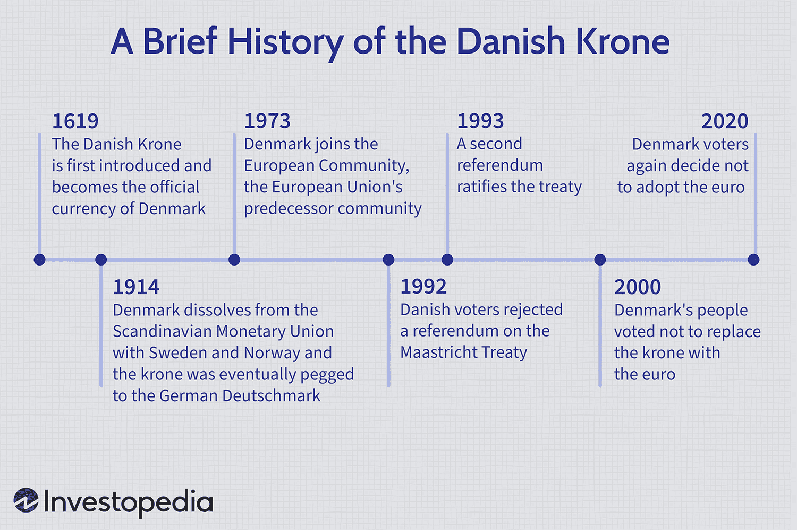

The Danish Krone (DKK) holds a significant position as the national currency of Denmark, sustained by a rich historical background. Its origins can be traced back to 1619, during which Denmark transitioned from using the Danish rigsdaler to establishing the krone. The transition marked a pivotal era in Denmark's economic evolution and laid the groundwork for the establishment of the Danish crown (krone) as a fundamental financial instrument. The Danish Krone's journey is characterized by its association with various economic unions, notably the Scandinavian Monetary Union, which ceased to exist during the early 20th century. Following the dissolution, Denmark navigated through diverse economic landscapes, including aligning the krone with several international currencies over the decades. Today, the krone is pegged to the euro, strengthening its presence in both European and global markets, and maintaining its stability amid fluctuating global economic conditions.

Algorithmic trading, on the other hand, is a revolutionary approach to currency trading. This method employs computer algorithms rigorously designed to execute trades at optimum speeds and efficiencies, largely surpassing traditional trading methods. The advancements in technology have significantly enhanced the capabilities of algorithmic trading, propelling it to the forefront of financial markets. Through high-frequency trading, arbitrage, and trend-following strategies, algorithmic trading empowers traders to capitalize on the rapid shifts within the markets, making precise trades unimaginable through manual methods. 

The purpose of this article is to explore how algorithmic trading integrates with the Danish Krone, facilitating modern-day trading endeavors. Understanding the historical trajectory of the DKK is crucial for developing robust trading strategies. It enables traders to not only grasp the currency's intrinsic value and stability factors but also to anticipate potential market behaviors that algorithms can exploit.

The Danish Krone continues to hold ongoing relevance in both European and global markets. With a strong peg to the euro, the DKK maintains its stature as a stable and reliable currency, offering unique attributes that appeal to traders employing algorithmic strategies. This article endeavors to shed light on the evolving role of the Danish Krone within the international trading landscape, its intersection with algorithmic trading, and the potential advantages that emerge from such an integration.

## Table of Contents

## Historical Overview of the Danish Krone

The Danish Krone (DKK) holds a storied position in the economic narrative of Denmark, with its origins tracing back to 1619. The journey of the DKK begins with the introduction of the krone as a replacement for the Danish rigsdaler, marking a significant transition in the establishment of the Danish crown. The rigsdaler had been in use as the primary currency, but the shift to the krone was part of broader monetary reforms aimed at stabilizing and modernizing the currency system within Denmark.

A pivotal moment in the history of the Danish Krone was the establishment and eventual dissolution of the Scandinavian Monetary Union (SMU). Founded in 1873, the union initially included Denmark, Sweden, and later Norway, facilitating a common currency system where the krone became an interchangeable currency among these countries. Each participating country's currency was pegged to gold at a fixed rate, with 1 krone equated to 0.403 grams of pure gold, promoting trade and economic stability across the region. However, the outbreak of World War I led to the dissolution of this union in 1914, forcing Denmark to consider new monetary policies and the standing of the krone in a rapidly changing economic landscape.

Post the SMU dissolution, the Danish Krone underwent various re-peg attempts to maintain stability and competitiveness. These included linking the krone to currencies such as the British pound and the German reichsmark. A significant modern era shift occurred with the establishment of a fixed exchange rate policy in the European Exchange Rate Mechanism (ERM) and later the ERM II. Since January 1, 1999, the Danish Krone has been closely pegged to the euro, with a central rate that allows only minimal fluctuations. This pegging provides stability and reduces exchange rate risks associated with extensive trade and financial interactions with eurozone countries, while still maintaining Denmark's monetary sovereignty outside the Eurozone.

Currently, the Danish Krone remains a stable currency within the global economic framework. This stability, bolstered by its peg to the euro, contributes to Denmark's robust economy and provides a reliable currency for international investors. Despite fluctuating global economic conditions, the DKK persists as an emblem of Denmark's economic resilience and adaptability, reflecting a balance between retaining national monetary policies and integrating within the broader European economic sphere.

## Understanding Algorithmic Trading

Algorithmic trading refers to the use of computerized systems to execute trading orders in financial markets based on pre-programmed algorithms. These algorithms consider various factors such as timing, price, and [volume](/wiki/volume-trading-strategy), aiming to achieve optimal trading outcomes. In modern finance, [algorithmic trading](/wiki/algorithmic-trading) plays a crucial role by enhancing market efficiency and [liquidity](/wiki/liquidity-risk-premium). It accounts for a significant portion of trading volumes in many markets, providing rapid execution speeds and minimizing the impact of human emotions on trading decisions. 

### Technological Advancements in Algorithmic Trading

The rise of algorithmic trading has been fueled by several technological advancements. High-speed internet and powerful computing capabilities have enabled traders to implement complex models and execute trades in milliseconds. Innovations in [artificial intelligence](/wiki/ai-artificial-intelligence) and [machine learning](/wiki/machine-learning) have further propelled algo trading, allowing systems to develop and refine strategies autonomously by learning from historical data patterns. Cloud computing also supports large-scale data processing and storage, facilitating the analysis and execution of vast numbers of trades efficiently.

### Traditional Trading Methods vs. Algorithmic Trading

Traditional trading methods often rely on human decision-making and manual order execution. Traders typically perform fundamental and technical analyses to make informed decisions. In contrast, algorithmic trading leverages quantitative models to make data-driven decisions. Algorithms can evaluate numerous variables simultaneously and adjust strategies in real time based on market conditions. This shift from manual to automated trading has transformed how markets operate, offering potential improvements in trading performance.

### Advantages of Algorithmic Trading

Algorithmic trading offers several advantages, primarily due to its speed, efficiency, and accuracy:

1. **Speed**: Algorithms can process and execute trades faster than a human trader, reducing latency and slippage.
2. **Efficiency**: Automated systems can monitor multiple markets and financial instruments simultaneously, identifying opportunities that might be missed by human traders.
3. **Accuracy**: Algorithms can collectively consider numerous market indicators, reducing the likelihood of errors in decision-making.

Such benefits have made algorithmic trading a preferred choice for many institutional and individual traders.

### Strategies in Algorithmic Trading

Several strategies are commonly employed in algorithmic trading, each tailored to specific market conditions and trader objectives:

- **High-Frequency Trading (HFT)**: Involves executing a large number of orders at extremely high speeds, capitalizing on small price discrepancies. The strategy relies on the ability to process information rapidly and execute trades within fractions of a second.

- **Arbitrage**: Seeks to profit from price differences of the same asset in different markets. This often involves simultaneously buying and selling an asset to exploit short-lived opportunities before prices converge.

- **Trend Following**: Involves identifying and capitalizing on persistent trends in the market. Algorithms track price movements and use indicators like moving averages to make buy or sell decisions based on established trends. 

Each of these strategies utilizes the core advantages of algorithmic trading to maximize returns while managing risks, demonstrating its integral role in contemporary financial markets.

## Impact of Algorithmic Trading on DKK

Algorithmic trading significantly influences the liquidity and [volatility](/wiki/volatility-trading-strategies) of the Danish Krone (DKK). The use of algorithms allows for rapid analysis and execution of trades, thereby increasing the overall liquidity of currency pairs involving the DKK. Enhanced liquidity can lead to tighter bid-ask spreads, facilitating more efficient trading and reducing transaction costs. However, the increase in trading volume can also contribute to heightened short-term volatility, particularly in reaction to market news or economic data releases.

An analysis of the historical exchange rate between DKK and Algorand (ALGO), a digital currency, provides insight into this dynamic. The DKK/ALGO exchange rate has been subject to fluctuation driven by both [cryptocurrency](/wiki/cryptocurrency) market sentiments and [forex](/wiki/forex-system) market conditions. Algorithmic trading can exploit these variations through strategies such as [arbitrage](/wiki/arbitrage), where traders capitalize on price discrepancies across different exchanges.

The adaptability of the DKK to automated trading systems is due in part to its established role in the global currency market and its relative stability. While the DKK is pegged to the euro, maintaining a stable exchange rate, algorithmic strategies can still be effectively applied. Algorithms are adept at identifying and acting upon small price movements, which are frequent given the currency's liquid nature.

Trading the DKK using algorithms presents both risks and rewards. Potential rewards include the ability to execute trades at speeds and precision levels that human traders cannot match, thus capturing fleeting market opportunities. However, there are risks, such as the possibility of algorithm-induced market shocks if automated systems react simultaneously to market signals, leading to abrupt price swings.

Market reactions to economic factors, such as changes in Denmark's monetary policy or fluctuations in eurozone economics, also influence algorithmic trading involving the DKK. For instance, news about [interest rate](/wiki/interest-rate-trading-strategies) adjustments or economic indicators can trigger algorithmic trading activity, impacting the DKK's exchange rates. Furthermore, global events affecting overall market confidence in stable currencies can affect trading strategies involving the DKK.

Understanding these dynamics is crucial for traders utilizing algorithmic systems with the DKK. The ability to anticipate market movements and respond with precision underscores the value that algorithmic trading brings to currency markets. Nevertheless, constant evaluation and iteration of trading algorithms are necessary to navigate the complex interplay of factors that influence the DKK's liquidity and volatility.

## Challenges and Opportunities

Algorithmic trading, while offering numerous advantages, comes with distinct challenges and opportunities, especially when dealing with currencies like the Danish Krone (DKK), which is pegged to the euro. Understanding these facets is crucial for traders looking to integrate algorithmic strategies with the DKK.

### Challenges of Trading DKK's Pegged Nature to the Euro

The DKK’s fixed exchange rate system, pegged to the euro under the European Exchange Rate Mechanism (ERM II), presents a notable constraint for algorithmic traders. This peg means that the DKK exhibits relatively low volatility compared to free-floating currencies, which can limit the opportunities for high-frequency trading ([HFT](/wiki/high-frequency-trading-strategies)) and arbitrage strategies that thrive on price discrepancies and swift market movements. Algorithmic systems, therefore, must be finely tuned to detect and capitalize on slight deviations and inefficiencies within the narrow trading ranges dictated by the peg.

One mathematical approach to assess potential trading opportunities under such constraints is through volatility analysis. The standard deviation formula, often denoted as σ, helps in understanding the price variability:

$$
\sigma = \sqrt{\frac{1}{N} \sum_{i=1}^{N} (x_i - \mu)^2}
$$

where $x_i$ represents individual price points, $\mu$ is the mean price, and $N$ is the total number of observations.

### Considerations for Trading in Less Volatile Environments

Trading in less volatile environments like the DKK necessitates a shift in algorithmic focus. Strategies that incorporate mean reversion, pairs trading, or signal filtering can be more effective. Traders might also explore incorporating economic indicator data, such as Danish economic reports or eurozone sentiment indices, to predict minor shifts aligning with policy changes or macroeconomic developments.

### Opportunities Provided by DKK's Stability

While the pegged nature of the DKK limits volatility, it also provides stability, which can be advantageous. Successful algorithmic trading in this context requires developing robust trading models that focus on medium to long-term trends. The predictable movement tied to the euro ensures a certain level of reliability, reducing the risk of unexpected price swings. This stability allows for refining algorithmic strategies that emphasize precision and consistency over aggressive market exploitation.

### Impact of Regulatory Environments

The regulatory landscape significantly impacts algorithmic trading in Denmark and the broader EU. Denmark's integration in the European single market necessitates compliance with EU-wide regulations like the Markets in Financial Instruments Directive II (MiFID II). These regulations, which aim to increase transparency, efficiency, and fairness in financial markets, can impose additional complexities on algorithmic traders. Traders must ensure that their algorithms incorporate risk management and adherence to reporting requirements as mandated by these regulations.

### Future Prospects for the DKK in Technological Advancements

Advancements in artificial intelligence (AI) and machine learning (ML) have the potential to revolutionize how traders approach the DKK market. As algorithms become more sophisticated, they can better analyze complex datasets, enhance prediction accuracy, and optimize execution strategies in real-time. Quantum computing also presents a future avenue for development, potentially allowing for faster processing of market data and more effective handling of large and complex financial models.

In conclusion, while algorithmic trading with the DKK presents unique complexities due to its pegged structure and regulatory environment, it also offers opportunities through stability and technological advancements. Understanding and adapting to these factors will be vital for traders looking to integrate the DKK into their algorithmic strategies.

## Conclusion

In summarizing the exploration of the Danish Krone (DKK) and its integration with algorithmic trading, it's essential to underscore the robust historical foundation and contemporary relevance of the currency. The Danish Krone, with its origins dating back to 1619, has demonstrated resilience and adaptability through significant economic shifts, including its current peg to the euro. This stability forms an invaluable asset in the international trading landscape, especially as traders increasingly integrate algorithmic systems into their strategies.

Algorithmic trading offers a swift, efficient, and precise mechanism for executing trades, qualities that can be particularly advantageous when dealing with stable currencies like the DKK. The Danish Krone's relative stability and its pegged nature mean it presents both challenges and opportunities for traders. For example, its low volatility might necessitate innovative approaches to exploit smaller market movements, encouraging the development of sophisticated algorithms that can thrive even in less dynamic conditions.

The evolving role of the DKK in the global market spotlights the currency's adaptability and potential in automated trading systems. As technology continues to advance, further integration of algorithmic trading with the Danish Krone seems promising. Traders are encouraged to harness the DKK's unique attributes—such as its stability and its strategic position within the European market—to optimize their algorithmic trading strategies.

Finally, a keen understanding of the Danish Krone's historical context is not just informative but crucial for developing well-rounded trading algorithms. Knowledge of past economic behaviors and interventions provides a nuanced perspective that can enhance predictive models and trading algorithms, ultimately leading to more informed and strategic trading decisions. Thus, recognizing the history and current standing of the DKK enriches the analytical arsenal for traders and positions them well for navigating the complexities of currency trading in the modern era.

## References & Further Reading

[1]: ["Algorithmic Trading: Winning Strategies and Their Rationale"](https://books.google.com/books/about/Algorithmic_Trading.html?id=WAlFDwAAQBAJ) by Ernest P. Chan

[2]: ["Advances in Financial Machine Learning"](https://www.amazon.com/Advances-Financial-Machine-Learning-Marcos/dp/1119482089) by Marcos Lopez de Prado

[3]: ["Quantitative Trading: How to Build Your Own Algorithmic Trading Business"](https://www.amazon.com/Quantitative-Trading-Build-Algorithmic-Business/dp/1119800064) by Ernest P. Chan

[4]: ["Machine Learning for Algorithmic Trading"](https://github.com/stefan-jansen/machine-learning-for-trading) by Stefan Jansen

[5]: ["Denmark's Fixed Exchange Rate Policy: The Future of the Krone Peg to the Euro"](https://www.brookings.edu/research/denmarks-fixed-exchange-rate-policy-the-future-of-the-krone-peg-to-the-euro/) by Brookings Institution

[6]: ["The Handbook of High Frequency Trading"](https://www.amazon.com/Handbook-High-Frequency-Trading-Gregoriou-ebook/dp/B00TH0LWHY) by Greg Gregoriou