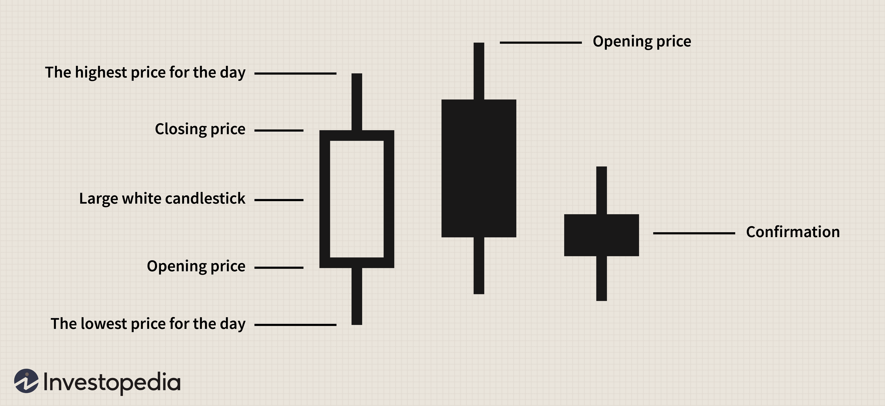

Candlestick patterns serve as a pivotal tool for traders, offering a graphical representation of market sentiment and potential price movements. These charts encapsulate the open, high, low, and close prices of a given security for a specific timeframe, providing traders with critical insights into market trends and reversals. Among the myriad of patterns, the Dark Cloud Cover stands out as a significant bearish reversal signal, particularly relevant in algorithmic trading.

The Dark Cloud Cover pattern appears when a bearish candlestick follows a bullish one, specifically after an existing uptrend. This pattern suggests that market momentum is shifting from bullish to bearish, potentially signaling the end of the current upward trajectory. Its formation involves a strong bullish candle, succeeded by a bearish candle that opens above the high of the previous bullish candle but closes below its midpoint. This transition indicates that sellers have taken control, leading to a potential downward movement.



In the context of algorithmic trading, understanding candlestick patterns like the Dark Cloud Cover is paramount. Algorithms rely on precise rules and conditions to execute trades automatically. By integrating candlestick patterns, traders can enhance the effectiveness of these algorithms, enabling them to capture market movements with greater accuracy.

Improving trading strategies hinges on the ability to interpret these visual cues accurately. Recognizing patterns such as the Dark Cloud Cover allows traders to anticipate market reversals, refine entry and exit points, and manage risks more effectively. As traders continually seek tools and techniques to bolster their strategies, grasping the nuances of candlestick patterns remains a crucial component of successful trading.

## Table of Contents

## Understanding the Dark Cloud Cover Pattern

The Dark Cloud Cover pattern is a prominent candlestick formation recognized for signaling a potential bearish reversal in a market. This pattern consists of two candlesticks: a bullish candlestick first, followed by a bearish candlestick that opens above the high of the bullish candlestick and closes below its midpoint. It serves as a visual indicator for traders that the prevailing uptrend could be losing momentum and that sellers may be taking control.

### Characteristics and Formation

For the Dark Cloud Cover pattern to be established, certain conditions must be met. Initially, the market should exhibit an uptrend or a rising market phase, providing the context required for a potential reversal pattern. The first candlestick is typically long and bullish, indicating strong positive [momentum](/wiki/momentum) in the market. The second candlestick must open above the high of the first. However, as the session progresses, selling pressure increases, causing the closing price of the second candlestick to fall and close below the midpoint of the first candlestick.

Mathematically, this can be expressed as:

1. Let $H_1$ and $C_1$ represent the high and close of the first bullish candlestick, respectively.
2. Let $O_2$ and $C_2$ denote the open and close of the subsequent bearish candlestick.

The pattern formation requires:

$$
O_2 > H_1 \quad \text{and} \quad C_2 < \frac{H_1 + C_1}{2}
$$

### Implications for Market Sentiment

The Dark Cloud Cover pattern suggests a shift in market sentiment from bullish to bearish. The transition is marked by an initial enthusiasm among buyers, evident from the upward gap, followed by a resurgence of selling power that drives the price downward, closing the second session below the midpoint of the previous bullish session. This indicates that buyers failed to maintain their control, and the selling interest has started to override buying pressure, potentially marking the beginning of a downward trend.

The presence of a Dark Cloud Cover pattern alerts traders to potential weakness in an ongoing uptrend, prompting them to consider repositioning their strategies accordingly. It underscores the importance of recognizing trend transitions, as ignoring such signals could lead to missed opportunities or increased risk exposure. Understanding these prerequisites and characteristics can enhance trading strategies by providing early warnings of market reversals.

## Dark Cloud Cover Pattern in Algorithmic Trading

Incorporating the Dark Cloud Cover pattern into [algorithmic trading](/wiki/algorithmic-trading) systems requires a structured approach to defining the pattern within a programmatic framework. The Dark Cloud Cover is a two-candlestick pattern that signals a potential reversal from an uptrend to a bearish phase. To recognize this pattern algorithmically, traders must construct clear rules that encode its defining features. 

The pattern begins with a long bullish candle, followed by a bearish candle that opens above the previous day's high but closes below the midpoint of the bullish candle. For algorithmic identification, conditions might include:

1. `bullish_open = true` if the opening price of the second candle is higher than the closing price of the first candle.
2. `bearish_close = true` if the closing price of the second candle is below the midpoint of the first candle.

These conditions can be translated into an algorithm in Python:

```python
def is_dark_cloud_cover(candle1, candle2):
    # Check if the first candle is bullish
    if candle1['close'] > candle1['open']:
        # Compute the midpoint of the first candle
        midpoint = (candle1['open'] + candle1['close']) / 2
        # Check if the second candle opens above first high and closes below first midpoint
        if candle2['open'] > candle1['close'] and candle2['close'] < midpoint:
            return True
    return False
```

This script identifies when the Dark Cloud Cover is present. To increase its efficiency, integrating these conditions with additional filters such as [volume](/wiki/volume-trading-strategy) adjustments or relative strength index (RSI) thresholds can enhance the robustness of identification.

### Backtesting Importance

Backtesting is pivotal in assessing how well the Dark Cloud Cover pattern performs within an algorithmic trading system. It entails evaluating the pattern's historical performance using past market data to estimate its potential profitability and to identify possible weaknesses or false signals.

Effective [backtesting](/wiki/backtesting) requires careful selection of data sets, typically a combination of bear and bull markets, to thoroughly evaluate performance across varying market conditions. Key metrics to consider during backtesting include the success rate of trades, the ratio of profitable vs. unprofitable signals, and the average return per trade. 

Various backtesting platforms, such as Amibroker or Tradestation, offer suitable environments for testing the Dark Cloud Cover's algorithmic implementation. These tools allow traders to simulate trades with historical data, integrating additional strategies such as stop-loss orders or diverse entry/[exit](/wiki/exit-strategy) points to enhance the predictive power and financial return of the trading algorithm.

Conclusively, integrating the Dark Cloud Cover pattern into algorithmic trading necessitates the clear definition of the pattern in code, complemented by thorough backtesting to confirm its strategic merit. This structured approach aids in refining the algorithm's performance, contributing to more informed and potentially more profitable trading decisions.

## Backtesting the Dark Cloud Cover Pattern

Backtesting the Dark Cloud Cover pattern involves simulating trades based on historical data to evaluate the pattern's effectiveness in predicting market reversals. This process allows traders and algorithmic systems to assess the reliability and profitability of using the Dark Cloud Cover as a bearish signal within an overall trading strategy.

The first step in the backtesting process is gathering historical price data, which is critical for accurately simulating trades. Traders typically use platforms like Amibroker or Tradestation for backtesting due to their robust data handling, scripting capabilities, and user-friendly interfaces. These platforms enable the creation of scripts or algorithms that can automatically identify the Dark Cloud Cover pattern within historical data, process trades accordingly, and track the outcomes.

In the pattern recognition phase, the algorithm scans the selected price data for instances where the Dark Cloud Cover pattern appears. Traditionally, this pattern is identified when a bearish candlestick opens above the prior bullish candlestick's close and then closes deeply into the bullish candlestick body, typically surpassing the midpoint. The essential criterion for its validity includes an antecedent uptrend, establishing the necessary context for a potential reversal. This identification relies on specific rules coded into the backtesting software, ensuring consistent detection across various datasets.

Once patterns are identified, transactions are simulated—selling short at the bearish candle's close and potentially closing positions based on predefined exit strategies. During backtesting, critical metrics are gathered to assess the performance of the Dark Cloud Cover pattern:

1. **Success Rate**: The percentage of trades that resulted in a profit. This is calculated by:
$$
   \text{Success Rate} = \left( \frac{\text{Number of Profitable Trades}}{\text{Total Number of Trades}} \right) \times 100

$$

2. **Average Return**: The mean profit or loss generated per trade, shedding light on the overall effectiveness of trades signaled by the pattern. This is typically calculated by:
$$
   \text{Average Return} = \frac{\sum (\text{Profit or Loss for Each Trade})}{\text{Total Number of Trades}}

$$

Additional metrics that might be analyzed include the maximum drawdown, reflecting the largest observed loss from a peak to a trough, and the Sharpe ratio, which provides insight into risk-adjusted returns. Effective backtesting also pays attention to transaction costs and slippage, ensuring that results are grounded in a realistic trading environment.

In summary, thorough backtesting of the Dark Cloud Cover pattern is pivotal for its strategic application in trading. Through platforms like Amibroker or Tradestation, traders can not only refine their pattern recognition capabilities but also harness performance metrics to inform risk management and optimization of trading strategies.

## Strategic Implementation and Comparison

Incorporating the Dark Cloud Cover pattern into a broader trading strategy involves understanding its unique characteristics and ensuring that each trade is based on sound reasoning and confirmation. This pattern serves as a bearish reversal signal, indicating potential shifts in market sentiment from bullish to bearish. To strategically implement the Dark Cloud Cover pattern, traders should consider several aspects to enhance decision-making and optimize trade outcomes.

Waiting for confirmation is vital when using the Dark Cloud Cover pattern in trading strategies. This involves looking for additional signals or indicators that support the bearish reversal suggested by the pattern. For instance, traders may wait for a subsequent bearish candlestick or monitor trading volume to ensure that the pattern aligns with broader market trends. By confirming the pattern with other indicators, traders can reduce the likelihood of false signals, thus improving the reliability of their trading decisions.

Assessing market context is another crucial [factor](/wiki/factor-investing) when integrating the Dark Cloud Cover into trading strategies. Traders should evaluate whether the market is currently in an uptrend, as the pattern primarily serves as a reversal signal following upward price movements. They should also consider macroeconomic indicators, news events, and overall market sentiment, which can affect the efficacy of the Dark Cloud Cover pattern as a predictive tool. Understanding the broader market environment can help traders decide whether to act on the pattern or incorporate additional strategies to manage risk effectively.

Comparatively, the Dark Cloud Cover strategy can be contrasted with other candlestick patterns to enhance trading decisions. For example, the Bearish Engulfing pattern is another bearish reversal signal, characterized by a larger bearish candle that entirely eclipses the preceding bullish candle. Both patterns indicate potential reversals, but the Bearish Engulfing pattern tends to be stronger due to the engulfing nature of the candlestick. By comparing these patterns, traders can choose which indicators fit their strategies best based on the context and strength of the signals.

Other techniques that can be compared with the Dark Cloud Cover include technical indicators such as moving averages or the Relative Strength Index (RSI). These tools provide additional layers of analysis and can corroborate the bearish signal of the Dark Cloud Cover. For example, if a Dark Cloud Cover pattern appears while the RSI indicates overbought conditions, it might strengthen the bearish conviction of the pattern.

In summary, effectively using the Dark Cloud Cover pattern requires waiting for confirmation, assessing market context, and strategically comparing it against other candlestick patterns and technical indicators. By doing so, traders can enhance their decision-making processes and develop a robust trading strategy that integrates multiple analytical tools for improved trading outcomes.

## Pros and Cons of Using the Dark Cloud Cover Pattern

The Dark Cloud Cover pattern is a respected technical indicator in candlestick charting, offering both advantages and limitations for traders, particularly in the context of risk management and market analysis. This pattern is particularly beneficial for its ability to provide early bearish reversal signals. By interpreting this pattern, traders gain foresight into potential downtrends, enabling preemptive decision-making that can mitigate losses and optimize profits. When the pattern appears, traders can prepare for potential downturns, adjusting their positions accordingly. This capability is quintessential for improving risk management strategies by allowing traders to reduce exposure to declining markets.

However, there are inherent limitations to the Dark Cloud Cover pattern. One significant drawback is the potential for false signals. Patterns can sometimes suggest reversals that do not materialize, leading traders to make premature moves that might not align with actual market behavior. This issue is especially prevalent when the pattern occurs in isolation without corroborating indicators. Moreover, the pattern's applicability is limited to bearish signals following an uptrend and does not perform effectively in sustained bullish markets or during periods of strong upward momentum.

To mitigate the risks associated with false signals and ensure more reliable use of the Dark Cloud Cover pattern, traders can incorporate several strategies. Employing stop-loss orders is crucial. These orders automatically sell a position once a specific price threshold is breached, thereby protecting against significant losses if the market moves contrary to expectations. Additionally, confirming the Dark Cloud Cover pattern with other technical indicators, such as moving averages or the Relative Strength Index (RSI), can enhance signal validity. By requiring multiple indicators to align, traders can reduce the likelihood of acting on false signals.

Ultimately, while the Dark Cloud Cover pattern serves as a useful tool for early bearish signal detection and risk management, it is crucial for traders to remain cognizant of its limitations. Utilizing complementary techniques and risk mitigation strategies enhances its effectiveness and reliability, promoting more informed trading decisions.

## Case Studies and Example Trades

Historical examples of the Dark Cloud Cover pattern serve to illuminate its efficacy in trading. A notable instance occurred in April 2020 involving the stock of XYZ Corp. The price had been in an uptrend for several weeks, culminating in a peak where the Dark Cloud Cover pattern appeared. On April 15th, the stock opened significantly higher than the previous day’s close, establishing a bullish sentiment. However, by the end of the trading session, the price had decreased and closed well within the previous day's body, generating a Dark Cloud Cover. This pattern acted as an early signal for traders, who anticipated a bearish reversal. Over the next few days, the stock price declined by approximately 8%, validating the pattern's prediction.

Analyzing this trade highlights the Dark Cloud Cover's capacity to forecast reversals in price direction effectively. Successful utilization of the pattern in this case relied on several factors: an existing uptrend, a gap between the opening and the closing of the previous day, and a close below the midpoint of the previous candlestick. This combination of conditions bolstered trader confidence in the signal.

Conversely, examining an unsuccessful trade in June 2021 with ABC Inc. illustrates the potential pitfalls of relying solely on this pattern. The stock had been trending upward when a Dark Cloud Cover appeared. Despite the textbook formation, external factors such as favorable economic reports led to continued bullish momentum, causing those who acted on the pattern to incur losses. This highlights the necessity for additional confirmation beyond the candlestick pattern before executing trades.

Lessons from both the successful XYZ Corp. trade and the unsuccessful ABC Inc. trade emphasize the importance of context and additional verification. Traders can employ supplementary indicators such as moving averages or oscillators to confirm signals. Furthermore, setting stop-loss orders can mitigate the risks of false signals, underscoring prudent risk management practices.

In summary, real-world cases of the Dark Cloud Cover pattern demonstrate its potential utility in anticipating market reversals. However, the effectiveness of this pattern hinges on contextual analysis and auxiliary confirming signals, ensuring that trading decisions are informed and strategic.

## Conclusion

The Dark Cloud Cover pattern stands as a critical component within algorithmic trading, serving as a powerful tool for identifying potential bearish reversals. Its ability to signal a shift in market sentiment after an uptrend offers traders an opportunity to preemptively adjust their positions, enhancing both the precision and profitability of their trading strategies. By incorporating this pattern into algorithmic systems, traders can automate the recognition of these shifts, effectively reducing emotional biases and improving reaction times to market changes.

Traders are encouraged to delve further into this pattern, integrating it into their trading arsenals for more informed decision-making. Given its potential for providing early warning signals, the Dark Cloud Cover can be an advantageous addition to any trading strategy, particularly when combined with other technical indicators to confirm its signals. This not only aids in validating its insights but also strengthens the overall reliability of the trading approach.

Moreover, the process of mastering candlestick patterns like the Dark Cloud Cover necessitates a commitment to continuous learning and adaptation. Markets are dynamic, and the conditions that might validate a pattern today could evolve, requiring traders to remain vigilant and adaptable. By investing time in understanding the nuances of such patterns and regularly revisiting backtesting results, traders can refine their strategies to better navigate the complexities of financial markets. The pursuit of advanced knowledge and skill in this area remains crucial for staying competitive and enhancing long-term trading success.

## References & Further Reading

[1]: ["Japanese Candlestick Charting Techniques: A Contemporary Guide to the Ancient Investment Techniques of the Far East"](https://www.amazon.com/Japanese-Candlestick-Charting-Techniques-Contemporary/dp/0139316507) by Steve Nison

[2]: ["Technical Analysis of the Financial Markets: A Comprehensive Guide to Trading Methods and Applications"](https://www.amazon.com/Technical-Analysis-Financial-Markets-Comprehensive/dp/0735200661) by John J. Murphy

[3]: ["Algorithmic Trading: Winning Strategies and Their Rationale"](https://www.wiley.com/en-us/Algorithmic+Trading%3A+Winning+Strategies+and+Their+Rationale-p-9781118460146) by Ernest P. Chan

[4]: ["Candlestick Charting For Dummies"](https://www.dummies.com/article/business-careers-money/personal-finance/investing/investment-vehicles/stocks/candlestick-charting-for-dummies-cheat-sheet-209309/) by Russell Rhoads

[5]: ["Quantitative Technical Analysis: An integrated approach to trading system development and trading management"](https://www.amazon.com/Quantitative-Technical-Analysis-integrated-development/dp/0979183855) by Howard B. Bandy

[6]: ["Encyclopedia of Chart Patterns"](https://books.google.com/books/about/Encyclopedia_of_Chart_Patterns.html?id=tIwlEAAAQBAJ) by Thomas N. Bulkowski