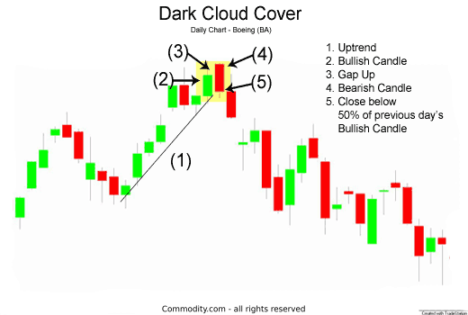

## Table of Contents

## What is the Dark Cloud Cover candlestick pattern?

The Dark Cloud Cover is a bearish reversal candlestick pattern that appears in an uptrend. It signals that the bulls might be losing control and the bears could be taking over. The pattern consists of two candlesticks. The first one is a long bullish candle that continues the existing uptrend. The second candle opens above the high of the first candle but closes below the midpoint of the first candle's body. This shows that after an initial push higher, the price was driven down significantly, suggesting a shift in market sentiment.

This pattern is considered more significant if it occurs after a prolonged uptrend or near resistance levels. Traders often look for confirmation of the bearish reversal in the following sessions, such as a third bearish candle or other bearish indicators. The name "Dark Cloud Cover" comes from the idea that the second candle's bearish close casts a shadow over the previous bullish trend, hinting at darker times ahead for the price action.

## How is the Dark Cloud Cover pattern formed?

The Dark Cloud Cover pattern is a sign that a stock's price might start going down after it has been going up. It is made up of two candles. The first candle is a big green one, showing that the price went up a lot during that day. This candle continues the upward trend that was already happening. The second candle starts even higher than the first candle's highest point, which makes it seem like the price will keep going up. But, something changes, and the price starts to fall. By the end of the day, the second candle closes lower than the middle of the first candle's body. This shows that the people who want the price to go down are starting to take control.

When traders see this pattern, they pay close attention because it might mean the price will start to drop. The pattern is more important if it happens after the price has been going up for a long time or if it happens near a price level where the stock often stops going up. Traders usually wait for another day or two to see if the price keeps going down before they decide to sell their stocks or bet on the price going down. The name "Dark Cloud Cover" comes from the idea that the second candle's lower close puts a shadow over the upward trend, suggesting that tough times might be coming for the stock's price.

## What does the Dark Cloud Cover pattern indicate in the market?

The Dark Cloud Cover pattern is a sign that the stock's price might start going down after it has been going up. It shows up as two candles on a chart. The first candle is a big green one, showing that the price went up a lot that day. The second candle starts even higher than the first candle's highest point, but then the price starts to fall. By the end of the day, the second candle closes lower than the middle of the first candle's body. This means that the people who want the price to go down are starting to take control.

When traders see this pattern, they pay close attention because it might mean the price will start to drop. The pattern is more important if it happens after the price has been going up for a long time or if it happens near a price level where the stock often stops going up. Traders usually wait for another day or two to see if the price keeps going down before they decide to sell their stocks or bet on the price going down. The name "Dark Cloud Cover" comes from the idea that the second candle's lower close puts a shadow over the upward trend, suggesting that tough times might be coming for the stock's price.

## Can you explain the psychology behind the Dark Cloud Cover pattern?

The Dark Cloud Cover pattern shows what people are thinking when the stock price might start to go down after going up. At first, everyone is happy because the stock price is going up a lot. This is shown by the first big green candle. People who want the price to go up are in control, and they think the price will keep going up. But then, something changes. The next day, the price starts even higher than the day before, which makes it seem like the price will keep going up. But then, the price starts to fall a lot by the end of the day. The second candle closes lower than the middle of the first candle, showing that people who want the price to go down are starting to take over.

This change in what people are thinking is important. The second candle's lower close makes people who were betting on the price going up start to worry. They might start to sell their stocks to avoid losing money if the price keeps going down. At the same time, people who want the price to go down see this as a chance to bet on the price dropping even more. The name "Dark Cloud Cover" comes from the idea that the second candle's lower close puts a shadow over the upward trend, suggesting that tough times might be coming for the stock's price. This pattern makes traders think carefully about what might happen next and often wait to see if the price keeps going down before making big decisions.

## What are the key criteria for identifying a valid Dark Cloud Cover pattern?

To spot a true Dark Cloud Cover pattern, you need to look for a couple of things. First, you should see a big green candle that shows the price went up a lot on the first day. This candle should be part of an upward trend that's been going on for a while. The second thing to look for is the next candle, which starts even higher than the first candle's top but ends up closing lower than the middle of the first candle's body. This second candle should be red, showing that the price went down a lot by the end of the day.

It's also important to think about where this pattern shows up. The Dark Cloud Cover is more meaningful if it happens after the price has been going up for a long time or if it's near a level where the price often stops going up. Traders usually wait for another day or two to see if the price keeps going down before they decide to sell their stocks or bet on the price dropping. This pattern suggests that people who want the price to go down might be taking over from those who want it to go up.

## How reliable is the Dark Cloud Cover pattern in predicting price reversals?

The Dark Cloud Cover pattern can be a helpful sign that the price might start to go down after going up, but it's not perfect. It works better when it happens after the price has been going up for a long time or near a price level where the stock often stops going up. Traders usually look for more signs in the next few days to make sure the price is really going to drop before they make big decisions.

Even though the Dark Cloud Cover can be a good hint, it doesn't always mean the price will go down. Sometimes, the price might keep going up even after this pattern shows up. That's why it's smart to use this pattern along with other tools and signs to get a better idea of what might happen next with the price.

## What are some common mistakes traders make when using the Dark Cloud Cover pattern?

One common mistake traders make when using the Dark Cloud Cover pattern is jumping to conclusions too quickly. They might see the pattern and immediately think the price will go down, but they don't wait to see if other signs confirm this. It's important to look at what happens in the next few days to make sure the price is really going to drop. Sometimes, the price might keep going up even after the Dark Cloud Cover shows up, so it's smart to be patient and use other tools to help make decisions.

Another mistake is not considering the bigger picture. The Dark Cloud Cover is more reliable if it happens after a long upward trend or near a resistance level. If traders don't pay attention to these things, they might think the pattern is more important than it really is. It's also helpful to use other indicators and patterns along with the Dark Cloud Cover to get a better idea of what might happen next with the price.

## How can the Dark Cloud Cover pattern be confirmed with other technical indicators?

Traders can use other technical indicators to make sure the Dark Cloud Cover pattern is a good sign that the price might go down. One way is to look at the [volume](/wiki/volume-trading-strategy). If the volume is higher on the day of the second candle, it can mean that more people are selling, which makes the pattern more reliable. Another way is to use momentum indicators like the Relative Strength Index (RSI). If the RSI is moving down and getting close to being oversold, it can support the idea that the price might keep going down.

Another helpful indicator is the Moving Average Convergence Divergence (MACD). If the MACD line crosses below the signal line around the same time as the Dark Cloud Cover, it can be a strong sign that the price is going to drop. Traders can also look at support and resistance levels. If the second candle of the Dark Cloud Cover closes near a key resistance level, it adds more weight to the pattern. Using these other indicators along with the Dark Cloud Cover can give traders a better idea of what might happen next with the price.

## What are the differences between the Dark Cloud Cover and the Evening Star patterns?

The Dark Cloud Cover and the Evening Star are both bearish reversal patterns that show up when a stock's price has been going up, but they look different and have different parts. The Dark Cloud Cover has two candles. The first one is a big green candle that shows the price went up a lot. The next day, the price starts even higher but then falls a lot and closes lower than the middle of the first candle's body. This pattern means that people who want the price to go down are starting to take over.

The Evening Star pattern has three candles. The first candle is a big green one, just like in the Dark Cloud Cover, showing that the price went up. The second candle is small and can be either green or red. It shows that the price didn't change much that day, which means people are unsure about what will happen next. The third candle is a big red one that closes well below the first candle's body. This pattern also means that the price might start to go down, but it gives a clearer sign because it shows a change in what people are thinking over three days instead of two.

## How should traders manage risk when trading based on the Dark Cloud Cover pattern?

When traders see the Dark Cloud Cover pattern, they should be careful and manage their risk well. One way to do this is by setting a stop-loss order. A stop-loss order helps limit how much money a trader can lose if the price doesn't go down like they thought it would. Traders can put the stop-loss just above the highest point of the Dark Cloud Cover pattern. This way, if the price goes up instead of down, the stop-loss will kick in and help them avoid losing too much money.

Another important thing is to not put all their money into one trade. Traders should only use a small part of their money for each trade, so if they're wrong, they don't lose everything. It's also a good idea to wait for more signs that the price will go down before making a big move. By using other tools and looking at what happens in the next few days, traders can make better decisions and keep their risk low.

## Can the Dark Cloud Cover pattern be used effectively in different time frames?

The Dark Cloud Cover pattern can be used in different time frames, like daily, weekly, or even hourly charts. It works the same way in all time frames: it shows up after the price has been going up and suggests that the price might start to go down. But, the pattern might be more or less reliable depending on the time frame. For example, on a daily chart, the pattern might be a stronger sign because it covers a whole day of trading. On shorter time frames like an hourly chart, the pattern might not be as strong because the price can change a lot in a short time.

Traders need to be careful when using the Dark Cloud Cover pattern on different time frames. They should look at other signs and use other tools to make sure the pattern is a good hint that the price will go down. On longer time frames, traders might feel more confident because the pattern covers more time and more trading activity. But on shorter time frames, they should be extra careful and maybe wait for more signs before making a big move. Using the pattern along with other indicators can help traders make better decisions no matter what time frame they're looking at.

## What are some advanced strategies for trading the Dark Cloud Cover pattern?

Traders can use the Dark Cloud Cover pattern along with other tools to make smarter trades. One good way is to use the pattern with volume. If the second candle of the Dark Cloud Cover has a lot of volume, it means more people are selling, which makes the pattern a stronger sign that the price might go down. Traders can also look at the Relative Strength Index (RSI). If the RSI is going down and getting close to being oversold, it can support the idea that the price will keep dropping. Another helpful tool is the Moving Average Convergence Divergence (MACD). If the MACD line crosses below the signal line around the same time as the Dark Cloud Cover, it's a strong hint that the price is going to go down.

Another advanced strategy is to use the Dark Cloud Cover pattern with support and resistance levels. If the second candle closes near a key resistance level, it adds more weight to the pattern. Traders can also combine the pattern with other chart patterns, like head and shoulders or double tops, to get a clearer picture of what might happen next. It's important for traders to be patient and wait for more signs before making big moves. By using these advanced strategies, traders can make better decisions and manage their risk well when trading based on the Dark Cloud Cover pattern.

## What is the Dark Cloud Cover Pattern and how can it be understood?

The Dark Cloud Cover pattern is a prominent candlestick formation recognized for signaling a potential bearish reversal in a market. This pattern consists of two candlesticks: a bullish candlestick first, followed by a bearish candlestick that opens above the high of the bullish candlestick and closes below its midpoint. It serves as a visual indicator for traders that the prevailing uptrend could be losing momentum and that sellers may be taking control.

### Characteristics and Formation

For the Dark Cloud Cover pattern to be established, certain conditions must be met. Initially, the market should exhibit an uptrend or a rising market phase, providing the context required for a potential reversal pattern. The first candlestick is typically long and bullish, indicating strong positive [momentum](/wiki/momentum) in the market. The second candlestick must open above the high of the first. However, as the session progresses, selling pressure increases, causing the closing price of the second candlestick to fall and close below the midpoint of the first candlestick.

Mathematically, this can be expressed as:

1. Let $H_1$ and $C_1$ represent the high and close of the first bullish candlestick, respectively.
2. Let $O_2$ and $C_2$ denote the open and close of the subsequent bearish candlestick.

The pattern formation requires:

$$
O_2 > H_1 \quad \text{and} \quad C_2 < \frac{H_1 + C_1}{2}
$$

### Implications for Market Sentiment

The Dark Cloud Cover pattern suggests a shift in market sentiment from bullish to bearish. The transition is marked by an initial enthusiasm among buyers, evident from the upward gap, followed by a resurgence of selling power that drives the price downward, closing the second session below the midpoint of the previous bullish session. This indicates that buyers failed to maintain their control, and the selling interest has started to override buying pressure, potentially marking the beginning of a downward trend.

The presence of a Dark Cloud Cover pattern alerts traders to potential weakness in an ongoing uptrend, prompting them to consider repositioning their strategies accordingly. It underscores the importance of recognizing trend transitions, as ignoring such signals could lead to missed opportunities or increased risk exposure. Understanding these prerequisites and characteristics can enhance trading strategies by providing early warnings of market reversals.

## Can we backtest the effectiveness of the Dark Cloud Cover Pattern?

Backtesting the Dark Cloud Cover pattern involves simulating trades based on historical data to evaluate the pattern's effectiveness in predicting market reversals. This process allows traders and algorithmic systems to assess the reliability and profitability of using the Dark Cloud Cover as a bearish signal within an overall trading strategy.

The first step in the [backtesting](/wiki/backtesting) process is gathering historical price data, which is critical for accurately simulating trades. Traders typically use platforms like Amibroker or Tradestation for backtesting due to their robust data handling, scripting capabilities, and user-friendly interfaces. These platforms enable the creation of scripts or algorithms that can automatically identify the Dark Cloud Cover pattern within historical data, process trades accordingly, and track the outcomes.

In the pattern recognition phase, the algorithm scans the selected price data for instances where the Dark Cloud Cover pattern appears. Traditionally, this pattern is identified when a bearish candlestick opens above the prior bullish candlestick's close and then closes deeply into the bullish candlestick body, typically surpassing the midpoint. The essential criterion for its validity includes an antecedent uptrend, establishing the necessary context for a potential reversal. This identification relies on specific rules coded into the backtesting software, ensuring consistent detection across various datasets.

Once patterns are identified, transactions are simulated—selling short at the bearish candle's close and potentially closing positions based on predefined [exit](/wiki/exit-strategy) strategies. During backtesting, critical metrics are gathered to assess the performance of the Dark Cloud Cover pattern:

1. **Success Rate**: The percentage of trades that resulted in a profit. This is calculated by:
$$
   \text{Success Rate} = \left( \frac{\text{Number of Profitable Trades}}{\text{Total Number of Trades}} \right) \times 100

$$

2. **Average Return**: The mean profit or loss generated per trade, shedding light on the overall effectiveness of trades signaled by the pattern. This is typically calculated by:
$$
   \text{Average Return} = \frac{\sum (\text{Profit or Loss for Each Trade})}{\text{Total Number of Trades}}

$$

Additional metrics that might be analyzed include the maximum drawdown, reflecting the largest observed loss from a peak to a trough, and the Sharpe ratio, which provides insight into risk-adjusted returns. Effective backtesting also pays attention to transaction costs and slippage, ensuring that results are grounded in a realistic trading environment.

In summary, thorough backtesting of the Dark Cloud Cover pattern is pivotal for its strategic application in trading. Through platforms like Amibroker or Tradestation, traders can not only refine their pattern recognition capabilities but also harness performance metrics to inform risk management and optimization of trading strategies.

## References & Further Reading

[1]: ["Japanese Candlestick Charting Techniques: A Contemporary Guide to the Ancient Investment Techniques of the Far East"](https://www.amazon.com/Japanese-Candlestick-Charting-Techniques-Contemporary/dp/0139316507) by Steve Nison

[2]: ["Technical Analysis of the Financial Markets: A Comprehensive Guide to Trading Methods and Applications"](https://www.amazon.com/Technical-Analysis-Financial-Markets-Comprehensive/dp/0735200661) by John J. Murphy

[3]: ["Algorithmic Trading: Winning Strategies and Their Rationale"](https://www.wiley.com/en-us/Algorithmic+Trading%3A+Winning+Strategies+and+Their+Rationale-p-9781118460146) by Ernest P. Chan

[4]: ["Candlestick Charting For Dummies"](https://www.dummies.com/article/business-careers-money/personal-finance/investing/investment-vehicles/stocks/candlestick-charting-for-dummies-cheat-sheet-209309/) by Russell Rhoads

[5]: ["Quantitative Technical Analysis: An integrated approach to trading system development and trading management"](https://www.amazon.com/Quantitative-Technical-Analysis-integrated-development/dp/0979183855) by Howard B. Bandy

[6]: ["Encyclopedia of Chart Patterns"](https://books.google.com/books/about/Encyclopedia_of_Chart_Patterns.html?id=tIwlEAAAQBAJ) by Thomas N. Bulkowski