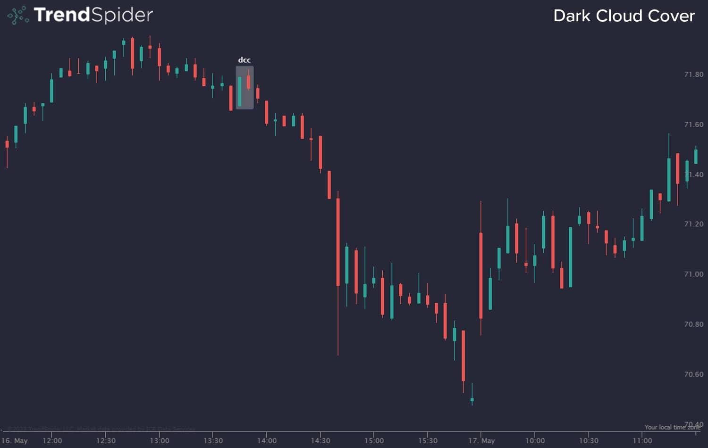

## Table of Contents

## What is Dark Cloud Cover?

Dark Cloud Cover is a bearish reversal pattern that appears in candlestick charts, which are used to show price movements in trading. This pattern forms when a bullish candle, where the closing price is higher than the opening price, is followed by a bearish candle. The bearish candle opens above the previous day's high but closes below the midpoint of the bullish candle's body. This suggests that the bullish trend might be losing strength and a bearish trend could be starting.

Traders watch for Dark Cloud Cover because it can signal that it might be a good time to sell or to prepare for a potential price drop. The pattern is more reliable if it occurs after a strong uptrend and if the bearish candle's close is significantly lower than the midpoint of the bullish candle. It's important for traders to look at other indicators and market conditions too, because no single pattern can predict market movements perfectly.

## How does Dark Cloud Cover form?

Dark Cloud Cover forms on a price chart when you see two candles in a specific pattern. The first candle is a bullish one, which means the price went up that day. It has a body where the closing price is higher than the opening price. This candle shows that buyers were in control and pushing the price higher.

The second candle is where the Dark Cloud Cover pattern really shows up. This candle starts with an opening price that is higher than the high of the first candle, suggesting the bullish trend might continue. But then, the price drops, and the candle closes below the midpoint of the first candle's body. This tells us that sellers took over and pushed the price down, hinting that the bullish trend might be ending and a bearish trend could be starting.

## What does Dark Cloud Cover indicate in trading?

Dark Cloud Cover is a sign that traders watch for because it can mean the price of something might start going down. It shows up on a chart after the price has been going up for a while. The first candle of this pattern is a tall one where the price ends higher than it started, showing that buyers were strong. Then comes a second candle that starts even higher but ends up closing lower than the middle of the first candle's body. This tells traders that sellers might be taking over, and the upward trend could be weakening.

Traders use Dark Cloud Cover to help decide when to sell what they own or to get ready for prices to fall. But it's not a sure thing. They need to look at other signs and what's happening in the market too. If the second candle closes a lot lower than the middle of the first candle, and this happens after a big run-up in prices, it's seen as a stronger warning that prices might go down.

## How can beginners identify Dark Cloud Cover on a chart?

To find Dark Cloud Cover on a chart, beginners should first look for a strong upward trend where prices have been going up. They need to spot a tall green or white candle, which means the price closed higher than it opened. This candle shows that buyers were in charge and pushing the price up.

Next, they should look for the next candle, which should start above the high of the first candle. This candle should be red or black, showing that it closed lower than it opened. Importantly, this second candle should close below the middle point of the first candle's body. This pattern suggests that sellers are starting to take over, and the upward trend might be losing steam. By watching for these two candles in this specific order, beginners can spot the Dark Cloud Cover pattern and use it as a hint that the price might start going down.

## What are the key components of a Dark Cloud Cover pattern?

The Dark Cloud Cover pattern has two main parts that you need to see on a price chart. The first part is a big green or white candle that shows the price went up that day. It means the buyers were strong and the price closed higher than it opened. This candle should come after a time when the price has been going up.

The second part is a red or black candle that comes right after the first one. This candle starts even higher than the top of the first candle, but then the price falls, and it closes below the middle of the first candle's body. This shows that sellers started to take over and push the price down. Seeing these two candles in this order is what makes the Dark Cloud Cover pattern, and it can mean that the price might start going down soon.

## Can Dark Cloud Cover be used as a standalone trading signal?

Dark Cloud Cover can be a helpful sign for traders, but it's not usually a good idea to use it by itself to decide when to buy or sell. It's like a warning that the price might start going down, but it doesn't tell the whole story. Traders need to look at other things too, like other patterns on the chart, what's happening in the market, and other signs that might say the same thing.

Using Dark Cloud Cover along with other tools can make it more reliable. For example, if other signs also show that the price might go down, then the Dark Cloud Cover becomes a stronger hint. But if there are mixed signals, it's better to be careful and not make quick decisions based on just one pattern.

## How does the volume affect the reliability of a Dark Cloud Cover pattern?

Volume is an important thing to look at when you see a Dark Cloud Cover pattern. If the volume is high on the second day of the pattern, it means more people are selling, which makes the pattern a stronger sign that the price might go down. High volume shows that a lot of traders agree with the sellers, making the signal more reliable.

But if the volume is low on that second day, it might not be as strong a sign. Low volume means fewer people are selling, so the pattern might not be as trustworthy. Traders should look at the volume along with the Dark Cloud Cover to make better choices about what to do next.

## What are common mistakes traders make when interpreting Dark Cloud Cover?

One common mistake traders make when looking at Dark Cloud Cover is relying on it too much by itself. They might see the pattern and think it's a sure sign to sell, but it's not that simple. The Dark Cloud Cover is just one clue, and traders need to check other signs and what's happening in the market too. If they don't, they might make bad choices and lose money.

Another mistake is not paying attention to the volume when the Dark Cloud Cover shows up. If the second candle has low volume, it might not be a strong sign that the price will go down. But if traders ignore this and act like it's a strong signal anyway, they could be wrong. It's important to see if the volume supports the pattern to know if it's a good time to sell or not.

## How does Dark Cloud Cover compare to other bearish reversal patterns?

Dark Cloud Cover is one of many bearish reversal patterns that traders look at, but it has its own special features. It's different from the Evening Star, which is another bearish pattern. The Evening Star has three candles: a big green one, a small one that can be green or red, and then a big red one. The Dark Cloud Cover is simpler because it only needs two candles. It starts with a big green candle and is followed by a red candle that opens higher but closes below the middle of the first candle's body. Both patterns warn that a price that's been going up might start going down, but they look different on a chart.

Another pattern traders might confuse with Dark Cloud Cover is the Bearish Engulfing pattern. The Bearish Engulfing also uses two candles, but it works a bit differently. With the Bearish Engulfing, the first candle is green and smaller, and the second candle is red and bigger, completely covering the body of the first candle. This shows a strong switch from buying to selling. The Dark Cloud Cover, on the other hand, shows a more gradual change because the second candle only needs to close below the middle of the first candle's body, not cover it completely. Both patterns suggest that sellers are taking over, but the way they look and the strength of the signal can be different.

## What advanced techniques can be used to confirm a Dark Cloud Cover signal?

To confirm a Dark Cloud Cover signal, traders can look at other signs on the chart to see if they match up. One way is to use technical indicators like the Relative Strength Index (RSI) or the Moving Average Convergence Divergence (MACD). If these indicators also show that the price might go down, it makes the Dark Cloud Cover a stronger signal. Another thing to check is if the price breaks below a key support level after the pattern shows up. If it does, it's a good hint that the price might keep going down.

Another advanced technique is to look at the volume when the Dark Cloud Cover appears. If the volume is high on the second candle, it means more people are selling, which makes the pattern more reliable. Traders can also use trend lines or Fibonacci retracement levels to see if the price is hitting important points that could support the bearish signal. By combining these different methods, traders can get a better idea of whether the Dark Cloud Cover is a real sign that the price will go down or if it's just a false alarm.

## How can Dark Cloud Cover be integrated into a comprehensive trading strategy?

Dark Cloud Cover can be a useful part of a bigger trading plan, but it should not be the only thing traders look at. When they see a Dark Cloud Cover, they should check other signs too, like the Relative Strength Index (RSI) or the Moving Average Convergence Divergence (MACD). These tools can help confirm if the price might really go down. Traders should also look at the volume when the pattern shows up. If a lot of people are selling on the second day of the pattern, it makes the Dark Cloud Cover a stronger sign that the price could drop.

Using Dark Cloud Cover along with other tools can help traders make smarter choices. For example, if the price breaks below an important support level after a Dark Cloud Cover, it's a good hint that the price might keep falling. Traders can also use trend lines or Fibonacci retracement levels to see if the price is hitting key points that could support the bearish signal. By putting all these pieces together, traders can build a solid plan that uses the Dark Cloud Cover as one part of a bigger picture to decide when to buy or sell.

## What are some real-world examples of Dark Cloud Cover patterns in historical market data?

One real-world example of a Dark Cloud Cover pattern happened in the stock market with Apple Inc. (AAPL) in early 2020. After a strong upward trend, Apple's stock had a big green candle on January 29, closing at around $323. The next day, January 30, the stock opened even higher at about $327 but then fell and closed at around $309, below the midpoint of the previous day's candle. This pattern signaled that the bullish trend might be losing steam, and indeed, the stock price started to decline in the following days.

Another example can be seen in the forex market with the EUR/USD pair in late 2019. On November 26, the pair had a strong bullish day, closing around 1.1000. The next trading day, November 27, the EUR/USD opened higher at about 1.1020 but then dropped to close around 1.0950, which was below the midpoint of the previous day's candle. This Dark Cloud Cover pattern suggested a potential reversal, and the pair did experience a downward movement in the subsequent sessions.

## References & Further Reading

[1]: Bulkowski, T. (2008). ["Encyclopedia of Candlestick Charts."](https://onlinelibrary.wiley.com/doi/book/10.1002/9781119202288) Wiley Trading.

[2]: Nison, S. (1991). ["Japanese Candlestick Charting Techniques: A Contemporary Guide to the Ancient Investment Techniques of the Far East."](https://archive.org/details/japanesecandlest0000niso) Prentice Hall Press.

[3]: Murphy, J. J. (1999). ["Technical Analysis of the Financial Markets: A Comprehensive Guide to Trading Methods and Applications."](https://archive.org/details/technicalanalysi0000murp) New York Institute of Finance.

[4]: Pring, M. J. (2002). ["Technical Analysis Explained: The Successful Investor's Guide to Spotting Investment Trends and Turning Points."](https://www.amazon.com/Technical-Analysis-Explained-Fifth-Successful/dp/0071825177) McGraw-Hill.

[5]: Chan, E. (2009). ["Quantitative Trading: How to Build Your Own Algorithmic Trading Business."](https://github.com/ftvision/quant_trading_echan_book) Wiley.