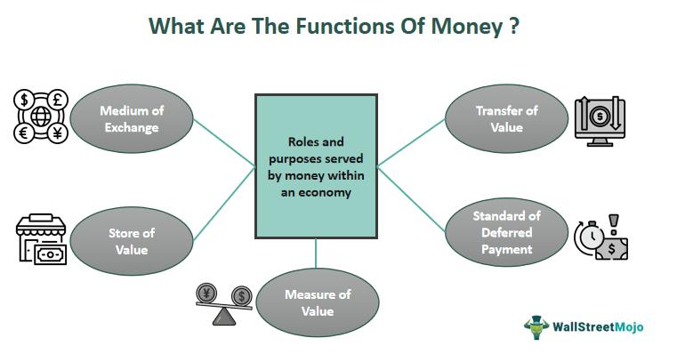

In recent years, the role of 'dark money' in political campaigns has gained significant attention and sparked widespread concern. Dark money refers to funds donated to political campaigns or organizations without disclosure of the donor's identity. These anonymous donations have the potential to significantly influence the outcomes of elections, potentially overshadowing the voices and preferences of the public.

The rise of dark money has raised critical questions about its impact on political funding and the democratic process. One important aspect to consider is how dark money, combined with technological advancements such as algorithmic trading, could further complicate the political landscape. Algorithmic trading, a method using pre-programmed software to execute trades at high speeds, represents a technological frontier intersecting with political funding strategies. This intersection creates a complex web where technology and opaque funding mechanisms can exert substantial influence on elections.



The intricate relationship between dark money, political funding, and algorithmic trading poses serious challenges to transparency and democratic integrity. This complex interaction can subvert regulations that are designed to ensure fair campaign practices, allowing for significant influence over political outcomes by undisclosed donors. Furthermore, the lack of transparency surrounding dark money hampers the ability to hold policymakers accountable, raising concerns about the concentration of power among wealthy individuals or corporations.

This article aims to untangle these complex relationships, exploring how dark money, anonymous political donations, and advanced technological tools like algorithmic trading shape modern political dynamics. The discussion will also highlight the challenges posed to transparency and democratic norms, drawing attention to the urgent need for reform and effective governance to safeguard democratic institutions.

## Table of Contents

## Understanding Dark Money and Anonymous Donations

Dark money refers to political funding that remains undisclosed, allowing donors to maintain anonymity. This type of funding is typically funneled through nonprofit organizations such as 501(c)(4) social welfare groups, 501(c)(5) labor unions, and 501(c)(6) trade associations, which are not mandated to disclose their contributors to the public or regulatory bodies. These entities can spend unlimited amounts on political campaigns, thereby wielding significant influence over election outcomes without revealing the identities of their financiers.

The anonymity afforded to donors raises critical concerns about political transparency and the role of wealthy individuals or corporations in shaping political agendas. With little to no obligation for disclosure, these donors can influence legislative priorities and electoral outcomes, potentially swaying political decisions in favor of their personal or corporate interests rather than the public good. This lack of transparency can undermine democratic processes by allowing hidden power dynamics to dominate political discourse.

Dark money is utilized in various ways within political campaigns, often funding large-scale advertising and strategic efforts to sways public opinion. The substantial financial backing can amplify certain messages or candidates, skewing the democratic process. For instance, political advertisements funded by dark money can saturate media markets, overshadowing grassroots campaigns that operate on smaller budgets and potentially altering election results by influencing voter perceptions and behaviors.

The regulatory landscape surrounding dark money is complex and fraught with challenges. Although there have been efforts to increase transparency, such as the DISCLOSE Act in the United States, many have struggled to pass through legislative bodies due to political disagreements and lobbying by affected organizations. These challenges highlight the difficulties in tracking dark money and implementing stringent oversight mechanisms.

Efforts to control dark money are further complicated by the constitutional protections for free speech and association, which can be interpreted to protect anonymous donations. Balancing these constitutional rights with the need for political transparency remains a contentious area within political financing reform debates.

In summary, while dark money plays a significant role in funding political activities, its opaque nature poses substantial threats to democratic integrity. Regulatory efforts continue to evolve in response to the challenges of tracking and controlling these anonymous donations, striving for a more transparent and accountable political funding system.

## The Impact of Dark Money on Political Funding

Dark money plays a pivotal role in political funding by shaping campaign strategies and influencing election outcomes. The nature of these undisclosed funds allows political entities to strategically allocate resources towards large-scale advertising and lobbying efforts, which can be crucial in swaying public opinion and achieving electoral success.

One key way that dark money impacts political campaigns is through its ability to finance extensive advertising campaigns. These campaigns are often aimed at influencing voter perceptions and can be deployed rapidly across a variety of media platforms. The absence of disclosure requirements means that the origin of such funds remains hidden, allowing wealthy individuals or organizations to potentially exert disproportionate influence. This anonymity not only obscures accountability but also allows these entities to push specific agendas without public scrutiny.

Notable examples of dark money influencing recent political events include the 2010 Citizens United v. Federal Election Commission decision, which significantly increased the flow of dark money into the U.S. political system. The ruling permitted corporations and unions to spend unlimited amounts on political advertising, as long as these expenditures were not directly coordinated with a candidate's campaign. This led to a surge in the formation of Super PACs and 501(c)(4) organizations, which became conduits for dark money. For instance, the 2012 U.S. presidential election witnessed a notable increase in dark money expenditures, with estimates suggesting that over $300 million were spent by these entities to shape electoral outcomes.

Dark money can also skew political priorities by diminishing the influence of grassroots contributions. Unlike dark money, grassroots funding typically originates from individual contributors who often have specific policy preferences and expectations from candidates. When political entities become reliant on dark money, there is a risk that they will prioritize the interests of anonymous donors over those of the general electorate. This shift in priorities undermines the democratic process and can lead to policymaking that favors the wealthy few over the broader population.

Addressing the challenges posed by dark money requires implementing potential reforms to foster transparency and accountability in political funding. One proposed reform is the Introduction of stricter disclosure laws that mandate the revelation of funding sources for political advertisements. Transparency could be further enhanced by requiring 501(c)(4) organizations, which are currently allowed to engage in political activities without disclosing their donors, to report substantial contributions that are used for political purposes.

Additionally, policy measures aimed at reducing the overall influence of money in politics could also be considered. These could include public financing of campaigns, wherein government funds are allocated to candidates to reduce dependence on private donations. By leveling the playing field, such reforms could amplify the voices of grassroots contributors and mitigate the skewing effects of dark money.

In summary, the impact of dark money on political funding is profound, affecting campaign strategies, election outcomes, and policymaking. Its unregulated nature poses significant challenges to democratic processes, necessitating comprehensive reforms to ensure a more transparent and equitable political funding landscape.

## Algorithmic Trading and Its Role in Political Funding

Algorithmic trading, commonly known as algo trading, involves the use of sophisticated software to execute trading decisions at speeds and frequencies that are beyond human capabilities. Such systems have been traditionally used within financial markets to exploit inefficiencies and optimize trading strategies. In recent times, there is growing evidence to suggest that these algorithmic tools are being adapted for use in political funding, specifically in the management and distribution of donations.

Political campaigns often require significant resources to deploy targeted advertisements, mobilize voters, and fund various operations integral to achieving electoral success. Given the complexity and vastness of donation data, algorithmic systems offer a means to enhance efficiency by automating donor management processes and strategically allocating resources. These systems can use data analysis to segment donor lists, prioritize potential high-yield contributors, and tailor engagements that maximize overall fundraising outcomes.

For instance, algorithms can be designed to identify patterns in donation behaviors, such as predicting when a donor might be likely to contribute based on historical data. Consider the following simplified Python code snippet to illustrate such a pattern recognition approach:

```python
import pandas as pd
from sklearn.ensemble import RandomForestClassifier

# Sample donor data
data = {
    'donation_amount': [100, 200, 150, 400, 50],
    'donation_frequency': [2, 3, 1, 5, 1],
    'last_donation_days': [30, 60, 10, 90, 20],
    'donated': [1, 1, 0, 1, 0]
}

df = pd.DataFrame(data)

# Features and target
X = df[['donation_amount', 'donation_frequency', 'last_donation_days']]
y = df['donated']

# Random Forest model
model = RandomForestClassifier()
model.fit(X, y)

# Predict likelihood of donation
new_data = [[250, 2, 15]]
prediction = model.predict(new_data)
print(f"Likelihood of donation: {prediction[0]}")
```

The script uses a random forest classifier to predict whether a donor is likely to contribute again based on their past donation behavior. This is a rudimentary example, yet it highlights how algorithmic tools can predict donor actions for strategic outreach.

While these technologies offer optimization, their use raises ethical concerns. Automated systems might prioritize donations from wealthier individuals or entities due to their potential higher yield, exacerbating existing disparities in political influence. Additionally, the use of algorithmic systems in political contexts often lacks transparency, as it is not always clear how data is used or how decisions are made, raising questions about fairness and accountability.

The integration of AI and algorithmic strategies within political ecosystems has become increasingly apparent. Tools that were once primarily used within financial markets are being repurposed to enhance political fundraising efforts, intertwining political and financial spheres in unprecedented ways. This trend raises significant questions about the implications for democratic processes and necessitates public discourse on establishing ethical frameworks to guide their use. As these technologies continue to evolve, they challenge existing regulatory structures while presenting new opportunities for innovation in political engagement.

## Challenges and Ethical Considerations

The convergence of dark money, anonymous donations, and [algorithmic trading](/wiki/algorithmic-trading) in political funding systems introduces significant ethical challenges, primarily surrounding transparency, fairness, and accountability. Regulators and citizens express grave concerns about how these mechanisms might be undermining the integrity of democratic institutions.

Transparency is a fundamental issue, as dark money and anonymous donations obscure the source of political influence. This anonymity allows wealthy individuals and corporations to exert disproportionate power over political campaigns without public scrutiny. The opacity not only fuels suspicion and mistrust but also complicates efforts to hold political entities accountable for their funding sources. Regulatory frameworks have struggled to evolve quickly enough to address these complexities, leaving gaps that potentially enable the covert manipulation of political agendas.

Fairness in political funding is further challenged by the rise of algorithmic trading. This technological innovation, while optimizing operational efficiencies in fundraising and donor engagement, can inadvertently exacerbate disparities in political influence. The use of algorithms may prioritize certain donors over others, leading to potentially unequal representation and skewed political discourse. Furthermore, the deployment of sophisticated algorithms might favor well-resourced political entities, marginalizing grassroots movements and smaller campaigns that cannot afford such technology.

Accountability is another prevalent concern, given the difficulty in tracing how algorithmic trading tools distribute and manage funds. The lack of clear regulatory oversight on these technological practices increases the risk of ethical breaches. Citizens and advocacy groups have called for comprehensive audits and transparency reports to enhance accountability and ensure that political processes remain impartial and just.

Public debates continue regarding the role of technology in widening the gap in political power distribution. As digital tools become intricately linked with political processes, the potential for technology to reinforce existing inequalities becomes a significant issue. Critics argue that unchecked technological advancements could lead to a scenario where financial influence dictates political outcomes, thus eroding democratic fairness.

Potential solutions to these challenges include enforcing stricter regulations on campaign finance and enhancing the transparency of funding sources. Governments and international bodies are urged to implement frameworks that mandate the disclosure of donor identities and the pathways through which funds are distributed. Additionally, fostering an open dialogue about the ethical implications of algorithmic trading in politics may lead to the development of industry standards that prioritize equity and transparency.

Building a transparent political funding environment requires active engagement from both regulators and citizens. Educating the public on these issues is crucial, as informed citizens are more equipped to demand accountability from their political representatives. By promoting robust regulatory solutions and encouraging active civic participation, societies can work towards mitigating the adverse ethical impacts posed by dark money, anonymous donations, and algorithmic trading in politics.

## Conclusion

The entanglement of dark money, anonymous political donations, and algorithmic trading significantly influences modern politics. While technological advancements have introduced innovative tools for political engagement, they have simultaneously created substantial hurdles for transparency. The anonymity afforded by dark money challenges efforts to hold political entities accountable, allowing undisclosed donors to exert considerable sway over political narratives and outcomes. This dynamic complicates the democratic process, raising concerns about the equitable representation of citizens' interests.

To safeguard the integrity of democratic systems, it is crucial to develop stringent regulations that ensure transparency in political funding. Reinforcing democratic norms involves instituting policies that require disclosure of funding sources and hold political entities accountable. Without such measures, the potential for unregulated influence remains high, threatening to skew political priorities away from publicly driven agendas.

Public education and active civic participation are essential in addressing the adverse effects of these opaque funding mechanisms. Educating citizens about the implications of dark money and technological interventions in political funding can empower them to demand greater transparency and accountability. Active civic engagement, such as participating in elections and advocacy, can help counterbalance the disproportionate influence exerted by anonymous donors and algorithmically managed funding.

Ultimately, fostering an open and transparent political environment is vital for the health of democracy. By prioritizing transparency, accountability, and active public involvement, democratic societies can more effectively combat the influence of dark money and algorithmic trading, preserving the foundational principles of equitable political representation.

## References & Further Reading

[1]: Mayer, J. (2016). ["Dark Money: The Hidden History of the Billionaires Behind the Rise of the Radical Right."](https://archive.org/details/darkmoneyhiddenh0000maye) Doubleday.

[2]: Drutman, L. (2015). ["The Business of America is Lobbying: How Corporations Became Politicized and Politics Became More Corporate."](https://academic.oup.com/book/9937) Oxford University Press.

[3]: Confessore, N. (2010). ["How U.S. Political Campaign Spending is Broken—and Unfixable."](https://usgovtpoli.commons.gc.cuny.edu/chapter-six-introduction-to-u-s-foreign-policy/) The New York Times.

[4]: Kroll, A., & Merica, D. (2012). ["How Super PACs and Dark Money have Reshaped Political Speech."](https://www.propublica.org/article/super-pacs-propublicas-guide-to-the-new-world-of-campaign-finance) CNN.

[5]: ["Understanding Dark Money and 501(c)(4) Organizations."](https://www.propublica.org/article/irs-political-dark-money-groups-501c4-tax-regulation) OpenSecrets.