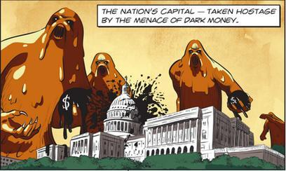

## Table of Contents

## What is dark money?

Dark money refers to political spending by groups that do not have to disclose their donors. This means that people can give money to these groups to influence elections or political issues without anyone knowing who they are. It's called "dark" because the sources of the money are hidden from the public.

These groups often use dark money to run ads or support candidates without revealing where the funds came from. This can make it hard for voters to know who is really behind a political message. Some people worry that dark money can lead to corruption or give wealthy donors too much power in politics.

## How does dark money influence politics?

Dark money can change how politics works because it lets rich people or groups give money to help their favorite candidates or ideas without anyone knowing who they are. When people see ads or hear about a candidate, they might not know that a secret group paid for it. This can make it hard for voters to make good choices because they don't have all the facts. It can also make it seem like more people support a certain idea than really do, because the money behind it is hidden.

This kind of secret money can also make politicians feel like they have to do what the secret donors want, instead of what their voters want. If a politician knows that a group with a lot of dark money can help them win or lose an election, they might start to listen more to that group than to the people who elected them. This can make people feel like their vote doesn't matter as much, and it can make the whole political system seem unfair.

## What are the sources of dark money?

Dark money comes from different places, but it's hard to know exactly where because it's secret. Often, it comes from rich people or big companies who want to help certain politicians or ideas without people knowing. They might give money to special groups called "nonprofits" or "social welfare organizations" that don't have to say who their donors are. These groups can spend the money on ads or other ways to affect elections and politics.

Sometimes, dark money also comes from unions or other groups that want to support their goals. They might use dark money to make it look like their ideas are more popular than they really are. Since the money is hidden, it's hard for the public to know who is really trying to influence politics and why. This makes it tricky to understand where all the dark money is coming from and what it's being used for.

## Can you explain the difference between dark money and other types of political contributions?

Dark money is different from other types of political contributions because it comes from groups that don't have to tell anyone who gave them the money. When people or companies give money directly to a candidate or a political party, they have to say who they are. This is called a "direct contribution" and it's easy to see who is helping which politician. But with dark money, the donors stay secret, so it's hard to know who is really behind the money.

Other types of political spending, like money given to political action committees (PACs), also have to follow rules about saying who their donors are. These PACs can spend money on ads or other ways to help candidates, but they have to be open about where their money comes from. Dark money groups, on the other hand, can spend money on similar things but without telling anyone who gave them the money. This makes dark money a big mystery in politics and can make it hard for voters to know who is trying to influence their choices.

## How is dark money legally defined in the United States?

In the United States, dark money is legally defined as money spent on political activities by groups that do not have to tell anyone who their donors are. These groups are often called "nonprofits" or "social welfare organizations" and they can spend money on ads or other ways to affect elections without revealing where the money comes from. The main rule that lets them do this is called the "Citizens United" decision by the Supreme Court in 2010, which said that these groups can spend money on politics without having to say who gave them the money.

This kind of spending is different from other types of political contributions because those usually have to follow rules about telling people who the donors are. For example, when people give money directly to a candidate or a political party, or when they give money to a political action committee (PAC), the donors' names have to be reported. But dark money groups don't have to follow these rules, so their spending stays secret. This makes it hard for the public to know who is really trying to influence politics and why.

## What are some examples of organizations that use dark money?

Some organizations that use dark money are groups like the American Action Network and the League of Conservation Voters. These groups can spend a lot of money on ads and other things to help politicians they like, but they don't have to say who gave them the money. The American Action Network often supports Republican candidates and ideas, while the League of Conservation Voters focuses on environmental issues and tends to support Democrats.

Another example is the Koch brothers' network, which includes groups like Americans for Prosperity. The Koch brothers are very rich and they use their money to help politicians and ideas they agree with, but they do it through these groups so no one knows it's them. This can make it hard for people to know who is really behind the money and why they are spending it.

## How has dark money impacted recent elections?

Dark money has had a big effect on recent elections. In the 2016 and 2020 elections, groups that didn't have to say who their donors were spent a lot of money on ads and other things to help candidates they liked. For example, in 2016, dark money groups spent millions of dollars to help Donald Trump and Hillary Clinton. This money helped shape what people saw and heard about the candidates, but voters didn't know who was really paying for it. This can make it hard for people to make good choices because they don't know who is trying to influence them.

In the 2020 election, dark money was used again to help both Joe Biden and Donald Trump. Groups like the Sixteen Thirty Fund spent a lot of money to help Democrats, while groups like the Judicial Crisis Network spent money to help Republicans. This money was used for ads and other ways to affect what people thought about the candidates. Because the donors were secret, it was hard for voters to know who was really behind the messages they were seeing. This kind of spending can make people feel like the election is not fair because rich people or groups can use their money to influence politics without anyone knowing.

## What are the arguments for and against the use of dark money in politics?

Some people think dark money is good because it lets people and groups give money to help politicians or ideas they like without anyone knowing who they are. They say this is important because it protects the privacy of donors. If someone wants to help a cause but is worried about being attacked or losing their job because of it, dark money can let them help without any trouble. Also, some people believe that dark money can help new ideas and candidates get more attention, because it lets them spend money on ads and other things without needing to tell everyone who is helping them.

But many people think dark money is bad because it can make politics unfair. When rich people or big groups can give a lot of money to help their favorite politicians without anyone knowing, it can make it hard for voters to know who is really trying to influence them. This can make it seem like more people support an idea than really do, and it can make politicians feel like they have to do what the secret donors want instead of what their voters want. This can make people feel like their vote doesn't matter as much, and it can make the whole political system seem unfair.

## How can dark money be tracked and monitored?

Dark money can be hard to track because the groups that use it don't have to say who gave them the money. But some people and groups try to find out where the money comes from by looking at things like tax records and public reports. For example, if a dark money group spends money on ads, they might have to report that spending to the Federal Election Commission (FEC), even if they don't have to say who their donors are. By looking at these reports, people can see how much money the group is spending and what they are spending it on, which can give clues about where the money might be coming from.

Some organizations, like the Center for Responsive Politics, work to track dark money by putting together information from different places. They might look at news stories, court cases, and other public records to try to figure out who is behind the money. Sometimes, journalists and researchers can find out who is giving money to these groups by talking to people or looking at leaked documents. Even though it's hard, these efforts can help shine a light on dark money and show the public who might be trying to influence politics behind the scenes.

## What reforms have been proposed to address the issue of dark money?

Some people want to change the rules about dark money to make politics more fair. They say that groups should have to tell everyone who gives them money, so voters can know who is trying to influence elections. One idea is to change the laws so that all groups, even nonprofits and social welfare organizations, have to report their donors if they spend money on politics. Another idea is to put limits on how much money these groups can spend, so they can't use a lot of secret money to help their favorite candidates or ideas.

Other people think we should focus on making it easier for everyone to give money to politics, not just rich people. They say that if more people can give small amounts of money, it will balance out the power of dark money. Some ideas include giving people tax breaks for small political donations or setting up public funding for elections. These changes could help make sure that everyone's voice is heard, not just the voices of secret donors with a lot of money.

## How does dark money affect policy-making and legislation?

Dark money can change how laws are made because it lets rich people or big groups help politicians without anyone knowing who they are. When politicians know that a secret group with a lot of money can help them win or lose an election, they might start to listen more to what the secret donors want. This can make them support laws or policies that the secret donors like, even if those laws are not what most people want. It can make the whole process of making laws seem unfair because the people who give the most money might have the biggest say, even if they are hidden.

This kind of secret money can also make it hard for the public to understand why certain laws are being made. If a new law comes out of nowhere and it helps a certain group or company, people might not know that dark money was behind it. This can make people feel like their government is not working for them, but for secret donors who have a lot of money. It can lead to less trust in the government and make people think that the system is rigged in favor of those who can afford to spend a lot of money on politics without telling anyone.

## What are the global perspectives on dark money and its regulation?

In many countries around the world, dark money is a big problem because it can make politics unfair. Some places, like the United States, have rules that let groups spend money on politics without saying who gave them the money. But other countries have different rules. In Europe, for example, some countries have stricter laws that make groups tell everyone who their donors are if they spend money on elections. This can help make sure that voters know who is trying to influence their choices. But even in places with strict rules, it can still be hard to stop dark money completely because people can find ways to hide where the money comes from.

Different countries have different ideas about how to deal with dark money. Some think that making all groups tell who their donors are is the best way to keep politics fair. Others believe that limiting how much money groups can spend on politics is a better solution. There are also countries that think giving people tax breaks for small donations or using public money to help fund elections can make dark money less powerful. But no matter what the rules are, many people around the world agree that dark money can hurt democracy by letting rich people or big groups have too much power in politics without anyone knowing.

## References & Further Reading

[1]: Mayer, J. (2016). ["Dark Money: The Hidden History of the Billionaires Behind the Rise of the Radical Right."](https://archive.org/details/darkmoneyhiddenh0000maye) Doubleday.

[2]: Drutman, L. (2015). ["The Business of America is Lobbying: How Corporations Became Politicized and Politics Became More Corporate."](https://academic.oup.com/book/9937) Oxford University Press.

[3]: Confessore, N. (2010). ["How U.S. Political Campaign Spending is Broken—and Unfixable."](https://usgovtpoli.commons.gc.cuny.edu/chapter-six-introduction-to-u-s-foreign-policy/) The New York Times.

[4]: Kroll, A., & Merica, D. (2012). ["How Super PACs and Dark Money have Reshaped Political Speech."](https://www.propublica.org/article/super-pacs-propublicas-guide-to-the-new-world-of-campaign-finance) CNN.

[5]: ["Understanding Dark Money and 501(c)(4) Organizations."](https://www.propublica.org/article/irs-political-dark-money-groups-501c4-tax-regulation) OpenSecrets.