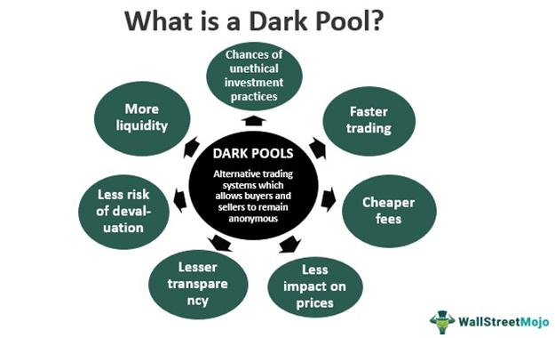

Dark pools and algorithmic trading have emerged as critical elements in the intricate world of financial markets. Dark pools are private trading venues that facilitate significant trades away from public exchanges, allowing institutional investors to buy or sell large volumes of securities without revealing their intentions to the broader market. This discretion helps mitigate adverse price movements that could be triggered by the knowledge of large trades. On the other hand, algorithmic trading leverages sophisticated algorithms to make fast, data-driven trading decisions, operating at speeds that far exceed human capabilities. These algorithms analyze market data, optimize order execution, and respond to market changes almost instantaneously.

When combined, dark pools and algorithmic trading create a synergy that enhances the execution of large transactions. Dark pools provide a platform for these automated strategies to execute large orders with minimal market impact. Meanwhile, algorithmic trading ensures that these orders are broken down, timed, and executed in ways that maximize efficiency and reduce the likelihood of influencing market prices. This collaboration supports institutional investors in executing trades that might otherwise be disruptive or costly in public markets.

This article examines the interaction between dark pools and algorithmic trading, discussing the sophisticated mechanisms that underpin their operation, the benefits they offer to traders, and the challenges they present, including issues of transparency and regulation. Through a comprehensive exploration, we aim to provide a deeper understanding of how these two components function together to shape modern financial markets.

## Table of Contents

## How Dark Pools Work

Dark pools provide institutional investors with a platform to execute large orders discreetly without influencing the public markets, thereby offering a solution for minimizing market impact and maintaining confidentiality. By design, they offer anonymity, effectively reducing the risk of price slippage by concealing details of trades until they are fully executed. This delayed disclosure helps protect trading strategies from being exposed to potential competitors.

The internal mechanisms of dark pools rely heavily on algorithms that match buy and sell orders without maintaining a public order book. These algorithms optimize trade execution by efficiently matching opposing orders while ensuring privacy. The absence of a public order book is critical to preserving the anonymous nature of dark pool transactions, allowing large trades to occur without alerting the broader market to significant buying or selling interest.

Despite the benefits offered by dark pools, they are subject to scrutiny due to transparency issues, which can influence market fairness. The lack of transparency in dark pools has raised concerns that some market participants may gain unfair advantages, potentially leading to market manipulation or discrepancies in pricing. These concerns have prompted regulatory bodies to impose oversight on dark pool operations, aiming to strike a balance between maintaining the anonymity that institutional investors seek and ensuring market integrity.

Regulatory efforts focus on enhancing transparency and accountability within dark pools. By enforcing disclosure requirements and monitoring trading activities, regulators aim to prevent any practices that could undermine market fairness. The challenge lies in crafting regulations that protect the confidentiality of trades while ensuring that dark pools operate within a framework that promotes equitable trading conditions.

## Algorithmic Strategies for Dark Pool Trading

Various sophisticated strategies are employed in dark pool trading using algorithms. These strategies are designed to execute large trades with minimal market impact, leveraging algorithms that can process data and make trading decisions at speeds unattainable through manual trading.

One of the primary strategies used is the Volume Weighted Average Price (VWAP) strategy. VWAP aims to execute trades in such a way that the price of the asset is as close as possible to the average price of the asset throughout the trading period, weighted by [volume](/wiki/volume-trading-strategy). This strategy minimizes price deviation, making it an attractive option for institutional investors seeking to acquire or dispose of large share volumes without causing significant price movements. The VWAP can be calculated using the formula: 

$$
\text{VWAP} = \frac{\sum_{i=1}^{n} P_i \times Q_i}{\sum_{i=1}^{n} Q_i}
$$

where $P_i$ and $Q_i$ represent the price and quantity of trade $i$, respectively. 

Another common strategy is the Time Weighted Average Price (TWAP), which executes trades evenly over a specified period. Unlike VWAP, TWAP does not consider trade volume, focusing on achieving a price that is evenly distributed across the trading interval, reducing market impact by preventing large surges in trading activity.

In addition to these, algorithms can disassemble large orders into smaller, less noticeable parts, employing stealth trading techniques that aim to further reduce market detectability. This approach is beneficial in maintaining anonymity while minimizing the influence on public market prices.

Liquidity providers within dark pools use algorithms to identify price improvements and optimize trade matches. Their goal is to enhance trade execution by seeking out favorable price points and facilitating smoother transactions between different parties in the pool.

Each of these strategies is designed to strike a balance between execution efficiency and market impact minimization. By employing advanced algorithms, traders can seamlessly navigate the opaque nature of dark pools, ensuring successful trade outcomes while maintaining discretion and efficiency.

## The Benefits of Using Algorithms in Dark Pools

Algorithmic trading within dark pools offers substantial advantages, particularly due to its ability to execute large trades discreetly while minimizing market [volatility](/wiki/volatility-trading-strategies). The use of sophisticated algorithms enables transactions to occur without revealing the size or intent, thus preserving the trade's value and minimizing the potential for adverse price movements. This strategic discretion prevents market participants from reacting to the trading activities, which is crucial in maintaining the integrity of the trade’s execution.

Cost efficiency is significantly enhanced through [algorithmic trading](/wiki/algorithmic-trading) in dark pools. Algorithms facilitate the reduction of transaction costs by optimizing the timing and method of trade execution. They analyze market conditions in real-time, ensuring that trades are conducted at optimal moments to coincide with favorable pricing. The improved market timing, assisted by algorithmic precision, allows traders to take advantage of short-lived opportunities, thus reducing the cost implications associated with manual trading methods.

Maintaining confidentiality and anonymity remains a pivotal benefit. The algorithms are designed to protect trading strategies by keeping them concealed from the broader public market. This privacy shields strategic maneuvers from competitors, ensuring that the intent behind trades is not prematurely disclosed, which could otherwise lead to counterstrategies by other market participants.

Liquidity is further enhanced by algorithmic trading, as algorithms are adept at identifying and interacting with hidden orders within dark pools. By discovering these latent opportunities, algorithms improve the likelihood of matching trades effectively and at favorable prices. This capability not only increases the chance of successful trade execution but also contributes to a more liquid environment, benefiting all participants involved.

In conclusion, algorithmic trading empowers institutional traders by providing the tools necessary to navigate dark pools effectively. Through the combination of discretion, cost efficiency, confidentiality, and improved [liquidity](/wiki/liquidity-risk-premium), algorithms offer a formidable approach to executing large trades without the drawbacks typically associated with public market transactions. Institutional traders are thus better equipped to execute their strategies within the opaque environment of dark pools, achieving their financial objectives while preserving the integrity and value of their trading activities.

## Risks and Challenges in Dark Pool Algorithmic Trading

Dark pool algorithmic trading, while providing significant advantages for executing large trades discreetly, also presents a series of risks and challenges. One of the primary concerns is information leakage, which occurs when sensitive trade data is inadvertently revealed, potentially impacting market dynamics. 

Moreover, market fragmentation is a potential issue as dark pools can divert liquidity from public exchanges, leading to a lack of price transparency and efficiency in price discovery. This fragmentation can adversely affect the broader market's ability to reflect true security values, posing a challenge to ensuring fair competition among trading venues.

Regulatory compliance poses another major challenge. Dark pools must operate under stringent oversight to prevent unfair trading practices. Regulatory bodies such as the SEC enforce rules to ensure these private trading venues uphold market integrity. However, keeping pace with evolving regulatory requirements necessitates continuous adaptation, which can be resource-intensive for trading firms.

Operational risks are inherent due to the complex technological infrastructure supporting algorithmic trading. Algorithms, while sophisticated, are susceptible to malfunctions. A failure in the system may result in incorrect trade executions, potentially causing financial losses. Such operational challenges necessitate robust risk management systems and comprehensive testing of trading algorithms before deployment to mitigate potential errors.

Counterparty risks are also significant due to the lack of transparency about trade parties until after trades are executed. This secrecy can lead to situations where one party may unknowingly trade with a counterparty of unknown creditworthiness, increasing the potential for default.

Addressing these challenges requires a multi-faceted approach that includes diligent risk management strategies and strict adherence to evolving regulatory standards. This involves implementing advanced data protection measures to minimize information leakage risks, maintaining robust compliance programs to align with regulatory demands, and ensuring algorithms are thoroughly tested to reduce operational mishaps. Ultimately, effective navigation of these risks and challenges will ensure the continued viability and integrity of dark pool algorithmic trading within the broader financial landscape.

## Regulatory Landscape for Dark Pools and Algorithmic Trading

Regulatory frameworks for dark pools and algorithmic trading are constantly evolving to align with technological advancements. In the United States, the Securities and Exchange Commission (SEC) plays a pivotal role in enforcing transparency to avert potential market manipulations. This is achieved by implementing regulations that require dark pools to provide light on their otherwise opaque trading activities. Such measures aim to ensure that participants do not exploit the anonymity of dark pools to engage in unfair trading practices. The SEC's transparency mandates typically focus on post-trade reporting and the disclosure of operational details, which are essential for maintaining market integrity.

Market surveillance is another cornerstone of the regulatory approach. Stringent monitoring systems are essential for detecting and mitigating abusive trading practices, such as front-running, where a trader gains an unfair advantage by executing orders based on advance knowledge of pending transactions. Surveillance technologies are crucial, as they allow regulators to analyze vast datasets quickly, identifying patterns that may indicate illicit activities. Advanced algorithms and machine-learning tools are often employed to enhance the effectiveness of such surveillance systems.

The international dimension of financial markets necessitates robust coordination among regulatory bodies. As dark pool and algorithmic trading strategies transcend national borders, inconsistencies in regulatory treatment can lead to loopholes and regulatory [arbitrage](/wiki/arbitrage). Institutions such as the International Organization of Securities Commissions (IOSCO) advocate for harmonization of regulations internationally, which includes standardized reporting formats, shared oversight protocols, and joint investigations into cross-border trading activities. Such collaborative efforts are crucial as financial markets become increasingly interconnected.

Balancing fairness with innovation presents a dual challenge within the regulatory landscape. Regulations must ensure a level playing field where all market participants, from large institutions to smaller players, operate under the same rules. However, they must also accommodate and even encourage technological innovations that enhance market efficiency. This requires a regulatory approach that is flexible yet firm, adapting to new technologies like [artificial intelligence](/wiki/ai-artificial-intelligence) and [machine learning](/wiki/machine-learning) while upholding core principles of fairness and market integrity.

In conclusion, the regulatory framework surrounding dark pools and algorithmic trading is dynamic and multifaceted, reflecting the rapid pace of technological change in financial markets. Agencies like the SEC are instrumental in enforcing transparency and fairness, while international coordination remains essential to manage the global nature of these trading activities. The challenge lies in fostering innovation without compromising on the principles that maintain market order and protect investors.

## Powering Dark Pool Trades

Dark pool trades utilize advanced technologies designed to optimize trade execution while ensuring confidentiality. Order-matching algorithms, trade anonymization, and liquidity aggregation are fundamental to the functioning of dark pools. These algorithms are tasked with efficiently pairing buy and sell orders without revealing them to the public market, preserving the anonymity of large trades and minimizing market impact.

Order-matching algorithms play a critical role by employing sophisticated strategies to execute trades at favorable prices. They function to identify compatible orders internally, facilitating swift execution without external visibility. As orders are matched internally within the dark pool, the absence of a public [order book](/wiki/order-book-trading-strategies) shield these transactions from public scrutiny and potential market manipulation.

Trade anonymization is another key aspect, ensuring that the identities of trading parties remain undisclosed. This confidentiality is particularly advantageous for institutional investors who wish to conduct substantial trades without alerting the broader market. By maintaining anonymity, dark pools preserve the strategic interests of participating entities.

Liquidity aggregation is a technique where dark pools consolidate orders from various sources, enhancing the likelihood of trade matches. This aggregation function increases the overall liquidity available within the pool, enabling more efficient execution of large trades.

Smart Order Routing (SOR) systems are utilized to evaluate multiple trading venues and routes orders to the most advantageous pool, ensuring optimal execution. SOR systems analyze market conditions in real-time and dynamically adjust routing decisions based on factors such as price, liquidity, and execution speed, thus maximizing trading outcomes.

To promote fair and equitable trading environments, dark pools integrate anti-gaming technologies. These mechanisms are designed to prevent predatory trading strategies that could exploit the confidential nature of dark pools. By detecting and controlling gaming tactics, these technologies uphold the integrity of the trading process.

The evolution of technology continues to bolster the efficacy of trading in dark pools. Innovations in machine learning and data analytics are paving the way for more advanced predictive algorithms, which can further enhance execution quality while maintaining discretion. Such technological progress ensures that dark pools remain potent tools for executing large orders without disturbing the equilibrium of public markets.

## Success Stories in Dark Pool Trading

Dark pool trading, a preferred strategy among institutional investors, has led to several notable successes. By leveraging the discreet nature of these platforms, investors can execute large trades without significantly impacting public market prices. One significant example involves an institutional investor who effectively acquired substantial shares in technology stocks. This strategic maneuver allowed them to secure considerable gains while maintaining a low profile in the market. The use of dark pools enabled the investor to avoid the typical price fluctuations associated with large acquisitions, thereby optimizing their financial objectives without public market exposure.

Similarly, a prominent [hedge fund](/wiki/hedge-fund-trading-strategies) adeptly utilized dark pools to establish significant short positions. By operating within the secretive confines of dark pools, the fund was able to position itself advantageously without attracting market attention. This approach not only facilitated the construction of their short positions but also allowed the hedge fund to evade detection by competitors and market analysts, thus maintaining strategic secrecy.

In another instance, a mutual fund achieved success by rebalancing its portfolio using dark pools. This technique helped the fund maintain its share value while acquiring desired assets at favorable prices. The ability to conduct these transactions discreetly minimized market impact and prevented adverse price movements, underscoring the advantages of dark pool trading in portfolio management.

These success stories exemplify the strategic advantages inherent in dark pool trading. By offering confidentiality and reducing the visibility of large trades, dark pools empower institutional investors to fulfill their investment strategies effectively, avoiding the pitfalls of public market exposure.

## The Future of Algorithmic Trading in Dark Pools

As financial markets evolve, the landscape of dark pool trading is poised for significant transformation facilitated by technological and regulatory developments. A key component driving this change is the integration of Artificial Intelligence (AI) into trading algorithms. AI's capability to enhance data analysis and pattern recognition enables more sophisticated trading strategies. These advancements allow for the identification of optimal trading opportunities and risk assessment in real-time, potentially increasing the efficiency of order executions within dark pools. Algorithms infused with machine learning capabilities can adapt to market changes swiftly, making them invaluable tools for institutional investors aiming to leverage dark pool environments to their advantage.

Regulatory changes will also play a crucial role in shaping the future of dark pool trading. As authorities strive to maintain a balance between fostering innovation and ensuring market fairness, regulatory frameworks are likely to evolve. This could involve enhanced transparency requirements and stricter surveillance to prevent market manipulation while still preserving the confidentiality advantages offered by dark pools. The challenge regulators face is to create policies that do not stifle technological advancements or reduce the attractiveness of dark pools for large traders.

Technological advancements may exacerbate the existing divide between financial institutions with access to cutting-edge tools and smaller players with limited resources. The deployment of complex algorithms and AI-driven systems requires significant investment in infrastructure and expertise, potentially marginalizing smaller firms. This disparity might result in a more concentrated market landscape, where only entities with substantial technological capabilities can fully reap the benefits of advanced dark pool trading.

Furthermore, the market structure itself might undergo changes as dark pools become increasingly prevalent. This could necessitate adaptability from market participants to remain competitive. For instance, traders may need to develop new strategies that align with evolving market dynamics and the integration of emerging technologies. Collaborative approaches and partnerships might become more common as institutions seek to combine resources to navigate the complexities of future algorithmic trading within dark pools.

In summary, the future of algorithmic trading in dark pools promises to be a dynamic interplay of technology and regulation. While innovations such as AI offer enhanced strategic possibilities, the challenge lies in maintaining an equitable market landscape that accommodates technological leaders and smaller participants alike. The evolution of market structures will require adaptability and strategic collaboration among traders to successfully operate in this rapidly advancing sector.

## References & Further Reading

[1]: BlackRock Investment Institute. ["Trading Dark Pools: Shedding Light on the Dark Market"](https://www.blackrock.com/corporate/insights/blackrock-investment-institute). 

[2]: Lopez de Prado, M. (2018). ["Advances in Financial Machine Learning"](https://www.amazon.com/Advances-Financial-Machine-Learning-Marcos/dp/1119482089). Wiley.

[3]: Harris, L. (2003). ["Trading and Exchanges: Market Microstructure for Practitioners"](https://academic.oup.com/book/52292). Oxford University Press.

[4]: Patterson, S. (2012). ["Dark Pools: The Rise of the Machine Traders and the Rigging of the U.S. Stock Market"](https://www.amazon.com/Dark-Pools-Machine-Traders-Rigging/dp/0307887189). Crown Business.

[5]: Aldridge, I. (2013). ["High-Frequency Trading: A Practical Guide to Algorithmic Strategies and Trading Systems"](https://www.amazon.com/High-Frequency-Trading-Practical-Algorithmic-Strategies/dp/1118343506). Wiley.

[6]: SEC. ["SEC Adopts Rules to Increase Transparency in Alternative Trading Systems"](https://www.sec.gov/newsroom/speeches-statements/proposed-rules-increase-operational-transparency-ats). 

[7]: Krawiec, M., & Krause, H. (2016). ["Regulating Dark Pools: The Emerging Market Structures, and Regulatory Challenges"](https://academic.oup.com/book/27407/chapter/197229790). Springer.

[8]: Hendershott, T., & Riordan, R. (2013). ["Algorithmic Trading and Information"](https://www.semanticscholar.org/paper/Algorithmic-Trading-and-Information-Hendershott-Riordan/992bb61fe2a9861310118f9f68ad98433e75eefd). American Economic Review, 103(1), 344-350.

[9]: Hasbrouck, J. (2007). ["Empirical Market Microstructure: The Institutions, Economics, and Econometrics of Securities Trading"](https://academic.oup.com/book/52241). Oxford University Press.