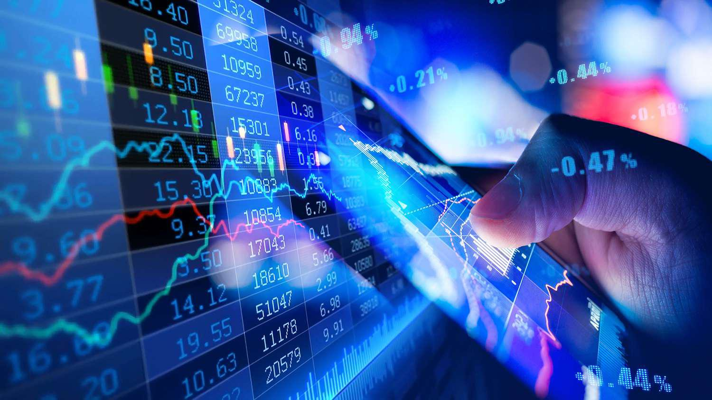

In the complex domain of financial markets, liquidity, dark pools, and algorithmic trading serve as fundamental components. Liquidity refers to the ease with which assets can be bought or sold in the market without causing significant price changes. It is essential because it ensures the smooth execution of transactions and contributes to market stability. Dark pools, private trading forums, allow large orders to be executed without public exposure, thereby providing liquidity for significant trades that might otherwise disrupt public markets. Algorithmic trading employs advanced computational methods to automate trading strategies, improving efficiency and contributing to overall market liquidity.

These elements are interconnected, influencing market operations, impacts, and future trends. Liquidity is regarded as the market's lifeblood, reducing trade costs and enhancing stability. Dark pools support this by enabling large-scale transactions with minimal market impact, while algorithmic trading optimizes trade execution, particularly in high-frequency scenarios. Collectively, they contribute to a market environment that values efficiency and liquidity, yet they also raise concerns regarding transparency and fairness. As financial markets continue to evolve, understanding these components is crucial for assessing their roles and regulating them to maintain a robust and equitable trading landscape.

## Table of Contents

## Understanding Financial Markets Liquidity

Liquidity plays a fundamental role in financial markets, ensuring that transactions are conducted smoothly and efficiently. It refers to the ability to buy or sell assets without causing significant price changes. Essentially, liquidity represents how quickly an asset can be converted into cash or another asset of equivalent value. In liquid markets, assets can be traded rapidly with minimal transaction costs, fostering a more stable and predictable trading environment.

High liquidity is often associated with market health. When markets are liquid, they typically exhibit tight bid-ask spreads, which reflect the difference between the highest price a buyer is willing to pay for an asset and the lowest price a seller is willing to accept. Tighter spreads reduce trading costs for participants, promoting market efficiency. Moreover, liquid markets reduce the risk of price manipulation, as the presence of numerous buyers and sellers decreases the impact of large transactions on asset prices.

The mechanics of liquidity can be described using supply and demand principles. When there is a balance in the number of buy and sell orders, markets maintain liquidity and price stability. Conversely, imbalances can lead to increased volatility and wider spreads, negatively impacting market efficiency. Market makers—entities that provide liquidity by quoting buy and sell prices—play a crucial role in sustaining market liquidity by facilitating transactions and absorbing excess supply or demand.

Various metrics assess market liquidity, including trading volume, turnover ratios, and market depth. Trading volume indicates the number of shares or contracts traded within a specific period, providing insight into market activity levels. A higher turnover ratio, the proportion of a security's total value traded relative to the average outstanding, suggests a liquid market. Meanwhile, market depth measures the market's capacity to sustain large orders without impacting prices significantly. It considers the order book's provide-sell-book liquidity, indicating the volume available at different price levels.

Overall, [liquidity](/wiki/liquidity-risk-premium) is indispensable for market dynamism, encouraging investor participation and confidence. It minimizes the potential for price distortion and enhances market stability by allowing participants to [exit](/wiki/exit-strategy) or enter positions effortlessly. Consequently, ensuring and maintaining adequate liquidity is critical to the efficient functioning of financial markets.

## The Role of Dark Pools in Market Liquidity

Dark pools are an integral component of modern financial markets, primarily serving as private trading mechanisms where transactions occur away from public exchanges. These platforms are designed to facilitate the execution of substantial orders with minimal market disruption. By offering a venue for large institutional investors to trade sizable quantities of securities, dark pools contribute significantly to market liquidity and stability.

Dark pools provide liquidity by accommodating the trading needs of institutional investors such as mutual funds, pension funds, and hedge funds. Executing large orders on open public markets can lead to significant price shifts, as such transactions can alert other market participants and cause a market reaction. By executing these trades in dark pools, large orders are matched discreetly, thus maintaining market equilibrium without substantial short-term price changes. This mitigates the risk of price slippage and reduces the cost of trading for large order sizes, enhancing overall market efficiency.

In addition to maintaining market stability, dark pools can affect price discovery, which is the process by which markets determine the price of a security. Since trades in dark pools are not immediately visible to the public, there is a divergence in trade information that can influence market perceptions and the transparency of price discovery. This has prompted ongoing discussions about the trade-offs between the benefits of liquidity provision and the importance of price transparency.

By lowering the likelihood of significant price fluctuations resulting from large trades, dark pools help prevent market [volatility](/wiki/volatility-trading-strategies), contributing to a stable trading environment. However, the privacy afforded by dark pools has led to increased scrutiny and debate about their impact on market fairness and transparency, highlighting the need for a balanced regulatory framework that maximizes their liquidity benefits while minimizing negative externalities.

In summary, dark pools play a crucial role in providing liquidity and stability to financial markets by allowing large orders to be executed off-exchange, minimizing market impact and facilitating efficient trade execution. This is essential for maintaining the structural integrity and optimal functioning of financial markets.

## How Algo Trading Interacts with Market Liquidity

Algorithmic trading, often known as algo trading, utilizes sophisticated computer algorithms to automate and optimize trading strategies across various financial markets. By leveraging pre-programmed rules and statistical models, algo trading can execute a high [volume](/wiki/volume-trading-strategy) of transactions with precision and speed that surpasses human capabilities. This efficiency plays a crucial role in influencing market liquidity.

Liquidity refers to the ability of an asset to be quickly bought or sold in the market without causing a significant impact on its price. In this context, algo trading enhances market liquidity by facilitating the seamless execution of numerous transactions, thereby ensuring a steady flow of trades. For instance, consider a scenario where a large institutional investor wishes to buy a substantial quantity of shares. An [algorithmic trading](/wiki/algorithmic-trading) system can break this large order into smaller segments and execute them incrementally to minimize market disruption and price volatility.

High-frequency trading ([HFT](/wiki/high-frequency-trading-strategies)), a subset of algorithmic trading, exemplifies how these trading techniques capitalize on market liquidity. HFT relies on the speedy execution of trades and millisecond-level market efficiency to achieve profitability. Algorithms used in HFT constantly scan multiple markets for liquidity imbalances or [arbitrage](/wiki/arbitrage) opportunities, executing trades at lightning speed once a profitable scenario is detected. This rapid trading activity contributes to tighter bid-ask spreads and increased market liquidity, making it easier for other market participants to transact.

From a technical perspective, algorithmic trading strategies may include [statistical arbitrage](/wiki/statistical-arbitrage), [market making](/wiki/market-making), and [trend following](/wiki/trend-following). Each of these strategies impacts market liquidity in different ways. For example, market-making algorithms place both buy and sell orders to profit from the spread between them, providing liquidity to the market. On the other hand, trend-following strategies might temporarily reduce liquidity by executing trades in the direction of prevailing market trends, but they often bring long-term liquidity through increased participation and interest in the asset class.

In summary, algorithmic trading significantly interacts with market liquidity by enabling high-frequency trading and other automated strategies that foster an efficient, liquid market environment. Nevertheless, the speed and volume of these trades also require constant oversight to ensure these activities don't result in adverse consequences such as market manipulation or unexpected volatility spikes.

## The Intersection of Dark Pools and Algorithmic Trading

Dark pools are financial platforms that allow trading without public [order book](/wiki/order-book-trading-strategies) exposure, characterized by their lack of transparency. They often utilize algorithmic trading to efficiently match buy and sell orders. This integration serves multiple purposes. Primarily, it enables large transactions to be conducted with minimal market impact. Large trades executed in public exchanges can significantly alter asset prices, potentially leading to increased volatility. By using algorithms within dark pools, these trades can be sliced into smaller, less conspicuous pieces that are executed over time or across various venues, thereby maintaining price stability.

Algorithmic trading within dark pools often employs complex mathematical models to determine the optimal timing and size of trades. For instance, algorithms may use historical data and real-time market information to predict price movements and adjust the execution strategy accordingly. This process maximizes the efficiency and effectiveness of trade execution. Furthermore, algorithms can react almost instantaneously to market signals, executing trades at speeds unattainable by manual methods. Such speed and precision are particularly advantageous in reducing the market impact of sizable orders.

Despite their benefits, the opacity associated with dark pools raises significant concerns about fairness and integrity within financial markets. Critics argue that the lack of transparency can lead to unequal information distribution, where certain market participants may have an advantage over others. This advantage might come from access to exclusive data or the ability to execute trades in hidden markets, potentially disadvantaging traditional market participants who rely on public exchanges.

Moreover, the synergy between dark pools and algorithmic trading has prompted regulatory scrutiny. Regulators worry that these private venues might facilitate activities that undermine market integrity, such as predatory trading practices. As a result, there is growing interest in ensuring that dark pools operate within a regulatory framework that promotes transparency and fairness, without stifling the efficiency benefits they provide.

In summary, the combination of dark pools and algorithmic trading plays a crucial role in modern financial markets, offering efficient trade execution and enhanced liquidity. However, the challenges associated with maintaining market fairness and transparency underline the need for careful oversight and regulation.

## Criticisms and Controversies

Dark pools and algorithmic trading, while offering significant efficiencies and liquidity benefits, face substantial criticism primarily due to issues around transparency and potential conflicts of interest. One major concern is the lack of public visibility associated with dark pools. Because these trades are executed away from public exchanges, the traditional market participants are often left in the dark regarding trading volumes and prices, which can lead to distorted market signals and misinformation about true supply and demand.

Algorithmic trading, particularly high-frequency trading (HFT), also garners criticism due to its perceived unfair advantages. The primary issue is the speed at which these trades are executed. High-frequency traders can capitalize on market information milliseconds before others, which can lead to a form of information asymmetry. Critics argue that such advantages allow high-frequency traders to "front-run" other market participants, effectively gaming the system by predicting and capitalizing on slower trades. This has raised concerns about the equity and fairness of the financial markets.

The rapid and automated nature of algorithmic trading can exacerbate market volatility. Algorithms, programmed to execute trades based on real-time market data, can lead to sudden and large volume trades that contribute to significant price swings. Instances such as the "Flash Crash" of 2010, where major stock indices in the United States plunged and then recovered rapidly within minutes, have highlighted the potential risks of high-speed, automated trading strategies.

Regulatory bodies, acknowledging these issues, are increasingly scrutinizing these practices to ensure fair market conditions. Regulatory frameworks are being developed and refined to address the opacity associated with dark pools and to mitigate the risks posed by high-frequency trading. Initiatives include mandatory trade reporting and transparency standards, as well as the implementation of speed bumps and other measures designed to address the unfair advantages linked to trading speed.

While regulations continue to evolve, the challenge remains to strike a balance between fostering market innovation and ensuring a fair trading environment for all participants.

## Conclusion

Financial markets liquidity, dark pools, and algorithmic trading are deeply interconnected components of the financial ecosystem. These elements collectively enhance market efficiency and liquidity by facilitating quicker and more substantial transaction volumes, which in turn can reduce transaction costs and lead to more stable pricing. Liquidity enables the seamless execution of trades, a feature that is critical for both retail and institutional investors seeking to execute large quantities of trades without disturbing market equilibrium.

Dark pools offer a platform for executing large trades with limited market impact, preserving the price stability of publicly traded securities. Similarly, algorithmic trading automates and accelerates trading processes, which can further increase market liquidity. Algorithmic strategies, particularly high-frequency trading, leverage these enhanced liquidity conditions to exploit minute price differences, increasing overall market volumes.

Nevertheless, the opacity associated with dark pools and the speed of algorithmic trading introduce challenges for market transparency. The restricted visibility of trades in dark pools raises questions about market fairness and equity, as market participants may lack critical information about price formation. Algorithmic trading, especially in high-frequency contexts, can lead to unfair advantages by allowing certain market actors to act on information milliseconds faster than others.

To maintain robust financial markets, it is crucial to strike a balance between leveraging the liquidity and efficiency that dark pools and algorithmic trading provide, while also enforcing regulations that ensure transparency and fairness. Regulatory bodies are tasked with monitoring these practices to prevent manipulative behaviors and maintain the integrity of the markets, ensuring they benefit all participants equally. Understanding and fine-tuning these regulatory measures are essential for fostering a stable and equitable financial environment.

## References & Further Reading

[1]: O'Hara, M. (2015). ["High Frequency Market Microstructure."](https://www.sciencedirect.com/science/article/pii/S0304405X15000045) Review of Financial Studies, 21(1), 31-42.

[2]: Madhavan, A. (2012). ["Exchange-Traded Funds, Market Structure, and the Flash Crash."](https://www.tandfonline.com/doi/abs/10.2469/faj.v68.n4.6) Financial Analysts Journal, 68(4), 20-35.

[3]: Budish, E., Cramton, P., & Shim, J. (2015). ["The High-Frequency Trading Arms Race: Frequent Batch Auctions as a Market Design Response."](https://academic.oup.com/qje/article/130/4/1547/1916146) American Economic Review, 105(7), 1486-1517.

[4]: Patterson, S. (2013). ["Dark Pools: The Rise of the Machine Traders and the Rigging of the U.S. Stock Market."](https://www.amazon.com/Dark-Pools-Machine-Traders-Rigging/dp/0307887189) Crown Business.

[5]: Foucault, T., Pagano, M., & Roell, A. (2013). ["Market Liquidity: Theory, Evidence, and Policy."](https://academic.oup.com/book/55158) Oxford University Press.