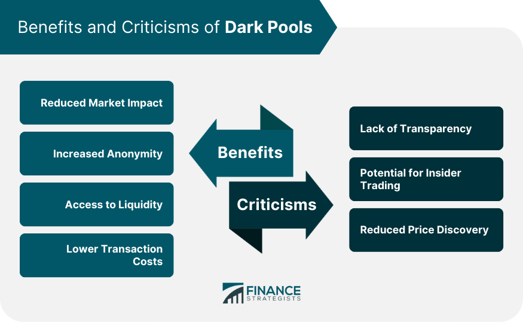

## Table of Contents

## What is dark pool liquidity?

Dark pool liquidity refers to the trading volume that happens away from public exchanges, in private venues called dark pools. These are platforms where big investors, like institutions, can buy and sell large amounts of stocks without showing their orders to the public. This helps them avoid moving the market price too much with their big trades.

Dark pools are used because when large orders are placed on public exchanges, they can affect the stock price. For example, if a big investor wants to sell a lot of shares, other traders might see this and start selling too, which would lower the price. By using dark pools, these big investors can keep their trades secret until they are done, helping them get a better price. However, this also means that regular investors don't get to see all the trading activity happening in the market.

## How do dark pools operate?

Dark pools are private exchanges where big investors trade stocks without other people knowing. They work by matching buyers and sellers inside the pool, away from the public eye. When someone wants to trade, they send their order to the dark pool. The pool then tries to find another order that matches it, like a buyer for a seller's shares. If it finds a match, the trade happens without anyone outside the pool knowing about it.

This helps big investors because they can trade large amounts of stocks without affecting the market price. For example, if a big investor wants to sell a million shares, doing it on a public exchange might make the stock price go down because other traders would see the big sell order. But in a dark pool, the order is hidden, so the price stays more stable. However, this also means that regular investors don't get to see all the trading activity, which can make the market less transparent.

## What is the purpose of dark pools in the financial markets?

Dark pools exist to help big investors trade large amounts of stocks without affecting the market price too much. When big investors want to buy or sell a lot of shares, doing it on a public exchange can make the stock price move a lot. Other traders might see the big order and start buying or selling too, which can push the price up or down. By using dark pools, these big investors can keep their trades secret until they are done, which helps them get a better price and avoid big swings in the stock price.

However, dark pools also make the market less transparent. Regular investors don't get to see all the trading activity happening in the market because some of it is hidden in dark pools. This can make it harder for everyone to understand what's really going on with stock prices. While dark pools help big investors, they can make things less fair for smaller investors who don't have access to the same information.

## Who can participate in dark pool trading?

Dark pool trading is mainly for big investors like banks, hedge funds, and other institutions. These groups have a lot of money to invest and need to trade large amounts of stocks. Regular people usually can't join dark pools directly because they don't have the same amount of money to invest. But sometimes, if a regular person's broker uses a dark pool, their trades might go through one without them knowing.

The reason big investors use dark pools is to keep their big trades secret. If they traded on public exchanges, everyone would see their orders and the stock price might change a lot. By using dark pools, they can buy or sell big chunks of stocks without affecting the market price too much. This helps them get a better price for their trades, but it also means that regular investors don't get to see all the trading activity happening in the market.

## What are the advantages of using dark pools for trading?

Dark pools help big investors trade large amounts of stocks without moving the market price too much. When big investors want to buy or sell a lot of shares, doing it on a public exchange can make the stock price go up or down a lot. Other traders might see the big order and start buying or selling too, which can push the price in the wrong direction. By using dark pools, these big investors can keep their trades secret until they are done. This helps them get a better price because the market doesn't know about their big order until it's too late.

Another advantage of dark pools is that they can help big investors save on trading costs. When big orders are placed on public exchanges, they can cause the price to move against the investor, which is called slippage. This can make the trade more expensive. Dark pools help avoid this by matching big orders away from the public eye, so the price stays more stable. This means big investors can trade without worrying about their big orders causing the price to change a lot, which can save them money.

## What are the common criticisms of dark pool liquidity?

One common criticism of dark pool [liquidity](/wiki/liquidity-risk-premium) is that it makes the market less fair for regular investors. When big investors trade in dark pools, their orders are hidden from the public. This means that other people don't get to see all the trading activity happening in the market. It can be hard for regular investors to understand what's really going on with stock prices if some trades are happening in secret. This lack of transparency can make the market less fair because big investors have access to information that others don't.

Another criticism is that dark pools can hurt the price discovery process. Price discovery is how the market figures out what a stock is worth based on all the buying and selling happening. When a lot of trading happens in dark pools, it's not included in this process. This can make it harder for the market to set the right price for stocks because not all the information is available. Some people worry that this can lead to prices that are not as accurate as they should be, which can be bad for everyone in the market.

## How do dark pools impact market transparency?

Dark pools make the market less transparent because they hide big trades from the public. When big investors use dark pools to buy or sell large amounts of stocks, regular investors don't get to see these trades. This means that a lot of trading activity is happening in secret, which can make it hard for everyone to understand what's really going on with stock prices. If people don't know about all the trades happening, they might make decisions based on incomplete information.

This lack of transparency can also affect how stock prices are set. Normally, the market figures out what a stock is worth by looking at all the buying and selling happening on public exchanges. But when a lot of trades happen in dark pools, this information isn't included in the price discovery process. As a result, the prices of stocks might not be as accurate as they should be. This can make the market less fair for everyone, especially for regular investors who don't have access to the same information as big investors using dark pools.

## Can dark pool trading affect the price discovery process?

Dark pool trading can affect the price discovery process because it hides big trades from the public. Price discovery is how the market figures out what a stock is worth by looking at all the buying and selling happening. When big investors use dark pools, their trades are not seen by everyone, so this information is not included in setting the stock price. This means that the prices might not be as accurate as they should be because not all the trading activity is visible.

This lack of information can make it harder for everyone to understand what's really going on with stock prices. If people don't know about all the trades happening, they might make decisions based on incomplete information. This can make the market less fair, especially for regular investors who don't have access to the same information as big investors using dark pools.

## What regulatory measures are in place for dark pools?

Regulators keep an eye on dark pools to make sure they follow the rules and don't hurt the market. In the United States, the Securities and Exchange Commission (SEC) is in charge of watching over dark pools. They have rules that say dark pools need to report their trades and be open about how they work. This helps make sure that dark pools don't hide too much information from the public and that they treat everyone fairly.

Other countries have their own rules too. For example, in Europe, the Markets in Financial Instruments Directive (MiFID II) sets rules for dark pools. These rules say that dark pools can only handle a certain amount of trading to keep the market fair. Regulators around the world work to balance the benefits of dark pools for big investors with the need to keep the market transparent and fair for everyone.

## How do dark pools compare to traditional exchanges in terms of trading volume and liquidity?

Dark pools usually have less trading [volume](/wiki/volume-trading-strategy) than traditional exchanges. Traditional exchanges like the New York Stock Exchange or NASDAQ have a lot of people buying and selling stocks all the time, so they have a lot of trading volume. Dark pools, on the other hand, are used by big investors to trade large amounts of stocks without showing their orders to the public. Because of this, the total amount of trading in dark pools is smaller compared to the big public exchanges.

When it comes to liquidity, dark pools can offer a different kind of liquidity. Liquidity means how easy it is to buy or sell something without affecting its price too much. Traditional exchanges have a lot of liquidity because there are always people trading there. Dark pools provide liquidity for big investors who want to trade large amounts without moving the market price. But this liquidity is hidden from the public, so it doesn't help with the overall market liquidity that everyone can see and use.

## What advanced strategies are employed by institutional investors in dark pools?

Institutional investors use dark pools to trade big amounts of stocks without making the price move a lot. One strategy they use is called "iceberg orders." This means they break up a big order into smaller parts and only show a little bit of it at a time. By doing this, they can buy or sell a lot of shares without other people knowing the whole size of their order. This helps them get a better price because the market doesn't see the big order all at once.

Another strategy is called "time slicing." This is when institutional investors spread their big trades out over time instead of doing it all at once. They might trade a little bit every hour or every day. This helps them avoid causing big changes in the stock price. By using these strategies in dark pools, big investors can keep their trades secret and get the best price for their stocks.

## What future trends might affect the use and regulation of dark pool liquidity?

In the future, technology might change how dark pools work. As computers and trading systems get better, dark pools might become even more important for big investors. They might use new tools to hide their trades even better and trade in smarter ways. But this could also make it harder for regular people to understand what's going on in the market. If dark pools become too good at hiding trades, regulators might need to make new rules to keep things fair for everyone.

Regulators around the world might also change the rules for dark pools. They might make dark pools report more information to the public or limit how much trading can happen in them. This would be to make sure that the market stays fair and everyone can see what's happening with stock prices. As more people learn about dark pools and how they affect the market, there could be more calls for better rules to make sure that dark pools don't hurt regular investors.

## References & Further Reading

[1]: O'Hara, M. (2015). ["High Frequency Market Microstructure."](https://www.sciencedirect.com/science/article/pii/S0304405X15000045) Review of Financial Studies, 21(1), 31-42.

[2]: Madhavan, A. (2012). ["Exchange-Traded Funds, Market Structure, and the Flash Crash."](https://www.tandfonline.com/doi/abs/10.2469/faj.v68.n4.6) Financial Analysts Journal, 68(4), 20-35.

[3]: Budish, E., Cramton, P., & Shim, J. (2015). ["The High-Frequency Trading Arms Race: Frequent Batch Auctions as a Market Design Response."](https://academic.oup.com/qje/article/130/4/1547/1916146) American Economic Review, 105(7), 1486-1517.

[4]: Patterson, S. (2013). ["Dark Pools: The Rise of the Machine Traders and the Rigging of the U.S. Stock Market."](https://www.amazon.com/Dark-Pools-Machine-Traders-Rigging/dp/0307887189) Crown Business.

[5]: Foucault, T., Pagano, M., & Roell, A. (2013). ["Market Liquidity: Theory, Evidence, and Policy."](https://academic.oup.com/book/55158) Oxford University Press.