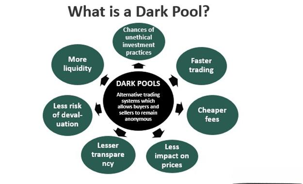

The world of trading is marked by a vast array of platforms and strategies, each contributing to the multifaceted nature of financial markets. Among these, dark pool liquidity has become particularly significant, especially within the sphere of algorithmic trading. Dark pools refer to private exchanges where large blocks of securities are traded away from the public eye, allowing institutional investors to execute large trades without revealing their intentions to the wider market. This lack of transparency, while controversial, facilitates significant advantages such as reduced market impact and protection of trading strategies.

Algorithmic trading, which leverages computer algorithms to execute trades at high speed and frequency, relies heavily on the efficiency and anonymity offered by dark pools. Traders using algorithmic methods are continuously looking to capitalize on the liquidity provided by these private venues, which allows them to manage large-scale transactions without tipping off competitors or causing significant price fluctuations. 

Understanding dark pool liquidity and its integration into algorithmic trading is key for both novice and experienced traders. As these traders navigate the complexities of modern financial markets, knowledge of dark pools' implications, advantages, and challenges becomes essential. This article aims to provide insight into how dark pool liquidity functions within the context of algorithmic trading, addressing various perspectives and considerations in the process.

## Table of Contents

## What is Dark Pool Liquidity?

Dark pools are private trading venues where institutional investors can execute large-scale trades without exposing their intentions to the public market. These hidden exchanges operate away from the conventional public stock exchanges, allowing trades to be conducted with a level of confidentiality that can be crucial for institutional traders. The essential characteristic of dark pools is their lack of pre-trade transparency, meaning that the [order book](/wiki/order-book-trading-strategies), which contains information on buy and sell orders, is not accessible to the public until after a trade is executed. 

This confidentiality serves as a significant advantage for institutions that need to trade large volumes. In a typical public market setting, large orders can disrupt the market, potentially leading to unfavorable price movements. For instance, if a large sell order were to be made public, it could prompt other market participants to adjust their prices downward before the order could be fulfilled, a phenomenon known as 'market impact.' Dark pools mitigate this issue by allowing trades to be executed without immediate disclosure, thus minimizing the risk of market impact and allowing prices to remain stable.

Moreover, dark pools enhance [liquidity](/wiki/liquidity-risk-premium) for institutional investors, enabling faster execution of large orders without the market [volatility](/wiki/volatility-trading-strategies) typically seen on public exchanges. By aggregating large interests from various participants, they create a pool of liquidity that facilitates significant trades while shielding them from the public eye. This structure can be particularly beneficial for hedge funds, pension funds, and other large trading entities looking to buy or sell substantial blocks of shares without revealing their trading strategies to competitors.

In essence, while dark pools contribute to market liquidity for large-scale transactions, they operate under a veil of secrecy that continues to prompt discussions about their role in the broader financial ecosystem.

## The Role of Dark Pool Liquidity in Algorithmic Trading

Algorithmic trading, a method of executing orders using automated pre-programmed trading instructions, often employs dark pool liquidity to optimize performance. By leveraging computers to execute trades at high speeds and volumes, [algorithmic trading](/wiki/algorithmic-trading) allows for the quick processing of market data and the execution of vast numbers of transactions. A key advantage of this approach is its ability to minimize human error and capitalize on fleeting market inefficiencies.

Dark pools, as private trading venues, provide a unique advantage in algorithmic trading by allowing the execution of large trades without immediately affecting the visible market. This is achieved by keeping trade details confidential until after the transaction is completed, thereby avoiding adverse price movement that could occur in public markets. Algorithms utilizing dark pools can strategically execute large buy or sell orders in pieces, rather than as a single trade, which helps to avoid slippage, a situation where the price changes unfavorably between the order being placed and executed.

In essence, dark pools offer a strategic advantage by concealing the trading interest from potential competitors, thus preserving the trader's edge. This confidentiality ensures that sophisticated trading strategies remain undisclosed, preventing rivals from gaining insights into an institution's trading intentions or strategies. The absence of transparency, intrinsic to dark pools, therefore provides a competitive shield which algorithms exploit to maintain confidential trading patterns.

Furthermore, the integration of dark pool liquidity within algorithmic trading offers enhanced liquidity and reduced market impact. Traders can access a continuous flow of buy and sell opportunities without contributing to price volatility associated with large order execution on public exchanges. This feature allows large institutional investors to conduct trades that are substantial enough to distort the market if executed openly, thereby maintaining stable market conditions.

Overall, the synergy between algorithmic trading and dark pool liquidity fosters an environment where trades can be conducted seamlessly and discreetly, enhancing the capability and efficiency of trading algorithms. These platforms facilitate market operations by ensuring large trades are completed without disclosing significant trading intentions, ultimately supporting the financial strategies of institutional traders.

## Advantages of Dark Pool Liquidity in Trading

Dark pool liquidity offers several advantages in trading, particularly for institutional investors seeking to optimize their strategies while minimizing disruptions in the market. One of the primary benefits of dark pool trading is the minimized market impact. By conducting trades away from the public eye, dark pools prevent large transactions from triggering significant price changes, which can happen if such trades were executed on public exchanges. This is essential for institutional investors managing substantial positions, as it allows them to enter or [exit](/wiki/exit-strategy) large trades without adversely affecting the market price.

Increased liquidity is another notable advantage provided by dark pools. These private platforms offer a continuous flow of buy and sell opportunities, which is essential for institutional investors who frequently need to transact in large volumes. The presence of other institutional participants in dark pools ensures that there is often a match for sizeable buy or sell orders, enhancing the fluidity and efficiency of financial markets. This increased liquidity contributes to more stable markets, as it absorbs large trades that might otherwise create volatility on public exchanges.

Confidentiality is a critical advantage that attracts traders to dark pools. These platforms allow investors to execute large trades with a greater degree of privacy, maintaining secrecy over their trading strategies. In a competitive market, preserving the confidentiality of trades can be paramount for institutional investors who do not want to signal their intentions to competitors or influence market sentiment. The ability to trade with a shroud of privacy helps in safeguarding strategic advantages, as traders can effectively mask their market movements, reducing the risk of unfavorable price shifts triggered by public knowledge of their trading activities.

These advantages make dark pool liquidity an attractive component of modern trading strategies, providing important tools for managing large trades discreetly and effectively in the complex landscape of financial markets.

## Criticism and Challenges

Dark pool liquidity, while beneficial for large institutional traders looking to minimize market impact, has faced considerable criticism and challenges over the years. The primary concerns surrounding dark pools are their lack of transparency, regulatory scrutiny, and implications for market fairness.

### Lack of Transparency

One of the most significant criticisms of dark pools is their inherent opacity. These private exchanges allow large transactions to occur without publicly displaying the size or price of the orders until after the trades have been executed. This lack of transparency can create an uneven playing field. Critics argue that it enables institutional investors to trade on information not available to the broader market, potentially leading to unfair advantages. This secrecy can result in institutional investors benefiting from price movements that are obscured from regular market participants, leading to information asymmetry.

### Regulatory Scrutiny

In response to these transparency issues, dark pools have come under increased regulatory scrutiny. Regulators such as the U.S. Securities and Exchange Commission (SEC) have implemented measures to enhance oversight and ensure that these private exchanges comply with fair trading practices. For instance, regulations have been proposed to require greater disclosure of dark pool operations and to establish fair access to these trading venues. This scrutiny aims to address potential conflicts of interest and to prevent any unfair competitive advantages that may arise from opaque trading environments.

### Market Fairness

The debate over market fairness is central to the criticism of dark pools. By shrouding large transactions in secrecy, dark pools can obscure critical pricing information from the broader market, potentially leading to price inefficiencies. Opponents contend that such practices can disguise the true supply and demand dynamics, ultimately affecting the price discovery process. Ensuring fairness thus necessitates balancing the privacy advantages for large trades against the need for transparency that benefits the entire marketplace.

In conclusion, while dark pools offer distinct advantages for minimizing market impact and increasing liquidity for large institutional traders, they face criticisms mainly centered around transparency and fairness. Balancing the confidential nature of dark pools with the demand for an open and fair trading environment remains an ongoing challenge for both regulators and market participants.

## The Future of Dark Pools in Algo Trading

As technological advancements continue to reshape financial markets, the future of dark pools in algorithmic trading holds significant promise and complexity. The synergy between dark pools and algorithmic trading is likely to strengthen as more sophisticated algorithms are developed, facilitating the execution of large-scale trades with improved efficiency and minimal market impact. The evolution of [artificial intelligence](/wiki/ai-artificial-intelligence) and [machine learning](/wiki/machine-learning) technologies is set to enhance the predictive capabilities of trading algorithms, allowing for more refined strategies that can effectively leverage the liquidity offered by dark pools.

Regulatory frameworks are concurrently evolving to ensure that the growth of dark pools does not compromise market integrity. Regulatory bodies worldwide are actively scrutinizing the operations of dark pools, aiming to enhance transparency while maintaining the privacy that these private trading venues inherently provide. This regulatory oversight seeks to address concerns regarding potential conflicts of interest and to ensure that the advantages offered by dark pools do not foster market inequality.

For traders and institutions, staying abreast of these regulatory changes is crucial. New regulations could impose additional reporting requirements or restrictions on the operation of dark pools, impacting how trading strategies are formulated and executed. Being informed enables traders to adapt their strategies proactively, ensuring that they remain compliant while effectively utilizing dark pool liquidity. As such, continuous education and adaptation are essential for capitalizing on the opportunities presented by dark pools in algorithmic trading while adhering to evolving regulatory standards.

Ultimately, the future of dark pools in algorithmic trading will be shaped by a delicate balance between technological innovation and regulatory intervention. Traders and institutions must navigate this landscape with agility, leveraging technological advancements while remaining vigilant to regulatory developments that aim to harmonize market fairness with the strategic advantages offered by dark pools.

## Conclusion

Dark pool liquidity plays a crucial role in modern trading, serving as a pivotal component in the execution of algorithmic trading strategies. These private trading venues offer traders substantial advantages, such as minimizing market impact and maintaining confidentiality. By facilitating large trades without alerting competitors or significantly affecting market prices, dark pools provide a strategic edge for institutions handling substantial volumes of assets.

However, the integration of dark pool liquidity into trading ecosystems presents a series of challenges that the trading community must navigate with caution. The lack of transparency inherent in dark pools raises concerns about market fairness and the potential for unequal access to information, prompting increased regulatory scrutiny. As regulations evolve to address these issues, traders and institutions must remain vigilant and adaptable to maintain compliance and ensure equitable trading practices.

Ultimately, a deep understanding of dark pool mechanisms is essential for traders aiming to optimize their strategies in today's competitive market environment. By balancing the benefits of dark pool liquidity with the necessity for transparency and fairness, market participants can harness these private exchanges to enhance their trading outcomes while adhering to best practices and regulatory requirements.

## References & Further Reading

[1]: Kwan, A. (2020). ["The Future of Dark Pools in the Face of Increased Regulation and Technological Advancement."](https://journals.sagepub.com/doi/full/10.1177/21582440211047576) Securities.io.

[2]: Madhavan, A. (2012). ["Exchange-Traded Funds, Market Structure, and the Flash Crash."](https://rpc.cfainstitute.org/en/research/financial-analysts-journal/2012/exchange-traded-funds-market-structure-and-the-flash-crash) Financial Analysts Journal, 68(4).

[3]: Black, F. (1986). ["Noise."](https://onlinelibrary.wiley.com/doi/abs/10.1111/j.1540-6261.1986.tb04513.x) The Journal of Finance, 41(3).

[4]: Bloomberg, M. (2010). ["The Bloomberg Way of Trading: A Look into Dark Pools."](https://knowledge.wharton.upenn.edu/article/the-bloomberg-way-an-inside-look-at-how-the-news-organization-covers-news/) Bloomberg News.

[5]: Clark, A., & Meyer, G. (2017). ["Dark Pools and High-Frequency Trading in Equity Markets: An Assessment of Their Impact on Market Quality and Integrity."](https://www.science.org/doi/pdf/10.1126/sciadv.aax0903) Journal of Business Ethics, 134(3).

[6]: Harris, L. (2003). ["Trading and Exchanges: Market Microstructure for Practitioners"](https://www.amazon.com/Trading-Exchanges-Market-Microstructure-Practitioners/dp/0195144708). Oxford University Press. 

[7]: Mittal, H. (2008). ["Are You Playing in a Toxic Dark Pool?"](https://www.semanticscholar.org/paper/Are-You-Playing-in-a-Toxic-Dark-Pool-Mittal/e1bba16eb26412f26ed50f459e0c9341eb296eb4) Journal of Trading, 3(1). 

[8]: Patterson, S. (2013). ["Dark Pools: High-Speed Traders, A.I. Bandits, and the Threat to the Global Financial System"](https://books.google.com/books/about/Dark_Pools.html?id=LIoNSKUEn24C). Crown Business. 

[9]: Popper, N. (2012). ["In Algorithmic Trading, the Debate Over the Utility of Dark Pools Continues."](https://academic.oup.com/edited-volume/41262/chapter/350850196) The New York Times. 

[10]: Stoll, H. R. (2000). ["Friction."](https://onlinelibrary.wiley.com/doi/abs/10.1111/0022-1082.00259) The Journal of Finance, 55(4).