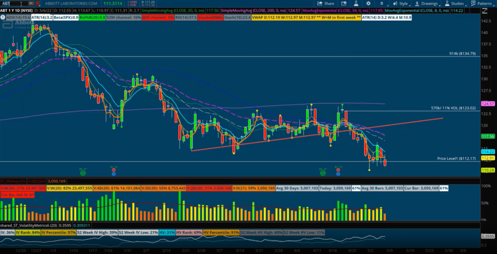

 to Dark Pool Trading

Dark pool trading refers to the private exchange or trading of financial securities that occurs outside of public stock exchanges. These transactions predominantly involve institutional investors, who execute trades that remain hidden from the general public. Unlike traditional stock exchanges, where trades are visible and can influence market prices, dark pools provide a platform for executing large orders discreetly. This discretion helps minimize market impact, preventing the price disruptions that might occur if large trades were made public.

The primary objective of dark pool trading is to allow significant orders to be executed without alerting the broader market, thus maintaining price stability. By doing so, dark pools can enhance market liquidity by facilitating the seamless transfer of large volumes of securities. Additionally, they can lower transaction costs by reducing the slippage—defined as the difference between the expected price of a trade and the actual price—that often accompanies large scale trades in public exchanges.

However, the opaque nature of dark pool trading introduces concerns about market transparency. Since these trades are not visible to the public, there is a reduced level of accountability and oversight, which can lead to potential conflicts of interest and market manipulation. Despite these concerns, dark pools have gained prominence, especially with the integration of algorithmic trading.

Algorithmic trading, commonly known as algo trading, plays a significant role in modern dark pool trading. It involves using advanced algorithms to execute trades at speeds and volumes beyond human capability, optimizing the execution of large orders while minimizing information leakage and market impact. This article will explore various strategies employed in dark pool trading, highlighting how algorithmic trading enhances execution efficiency and risk management within these private exchange systems.

## Table of Contents

## Understanding Dark Pools

Dark pools are a specialized type of alternative trading system (ATS) that facilitate the anonymous trading of large blocks of securities. They were developed to meet the demands of institutional investors seeking to transact significant quantities of shares without alerting the broader market, which might otherwise react to the visible movement of large trades, potentially altering stock prices unfavorably for these investors.

The operation of dark pools allows these large trades to be executed discreetly, providing liquidity and minimizing market impact. While they can function similarly to public stock exchanges, dark pools differ primarily in their lack of transparency; they do not display the orders being worked or the identities of the participants until after trades have been executed. This anonymity is beneficial in preventing the full exposure of trading intentions, which could lead to adverse price movements if competitors were able to observe and potentially exploit this information.

Dark pools can either be operated by major financial institutions or function as stand-alone entities, each with its own rules and structures tailored to the preferences of its participants. Those managed by financial institutions may integrate more closely with the institution's internal systems and client bases, while independent dark pools cater to a broader range of market participants, maintaining a neutral stance.

Despite their opaque nature, dark pools are subject to regulatory oversight to ensure adherence to fair trading practices. Regulators such as the U.S. Securities and Exchange Commission (SEC) implement rules designed to ensure that dark pools operate within the legal framework provided for ATSs. These regulations aim to safeguard market integrity, ensuring that dark pools do not unfairly disadvantage other market participants or destabilize the market through opaque and potentially manipulative trading practices.

A comprehensive understanding of dark pool mechanisms is essential for the development of effective trading strategies within these venues. As they offer a unique environment distinct from traditional exchanges, traders must adapt their approaches to align with the distinct characteristics of dark pools. This includes consideration of factors such as order execution quality, potential latency issues, and the impact of regulatory changes on dark pool operations.

In summary, while dark pools play a critical role in the modern securities market by providing a venue for large trades to be executed quietly and efficiently, they also present unique challenges and opportunities that require a deep understanding to navigate effectively.

 to Algo Trading

Algorithmic trading, commonly known as algo trading, has revolutionized the way financial markets operate by executing trades at speeds and frequencies unattainable by human traders. It relies on sophisticated algorithms that analyze vast amounts of market data to make informed trading decisions. These algorithms are programmed to monitor market conditions and execute trades based on predefined criteria such as price, timing, and [volume](/wiki/volume-trading-strategy).

At its core, algo trading involves designing robust strategies that can operate autonomously in the financial markets. This requires creating algorithms that not only interpret real-time data but also adapt to changing market conditions. The algorithms can identify trends, price discrepancies, or [arbitrage](/wiki/arbitrage) opportunities, enabling traders to capitalize on them efficiently.

Institutional investors are the primary users of [algorithmic trading](/wiki/algorithmic-trading) due to its ability to process large volumes of trades without significant market disruption. As a result, algo trading has become an essential component of modern trading practices, enhancing [liquidity](/wiki/liquidity-risk-premium), reducing transaction costs, and supporting complex investment strategies.

The integration of algorithmic trading with dark pools offers traders significant opportunities to optimize trade executions while managing risk. Dark pools, which facilitate the anonymous trading of large blocks of securities away from public exchanges, complement algo trading by allowing trades to be executed discreetly. This marriage between algo trading and dark pools enables traders to minimize market impact and information leakage, which are crucial in maintaining a competitive edge.

Algorithmic strategies within dark pools often focus on execution efficiency. These algorithms can use techniques such as volume-weighted average price (VWAP) and time-weighted average price (TWAP) to distribute large orders over time, ensuring that market impact is minimized. By executing trades strategically, traders can achieve better pricing and execution quality, particularly for large institutional orders.

In summary, the application of algorithmic trading in financial markets has led to transformative changes, enhancing both the efficiency and effectiveness of trading strategies. As the landscape of dark pool trading evolves, the synergy between algo trading and dark pools will continue to be pivotal in maintaining competitive advantages and optimizing trade execution.

## Dark Pool Trading Strategies with Algorithms

Dark pool trading strategies that incorporate algorithmic components focus on optimizing the execution of large orders to reduce market impact and enhance execution efficiency. One prevalent approach is the Volume Weighted Average Price (VWAP) strategy, which aims to execute trades at an average price weighted by the traded volume over a specific period. This approach is designed to achieve a price close to the average market price while minimizing the impact on price levels. The VWAP calculation is expressed as follows:

$$
\text{VWAP} = \frac{\sum{(P_i \times Q_i)}}{\sum{Q_i}}
$$

where $P_i$ represents the price of the trade and $Q_i$ represents the quantity traded at each transaction. By distributing the trade over a specified time frame, VWAP strategies help in reducing the visibility of large transactions, thereby minimizing market disturbances.

Another effective algorithmic strategy employed in dark pools is the Time Weighted Average Price (TWAP) approach. TWAP is designed to execute a large order evenly over time by breaking it into smaller, incrementally executed trades. This strategy helps trade without significantly affecting market liquidity and is particularly useful in less volatile markets. The TWAP formula can be represented as:

$$
\text{TWAP} = \frac{\sum{P_i}}{n}
$$

where $P_i$ is the trade price at each interval, and $n$ is the number of intervals within a specified period.

Stealth algorithms play a crucial role in concealing the intentions behind significant trades to avoid revealing them to competing trades on both lit and dark markets. These algorithms intelligently manage order distribution and timing, allowing market participants to execute without drawing attention. By using predictive analytics and real-time data, stealth algorithms can dynamically adjust the trading path, further avoiding potential pattern recognition by other market participants or algorithms.

Overall, the application of these strategies in dark pools aims to manage price movements, prevent information leakage, and maximize the efficiency of trade execution. With algorithmic trading in dark pools, traders can achieve a balance between stealth, speed, and price optimization, ensuring that large transactions are conducted discreetly while maintaining favorable market conditions.

## Advantages and Challenges of Algo Trading in Dark Pools

Algorithmic trading within dark pools presents both significant advantages and notable challenges. The primary benefits stem from its potential to reduce market impact, enhance execution speed, and improve cost efficiency.

The reduced market impact is particularly crucial for institutional investors handling large orders. By dispersing these orders across dark pools, traders can execute trades without significantly affecting stock prices, as would happen on public exchanges. This method maintains the confidentiality of trading intentions, helping protect sensitive trading strategies from exposure.

Execution speed is another major advantage. Algorithmic systems can rapidly analyze market data and execute trades at speeds far superior to human capabilities. The algorithms can monitor numerous variables simultaneously, executing trades as soon as optimal conditions are met. This speed not only facilitates quicker trade execution but also opens up arbitrage opportunities that may arise in fleeting time windows.

Cost efficiency is achieved through reduced transaction fees as trades in dark pools often incur lower fees than traditional exchanges. Additionally, by minimizing market impact through algorithmic precision, the overall cost associated with executing large orders is lowered. This efficiency is crucial for maintaining competitive advantages and improving profit margins.

Despite these advantages, several challenges affect algo trading in dark pools. A significant issue is the lack of price transparency. Unlike public exchanges where prices and trade volumes are visible, dark pools operate in relative obscurity. This opacity can lead to information asymmetry where certain traders possess more knowledge about the trading environment than others, potentially leading to unfair advantages.

Conflicts of interest also pose a challenge. Some dark pools are operated by large financial institutions that may trade against their clients. This setup can raise concerns about the prioritization of orders and whether client interests are wholly protected.

To mitigate risks associated with anonymity and regulatory compliance, monitoring the integration of trading systems is vital. Regulatory bodies impose stringent rules to safeguard market integrity, requiring constant updates and adaptations in trading algorithms to ensure adherence to such frameworks.

Traders must also continuously refine and adapt their algorithms to align with fluctuating market conditions and evolving regulations. This adaptability is crucial to maintain the efficacy and legality of trading operations.

Understanding the duality of advantages and challenges in algo trading within dark pools is vital for developing effective strategies. By acknowledging both sides, traders can better harness these sophisticated trading systems, optimizing execution while navigating potential pitfalls.

## Future of Dark Pool Trading and Algorithmic Strategies

The future of dark pool trading and algorithmic strategies is expected to evolve significantly, driven by both technological innovations and regulatory developments. As trading algorithms become increasingly sophisticated, they promise enhanced efficiency and effectiveness in executing trades. Advances in technology are providing traders with tools that can analyze vast datasets rapidly and accurately, leading to better-informed trading decisions and optimized strategies.

Emerging technologies, particularly [artificial intelligence](/wiki/ai-artificial-intelligence) (AI) and [machine learning](/wiki/machine-learning), are set to play a critical role in strategy optimization for dark pool trading. AI can process and interpret complex patterns in financial markets, providing insights that were previously inaccessible. Machine learning algorithms, with their ability to learn from historical data and adapt to new market conditions, offer a dynamic approach to developing trading strategies. These technologies facilitate the identification of optimal trading opportunities and mitigate risks associated with market [volatility](/wiki/volatility-trading-strategies).

However, the evolution of dark pools is not solely dictated by technology. Regulatory scrutiny continues to significantly influence the functionality and implementation of dark pool trading strategies. Regulators are increasingly focused on ensuring market transparency and fairness, which necessitates compliance with stringent standards and reporting requirements. This ongoing scrutiny may lead to changes in how dark pools operate, potentially affecting their attractiveness to traders seeking anonymity.

Traders must navigate these evolving landscapes with agility and a thorough understanding of both technological advancements and regulatory requirements. Remaining informed about changes in market conditions, technological breakthroughs, and regulatory updates is crucial for traders aiming to leverage the opportunities presented in this domain. Successfully adapting to these changes will involve the continuous refinement of algorithms and an openness to integrating new technologies into existing trading frameworks.

In summary, the future of dark pool trading and algorithmic strategies will be shaped by the interplay of advanced technology and regulatory measures. Traders who are able to effectively harness emerging technologies and adapt to regulatory changes will find themselves well-positioned to capitalize on the opportunities in this evolving market landscape.

## References & Further Reading

[1]: McCrum, D. (2018). ["How Dark Pools Work"](https://lime.co/news/how-do-dark-pools-operate-and-why-were-they-created-31194/). Financial Times.

[2]: Buti, S., & Rindi, B. (2016). ["Dark Pool Trading Strategies, Market Quality and Welfare."](https://www.sciencedirect.com/science/article/pii/S0304405X16300022) Journal of Financial Economics.

[3]: Aldridge, I. (2013). [High-Frequency Trading: A Practical Guide to Algorithmic Strategies and Trading Systems (2nd ed.).](https://www.wiley.com/en-us/High+Frequency+Trading%3A+A+Practical+Guide+to+Algorithmic+Strategies+and+Trading+Systems-p-9780470579770) Wiley.

[4]: Bauguess, S. (2018). ["The Role of Alternative Trading Systems in Today's Equity Markets."](https://papers.ssrn.com/sol3/papers.cfm?abstract_id=3226514) U.S. Securities and Exchange Commission.

[5]: de Prado, M.L. (2018). [Advances in Financial Machine Learning.](https://www.amazon.com/Advances-Financial-Machine-Learning-Marcos/dp/1119482089) Wiley.

[6]: BlackRock. (2018). ["Working Paper: The Evolution of Equity Trading in a Global and Rapidly Changing Landscape - A Synthesis of Key Trends, Drivers and Prospects for the Future."](https://hk.linkedin.com/in/guqinyi) BlackRock.

[7]: Gomber, P., Arndt, B., Lutat, M., & Uhle, T. (2011). ["High-frequency trading."](https://papers.ssrn.com/sol3/papers.cfm?abstract_id=1858626) SpringerLink.