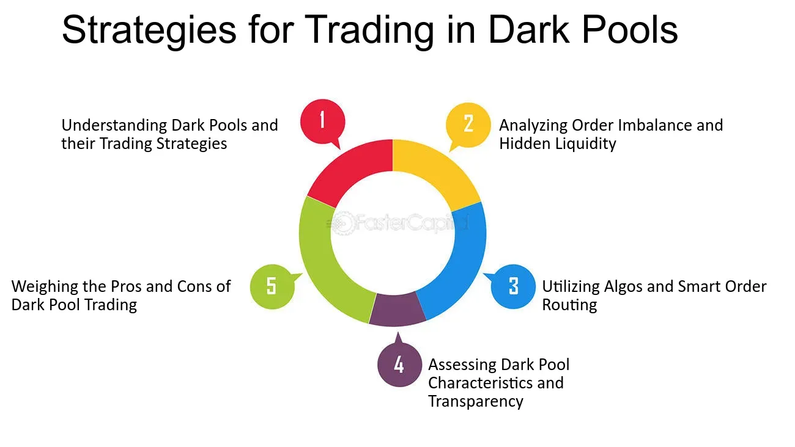

## Table of Contents

## What is dark pool trading?

Dark pool trading is a type of trading that happens away from public stock exchanges. It's called "dark" because the trades are not visible to the public until after they are completed. This type of trading is used by big investors, like big banks and institutions, who want to buy or sell large amounts of stocks without affecting the market price too much. If they traded on public exchanges, their big orders could cause the price to go up or down a lot, which they want to avoid.

Dark pools help these big investors keep their trading plans secret. They can place their orders in a dark pool, and the trades are matched privately. This way, other traders on public exchanges don't know what's happening and can't react to it. While dark pools can be useful for big investors, they can also make the overall market less transparent, which some people worry about. Regulators keep an eye on dark pools to make sure they are fair and not used to manipulate the market.

## How do dark pools differ from traditional stock exchanges?

Dark pools and traditional stock exchanges are different in how they work and what they do. A traditional stock exchange, like the New York Stock Exchange, is a public place where people buy and sell stocks. Everyone can see the prices and the orders that are happening in real time. This means if you want to buy or sell a stock, you can see what other people are doing and make your decision based on that information.

On the other hand, dark pools are private. They are used by big investors to trade large amounts of stocks without other people knowing about it. In a dark pool, the orders are hidden until after the trade is done. This helps big investors keep their plans secret and avoid moving the market price too much. While this can be helpful for them, it makes the overall market less open and clear for everyone else.

## What are the advantages of using dark pools for trading?

Dark pools have some big advantages for big investors. The main one is that they can trade large amounts of stocks without other people knowing about it. When big investors want to buy or sell a lot of stocks, doing it on a public exchange can make the stock price move a lot. By using a dark pool, they can keep their plans secret and not affect the market price so much. This helps them get a better price for their stocks and not scare other people in the market.

Another advantage is that dark pools can help big investors save on costs. When they trade on a public exchange, they might have to pay more in fees and other costs. Dark pools often have lower fees, so big investors can save money. Also, because their orders are hidden, they don't have to worry about other traders trying to take advantage of their big orders. This can make their trading more efficient and less risky.

## What are the potential risks associated with dark pool trading?

Dark pool trading can be risky for the overall market because it makes things less clear. When big trades happen in secret, it's hard for other people to know what's going on. This can make the market feel less fair and open. If too many big trades happen in dark pools, it might make it harder for regular investors to understand the market and make good choices. Regulators worry about this and try to make sure dark pools don't cause too many problems.

Another risk is that some people might use dark pools to do bad things, like trying to trick the market. Because dark pools are private, it can be easier for some traders to hide what they're doing. This could lead to unfair practices or even illegal activities. Regulators have to keep a close watch on dark pools to stop this from happening. Even with all the rules, there's always a chance that someone might find a way to use dark pools to cheat the system.

## Who typically uses dark pools and why?

Big investors like banks, hedge funds, and other institutions are the ones who usually use dark pools. They trade large amounts of stocks and want to keep their moves secret. If they traded on public exchanges, their big orders could make the stock price go up or down a lot. By using dark pools, they can buy or sell stocks without other people knowing about it, which helps them get a better price and not scare the market.

These big investors also use dark pools because they can save money. Trading on public exchanges can be more expensive because of fees and other costs. Dark pools often have lower fees, so big investors can keep more of their money. Plus, since their orders are hidden, they don't have to worry about other traders trying to take advantage of their big orders. This makes their trading smoother and less risky.

## How can retail investors access dark pools?

Retail investors usually can't use dark pools directly because they are meant for big investors like banks and hedge funds. These big investors trade large amounts of stocks and need to keep their orders secret. Dark pools help them do this without affecting the market price too much. Retail investors, who trade smaller amounts, don't have the same need for secrecy and don't usually have access to these private trading places.

However, there are some ways retail investors might indirectly use dark pools. Some big brokers or investment firms that have access to dark pools might let their retail clients trade through them. This means the retail investor's order could be sent to a dark pool by the broker. But this is not common, and most retail investors will trade on public exchanges where everything is open and clear.

## What are some common dark pool trading strategies for beginners?

Dark pool trading is mostly used by big investors like banks and hedge funds, so it's not common for beginners to use these strategies. But if you're a beginner and your broker lets you access dark pools, one simple strategy is to use them for big trades. If you want to buy or sell a lot of a stock, using a dark pool can help you keep your order secret. This way, you won't scare other traders and move the market price too much. It's like sneaking into a party without everyone knowing you're there.

Another strategy for beginners could be to use dark pools to save on costs. Dark pools often have lower fees than public exchanges, so if your broker gives you access, you might save some money on your trades. Just remember, dark pools are less open than public exchanges, so you won't see what other people are doing until after the trade is done. It's like shopping at a store where you can't see the prices until you check out.

## How do advanced traders use dark pool data to inform their strategies?

Advanced traders use dark pool data to get a better idea of what big investors are doing. They look at the data to see if there are any big orders happening in secret. This can help them guess which way the market might move. For example, if they see a lot of big buy orders in a dark pool, they might think the price of that stock will go up soon. By knowing what the big players are up to, advanced traders can make smarter choices about when to buy or sell.

Another way advanced traders use dark pool data is to find hidden trends. They look for patterns in the data that might not be obvious on public exchanges. This can give them an edge over other traders who only look at what's happening on the open market. By using dark pool data, they can spot opportunities that others might miss. It's like having a secret map that shows you where to go before everyone else knows.

## What role does liquidity play in dark pool trading strategies?

Liquidity is very important in dark pool trading strategies. It means how easy it is to buy or sell a stock without moving the price too much. In dark pools, big investors want to trade large amounts of stocks without other people knowing about it. If there's a lot of liquidity, it's easier for them to do this without scaring the market. They can sneak their big orders in and out without making a big splash, like swimming in a big pool without making waves.

When there's not enough liquidity in a dark pool, it can be harder for big investors to trade without affecting the price. If they try to buy or sell a lot of stocks in a pool with low liquidity, it might be like trying to swim in a small pool - their moves can be noticed and can make the water splash around. So, advanced traders look at liquidity to decide when and where to use dark pools. They want to find the right pools where they can trade big without causing too much trouble.

## How can traders mitigate the impact of information leakage in dark pools?

Traders can use different ways to keep their trading plans secret in dark pools. One way is to split up their big orders into smaller ones. Instead of buying a lot of one stock all at once, they can buy a little bit at a time. This makes it harder for other people to see what they're doing and guess their plans. It's like sneaking into a party in small groups instead of all at once, so no one notices.

Another way is to use different dark pools for their trades. By spreading out their orders across several pools, traders can make it even harder for others to track them. It's like using different secret paths to get to the same place. This way, if someone finds out about one path, they won't know the whole plan. By being careful and using these tricks, traders can keep their moves hidden and protect their big trades from being noticed.

## What are the regulatory considerations for dark pool trading?

Regulators keep a close eye on dark pools to make sure they are fair and not used to trick the market. They set rules to stop bad things from happening, like people using dark pools to hide what they're doing and cheat others. Regulators want to make sure that even though dark pools are private, they don't make the whole market less clear and fair for everyone. They check to see if dark pools are following the rules and if they are being used in a way that helps the market work well.

One big thing regulators look at is how much trading happens in dark pools compared to public exchanges. They want to make sure that too many big trades don't happen in secret, which could make it hard for regular investors to understand the market. Regulators also make sure that the people running dark pools are honest and not doing anything sneaky. By keeping a close watch, regulators try to balance the benefits of dark pools for big investors with the need for a fair and open market for everyone.

## How do expert traders combine dark pool trading with other market strategies to optimize performance?

Expert traders use dark pools as part of a bigger plan to make their trading better. They combine dark pool trading with other strategies like trading on public exchanges and using special computer programs to help them make choices. By using dark pools, they can keep their big orders secret and not scare the market. This helps them get a better price for their stocks. At the same time, they look at what's happening on public exchanges to see how other people are trading and make smarter moves. It's like using a secret map and a regular map together to find the best way to go.

Another way expert traders mix dark pool trading with other strategies is by using the information they get from dark pools to guess what the market will do next. They look at the data from dark pools to see if big investors are buying or selling a lot of a certain stock. This can give them clues about which way the price might move. Then, they use this information to decide when to buy or sell on public exchanges. It's like using a secret signal to know when to make a move in a game. By combining dark pool trading with other strategies, expert traders can make the most of their trades and do better in the market.

## What are Dark Pool Trading Strategies with Algorithms?

Dark pool trading strategies that incorporate algorithmic components focus on optimizing the execution of large orders to reduce market impact and enhance execution efficiency. One prevalent approach is the Volume Weighted Average Price (VWAP) strategy, which aims to execute trades at an average price weighted by the traded volume over a specific period. This approach is designed to achieve a price close to the average market price while minimizing the impact on price levels. The VWAP calculation is expressed as follows:

$$
\text{VWAP} = \frac{\sum{(P_i \times Q_i)}}{\sum{Q_i}}
$$

where $P_i$ represents the price of the trade and $Q_i$ represents the quantity traded at each transaction. By distributing the trade over a specified time frame, VWAP strategies help in reducing the visibility of large transactions, thereby minimizing market disturbances.

Another effective algorithmic strategy employed in dark pools is the Time Weighted Average Price (TWAP) approach. TWAP is designed to execute a large order evenly over time by breaking it into smaller, incrementally executed trades. This strategy helps trade without significantly affecting market liquidity and is particularly useful in less volatile markets. The TWAP formula can be represented as:

$$
\text{TWAP} = \frac{\sum{P_i}}{n}
$$

where $P_i$ is the trade price at each interval, and $n$ is the number of intervals within a specified period.

Stealth algorithms play a crucial role in concealing the intentions behind significant trades to avoid revealing them to competing trades on both lit and dark markets. These algorithms intelligently manage order distribution and timing, allowing market participants to execute without drawing attention. By using predictive analytics and real-time data, stealth algorithms can dynamically adjust the trading path, further avoiding potential pattern recognition by other market participants or algorithms.

Overall, the application of these strategies in dark pools aims to manage price movements, prevent information leakage, and maximize the efficiency of trade execution. With algorithmic trading in dark pools, traders can achieve a balance between stealth, speed, and price optimization, ensuring that large transactions are conducted discreetly while maintaining favorable market conditions.

## References & Further Reading

[1]: McCrum, D. (2018). ["How Dark Pools Work"](https://lime.co/news/how-do-dark-pools-operate-and-why-were-they-created-31194/). Financial Times.

[2]: Buti, S., & Rindi, B. (2016). ["Dark Pool Trading Strategies, Market Quality and Welfare."](https://www.sciencedirect.com/science/article/pii/S0304405X16300022) Journal of Financial Economics.

[3]: Aldridge, I. (2013). [High-Frequency Trading: A Practical Guide to Algorithmic Strategies and Trading Systems (2nd ed.).](https://www.wiley.com/en-us/High+Frequency+Trading%3A+A+Practical+Guide+to+Algorithmic+Strategies+and+Trading+Systems-p-9780470579770) Wiley.

[4]: Bauguess, S. (2018). ["The Role of Alternative Trading Systems in Today's Equity Markets."](https://papers.ssrn.com/sol3/papers.cfm?abstract_id=3226514) U.S. Securities and Exchange Commission.

[5]: de Prado, M.L. (2018). [Advances in Financial Machine Learning.](https://www.amazon.com/Advances-Financial-Machine-Learning-Marcos/dp/1119482089) Wiley.

[6]: BlackRock. (2018). ["Working Paper: The Evolution of Equity Trading in a Global and Rapidly Changing Landscape - A Synthesis of Key Trends, Drivers and Prospects for the Future."](https://hk.linkedin.com/in/guqinyi) BlackRock.

[7]: Gomber, P., Arndt, B., Lutat, M., & Uhle, T. (2011). ["High-frequency trading."](https://papers.ssrn.com/sol3/papers.cfm?abstract_id=1858626) SpringerLink.