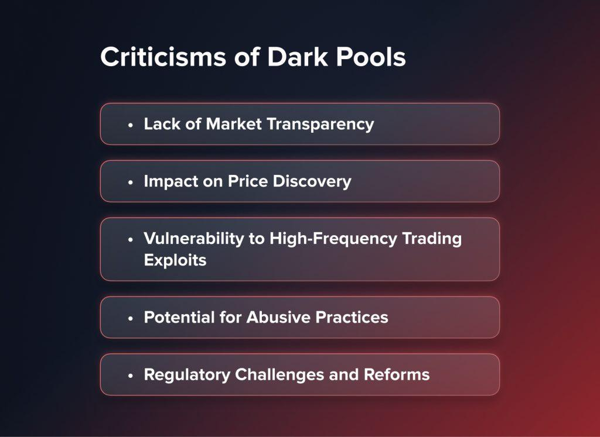

## Table of Contents

## What are dark pools?

Dark pools are private stock markets where big investors can trade large amounts of shares without other people knowing about it right away. They are called "dark" because the trades are not shown to the public until after they happen. This helps big investors buy or sell a lot of shares without causing the price to go up or down too much.

These pools are used by big investors like banks, pension funds, and mutual funds. They want to keep their trading plans secret so they don't affect the market. Dark pools are different from regular stock exchanges where everyone can see the trades happening in real time. While dark pools can be helpful for big investors, some people worry that they might make the market less fair for smaller investors who don't have access to them.

## How do dark pools function?

Dark pools work by letting big investors trade shares away from the public eye. When someone wants to buy or sell a lot of shares, they can use a dark pool to do it quietly. The orders to buy or sell are kept secret until the trade is done. This helps keep the price of the shares from moving too much because of the big trade. Dark pools use computers to match buyers and sellers. If the price and amount match, the trade happens, and then it's reported to the public.

There are different kinds of dark pools. Some are run by big banks or investment firms, and others are run by stock exchanges themselves. To use a dark pool, investors usually need to be big clients of the firm running it. This means smaller investors can't use them. Dark pools can be good because they help big trades happen without causing big price changes. But some people worry that they might make the market less fair, because not everyone can use them and the trades are hidden for a while.

## What is the purpose of dark pools?

Dark pools are special places where big investors can trade large amounts of shares without everyone knowing about it right away. The main purpose of dark pools is to help these big investors buy or sell a lot of shares without causing the price to go up or down too much. When a big investor wants to trade, they can use a dark pool to keep their plans secret. This means they can move a lot of shares without other people seeing what they're doing and changing the price because of it.

This secrecy is important because if everyone knew about a big trade, they might start buying or selling too, which could make the price move a lot. Dark pools help keep the market stable by letting these big trades happen quietly. But, some people worry that dark pools might make things unfair. Since only big investors can use them, smaller investors don't get the same chance to know about these trades until after they happen. This can make the market less fair for everyone.

## Who can use dark pools?

Dark pools are mainly for big investors like banks, pension funds, and mutual funds. These big investors need to trade a lot of shares without other people knowing about it right away. So, they use dark pools to keep their trading plans a secret. To use a dark pool, these investors usually have to be big clients of the firm that runs it. This means that only people with a lot of money and big accounts can use dark pools.

Smaller investors, like regular people who don't have a lot of money to invest, can't use dark pools. They have to trade on regular stock exchanges where everyone can see what's happening. This is one reason why some people think dark pools might make the market less fair. Big investors can trade in secret, but smaller investors can't. So, smaller investors might not know about big trades until after they happen, which can affect their own trading decisions.

## What are the advantages of using dark pools?

Dark pools help big investors trade a lot of shares without making the price go up or down too much. When a big investor wants to buy or sell a lot of shares, if everyone knew about it, they might start buying or selling too. This could make the price change a lot. But in a dark pool, the trade is kept secret until it's done. This means the big investor can move a lot of shares without other people seeing and changing the price because of it. So, dark pools help keep the market stable by letting big trades happen quietly.

Another advantage is that dark pools can save big investors some money. When a big investor trades on a regular stock exchange, everyone can see what they're doing. This might make other people try to get a better price, which could cost the big investor more money. In a dark pool, the trade is hidden, so the big investor can often get a better price because there's less competition. This can save them money and help them get a better deal on their trades.

## What are the criticisms of dark pools?

Some people worry that dark pools might make the market less fair. Big investors can use dark pools to trade in secret, but smaller investors can't. This means smaller investors don't know about big trades until after they happen. This can make it harder for them to make good trading decisions because they don't have all the information. It's like playing a game where some players can see all the cards, but others can't.

Another criticism is that dark pools might hurt the regular stock exchanges. When big investors use dark pools, they take their trades away from the public markets. This can make the regular stock exchanges less busy and less good at showing what the real price of a stock should be. Some people think this could make the whole market less clear and less fair for everyone. They worry that if too many trades happen in secret, it could be bad for the market as a whole.

## How do dark pools impact market transparency?

Dark pools make the market less transparent because they let big investors trade in secret. When a big trade happens in a dark pool, other people don't know about it until after it's done. This means smaller investors don't have all the information they need to make good trading decisions. It's like playing a game where some players can see all the cards, but others can't. This can make the market feel unfair because not everyone has the same information.

Some people worry that if too many trades happen in dark pools, it could make the whole market less clear. When big investors take their trades away from the regular stock exchanges, it can make those exchanges less busy. This can make it harder for everyone to know what the real price of a stock should be. If a lot of trading happens in secret, it might be bad for the market because it's harder to trust that the prices are fair and correct.

## Can dark pools affect stock prices?

Dark pools can affect stock prices because they let big investors trade a lot of shares without other people knowing about it right away. When a big investor wants to buy or sell a lot of shares, if everyone knew about it, they might start buying or selling too. This could make the price go up or down a lot. But in a dark pool, the trade is kept secret until it's done. So, the big investor can move a lot of shares without causing the price to change too much right away.

But once the trade from the dark pool is reported to the public, it can still affect the stock price. If people see that a big trade happened, they might think the stock is more important or less important than they thought before. This can make them want to buy or sell the stock, which can then change the price. So, even though dark pools are meant to help keep the market stable, they can still have an impact on stock prices once the trades are known to everyone.

## What regulations govern dark pools?

Dark pools are watched over by rules to make sure they are fair and safe. In the United States, the main group that makes these rules is the Securities and Exchange Commission (SEC). The SEC has rules that say dark pools have to tell everyone about their trades after they happen. They also have to be honest about how they work and treat everyone the same. This helps keep the market fair for everyone.

In Europe, the rules are a bit different but still try to keep things fair. The main rule is called the Markets in Financial Instruments Directive (MiFID II). This rule says that dark pools can only be used for a certain amount of trading. It also says that dark pools have to report their trades and share information with the public. Both the SEC and MiFID II rules are there to make sure dark pools don't hurt the market and that everyone can trust it.

## What are some examples of dark pools?

Some examples of dark pools are run by big banks and stock exchanges. For example, there's one called "SIGMA X" which is run by Goldman Sachs. Another one is "Crossfinder" which is run by Credit Suisse. These dark pools let big investors trade shares without other people knowing about it right away.

Other examples include dark pools run by stock exchanges themselves. For instance, the New York Stock Exchange has a dark pool called "NYSE MatchPoint." Another one is "BATS Trading's BATS Dark Pool." These dark pools help big investors buy or sell a lot of shares quietly, which can keep the market stable. But they are only for big investors, and smaller investors can't use them.

## How do dark pools compare to traditional exchanges?

Dark pools and traditional exchanges are different in how they work and who can use them. Traditional exchanges, like the New York Stock Exchange, are public places where anyone can see the trades happening in real time. When someone buys or sells shares on a traditional exchange, everyone knows about it right away. This can be good because it makes the market fair for everyone. But if a big investor wants to trade a lot of shares, it can make the price go up or down a lot because everyone sees it.

Dark pools are private places where big investors can trade shares without everyone knowing about it right away. When a big investor uses a dark pool, they can buy or sell a lot of shares quietly. The trade is kept secret until it's done, which helps keep the price from changing too much. But only big investors can use dark pools, so smaller investors don't get the same chance to know about these big trades until after they happen. This can make the market feel less fair because not everyone has the same information.

## What is the future outlook for dark pools in the financial market?

The future of dark pools in the financial market is a bit tricky to predict. Some people think dark pools will keep being important because big investors like to trade in secret. They help big investors buy or sell a lot of shares without making the price go up or down too much. As more and more trading happens on computers, dark pools might become even more popular. But, rules from places like the SEC and MiFID II might change how dark pools work. These rules try to make sure dark pools don't hurt the market and that everyone can trust it.

On the other hand, some people worry that dark pools might cause problems. They think dark pools can make the market less fair because only big investors can use them. Smaller investors don't know about big trades until after they happen, which can make it hard for them to make good trading choices. If too many trades happen in secret, it might make the whole market less clear. So, the future of dark pools will depend a lot on how rules change and how people feel about fairness in the market.

## References & Further Reading

[1]: Kissell, R. (2014). ["An Introduction to Algorithmic Trading: Basic to Advanced Strategies."](https://archive.org/details/introductiontoal0000lesh) Academic Press.

[2]: Patterson, S. (2013). ["Dark Pools: The Rise of the Machine Traders and the Rigging of the U.S. Stock Market."](https://www.amazon.com/Dark-Pools-Machine-Traders-Rigging/dp/0307887189) Crown Business.

[3]: Lopez de Prado, M. (2018). ["Advances in Financial Machine Learning."](https://www.amazon.com/Advances-Financial-Machine-Learning-Marcos/dp/1119482089) Wiley.

[4]: Aldridge, I. (2013). ["High-Frequency Trading: A Practical Guide to Algorithmic Strategies and Trading Systems."](https://onlinelibrary.wiley.com/doi/pdf/10.1002/9781119203803.fmatter) Wiley.

[5]: McPartland, J., & Lewis, R. (2014). ["The Law and Economics of High Frequency Trading."](https://www.chicagofed.org/~/media/others/people/research-resources/mcpartland-john/the-challenges-of-derivatives-ccp-interoperability-pdf.pdf?la=en) Federal Reserve Bank of Chicago, Economic Perspectives, 38(2).