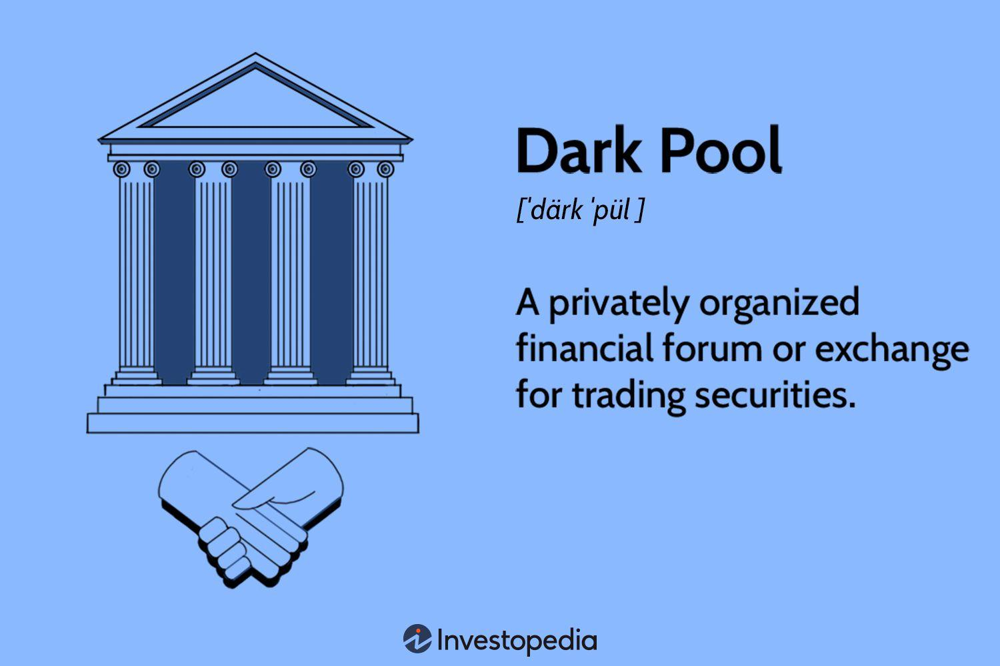

## Table of Contents

## What is dark pool trading?

Dark pool trading is a type of trading that happens away from public stock exchanges. It's called "dark" because the details of these trades, like the price and the amount of shares, are not shown to the public until after the trades are done. This kind of trading is often used by big investors, like banks and institutions, who want to buy or sell large amounts of stocks without affecting the market price too much.

When big investors trade in the open market, their large orders can cause the price of a stock to go up or down a lot. By using dark pools, they can keep their trading plans secret and avoid causing big price changes. This can help them get better prices for their trades. However, dark pool trading can also make the overall market less transparent, which some people think is not good for smaller investors who don't have access to these private trading venues.

## How do dark pools differ from public exchanges?

Dark pools and public exchanges are different in how they work and what information they share. Public exchanges, like the New York Stock Exchange, are open places where everyone can see the prices and amounts of stocks being bought and sold in real time. This openness helps people make decisions based on what's happening in the market. On the other hand, dark pools keep their trading details hidden until after the trades are done. This means that while a trade is happening, no one outside the dark pool knows about it, which can be useful for big investors.

The main reason big investors use dark pools is to avoid affecting the market price too much with their large orders. If they try to buy or sell a lot of stocks on a public exchange, it can cause the price to change a lot. By using dark pools, they can keep their plans secret and trade without causing big price swings. However, this can make the overall market less clear and fair, because smaller investors don't have the same access to these private trading places. So, while dark pools help big investors, they can also make it harder for everyone to understand what's happening in the market.

## Who can participate in dark pool trading?

Dark pool trading is mostly for big investors like banks, hedge funds, and other big financial institutions. These groups can use dark pools because they need to buy or sell a lot of stocks without everyone knowing about it right away. This helps them keep their trading plans a secret and not affect the stock price too much.

Regular people, like small investors, usually can't trade directly in dark pools. They don't have the same access as the big investors. But sometimes, if a small investor uses a big brokerage firm that has access to dark pools, they might be able to trade through those dark pools without knowing it. This means their trades could happen in a dark pool, but they wouldn't be able to choose to do it themselves.

## What are the advantages of using dark pools for trading?

Using dark pools for trading can help big investors a lot. When they need to buy or sell a lot of stocks, doing it on a public exchange can make the stock price go up or down a lot. By using dark pools, they can keep their big trades a secret until they're done. This means they can get better prices because their trades don't affect the market as much. It's like being able to shop without everyone knowing what you're buying, so you can get a better deal.

Dark pools also help keep trading costs down. When big investors trade on public exchanges, they might have to pay more because their orders can push the price around. In dark pools, they can find other big investors who want to trade the same stock but in the opposite direction. This means they can trade directly with each other without going through a public exchange, which can save them money. It's like finding someone who wants to sell exactly what you want to buy, so you both get a good deal without anyone else knowing.

## What are the potential risks and disadvantages of dark pool trading?

Dark pool trading can make the market less fair for everyone. Big investors can use dark pools to keep their trading plans secret, which means smaller investors don't know what's happening. This can make it harder for smaller investors to make good choices because they don't have all the information. It's like playing a game where some players know the rules, but others don't.

Another problem with dark pools is that they can make the market less clear. When a lot of trading happens in secret, it's hard to understand what's really going on with stock prices. This can make the whole market less stable because people might not trust what they see. It's like trying to solve a puzzle with missing pieces; you can't see the full picture.

## How do dark pools affect market transparency?

Dark pools can make the market less clear because they hide trading details until after trades are done. When big investors use dark pools, they keep their plans secret. This means other people in the market don't know what's happening. It's like trying to see through a foggy window; you can't see everything clearly. This lack of information can make it harder for everyone to understand what's really going on with stock prices.

Because dark pools keep trades hidden, they can make the market less fair. Smaller investors who don't have access to dark pools might miss out on important information. This can put them at a disadvantage because they can't make the best trading decisions. It's like playing a game where some players get to see the other players' cards, but others don't. This can lead to less trust in the market because people feel like they're not getting a fair chance.

## What is the regulatory environment surrounding dark pools?

Dark pools are watched by people who make rules for the stock market. In the United States, the main rule-makers are the Securities and Exchange Commission (SEC). They want to make sure dark pools are fair and don't hurt the market. The SEC has rules that say dark pools have to tell them about their trades and how they work. This helps the SEC keep an eye on things and make sure dark pools are not being used in bad ways.

Even with these rules, some people think dark pools should be watched more closely. They worry that too much secret trading can make the market unfair. So, the SEC and other rule-makers around the world keep looking at their rules and sometimes change them to make the market better. They want to find a good balance where big investors can use dark pools, but the market stays clear and fair for everyone.

## How do dark pools execute trades and what types of orders are used?

Dark pools execute trades by matching buyers and sellers away from public exchanges. When someone wants to trade in a dark pool, they send an order to the dark pool's system. This order is not shown to the public, so no one knows about it until it's done. The dark pool's system looks for another order that wants to do the opposite trade. If it finds a match, the trade happens right away, and the details are only shown after it's finished. This way, big investors can trade without affecting the market price too much.

There are different types of orders used in dark pools. One common type is the "limit order," where a trader says they want to buy or sell a stock at a specific price. Another type is the "market order," where a trader wants to buy or sell at the best price available right now. Dark pools also use "iceberg orders," which let traders hide part of their order. Only a small part of the order shows up, and the rest stays hidden until it's traded. This helps big investors trade large amounts without showing their full plan to the market.

## What role do dark pools play in high-frequency trading?

Dark pools can be important for high-frequency trading ([HFT](/wiki/high-frequency-trading-strategies)). HFT is when computers trade stocks very quickly, trying to make small profits many times a day. Dark pools let these high-frequency traders find big orders that are hidden from the public. This can help them make trades without other people knowing right away, which can give them an advantage. They can use this information to trade faster and make more money.

But using dark pools for HFT can also cause problems. Because high-frequency traders can see some of the hidden orders in dark pools, they might be able to guess what big investors are doing. This can make the market less fair for everyone else. Also, if too many high-frequency traders use dark pools, it can make the market more confusing and harder to understand. So, while dark pools can help high-frequency traders, they can also make the market less clear and fair for other people.

## How can investors access dark pools and what are the common entry methods?

Investors can access dark pools through big brokerage firms or investment banks that have the right to use them. These firms often have special agreements with dark pool operators, so they can send their clients' orders to these private trading venues. Regular people, like small investors, usually can't trade directly in dark pools. But if they use a big brokerage firm, their trades might happen in a dark pool without them knowing it. This is because the firm might decide to route some orders to dark pools to get better prices for their clients.

There are different ways big investors can enter dark pools. One common method is through a direct connection with the dark pool operator. This means they can send their orders straight to the dark pool's system. Another way is through an algorithm that the brokerage firm uses. This algorithm can look at different trading venues, including dark pools, and decide where to send the order based on what's best for the client. By using these methods, big investors can keep their trading plans secret and trade large amounts of stocks without affecting the market too much.

## What are some notable examples of dark pools and their operators?

Some well-known dark pools include those run by big banks and financial companies. One example is the dark pool operated by Goldman Sachs, called Sigma X. It's one of the biggest and is used by many big investors to trade stocks without showing their orders to the public. Another example is the dark pool run by Credit Suisse, called Crossfinder. It's also very popular and helps big investors trade large amounts of stocks quietly.

Another notable dark pool is operated by UBS, called UBS ATS. This dark pool is known for its size and the number of trades it handles. It helps big investors buy and sell stocks without affecting the market price too much. These examples show how big financial companies use dark pools to help their clients trade in private, away from public exchanges.

## How have dark pools evolved over time and what might their future look like?

Dark pools started in the late 1980s and early 1990s when big investors wanted a way to trade big amounts of stocks without everyone knowing. At first, they were small and only a few big investors used them. But over time, more and more big banks and financial companies started their own dark pools. By the 2000s, dark pools had grown a lot and were handling a big part of the market's trading. Technology also helped dark pools grow, making it easier for them to match buyers and sellers quickly and secretly.

In the future, dark pools might keep growing and changing. More rules might be made to make sure they don't hurt the market too much. This could mean dark pools have to share more information about their trades. Technology will also keep changing how dark pools work, maybe making them even faster and better at matching trades. But people will always be trying to find a balance between letting big investors use dark pools and keeping the market fair and clear for everyone.

## References & Further Reading

[1]: O'Hara, M. (2015). ["High Frequency Market Microstructure."](https://www.sciencedirect.com/science/article/pii/S0304405X15000045) Annual Review of Financial Economics, 7(1), 1-20.

[2]: Buti, S., Rindi, B., & Werner, I. M. (2011). ["Diving into Dark Pools."](https://papers.ssrn.com/sol3/papers.cfm?abstract_id=1630499) American Economic Journal: Microeconomics, 3(2), 188-213.

[3]: Madhavan, A. (2012). ["Exchange-Traded Funds, Market Structure, and the Flash Crash."](https://www.tandfonline.com/doi/abs/10.2469/faj.v68.n4.6) Financial Analysts Journal, 68(4), 20-35.

[4]: Harris, L. (2013). ["What to do about high-frequency trading."](https://blogs.cfainstitute.org/investor/2013/04/24/what-to-do-about-high-frequency-trading/) Financial Analysts Journal, 69(2), 6-9.

[5]: Patterson, S. (2013). ["Dark Pools: The Rise of the Machine Traders and the Rigging of the U.S. Stock Market."](https://www.amazon.com/Dark-Pools-Machine-Traders-Rigging/dp/0307887189) Crown Business.

[6]: MacKenzie, D. (2018). ["Material Signals: A historical sociology of high-frequency trading."](https://www.semanticscholar.org/paper/Material-Signals%3A-A-Historical-Sociology-of-MacKenzie/a3347764ea03c35bddbc703940a907c6e52f6f6b) The British Journal of Sociology, 69(3), 537-561.