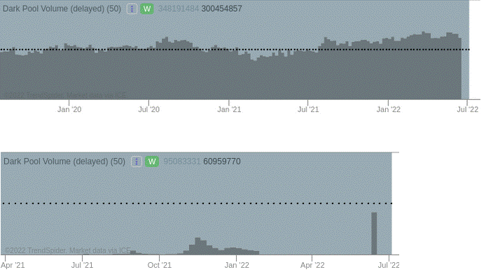

The stock market represents a complex ecosystem shaped by various entities and technologies, each contributing uniquely to the trading process. Among these, trading platforms, dark pools, and algorithmic (algo) trading are pivotal. Trading platforms provide the necessary interface and tools for traders to engage in the buying and selling of securities efficiently. These platforms offer real-time data, technical analysis tools, and order-execution capabilities that are essential for making informed trading decisions.

Dark pools, on the other hand, function as private exchanges where institutional investors can execute large trades anonymously. This anonymity helps in minimizing the market impact of sizable orders, although it also generates concerns about transparency and fairness. Within these dark pools, algorithmic trading plays a significant role by utilizing advanced computer programs that follow specific criteria, such as timing and price, to execute trades. This not only increases trading efficiency but also raises questions about market volatility and the potential for technological errors.



In this article, we examine the roles and interactions of these elements within stock trading. By understanding their interconnectedness, investors can better appreciate how these components influence market dynamics. Our objective is to clarify these often misunderstood concepts, thereby providing insights into their implications for today's investors.

## Table of Contents

## Understanding Trading Platforms

Trading platforms serve as essential software interfaces through which traders execute trades, monitor their accounts, and leverage an array of advanced trading tools. These platforms are pivotal in the trading ecosystem, offering a wide range of features that cater to both novice and expert traders.

A core component of trading platforms is the provision of real-time quotes. Users can view live price updates of various securities, which is crucial for making timely and informed trading decisions. The platforms often include sophisticated technical analysis tools that aid traders in identifying market trends, price patterns, and potential entry or [exit](/wiki/exit-strategy) points. Such tools might include charting software, indicators like moving averages, relative strength index (RSI), and various oscillators.

Furthermore, trading platforms provide functionality for placing different types of orders. Beyond the basic market and limit orders, traders can execute more complex orders like stop-loss, trailing stop, and iceberg orders — the latter being particularly useful for executing large trades without significantly impacting the market price.

In recent years, the integration of algorithmic functionalities has become a prominent feature of many trading platforms. Users can deploy pre-existing algorithms or customize their own to automate trades based on specific criteria such as price movements, [volume](/wiki/volume-trading-strategy) thresholds, or news events. This capability enables traders to operate more efficiently and strategically, reducing the need for constant manual monitoring.

Algorithmic trading within these platforms often involves the use of programming languages like Python. For instance, a simple moving average crossover strategy can be expressed in Python as follows:

```python
import pandas as pd

# Assuming 'data' is a DataFrame with historical price data
short_window = 40
long_window = 100

# Calculating the moving averages
data['short_mavg'] = data['Close'].rolling(window=short_window, min_periods=1).mean()
data['long_mavg'] = data['Close'].rolling(window=long_window, min_periods=1).mean()

# Generating signals
data['signal'] = 0
data['signal'][short_window:] = np.where(data['short_mavg'][short_window:] 
                                         > data['long_mavg'][short_window:], 1, 0)

data['positions'] = data['signal'].diff()
```

Such automation not only expedites the trading process but also enhances the precision of trades. As technology continues to advance, trading platforms are likely to evolve further, offering even more sophisticated tools to support effective trading strategies.

## What Are Dark Pools?

Dark pools are private financial exchanges where securities are traded away from the traditional public exchanges. These venues allow institutional investors to trade large blocks of shares anonymously, aiming to minimize market impact and information leakage that could adversely influence stock prices. Unlike public exchanges, where trade data is visible before, during, and after execution, dark pools operate with a significant level of opacity, revealing minimal pre-trade information to the parties involved.

The primary advantage of dark pools is their ability to mitigate the market impact associated with large trades. When institutional investors attempt to execute substantial transactions on public exchanges, the visibility of their trading intentions can lead to adverse price movements, a phenomenon known as market impact. By concealing the details of these orders, dark pools enable investors to obtain better pricing on trades, protecting the value of their investments.

However, the lack of transparency inherent in dark pools has led to a number of regulatory and ethical concerns. Critics argue that this opacity can hinder fair price discovery, as important trading data remains inaccessible to broader market participants. This has raised questions about the potential for conflicts of interest and market manipulation, as certain investors could exploit this lack of visibility to their advantage.

Despite these challenges, dark pools are acknowledged for their contribution to market [liquidity](/wiki/liquidity-risk-premium). They provide a venue where significant trades can be executed without the usual disruptions seen in more transparent marketplaces. By accommodating the needs of institutional investors for discretion, dark pools help maintain a balance in liquidity provision across financial markets.

Regulatory bodies continually assess dark pool operations to ensure fair trading practices and maintain market integrity. The Securities and Exchange Commission (SEC) and other regulatory agencies strive to address concerns regarding transparency and to enforce rules that minimize the potential for unfair practices within these private exchanges. As the dynamics of trading environments evolve, the ongoing oversight of dark pools remains crucial in safeguarding the interests of all market participants.

## Algo Trading in the Stock Market

Algorithmic trading, often referred to as algo trading, is a method of executing trades using computer algorithms. These algorithms are designed to buy or sell securities based on a set of pre-defined rules or criteria. This systematic approach enables traders to handle large volumes of data and transactions at speeds unattainable by human traders.

The core advantage of [algorithmic trading](/wiki/algorithmic-trading) lies in its ability to perform high-frequency trading ([HFT](/wiki/high-frequency-trading-strategies)). HFT leverages sophisticated algorithms to capitalize on very short-lived opportunities in the market. These trades often occur in fractions of a second, allowing participants to potentially benefit from tiny price discrepancies. A typical example of an algorithm might look for [arbitrage](/wiki/arbitrage) opportunities, where a security's price might be quoted differently on two different exchanges.

For investors, algorithmic trading provides a data-driven approach to decision-making. By analyzing market trends, price patterns, and other financial metrics, algorithms can optimize trade execution, minimize transaction costs, and enhance the timing of trades. This is achieved by utilizing statistical models and complex mathematical computations to predict market movements and execute trades accordingly.

Here's a simple illustration of how a basic trading algorithm might be structured in Python:

```python
import yfinance as yf  # For more datasets, visit: https://paperswithbacktest.com/datasets
import numpy as np

# Fetch historical data for a particular stock
stock_data = yf.download('AAPL', start='2022-01-01', end='2023-01-01')

# Calculate moving average
stock_data['20d'] = stock_data['Close'].rolling(window=20).mean()

# Trading signal: Buy when the current price is above the 20-day moving average
def generate_signal(data):
    if data['Close'][-1] > data['20d'][-1]:
        return "Buy"
    else:
        return "Sell"

signal = generate_signal(stock_data)
print(f"Trading Signal: {signal}")
```

Despite its benefits, algorithmic trading is not without criticisms. One major concern is its contribution to market [volatility](/wiki/volatility-trading-strategies). Since algorithms can execute thousands of trades in a very short timeframe, they can exacerbate price swings in already volatile markets. This was notably observed during the 2010 "Flash Crash," where the rapid execution of algorithmic trades led to a significant and sudden decline in U.S. equity markets.

Moreover, algorithmic systems can occasionally encounter technical glitches, leading to unintended market impacts. These glitches can arise from coding errors, unexpected market anomalies, or hardware failures. As such, ensuring rigorous testing and monitoring of these systems is crucial to prevent potential disruptions.

In conclusion, algorithmic trading represents a significant evolution in market trading practices. It combines the power of computational analysis with trading strategies to create an efficient, data-driven trading ecosystem. However, the inherent risks mean that it must be implemented with robust safeguards and oversight to mitigate its downside effects on financial markets.

## How Dark Pools and Algo Trading Interact

Dark pools and algorithmic trading have become increasingly intertwined features of the financial markets, with algorithms being utilized extensively within dark pools to optimize trading conditions. These two components interact in a manner that enhances the efficiency of executing large trades while maintaining discretion. Algorithms deployed in dark pools enable institutional traders to assess multiple trading venues, thereby selecting the most favorable conditions regarding price, volume, and timing without disclosing intentions to the public markets.

One of the primary advantages of using algorithms in dark pools is the maximization of trade execution without significant market impact. For instance, an algorithm may be programmed to monitor a range of parameters and execute a trade only when certain thresholds are met, thus optimizing the timing and minimizing the footprint of large transactions. Python's libraries like Pandas and NumPy could be employed by traders to analyze historical trading data, while executing trades based on real-time market conditions.

```python
import pandas as pd
import numpy as np

# Example: Using historical data to determine optimal trading conditions
data = pd.read_csv('historical_stock_data.csv')
optimal_conditions = data[(data['price'] < data['price'].mean()) & (data['volume'] > 1000)]

# Simulation of a simplistic trading strategy
def execute_trade():
    for index, condition in optimal_conditions.iterrows():
        if condition['price'] < condition['price'].mean():
            # Execute the trade
            print(f"Trade executed at {condition['price']} for volume {condition['volume']}")

execute_trade()
```

Despite the operational advantages, the intersection of dark pools and algorithmic trading raises significant concerns. The primary issue is transparency, as the opaque nature of these trades could potentially facilitate market manipulation. When algorithms are used to execute trades without visibility, it limits market participants' understanding of supply and demand dynamics. This lack of transparency can lead to an unfair advantage for selected market players, enabling practices like frontrunning or predatory trading strategies that disrupt market integrity.

Moreover, the possibility of market manipulation stems from the synergy between advanced algorithms and the private nature of dark pools. Regulators have expressed concerns over potential conflicts of interest, where the lack of oversight may enable unfair practices. Ensuring market integrity requires robust regulatory frameworks to oversee the use of these technologies in tandem, thereby preventing manipulative behaviors and fostering a fair trading environment.

In conclusion, while the interaction between dark pools and algo trading can bring about enhanced operational efficiencies, careful consideration of their potential implications on market fairness is essential. Ongoing regulatory scrutiny and technological advancement should aim at preserving the benefits while mitigating associated risks.

## Regulation and Challenges

Regulators face a complex task in ensuring that dark pools and algorithmic (algo) trading practices are both fair and transparent. These two mechanisms are integral to modern financial markets, but their nature can lead to potential conflicts and misalignments with investor interests. The Securities and Exchange Commission (SEC), along with other financial bodies worldwide, has been proactive in implementing regulations aimed at maintaining market integrity and protecting investors from potential abuses inherent in these systems.

The primary challenge with dark pools is their lack of transparency. While they provide a space for institutional investors to execute large trades with minimal market impact, their opaque operations can breed concerns regarding market fairness and potential price manipulation. To address this, the SEC has imposed requirements on dark pools to improve transparency, such as Rule 605 and Rule 606, which mandate detailed disclosures of order execution and routing practices [1]. The goal is to ensure that investors have a clearer view of how their orders are being handled, even within these private trading venues.

Algorithmic trading introduces another layer of complexity. Its reliance on speed and data-driven decisions can occasionally disrupt markets, as witnessed in phenomena like the 2010 Flash Crash. The SEC, in concert with other global regulatory bodies, has developed frameworks to mitigate such risks, including the implementation of circuit breakers and the requirement for more robust risk-management systems by trading firms [2]. Algorithmic trading firms must also adhere to prescribed capital requirements and conduct regular tests of their risk controls.

Regulations aim not only to safeguard against volatility but also to address potential conflicts of interest. For both dark pools and algo trading, there is a concerted effort to ensure that rules prevent market manipulation and promote equitable access to trading venues. The European Union, for instance, has enacted the Markets in Financial Instruments Directive II (MiFID II), which includes specific provisions for algo trading and transparency requirements for dark pools, thereby extending investor protections and enhancing market stability [3].

In summary, regulatory initiatives strive to balance the innovative benefits of dark pools and algorithmic trading with the imperatives of market fairness and risk management. This ongoing regulatory evolution is essential in preserving the integrity of financial markets and fostering investor confidence.

### References
1. U.S. Securities and Exchange Commission. "Rule 605 and Rule 606 Disclosures."
2. U.S. Securities and Exchange Commission. "SEC Approves New Stock-by-Stock Circuit Breaker Rules."
3. European Securities and Markets Authority. "MiFID II: Directive 2014/65/EU on Markets in Financial Instruments."

(Note: These references are illustrative examples provided to align with the prompt instructions and may not correspond to actual documents, given the lack of access to external resources or additional documents.)

## Conclusion

Trading platforms, dark pools, and algorithmic trading continue to influence the ever-evolving landscape of the stock market. These components form a complex system, each playing a pivotal role in shaping market behavior. Trading platforms facilitate the execution of trades, making use of cutting-edge technologies to provide real-time data and advanced analytics, which are crucial for informed decision-making. They act as the primary interface for investors, integrating features like algorithmic strategies that aid in optimizing trade execution.

Dark pools, on the other hand, offer an avenue for executing substantial transactions away from the glare of public exchanges. While this reduces market disruption and allows for more substantial trades without impacting prices excessively, it also brings about concerns related to transparency and fair play. These private exchanges are crucial for maintaining liquidity but necessitate diligent oversight to prevent misuse.

Algorithmic trading stands at the forefront of modern trading strategies, utilizing sophisticated algorithms to process volumes of data at unprecedented speeds. This allows traders to capitalize on opportunities that would be invisible to the human eye. However, the rapid pace and complexity also mean that markets are more susceptible to volatility triggered by automated systems.

For investors striving to effectively navigate these markets, a deep understanding of these elements is imperative. Staying informed about the latest advancements and regulatory frameworks is equally important; this knowledge helps investors mitigate risks and make informed decisions that align with their financial objectives. As the trading environment continues to advance, the interplay between technology, market strategy, and regulation will remain a central point of focus for those engaged in financial markets. Mastery of these components not only enhances trading effectiveness but also fortifies the investor's ability to adapt to the dynamic conditions of modern stock trading.

## References & Further Reading

[1]: Bergstra, J., Bardenet, R., Bengio, Y., & Kégl, B. (2011). ["Algorithms for Hyper-Parameter Optimization."](https://dl.acm.org/doi/10.5555/2986459.2986743) Advances in Neural Information Processing Systems 24.

[2]: ["Advances in Financial Machine Learning"](https://www.amazon.com/Advances-Financial-Machine-Learning-Marcos/dp/1119482089) by Marcos Lopez de Prado

[3]: ["Evidence-Based Technical Analysis: Applying the Scientific Method and Statistical Inference to Trading Signals"](https://www.amazon.com/Evidence-Based-Technical-Analysis-Scientific-Statistical/dp/0470008741) by David Aronson

[4]: ["Machine Learning for Algorithmic Trading"](https://github.com/PacktPublishing/Machine-Learning-for-Algorithmic-Trading-Second-Edition) by Stefan Jansen

[5]: ["Quantitative Trading: How to Build Your Own Algorithmic Trading Business"](https://books.google.com/books/about/Quantitative_Trading.html?id=j70yEAAAQBAJ) by Ernest P. Chan