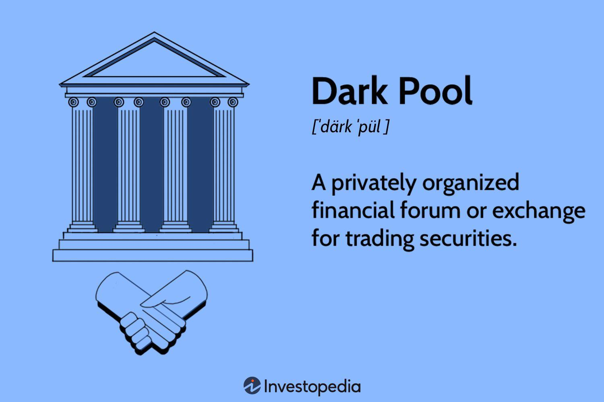

## Table of Contents

## What are dark pools?

Dark pools are private stock exchanges where big investors trade large amounts of stocks without other people knowing about it right away. They are called "dark" because the trades are not shown to the public until after they happen. This helps big investors buy or sell a lot of stocks without causing the stock price to change too much. Regular people usually can't use dark pools because they are meant for big investors like banks and big funds.

The main reason dark pools exist is to help big investors avoid affecting the market too much with their big trades. If a big investor wants to sell a lot of a certain stock, doing it on a public exchange might make the price of that stock go down quickly. By using a dark pool, they can sell their stocks without everyone else seeing it and reacting right away. This can be good for the big investor, but some people worry that dark pools might make the overall market less fair or transparent.

## How do dark pools differ from traditional stock exchanges?

Dark pools are different from traditional stock exchanges because they keep trades secret until after they happen. On a traditional stock exchange, like the New York Stock Exchange, everyone can see the trades happening in real time. This means that when someone buys or sells a stock, other people can see it and might decide to buy or sell based on that information. In a dark pool, big investors can trade large amounts of stocks without other people knowing about it right away. This helps them avoid causing big changes in the stock price.

Another big difference is who can use them. Traditional stock exchanges are open to everyone, from big investors to regular people. Anyone can buy and sell stocks on these exchanges. Dark pools, on the other hand, are mainly for big investors like banks and large funds. Regular people usually can't use dark pools because they are designed to handle big trades that might affect the market if they were done publicly. This makes dark pools less accessible but useful for big investors who want to keep their trades private.

## Who can access dark pools and how?

Dark pools are mostly used by big investors like banks, big funds, and other large financial companies. These big investors need to trade a lot of stocks without causing the stock price to change too much. They can access dark pools through special trading platforms that are set up by big financial firms or stock exchanges. These platforms are not open to everyone, so regular people can't just sign up and start trading.

To use a dark pool, a big investor usually needs to have an account with a broker that offers access to these private exchanges. The broker will handle the trades on behalf of the investor, making sure that the trades stay secret until after they are done. This way, the big investor can buy or sell a large number of stocks without everyone else knowing about it right away.

## What is the history and origin of dark pools?

Dark pools started in the late 1980s. They were created by big financial companies who wanted to trade large amounts of stocks without everyone else knowing about it. The first dark pool was set up by a company called Instinet in 1986. It was called "POSIT" and it let big investors trade stocks privately. This was important because if a big investor wanted to sell a lot of a certain stock, doing it on a public exchange could make the price go down quickly. By using a dark pool, they could sell their stocks without causing big changes in the price.

Over time, more and more big financial companies started their own dark pools. By the early 2000s, dark pools became more popular because of new technology and rules that made it easier for them to work. Today, there are many dark pools run by big banks and stock exchanges. They are still used mostly by big investors who want to keep their trades secret. While dark pools help big investors, some people worry that they might make the overall market less fair or transparent.

## What are the advantages of using dark pools for trading?

Using dark pools for trading can help big investors a lot. The main advantage is that they can trade large amounts of stocks without other people knowing about it right away. This is important because if a big investor wants to sell a lot of a certain stock, doing it on a public exchange might make the stock price go down quickly. By using a dark pool, they can sell their stocks without causing big changes in the price. This helps them get a better price for their stocks and avoid losing money because of quick price changes.

Another advantage is that dark pools can help big investors keep their trading strategies secret. If everyone can see what a big investor is doing on a public exchange, other people might start copying their moves or trying to guess what they will do next. By using a dark pool, big investors can keep their plans private and avoid other people trying to take advantage of their trades. This can be really helpful for big investors who want to stay one step ahead in the market.

## What are the potential risks and criticisms associated with dark pools?

One big worry about dark pools is that they might make the stock market less fair. Because trades in dark pools are secret until after they happen, regular people who use public exchanges might not know what's going on. This can make it harder for them to make good choices about buying and selling stocks. Big investors who use dark pools might have an advantage because they can see what's happening in the public market while keeping their own trades hidden. This can lead to a situation where the market is not as open and honest as it should be.

Another risk is that dark pools might hurt the overall health of the stock market. When too many big trades happen in dark pools instead of public exchanges, it can make the public market less active. This can lead to less information about what's happening in the market, which makes it harder for everyone to understand and predict what will happen next. Some people also worry that dark pools might be used for bad things, like trying to control stock prices or hide illegal activities. Because of these risks, many people think that dark pools need to be watched closely to make sure they don't cause problems for the whole market.

## How do dark pools impact market transparency and liquidity?

Dark pools can make the stock market less transparent. Transparency means that everyone can see what's happening in the market. When big investors use dark pools to trade large amounts of stocks, other people don't know about these trades until after they happen. This can make it hard for regular people who use public exchanges to understand what's going on in the market. They might not have all the information they need to make good choices about buying and selling stocks. This lack of transparency can make the market feel unfair because big investors have an advantage by keeping their trades secret.

Dark pools can also affect the [liquidity](/wiki/liquidity-risk-premium) of the market. Liquidity means how easy it is to buy or sell stocks without changing their price too much. When big trades happen in dark pools instead of public exchanges, it can make the public market less active. This means there might be fewer people buying and selling stocks on public exchanges, which can make it harder for everyone to trade quickly and at good prices. While dark pools help big investors trade large amounts without causing big price changes, they can also make the overall market less liquid and more unpredictable for everyone else.

## What regulations govern the operation of dark pools?

Dark pools are regulated by rules that aim to keep the market fair and safe. In the United States, the main regulator is the Securities and Exchange Commission (SEC). The SEC has rules that dark pools must follow, like making sure they don't hide important information from the public and that they treat all their users fairly. Dark pools also have to report their trades to the public after they happen, so everyone can see what was traded and at what price. This helps make sure that dark pools don't cause too many problems for the overall market.

Another important rule is called Regulation NMS (National Market System). This rule says that dark pools have to follow the same price rules as public exchanges. This means that if a stock is being traded at a better price on a public exchange, dark pools have to match that price. This helps keep the market fair and stops dark pools from giving big investors too much of an advantage. Overall, these rules try to balance the benefits that dark pools give to big investors with the need to keep the market open and honest for everyone.

## Can you explain the different types of dark pools?

There are two main types of dark pools: broker-dealer dark pools and independent dark pools. Broker-dealer dark pools are run by big banks or financial companies. They let their own clients trade stocks privately. These dark pools are often used by the bank's big investors who want to keep their trades secret. Independent dark pools, on the other hand, are run by companies that are not banks. They offer their services to anyone who wants to use them, as long as they meet certain rules. These dark pools try to be fair to everyone and not just help one group of investors.

Both types of dark pools have their own advantages and challenges. Broker-dealer dark pools can be very good for big investors because they are run by big banks that know a lot about trading. But some people worry that these dark pools might favor their own clients over others. Independent dark pools try to be more open and fair to everyone. They might not have as many big investors, but they can be a good choice for people who want to trade in a more neutral place. No matter which type of dark pool someone uses, the goal is always to trade large amounts of stocks without causing big changes in the market.

## How do dark pool transactions affect the overall market price?

Dark pool transactions can affect the overall market price by keeping big trades hidden until after they happen. When a big investor wants to buy or sell a lot of a certain stock, doing it on a public exchange might make the stock price change quickly. By using a dark pool, they can trade without everyone else knowing about it right away. This means the stock price might not change as much at first. But when the trade is finally reported to the public, it can still cause the price to move, just not as suddenly.

Even though dark pool trades are secret at first, they can still have an impact on the market. When a lot of big trades happen in dark pools, it can make the public market less active. This can lead to less buying and selling on public exchanges, which might make it harder for everyone to trade quickly and at good prices. So, while dark pools help big investors avoid causing big price changes right away, they can still affect the overall market price when their trades are finally shown to everyone.

## What role do algorithms play in dark pool trading?

Algorithms play a big role in dark pool trading. They help big investors trade large amounts of stocks without causing big changes in the stock price. When a big investor wants to buy or sell a lot of stocks, they use algorithms to break up their big trade into smaller pieces. This way, they can spread out their trades over time and across different dark pools. By doing this, they can keep their trades secret and avoid making the stock price move too much.

These algorithms also help big investors find the best prices for their trades. They look at different dark pools and public exchanges to see where the best deals are. Then, they decide where to send each part of the big trade to get the best price. This makes dark pool trading more efficient and helps big investors save money. Overall, algorithms are very important for making dark pool trading work well and keeping big trades secret.

## How can investors monitor and analyze dark pool activity?

Investors can monitor and analyze dark pool activity by looking at public data that dark pools have to report after trades happen. This data shows what stocks were traded, how many, and at what price. Some companies also offer special tools and services that help investors understand dark pool activity better. These tools can show patterns and trends in the data, which can help investors guess what big investors might be doing in dark pools.

Even though dark pool trades are secret until after they happen, investors can still get clues about what's going on by watching the public market closely. If a stock's price suddenly changes a lot after a dark pool trade is reported, it might mean a big investor was buying or selling a lot of that stock. By keeping an eye on these price changes and using special tools, investors can get a better idea of how dark pool activity might be affecting the market.

## References & Further Reading

[1]: Bergstra, J., Bardenet, R., Bengio, Y., & Kégl, B. (2011). ["Algorithms for Hyper-Parameter Optimization."](https://dl.acm.org/doi/10.5555/2986459.2986743) Advances in Neural Information Processing Systems 24.

[2]: ["Advances in Financial Machine Learning"](https://www.amazon.com/Advances-Financial-Machine-Learning-Marcos/dp/1119482089) by Marcos Lopez de Prado

[3]: ["Evidence-Based Technical Analysis: Applying the Scientific Method and Statistical Inference to Trading Signals"](https://www.amazon.com/Evidence-Based-Technical-Analysis-Scientific-Statistical/dp/0470008741) by David Aronson

[4]: ["Machine Learning for Algorithmic Trading"](https://github.com/PacktPublishing/Machine-Learning-for-Algorithmic-Trading-Second-Edition) by Stefan Jansen

[5]: ["Quantitative Trading: How to Build Your Own Algorithmic Trading Business"](https://books.google.com/books/about/Quantitative_Trading.html?id=j70yEAAAQBAJ) by Ernest P. Chan