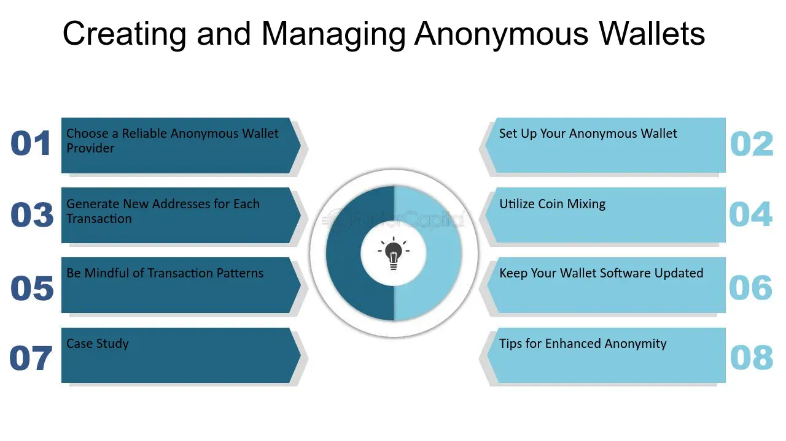

## Table of Contents

## What is a Dark Wallet?

A Dark Wallet is a type of digital wallet used for cryptocurrencies, like Bitcoin, that focuses on keeping your transactions private. It was created to help people make payments without others being able to track them. This is important for people who want to keep their financial activities secret, like journalists or activists in countries with strict government control.

The main feature of a Dark Wallet is its ability to mix your transactions with others. This mixing, or "tumbling," makes it hard for anyone to follow the money trail. By doing this, Dark Wallets help protect your privacy and make it difficult for outsiders to see where your money is going or coming from.

## When was Dark Wallet first introduced?

Dark Wallet was first introduced in 2014. It was created by two people, Cody Wilson and Amir Taaki. They wanted to make a tool that would help people keep their Bitcoin transactions private.

The idea behind Dark Wallet was to mix users' transactions together. This mixing, called "tumbling," makes it hard for anyone to track where the money is going. This was important for people who needed to keep their financial activities secret, like activists or journalists in countries with strict government control.

## Who are the creators of Dark Wallet?

The creators of Dark Wallet are Cody Wilson and Amir Taaki. They made Dark Wallet to help people keep their Bitcoin transactions private. They wanted to make a tool that would protect people's privacy, especially for those who needed it the most.

Cody Wilson is known for his work on 3D-printed guns, and he brought his interest in privacy and freedom to the Dark Wallet project. Amir Taaki is a well-known figure in the Bitcoin community and has worked on many projects to improve the security and privacy of cryptocurrencies. Together, they created Dark Wallet to mix users' transactions, making it hard for others to track where the money goes.

## What was the primary purpose behind the development of Dark Wallet?

The main reason for making Dark Wallet was to help people keep their Bitcoin transactions private. Cody Wilson and Amir Taaki wanted to create a tool that would protect people's privacy, especially for those who needed it the most. They thought it was important for people like journalists and activists in countries with strict government control to be able to make payments without others knowing.

Dark Wallet works by mixing users' transactions together, a process called "tumbling." This mixing makes it hard for anyone to track where the money is going or coming from. By doing this, Dark Wallet helps keep people's financial activities secret and safe from prying eyes.

## How does Dark Wallet enhance user privacy?

Dark Wallet helps keep your Bitcoin transactions private by mixing them with other people's transactions. This mixing, called "tumbling," makes it hard for anyone to follow the money trail. When you use Dark Wallet, your money gets mixed with other people's money, so it's tough for anyone to see where your money is going or coming from.

This is important for people who need to keep their financial activities secret, like journalists or activists in countries with strict government control. By using Dark Wallet, they can make payments without worrying about others tracking them. This way, Dark Wallet helps protect their privacy and keeps their money safe from prying eyes.

## What are the main features of Dark Wallet?

Dark Wallet has a few main features that help keep your Bitcoin transactions private. One big feature is "tumbling," which means mixing your money with other people's money. This makes it hard for anyone to track where your money is going or coming from. Another feature is that Dark Wallet is easy to use, so you don't need to be a tech expert to keep your transactions secret.

These features are important for people who need to keep their financial activities private, like journalists or activists in countries with strict government control. By using Dark Wallet, they can make payments without others knowing. This way, Dark Wallet helps protect their privacy and keeps their money safe from prying eyes.

## What are the legal and ethical issues associated with using Dark Wallet?

Using Dark Wallet can raise some legal and ethical issues. On the legal side, because Dark Wallet helps keep transactions private, it can be used for things that are against the law, like buying illegal stuff or hiding money from taxes. Some countries have strict rules about using tools that hide where money goes, so using Dark Wallet might break those rules. This means people who use it could get in trouble with the law, even if they're not doing anything bad.

On the ethical side, using Dark Wallet can be a good thing for people who need to keep their money safe, like journalists or activists in places where the government watches them closely. It helps them stay safe and do their work without fear. But, it can also be used for bad things, like helping criminals hide their money. So, it's important for people to think about why they're using Dark Wallet and if it's the right thing to do.

## How has the development and use of Dark Wallet evolved over time?

Dark Wallet was first introduced in 2014 by Cody Wilson and Amir Taaki. They made it to help people keep their Bitcoin transactions private. At first, Dark Wallet was a big deal because it let people mix their money with others, which made it hard for anyone to track where the money was going. This was really important for people like journalists and activists who needed to keep their money safe from strict governments.

Over time, Dark Wallet faced some challenges. It got a lot of attention from the media and law enforcement because it could be used for illegal things, like hiding money from taxes or buying illegal stuff. This made some people worried about using it, even if they were doing nothing wrong. Because of these issues, Dark Wallet didn't become as popular as other Bitcoin wallets. But the ideas behind it, like mixing transactions to keep them private, have influenced other privacy-focused tools in the [cryptocurrency](/wiki/cryptocurrency) world.

## What are the technical challenges faced by Dark Wallet?

Dark Wallet faced some big technical challenges. One big problem was making sure the tumbling, or mixing of transactions, worked well. This is important because it's what makes Dark Wallet keep transactions private. But, it's hard to make sure this mixing happens fast and doesn't mess up the transactions. If it doesn't work right, people might lose their money or their transactions might not go through.

Another challenge was making Dark Wallet easy to use. Even though it was made to help people keep their money private, it still needed to be simple enough for anyone to use. If it was too hard to understand, people wouldn't want to use it. This was tricky because keeping transactions private is a complicated thing, and making it simple for everyone was a big task.

Lastly, keeping Dark Wallet safe from hackers was another big challenge. Because it deals with money and privacy, it's a target for people who want to steal or mess with it. Making sure the wallet was strong and safe against attacks was something the creators had to work hard on. If it wasn't safe, people wouldn't trust it, and they wouldn't use it.

## How does Dark Wallet compare to other privacy-focused cryptocurrencies and wallets?

Dark Wallet is different from other privacy-focused cryptocurrencies and wallets because it mainly works with Bitcoin. It uses a special method called tumbling to mix your transactions with others, making it hard for anyone to track your money. Other privacy-focused cryptocurrencies, like Monero or Zcash, have privacy built right into their system. They don't need to mix transactions because they hide where the money comes from and goes to from the start. Wallets like Samourai Wallet or Wasabi Wallet also mix Bitcoin transactions, but they might have different ways of doing it or extra features that make them easier to use or more secure.

While Dark Wallet was one of the first to focus on privacy, it faced some challenges that other wallets and cryptocurrencies have tried to solve better. For example, Dark Wallet can be hard to use because it's not as user-friendly as some newer wallets. Also, because it got a lot of attention from the media and law enforcement, some people might feel worried about using it. On the other hand, wallets like Wasabi Wallet have made their mixing process easier and added features to help users stay safe. Cryptocurrencies like Monero and Zcash have privacy built-in, so users don't need to do anything extra to keep their transactions private. This makes them simpler to use for people who just want their money to stay private without extra steps.

## What is the current status of Dark Wallet, and what are its future prospects?

Dark Wallet isn't as popular as it used to be. It came out in 2014 but didn't get a lot of people using it because it was hard to use and got a lot of attention from the media and law enforcement. Because of these problems, Dark Wallet isn't really used much anymore. But the ideas it brought, like mixing transactions to keep them private, have helped other privacy-focused tools in the cryptocurrency world.

Even though Dark Wallet isn't around much anymore, the need for privacy in cryptocurrency is still there. Other wallets and cryptocurrencies, like Wasabi Wallet and Monero, have taken the ideas from Dark Wallet and made them better. They've made their tools easier to use and more secure. So, while Dark Wallet itself might not have a big future, the things it started have a good chance of helping more people keep their money private in the future.

## What are the potential impacts of Dark Wallet on the broader cryptocurrency ecosystem?

Dark Wallet had a big impact on the broader cryptocurrency ecosystem by showing people how important privacy is. When it came out in 2014, it was one of the first tools to focus on keeping Bitcoin transactions secret. This made people think more about privacy in cryptocurrencies. Dark Wallet used a method called tumbling to mix transactions, making it hard for anyone to track the money. This idea of mixing transactions inspired other wallets and cryptocurrencies to find new ways to keep users' money private.

Even though Dark Wallet isn't used much anymore, its influence is still felt today. Other privacy-focused tools, like Wasabi Wallet and cryptocurrencies like Monero and Zcash, have built on the ideas that Dark Wallet started. They've made their tools easier to use and more secure, helping more people keep their money private. The focus on privacy that Dark Wallet brought has made the whole cryptocurrency ecosystem think more about how to protect users' financial activities from being watched by others.

## References & Further Reading

[1]: Greenberg, A. (2014). ["The Dark Wallet Developers Are Going Full Crypto-Anarchist On Their Ass."](https://www.wired.com/2014/07/inside-dark-wallet/) Wired.

[2]: Nakamoto, S. (2008). ["Bitcoin: A Peer-to-Peer Electronic Cash System."](https://nakamotoinstitute.org/library/bitcoin/)

[3]: Narayanan, A., Bonneau, J., Felten, E., Miller, A., & Goldfeder, S. (2016). ["Bitcoin and Cryptocurrency Technologies: A Comprehensive Introduction."](https://press.princeton.edu/books/hardcover/9780691171692/bitcoin-and-cryptocurrency-technologies) Princeton University Press.

[4]: Osipov, G. (2019). ["Algorithmic Trading in Financial Markets."](https://www.researchgate.net/publication/378548435_Algorithmic_Trading_and_AI_A_Review_of_Strategies_and_Market_Impact) CRC Press.

[5]: Marx, M., & Neuner, J. (2018). ["Dark Wallet: A New Era of Bitcoin Financial Privacy?"](https://journals.sagepub.com/doi/full/10.1177/0896920518784793) FinTech.

[6]: Chaum, D. (1985). ["Security without Identification: Transaction Systems to Make Big Brother Obsolete."](https://dl.acm.org/doi/10.1145/4372.4373) Communications of the ACM.

[7]: Vigna, P., & Casey, M. J. (2015). ["The Age of Cryptocurrency: How Bitcoin and Digital Money are Challenging the Global Economic Order."](https://dl.acm.org/doi/10.5555/2717097) St. Martin's Press.