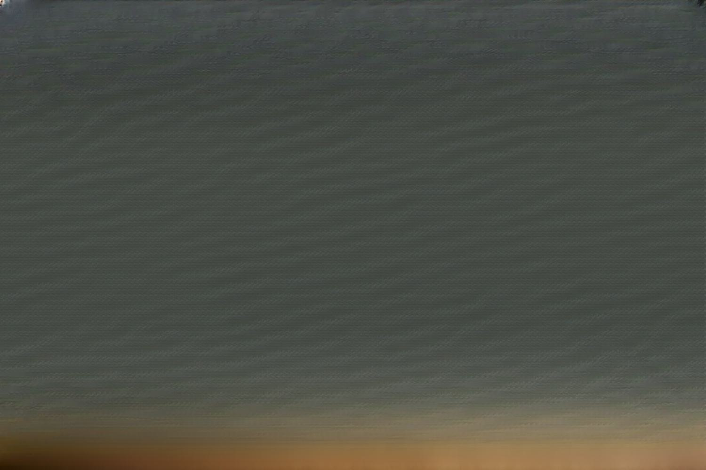

## Table of Contents

## What is a darknet market?

A darknet market is a type of online marketplace that operates on the dark web, a hidden part of the internet that is not indexed by regular search engines. These markets are often used to sell illegal goods and services, such as drugs, weapons, and stolen data, because they offer a level of anonymity and security to both buyers and sellers. People access darknet markets using special software like Tor, which helps hide their identity and location.

Transactions on darknet markets are usually made with cryptocurrencies like Bitcoin, which adds another layer of anonymity. These markets have their own rules and systems to ensure that buyers and sellers can trust each other, even though they don't know each other's real identities. Despite efforts by law enforcement to shut them down, new darknet markets keep appearing because there is a demand for these kinds of hidden online spaces.

## How do darknet markets operate?

Darknet markets work like secret online shops where people buy and sell things that are often illegal. They use special software called Tor to hide who they are and where they are. This software makes it hard for others to track them. When someone wants to buy something, they go to the market's website on the dark web. They look at what's for sale, just like shopping on any other website. But instead of using regular money, they use cryptocurrencies like Bitcoin. This helps keep their identity secret because it's harder to trace cryptocurrency transactions.

Once a buyer decides what they want, they send the money to the seller's [cryptocurrency](/wiki/cryptocurrency) wallet. To make sure the seller actually sends the item, darknet markets often use something called an escrow service. This means the money is held by the market until the buyer gets their item and says it's okay. If there's a problem, the market can help sort it out. Sellers and buyers leave reviews for each other, which helps everyone trust the market more. Even though police try to stop these markets, new ones keep popping up because people still want to use them.

## What types of products are commonly sold on darknet markets?

Darknet markets are like secret online stores where people buy and sell things that are usually not allowed. The most common items you'll find are drugs. People can buy all sorts of drugs, like marijuana, cocaine, and pills. These drugs come from all over the world, and buyers can choose based on reviews and descriptions.

Besides drugs, darknet markets also sell other illegal stuff. You can find weapons, like guns and knives, and fake money or documents, like passports and driver's licenses. There are also stolen things, like credit card numbers and personal information, which people use to do things like identity theft.

Some darknet markets even have services for hire, like hackers who can break into computer systems or people who will do illegal jobs. It's a hidden world where almost anything illegal can be bought or sold, as long as you know where to look and how to stay safe.

## What is the Silk Road and its significance in the history of darknet markets?

The Silk Road was a famous darknet market that started in 2011. It was created by a person named Ross Ulbricht, who used the nickname "Dread Pirate Roberts." The Silk Road was special because it was one of the first big darknet markets where people could buy and sell illegal things like drugs, using Bitcoin to keep their identities secret. It worked a lot like a regular online store, but it was hidden on the dark web and used Tor to keep users safe.

The Silk Road became very important because it showed the world that darknet markets could work. It grew really big, with thousands of users and millions of dollars in sales. But in 2013, the police shut it down and arrested Ross Ulbricht. Even though the Silk Road is gone, it changed how people think about buying and selling things online. It paved the way for many other darknet markets that came after it, showing that there was a big demand for these secret online spaces.

## How can one access a darknet market?

To access a darknet market, you need special software called Tor. Tor helps hide who you are and where you are on the internet. First, you download and install the Tor browser from the Tor Project website. It's free and easy to use. Once you have Tor set up, you can go to darknet market websites by typing in their special web addresses. These addresses usually end in ".onion" instead of ".com" or ".org."

When you're on a darknet market, you'll see listings of things for sale, just like on a regular shopping website. To buy something, you need to sign up for an account on the market and use cryptocurrency like Bitcoin to pay. You send the Bitcoin to the seller's wallet, and the market often holds onto the money until you get your item. This is called an escrow service, and it helps make sure you get what you paid for. Remember, using darknet markets can be risky and often involves illegal activities, so be careful.

## What are the risks associated with using darknet markets?

Using darknet markets can be risky. One big risk is that you might get caught by the police. Buying and selling illegal things can lead to arrests and jail time. The police are always trying to stop these markets, so they might be watching and could catch you. Also, even though darknet markets try to keep things secret, there's always a chance your identity could be found out. If that happens, you could get in big trouble.

Another risk is that you might not get what you paid for. Some sellers on darknet markets are not honest. They might take your money and send you fake stuff or nothing at all. Even though there are reviews and ratings, you can't always trust them. And if you use cryptocurrencies like Bitcoin, you might lose your money if you make a mistake with the transaction. So, there's a chance you could lose money and not get anything in return.

## How do transactions on darknet markets typically occur?

Transactions on darknet markets usually happen with cryptocurrencies like Bitcoin. When someone wants to buy something, they send Bitcoin to the seller's wallet. But to make sure the seller sends the item, the money is often held by the market in something called an escrow service. This means the market keeps the money until the buyer gets their item and says it's okay. If there's a problem, the market can help sort it out.

After the buyer sends the money, the seller ships the item. The buyer then checks to make sure it's what they ordered. If everything is good, the buyer tells the market, and the money is released to the seller. If there's a problem, the buyer and seller can talk to the market to fix it. This way, both the buyer and seller feel safer, even though they don't know each other's real identities.

## What measures do darknet markets take to ensure user anonymity?

Darknet markets use special software called Tor to keep users secret. Tor hides who you are and where you are on the internet. When you use Tor to go to a darknet market, it's hard for anyone to find out your real identity. The websites on darknet markets have special addresses that end in ".onion," which you can only reach with Tor. This makes it even harder for people to track you.

Another way darknet markets keep things secret is by using cryptocurrencies like Bitcoin for payments. When you pay with Bitcoin, it's harder to trace the money back to you. Darknet markets also have rules and systems to make sure buyers and sellers don't know each other's real names. They use nicknames and special codes to talk to each other. All these things together help keep everyone's identity safe on darknet markets.

## What are some notable darknet markets that have existed post-Silk Road?

After the Silk Road was shut down, other darknet markets took its place. One of the most famous ones was AlphaBay. It started in 2014 and grew really big, with lots of users and even more things to buy than the Silk Road. AlphaBay had drugs, weapons, and other illegal stuff. It used the same tricks as the Silk Road, like Tor and Bitcoin, to keep users secret. But in 2017, the police closed AlphaBay down and arrested its leader, a man named Alexandre Cazes.

Another well-known darknet market was Hansa Market. It became popular around the same time as AlphaBay. Hansa was known for being safe and having good rules to protect buyers and sellers. It also had a lot of different things for sale. When AlphaBay was shut down, a lot of its users went to Hansa. But the police had a secret plan. They had already taken over Hansa and were watching everything. Soon after, they closed Hansa too. Even though these markets are gone, new ones keep popping up because there's always a demand for them.

## How have law enforcement efforts impacted darknet markets over time?

Law enforcement has been trying hard to stop darknet markets. They've shut down big ones like the Silk Road, AlphaBay, and Hansa Market. When they close a market, they arrest the people running it and sometimes the users too. This makes it harder for new markets to start up because people are scared of getting caught. But even though the police keep closing them, new darknet markets keep popping up because there's still a demand for them.

The efforts of law enforcement have made darknet markets less stable. When a big market gets shut down, users have to find new places to buy and sell things. This can be risky because new markets might not be as safe or trustworthy. Also, the police sometimes use tricks, like taking over a market secretly to watch what people are doing. This makes it even harder for darknet markets to stay open for a long time. Even with all these challenges, darknet markets keep coming back because people still want to use them.

## What are the current trends and developments in darknet markets?

Darknet markets keep changing and growing. One big trend is that they're using more different kinds of cryptocurrencies, not just Bitcoin. This makes it even harder for the police to track the money. Also, darknet markets are trying to be more user-friendly. They're making their websites look nicer and easier to use, so more people feel comfortable using them. Another thing is that they're using new ways to keep users safe, like special codes and secret ways to talk to each other.

Even though law enforcement is always trying to shut them down, new darknet markets keep popping up. They're getting smarter about staying hidden and safe. Some markets are also focusing on selling things that are not just illegal drugs, like fake money or stolen data. This shows that darknet markets are becoming more diverse. Overall, darknet markets are adapting to the challenges they face and finding new ways to keep going.

## What is the future outlook for darknet markets and their regulation?

The future of darknet markets looks like it will keep changing and growing. Even though the police try to stop them, new markets keep popping up because there's still a big demand for them. These markets might start using even more different kinds of cryptocurrencies to make it harder for the police to track the money. They might also become more user-friendly, so more people feel safe using them. Darknet markets could also start selling more types of things, not just illegal drugs, to meet different needs.

Regulating darknet markets is really hard because they are so hidden. The police will probably keep trying to shut them down, but it's a big challenge because new markets keep appearing. Governments might try to make new laws or use special technology to catch people using these markets. But it's tough because darknet markets are always finding new ways to stay secret and safe. So, the future might be a back-and-forth between darknet markets and the people trying to stop them.

## References & Further Reading

[1]: Greenberg, A. (2013). "This Is How the FBI Will Crib Ross Ulbricht’s Alleged Personal Diaries as Evidence". Wired. Retrieved from [Wired](https://en.wikipedia.org/wiki/Andy_Greenberg)

[2]: Bilton, N. (2017). "American Kingpin: The Epic Hunt for the Criminal Mastermind Behind the Silk Road". Portfolio/Penguin.

[3]: Rayman, N. (2013). "FBI's Malware Analysis Expert Takes Down The Silk Road". Forbes. Retrieved from [Forbes](https://www.forbes.com/councils/forbestechcouncil/2023/10/20/the-role-of-automation-in-malware-analysis/)

[4]: Woolf, N. (2017). "Silk Road's Ross Ulbricht loses court appeal against conviction and life sentence". The Guardian. Retrieved from [The Guardian](https://man.fandom.com/wiki/Diana_Rigg)

[5]: Christin, N. (2013). "Traveling the Silk Road: A Measurement Analysis of a Large Anonymous Online Marketplace". Proceedings of the 22nd International Conference on World Wide Web. Retrieved from [Carnegie Mellon University](https://dl.acm.org/doi/10.1145/2488388.2488408)

[6]: Moore, D., & Rid, T. (2016). "Cryptopolitik and the Darknet". Survival, 58(1), 7-38. Retrieved from [Tandfonline](https://www.tandfonline.com/doi/full/10.1080/00396338.2016.1142085)

[7]: Zetter, K. (2015). "Hacker Lexicon: What Is the Dark Web?". Wired. Retrieved from [Wired](https://www.wired.com/2014/11/hacker-lexicon-whats-dark-web/)

[8]: Gandal, N., & Halaburda, H. (2016). "Can We Predict the Winner in a Market with Network Effects? Competition in Cryptocurrency Market". Games, 7(3), 16. Retrieved from [MDPI](https://papers.ssrn.com/sol3/papers.cfm?abstract_id=2832836)

[9]: Jentzsch, C. (2016). "Decentralized Autonomous Organization to Automate Governance". Retrieved from [GitHub](https://lawofthelevel.lexblogplatformthree.com/wp-content/uploads/sites/187/2017/07/WhitePaper-1.pdf)