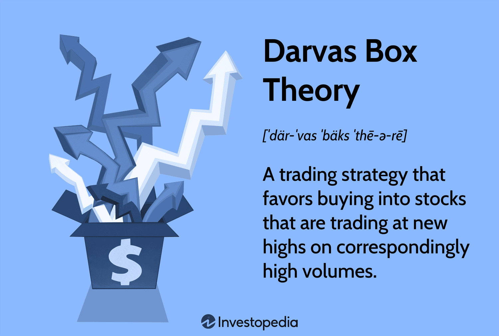

## Table of Contents

## What is the Darvas Box Theory?

The Darvas Box Theory is a trading strategy developed by Nicolas Darvas in the late 1950s. He used this method to turn a $10,000 investment into over $2 million in just a few years. The theory is based on the idea that stocks move in predictable patterns, which Darvas called "boxes." These boxes are price ranges where a stock trades for a period of time before breaking out to a new high or low.

To use the Darvas Box Theory, traders look for stocks that are making new highs and then enter a consolidation phase, forming a box. The top of the box is the highest price the stock reached during the consolidation, and the bottom is the lowest price. When the stock price breaks above the top of the box, it's a signal to buy. If the price falls below the bottom of the box, it's a signal to sell. Darvas believed that by following these breakout signals, traders could ride the upward momentum of a stock and make profits.

The Darvas Box Theory is still used today by many traders, though it has evolved with the addition of modern tools and technology. It's important for traders to combine the theory with other forms of analysis, like fundamental analysis, to increase their chances of success. While no trading strategy guarantees profits, the Darvas Box Theory offers a structured approach to identifying potential trading opportunities based on price movements.

## Who was Nicolas Darvas and how did he develop the Darvas Box Theory?

Nicolas Darvas was a dancer and investor who became famous for his success in the stock market during the late 1950s. He was born in Hungary and moved to the United States to pursue his career in dancing. While traveling the world for his performances, Darvas started investing in stocks. He began with a small amount of money and turned it into a fortune, which caught the attention of many people. Darvas wrote about his methods in a book called "How I Made $2,000,000 in the Stock Market," where he explained his unique trading strategy known as the Darvas Box Theory.

Darvas developed the Darvas Box Theory by observing stock price movements and patterns. He noticed that stocks often moved within a certain price range, which he called a "box." When a stock broke out of this box to a new high, Darvas saw it as a signal to buy. He used this simple method to make his investment decisions while he was on tour, often using newspapers and ticker tapes to keep track of stock prices. His approach was based on the idea that stocks that were making new highs and then consolidating could continue to rise, allowing him to profit from the upward momentum.

## What are the basic principles of the Darvas Box Theory?

The Darvas Box Theory is all about watching how stock prices move and finding patterns. Nicolas Darvas noticed that stocks often stay within a certain price range, which he called a "box." The top of the box is the highest price the stock reaches during this time, and the bottom is the lowest price. When the stock price stays inside this box, it means the stock is taking a break. Darvas thought that if the price broke out above the top of the box, it was a good time to buy the stock.

When the stock price breaks out of the box and goes higher, it means the stock might keep going up. Darvas used this idea to decide when to buy and sell stocks. He would only buy a stock if it broke out above the top of the box, and he would sell it if the price fell below the bottom of the box. This simple rule helped him make a lot of money. Even though it sounds easy, Darvas also paid attention to other things like how much the stock was traded and the overall market conditions to make better choices.

## How does the Darvas Box method identify potential trading opportunities?

The Darvas Box method looks for stocks that are making new highs and then start trading in a certain price range, which Nicolas Darvas called a "box." The top of the box is the highest price the stock reached while in this range, and the bottom is the lowest price. When a stock stays inside this box, it means the stock is taking a break. Darvas thought that if the price of the stock broke out above the top of the box, it was a good sign to buy the stock. This breakout suggested that the stock might keep going up, giving traders a chance to make money.

To use the Darvas Box method, traders watch the stock's price closely. If the stock breaks out above the top of the box, it's a signal to buy. But if the price falls below the bottom of the box, it's a signal to sell. Darvas also paid attention to how many shares were being traded, which he called volume. High volume during a breakout made him more confident that the stock would keep going up. By using these simple rules, traders can spot stocks that might be ready to rise and make smart trading decisions.

## What are the key components of a Darvas Box?

A Darvas Box has two main parts: the top of the box and the bottom of the box. The top is the highest price a stock reaches while it's moving in a certain range. The bottom is the lowest price in that same range. When a stock stays between these two prices for a while, it makes a box shape on a price chart. Nicolas Darvas called this a "box" because it looks like a rectangle on the chart.

The key to using a Darvas Box is to watch what happens when the stock price tries to move out of the box. If the price goes above the top of the box, it's a sign that the stock might keep going up. This is called a breakout. Darvas thought this was a good time to buy the stock. But if the price falls below the bottom of the box, it's a sign to sell the stock. So, the top and bottom of the box are important because they help traders decide when to buy or sell.

## How does one draw a Darvas Box on a price chart?

Drawing a Darvas Box on a price chart is pretty simple. First, you need to find a stock that is making new highs and then starts to move in a certain price range. When the stock hits a new high and then starts to go down a bit but doesn't go below the last low, you can start drawing the box. The top of the box is the highest price the stock reached in this range. You draw a horizontal line at this high price. The bottom of the box is the lowest price the stock reached while it was moving in this range. You draw another horizontal line at this low price. These two lines make the box.

After you've drawn the box, you watch the stock's price to see what it does next. If the price goes above the top line of the box, it's called a breakout. This is a sign that you might want to buy the stock because it could keep going up. But if the price falls below the bottom line of the box, it's a sign that you might want to sell the stock. So, drawing a Darvas Box helps you see when a stock might be ready to move up or down, and it can help you make better trading decisions.

## What are the entry and exit rules associated with the Darvas Box Theory?

The Darvas Box Theory has simple rules for when to buy and sell stocks. You buy a stock when its price goes above the top of the box. This is called a breakout. The top of the box is the highest price the stock reached while it was moving in a certain range. When the price goes above this top line, it's a sign that the stock might keep going up. So, you enter a trade by buying the stock right after it breaks out above the top of the box.

The exit rule is just as simple. You sell the stock if its price falls below the bottom of the box. The bottom of the box is the lowest price the stock reached while it was in the box. If the price drops below this bottom line, it's a sign that the stock might keep going down. So, you exit the trade by selling the stock as soon as it goes below the bottom of the box. These rules help traders know when to get in and out of trades based on the Darvas Box.

## Can the Darvas Box Theory be applied to different time frames and markets?

Yes, the Darvas Box Theory can be used on different time frames and in different markets. It works well for short-term trading, like day trading, where you look at charts that show prices over a few minutes or hours. But it can also be used for longer time frames, like weekly or monthly charts, if you want to hold onto stocks for a longer time. As long as you can see the boxes forming on the chart, you can use the Darvas Box Theory. This makes it useful for trading stocks, but also for other things like forex, commodities, and even cryptocurrencies.

The key is to find the right time frame that matches your trading style. If you like to make quick trades, you'll use shorter time frames. If you're more patient and want to hold onto your investments for a while, you'll use longer time frames. The Darvas Box Theory can work in any market where prices move in patterns. You just need to watch the prices and draw the boxes correctly. Whether you're trading stocks in New York, forex in London, or Bitcoin online, the basic idea of looking for breakouts from the boxes stays the same.

## What are the limitations and criticisms of the Darvas Box Theory?

The Darvas Box Theory has some limitations and people have criticized it. One big problem is that it can give wrong signals. Sometimes a stock breaks out of the box but then the price goes back down. This is called a false breakout. It can make traders lose money if they buy the stock right after the breakout. Another issue is that the theory doesn't take into account other important things like the company's financial health or what's happening in the economy. Traders who only use the Darvas Box might miss out on important information that could affect the stock's price.

Also, the Darvas Box Theory can be hard to use because different traders might draw the boxes differently. This means that what looks like a good trading signal to one person might not look the same to another. Some people say the theory is too simple and doesn't work well in today's fast-moving markets. They think it's better to use other methods along with the Darvas Box to make smarter trading decisions. Even though it has helped some traders make money, it's not a perfect strategy and should be used carefully.

## How has the Darvas Box Theory evolved since its inception?

Since Nicolas Darvas first came up with the Darvas Box Theory in the late 1950s, it has changed a bit to fit today's markets. Back then, Darvas used newspapers and ticker tapes to keep track of stock prices. Now, traders use computers and special software to draw the boxes and watch for breakouts. These tools make it easier to spot patterns and trade quickly. Some traders also add other ways to analyze stocks, like looking at how much the stock is traded or the company's earnings, to make better decisions.

Even though the basic idea of the Darvas Box hasn't changed, how people use it has gotten more complicated. Traders now use different time frames, from minutes to months, to fit their trading styles. They also apply the theory to other markets, like forex and cryptocurrencies, not just stocks. While some still follow Darvas's simple rules, others mix in other strategies to make the Darvas Box Theory work better in today's fast-moving markets.

## What advanced techniques can be used to enhance the effectiveness of the Darvas Box Theory?

To make the Darvas Box Theory work better, traders can use something called volume to help them decide when to buy or sell. Volume is how many shares of a stock are being traded. If a stock breaks out of the box and the volume is high, it's a stronger sign that the stock might keep going up. Traders can also use other ways to look at stocks, like checking the company's earnings or the overall market conditions. This helps them understand why the stock is moving and make smarter choices.

Another way to improve the Darvas Box Theory is by using different time frames. Traders can look at short-term charts to find quick trades, or long-term charts if they want to hold onto stocks for a while. This lets them match the theory to how they like to trade. Some traders also use other technical tools, like moving averages or trend lines, along with the Darvas Box. These tools can help confirm when a breakout is real and not just a false signal. By mixing these advanced techniques with the Darvas Box Theory, traders can make better trading decisions.

## How can the Darvas Box Theory be integrated with other technical analysis tools for better results?

To make the Darvas Box Theory work better, traders can use it with other technical analysis tools. One way is to use volume, which is how many shares of a stock are being traded. If a stock breaks out of the box and the volume is high, it's a stronger sign that the stock might keep going up. Traders can also use moving averages, which are lines on the chart that show the average price of a stock over time. If the stock price breaks out of the box and is also above the moving average, it can be a good time to buy. Trend lines, which show the direction of the stock's price, can also help. If the breakout happens along with an upward trend, it adds more confidence to the buy signal.

Another way to improve the Darvas Box Theory is by using indicators like the Relative Strength Index (RSI) or the Moving Average Convergence Divergence (MACD). The RSI helps traders see if a stock is overbought or oversold, which can help confirm if a breakout is likely to last. If the RSI is not in the overbought zone when a breakout happens, it can be a good sign to buy. The MACD can show when a stock's momentum is changing, which can also confirm a breakout. By combining the Darvas Box Theory with these other tools, traders can make more informed decisions and increase their chances of success in the market.

## References & Further Reading

[1]: Darvas, N. (1960). ["How I Made $2,000,000 in the Stock Market"](https://www.amazon.com/How-Made-000-Stock-Market/dp/1614271690). Lyle Stuart.

[2]: Lopez de Prado, M. (2018). ["Advances in Financial Machine Learning"](https://www.amazon.com/Advances-Financial-Machine-Learning-Marcos/dp/1119482089). Wiley.

[3]: Aronson, D. R. (2007). ["Evidence-Based Technical Analysis: Applying the Scientific Method and Statistical Inference to Trading Signals"](https://onlinelibrary.wiley.com/doi/book/10.1002/9781118268315). Wiley.

[4]: Jansen, S. (2020). ["Machine Learning for Algorithmic Trading: Predictive models to extract signals from market and alternative data for systematic trading strategies with Python"](https://github.com/stefan-jansen/machine-learning-for-trading). Packt Publishing.

[5]: Chan, E. P. (2008). ["Quantitative Trading: How to Build Your Own Algorithmic Trading Business"](https://github.com/ftvision/quant_trading_echan_book). Wiley.