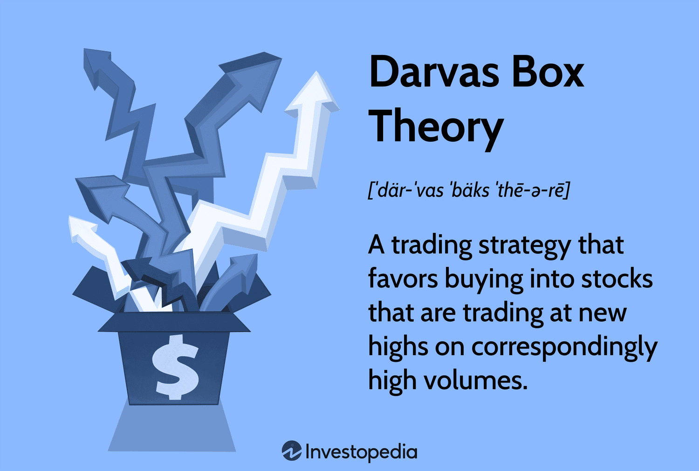

## Table of Contents

## What is the Darvas Box Trading Strategy?

The Darvas Box Trading Strategy is a method used by traders to decide when to buy and sell stocks. It was created by Nicolas Darvas, a dancer who turned into a successful stock trader. The strategy involves drawing boxes around the highs and lows of a stock's price movement. When the stock price breaks out of the top of the box, it's a signal to buy. If the price falls below the bottom of the box, it's a signal to sell.

Darvas used this method to make a lot of money in the stock market. He looked for stocks that were going up and formed these boxes. He would only buy a stock if it broke above the top of the box, showing strong upward movement. If the stock price stayed within the box, he would wait. But if it broke below the bottom of the box, he would sell to avoid losing money. This strategy helped him pick winning stocks and manage his risks.

## Who developed the Darvas Box Theory and why?

Nicolas Darvas developed the Darvas Box Theory. He was a dancer and not a finance expert, but he became very good at trading stocks. Darvas wanted a simple way to make money in the stock market without spending all his time on it. So, he came up with the Darvas Box Theory to help him decide when to buy and sell stocks easily.

The Darvas Box Theory is about drawing boxes around the highest and lowest prices of a stock. Darvas would only buy a stock if its price went above the top of the box. This showed him that the stock was strong and likely to keep going up. If the price fell below the bottom of the box, he would sell the stock to avoid losing money. This method helped Darvas make a lot of money and manage his risks in the stock market.

## How does the Darvas Box help in identifying stock trends?

The Darvas Box helps traders spot when a stock's price is going up or down by drawing boxes around its highest and lowest points. When the price of a stock stays inside a box, it means the stock is not moving much. But if the price breaks out of the top of the box, it's a sign that the stock might keep going up. This is a good time for traders to buy the stock because it shows the stock is strong.

If the price of the stock falls below the bottom of the box, it's a warning that the stock might keep going down. This is when traders should sell the stock to avoid losing money. By using the Darvas Box, traders can see clear signals about when to buy and sell, making it easier to follow stock trends and make smart trading choices.

## What are the key components of a Darvas Box?

The Darvas Box has two main parts: the top and the bottom of the box. The top of the box is the highest price the stock reached before it started to move sideways or down a bit. The bottom of the box is the lowest price the stock hit during that same time. These two points create the box, and they help traders see where the stock's price has been moving.

When a stock's price breaks above the top of the box, it's a sign that the stock might keep going up. This is when traders think about buying the stock because it looks strong. On the other hand, if the price drops below the bottom of the box, it's a warning that the stock might keep going down. This is when traders might want to sell the stock to avoid losing money. By watching these two parts of the Darvas Box, traders can make better choices about when to buy and sell.

## How do you construct a Darvas Box on a stock chart?

To construct a Darvas Box on a stock chart, you start by looking at the stock's price movements over time. Find a period where the stock price goes up, then moves sideways or drops a bit before going up again. The highest price the stock reached before it started moving sideways or down is the top of the box. The lowest price it hit during that time is the bottom of the box. Draw a horizontal line at the top price and another at the bottom price. These two lines create the box.

Once you have drawn the box, you watch to see what the stock price does next. If the price breaks above the top of the box, it's a signal that the stock might keep going up. This is a good time to think about buying the stock. If the price falls below the bottom of the box, it's a warning that the stock might keep going down. This is when you might want to sell the stock to avoid losing money. By using the Darvas Box, you can see clear signs about when to buy and sell based on the stock's price movements.

## What are the entry and exit rules for trading using the Darvas Box?

The entry rule for trading with the Darvas Box is simple. You look for a stock that has been going up and then starts moving sideways or down a bit. You draw a box around the highest and lowest prices during this time. If the stock's price breaks above the top of the box, that's your signal to buy the stock. It means the stock is strong and might keep going up.

The exit rule is just as straightforward. If you've bought a stock and its price stays inside the box you drew, you wait and watch. But if the price falls below the bottom of the box, that's your signal to sell the stock. It's a warning that the stock might keep going down, and selling helps you avoid losing more money. By following these rules, you can use the Darvas Box to decide when to buy and sell stocks based on clear price movements.

## Can you explain the concept of 'raising the box' in the Darvas Box strategy?

In the Darvas Box strategy, 'raising the box' is what you do when the stock's price keeps going up. After you buy a stock because it broke above the top of the first box, you watch to see if it keeps going higher. If it does, you draw a new box. The top of this new box is the new highest price the stock reached, and the bottom is the lowest price it hit after breaking out of the first box. This new box helps you keep track of the stock's new high and low points.

Raising the box lets you see if the stock is still strong and moving up. If the stock's price breaks above the top of this new box, it's another signal to keep holding the stock or maybe even buy more. But if the price falls below the bottom of the new box, it's a warning that the stock might be weakening. This could be a sign to sell the stock to avoid losing money. By raising the box, you can follow the stock's upward trend and make better decisions about when to buy or sell.

## How does volume play a role in the Darvas Box strategy?

In the Darvas Box strategy, volume is important because it shows how many people are buying or selling the stock. When the stock price breaks above the top of the box, you want to see a lot of volume. This means many people are buying the stock, which makes the breakout stronger. If the volume is low when the price breaks out, it might not be a good sign because it could mean fewer people are interested in the stock.

Volume also helps you decide when to sell. If the stock price falls below the bottom of the box and the volume is high, it's a stronger warning that the stock might keep going down. High volume means more people are selling, which can make the price drop faster. By watching the volume along with the price, you can make better choices about when to buy and sell using the Darvas Box strategy.

## What are common mistakes traders make when using the Darvas Box strategy?

One common mistake traders make when using the Darvas Box strategy is not waiting for enough volume during a breakout. When the stock price breaks above the top of the box, traders should look for high volume to confirm that the breakout is strong. If they buy the stock without seeing enough volume, they might end up with a stock that doesn't keep going up as expected. Another mistake is ignoring the volume when the price falls below the bottom of the box. High volume when the price drops out of the box is a stronger sign that the stock might keep going down, and traders should sell to avoid bigger losses.

Another mistake is not raising the box as the stock price continues to go up. Traders sometimes stick with the first box they draw and miss out on seeing new highs and lows. By not drawing new boxes, they can miss important signals about when to keep holding or even buy more of the stock. Lastly, some traders get too attached to a stock and don't sell when the price falls below the box. They might hope the price will go back up, but this can lead to bigger losses if the stock keeps going down. It's important to follow the rules of the strategy and sell when the price breaks the bottom of the box.

## How can the Darvas Box strategy be adapted for different market conditions?

The Darvas Box strategy can be changed to fit different market times by watching how the market is acting. If the market is going up a lot, traders might want to make the boxes smaller. This means they draw the top and bottom of the box closer together. Smaller boxes can catch quicker moves in the stock's price. Also, traders might want to buy the stock when it breaks out of the box with even more volume than usual. This shows that the stock is really strong and likely to keep going up in a hot market.

On the other hand, if the market is not moving much or going down, traders can make the boxes bigger. Bigger boxes can help them see if the stock is still going up even when the market is not doing well. They might also wait for the stock to break out of the box with a lot more volume than they would in a good market. This extra volume can give them more confidence that the stock will keep going up even in tough times. By changing the size of the boxes and looking at volume, traders can use the Darvas Box strategy in different market conditions.

## What are some advanced techniques or variations of the Darvas Box strategy?

One advanced technique in the Darvas Box strategy is using multiple time frames to draw boxes. Traders can look at daily, weekly, or even monthly charts to see different boxes. This helps them understand the bigger picture and the smaller moves in the stock's price. By drawing boxes on different time frames, traders can spot strong trends that last longer and make better choices about when to buy and sell.

Another variation is combining the Darvas Box with other indicators like moving averages or the Relative Strength Index (RSI). For example, traders might wait for the stock price to break out of the box and also for the RSI to show the stock is not overbought. This extra check can help them avoid buying a stock that might go down soon. Using other indicators with the Darvas Box can make the strategy more accurate and help traders manage their risks better.

## How effective is the Darvas Box strategy compared to other trading strategies, and what are its limitations?

The Darvas Box strategy can be very effective for traders who want a simple way to find stocks that are going up. It helped Nicolas Darvas make a lot of money by focusing on stocks with clear upward trends and using volume to confirm strong moves. Compared to other trading strategies like moving averages or momentum trading, the Darvas Box is easy to understand and use. It works well in markets that are going up because it catches stocks that are breaking out to new highs. But it's not the best strategy for every trader or every market condition. Some traders might find other strategies more suited to their style or the current market.

One big limitation of the Darvas Box strategy is that it can give false signals. Sometimes, a stock might break out of the box but then go back down quickly. This can lead to losses if traders buy the stock too soon. Also, the strategy might not work well in markets that are not moving much or going down. In these conditions, stocks might not break out of boxes often, making it hard to find good trades. Traders need to be careful and might need to use other tools or strategies along with the Darvas Box to make better decisions and manage their risks.

## References & Further Reading

[1]: ["How I Made $2,000,000 in the Stock Market"](https://www.amazon.com/How-Made-000-Stock-Market/dp/1614271690) by Nicolas Darvas

[2]: ["Advances in Financial Machine Learning"](https://www.amazon.com/Advances-Financial-Machine-Learning-Marcos/dp/1119482089) by Marcos Lopez de Prado

[3]: ["Quantitative Trading: How to Build Your Own Algorithmic Trading Business"](https://www.amazon.com/Quantitative-Trading-Build-Algorithmic-Business/dp/1119800064) by Ernest P. Chan

[4]: ["Machine Trading: Deploying Computer Algorithms to Conquer the Markets"](https://www.amazon.com/Machine-Trading-Deploying-Computer-Algorithms/dp/1119219604) by Ernest P. Chan

[5]: Neely, C. J., Weller, P. A., & Ulrich, J. M. (2009). ["The Adaptive Markets Hypothesis: Evidence from the Foreign Exchange Market"](https://www.cambridge.org/core/journals/journal-of-financial-and-quantitative-analysis/article/abs/adaptive-markets-hypothesis-evidence-from-the-foreign-exchange-market/9D336CDCA83233819EB5CDD0F4BC0DAA). Journal of Financial and Quantitative Analysis.