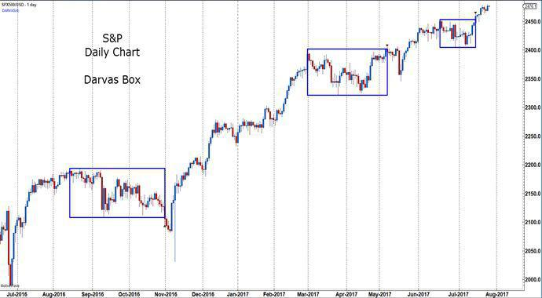

In the ever-evolving world of stock trading, strategies frequently evolve, yet certain approaches persist well beyond their inception. One such enduring methodology is the Darvas Box strategy, a classic trend-following system that continues to attract traders eager to optimize investment gains. Originally conceived by Nicolas Darvas, a figure famous not for his initial Wall Street background but for his extraordinary trading success, this strategy blends elements of technical analysis with momentum trading principles, providing a robust framework for traders.

The appeal of the Darvas Box method lies in its systematic approach to identifying stocks poised for upward movement. The technique is designed to capture momentum in stocks, especially those achieving new 52-week highs. By leveraging 'boxes' drawn around price ranges, traders can anticipate potential breakouts, thus maximizing returns during sustained trends. The core mechanism of the strategy focuses on price-action patterns, whereby stocks are monitored within a defined range until they break above the upper threshold, signaling a buying opportunity.



Given its historical roots, the Darvas Box strategy may appear simplistic by contemporary standards. However, its fundamental principles remain valid and applicable, particularly in today's technology-driven trading environment. As algorithmic trading becomes increasingly pervasive, adopting a systematic approach such as the Darvas Box can offer advantages in both speed and precision. By embedding this timeless strategy within algorithmic systems, traders can effectively scan for breakout opportunities and execute trades that capitalize on momentum trends.

Ultimately, the longevity of the Darvas Box strategy underscores its enduring relevance and efficacy. As traders continue to seek strategies that can adapt to changing market conditions, the Darvas Box method remains a pertinent example of how classical techniques can be integrated with modern trading advancements to achieve consistent results.

## Table of Contents

## The Origins of the Darvas Box Strategy

Nicolas Darvas, originally a professional ballroom dancer, became an unexpected yet profound influence on Wall Street due to his unconventional trading success. His journey into the world of stock trading began when he accepted shares as part of his performance payment in Toronto. Intrigued by the stock market and driven by a desire to increase his wealth, Darvas embarked on a self-education journey, consuming numerous books on finance and stock market behavior.

In the late 1950s, Darvas achieved a legendary feat by transforming an initial investment of $36,000 into over $2.25 million within approximately 18 months. This success was largely attributed to what is now known as the Darvas Box theory. A unique aspect of his strategy was the focus on momentum trading, specifically targeting stocks that were achieving new 52-week highs. Darvas noticed that these high-performing stocks often exhibited specific price patterns, which he meticulously analyzed and categorized.

The essence of the Darvas Box method involved identifying stocks that had price ranges forming a 'box'. When a stock's price broke above the upper boundary of this box, it signaled a potential upward trend, prompting Darvas to make a buy decision. Conversely, if the price fell below the lower boundary, it suggested potential downside risk, prompting him to sell or avoid entering the trade. The formation of these boxes allowed Darvas to systematically capture price movements driven by strong market [momentum](/wiki/momentum).

By focusing on stocks within these 'boxes' and prioritizing those reaching significant price highs, Darvas effectively harnessed the stock market's momentum. His approach emphasized not only technical analysis but also the psychological aspects of trading, such as capitalizing on market trends and investor behavior. This methodology, while simple in its logic, required strict discipline in execution, a [factor](/wiki/factor-investing) Darvas credited heavily for his success.

Darvas outlined his trading philosophy and strategy in his book "How I Made $2,000,000 in the Stock Market", offering insights into his disciplined approach and the factors he considered when identifying potential [breakout](/wiki/breakout-trading) stocks. His method became popular among traders interested in systematic strategies that combined technical indicators with psychological market cues, and it remains influential in trading practices today.

Darvas's remarkable story serves as a testament to the potential of systematic trading strategies and underscores the impact of disciplined, rules-based approaches in achieving trading success.

## How the Darvas Box Works

The Darvas Box is a trend-following system primarily utilized to identify potential breakout opportunities in stock trading. This strategy involves determining a 'box' or a narrow trading range for a stock's price. The key aspects of the Darvas Box system are as follows:

1. **Identifying the Box**: The Darvas Box is defined when a stock's price fluctuates within a specific high and low range over a certain period. The upper and lower boundaries of this range form the "box." Traders monitor this range closely, waiting for the stock to exhibit momentum that could indicate a potential breakout.

2. **Entry Point**: A critical component of the Darvas Box strategy is selecting the right entry point. Traders are advised to buy a stock when its price breaks above the upper limit of the predefined box. This breakout signals a continuation of upward momentum, suggesting that the stock may continue to rise beyond the established trading range.

3. **Role of Volume**: Volume is a vital indicator within the Darvas Box strategy. When the trading volume surpasses its average levels as the stock's price breaks the upper boundary of the box, it provides additional confirmation for a potential breakout. High trading volume during a breakout is often interpreted as strong investor interest, increasing the likelihood of a sustained trend.

4. **Risk Management with Stop-Loss Orders**: Proper risk management is crucial in the Darvas Box method. To mitigate potential losses, traders set stop-loss orders just below the lower limit of the box. This precaution ensures that if the stock price falls unexpectedly, exiting the position minimizes financial damage.

To illustrate, assume a stock has recently traded between $50 (lower limit) and $55 (upper limit) for a specific period. If the stock price rises above $55 with increased trading [volume](/wiki/volume-trading-strategy), it might be a signal to buy, since the breakout could indicate the start of a new upward trend. Conversely, if the price drops below $50, the stop-loss would be triggered, thereby limiting any losses.

This rule-based system's simplicity and reliance on clear signals offer a structured approach to capturing market trends, making it a valuable tool for traders seeking to harness predictable market movements.

## Implementing Darvas Box in Algo Trading

In today's automated trading environment, the adaptation of the Darvas Box strategy into [algorithmic trading](/wiki/algorithmic-trading) systems offers traders the ability to efficiently monitor a myriad of stocks for potential breakout opportunities. By leveraging algorithms, traders can identify stocks that are reaching new 52-week highs and dynamically construct 'boxes' around price ranges to anticipate future movements.

The implementation of the Darvas Box method in algorithmic trading involves several essential steps. Firstly, algorithms are programmed to scan market data continuously. Stocks that hit new 52-week highs are flagged, as historical analysis shows that such stocks may indicate strong upward momentum. The algorithm then constructs a Darvas Box around the stock's current price range, defined by a recent high and a designated low point, often based on a trailing stop or recent downward movement.

For traders using Python, libraries such as pandas and NumPy can be employed to handle large datasets and compute the necessary parameters for box construction. A simple implementation for identifying a breakout might involve:

```python
import pandas as pd

# Sample stock data
data = pd.DataFrame({
    'Date': ['2023-01-01', '2023-01-02', '2023-01-03', '2023-01-04'],
    'High': [150, 152, 155, 160],
    'Low': [145, 148, 149, 155],
    'Close': [148, 151, 154, 158]
})

# Set the 52-week high condition
new_high = data['High'].max()

# Define the Darvas Box
upper_limit = new_high
lower_limit = data['Low'].min()

# Signal generation
data['Signal'] = (data['Close'] > upper_limit).astype(int)

print(data)
```

This script provides a foundational approach to identifying potential breakout signals when the closing price surpasses the predefined upper limit of the Darvas Box.

Moreover, automated tools are instrumental in [backtesting](/wiki/backtesting) the Darvas strategy. By simulating the strategy across various historical timeframes and market scenarios, traders can assess its performance and adjust parameters to enhance effectiveness. Backtesting can help identify periods where the strategy underperforms, such as in non-trending or highly volatile markets, and allow for refinement of entry and [exit](/wiki/exit-strategy) points.

This robotic approach to implementing the Darvas Box strategy enables consistent, emotion-free trading, deploying mechanical precision to what was originally a manual, intuitive practice. As algorithmic systems continually evolve with technological advancements, the adaptability of the Darvas Box theory ensures its ongoing relevance and application in diverse market conditions.

## Benefits and Limitations of the Darvas Box Strategy

The Darvas Box method offers various benefits that make it an attractive choice for traders. One of its key advantages is its simplicity and effectiveness in capturing trending market movements. By focusing on stocks that are trading within a defined range and poised for a breakout, traders can implement a clear and disciplined strategy. This straightforward approach is particularly useful in markets where stocks exhibit strong directional movements.

Another benefit of the Darvas Box strategy is its adaptability to different timeframes, which makes it suitable for both swing trading and systematic [day trading](/wiki/day-trading-spy). Traders can adjust the size of the boxes and timeframes to align with their specific trading goals and risk tolerance. This versatility allows practitioners to apply the strategy across different market conditions, enhancing its utility.

Despite these advantages, the Darvas Box strategy comes with limitations. It tends to perform poorly in sideways or highly volatile markets, where price movements do not exhibit clear trends. In such conditions, the strategy may produce false breakouts, leading to potential losses. This reliance on trending markets highlights a crucial limitation: the need for discernible trends to generate profitable results. 

Traders must acknowledge that while the Darvas Box method can be highly effective in trending environments, its success is not guaranteed across all market scenarios. As such, it is essential for traders to remain vigilant and adapt their strategies to current market dynamics to optimize their trading outcomes.

## Conclusion

Despite its origins in the mid-20th century, the Darvas Box strategy remains relevant today, especially when integrated into algorithmic trading systems. Its robust yet straightforward structure—focusing on price movements and predefined breakouts—offers a systematic approach that resonates with both novice and experienced traders. The strategy's reliance on clearly defined rules ensures consistency in trading practices, reducing emotional decision-making and fostering disciplined trading habits. This rule-based nature facilitates seamless integration into algorithmic systems, which thrive on predefined criteria and rapid execution.

As market conditions continually evolve, understanding and adapting the Darvas Box strategy to current trends is crucial for sustained success. Traders can leverage [machine learning](/wiki/machine-learning) and advanced data analytics to refine the basic Darvas principles, enhancing their ability to identify breakout opportunities effectively. Furthermore, exploring different market sectors and adjusting criteria such as box sizes or volume thresholds can optimize performance across varying market conditions. The key to unlocking the strategy’s potential lies in a comprehensive grasp of its core principles combined with a willingness to innovate, ensuring its applicability remains robust in dynamic trading environments.

## References & Further Reading

[1]: ["How I Made $2,000,000 in the Stock Market"](https://www.amazon.com/How-Made-000-Stock-Market/dp/1614271690) by Nicolas Darvas

[2]: ["Advances in Financial Machine Learning"](https://www.amazon.com/Advances-Financial-Machine-Learning-Marcos/dp/1119482089) by Marcos Lopez de Prado

[3]: ["Quantitative Trading: How to Build Your Own Algorithmic Trading Business"](https://www.amazon.com/Quantitative-Trading-Build-Algorithmic-Business/dp/1119800064) by Ernest P. Chan

[4]: ["Machine Trading: Deploying Computer Algorithms to Conquer the Markets"](https://www.amazon.com/Machine-Trading-Deploying-Computer-Algorithms/dp/1119219604) by Ernest P. Chan

[5]: Neely, C. J., Weller, P. A., & Ulrich, J. M. (2009). ["The Adaptive Markets Hypothesis: Evidence from the Foreign Exchange Market"](https://www.cambridge.org/core/journals/journal-of-financial-and-quantitative-analysis/article/abs/adaptive-markets-hypothesis-evidence-from-the-foreign-exchange-market/9D336CDCA83233819EB5CDD0F4BC0DAA). Journal of Financial and Quantitative Analysis.