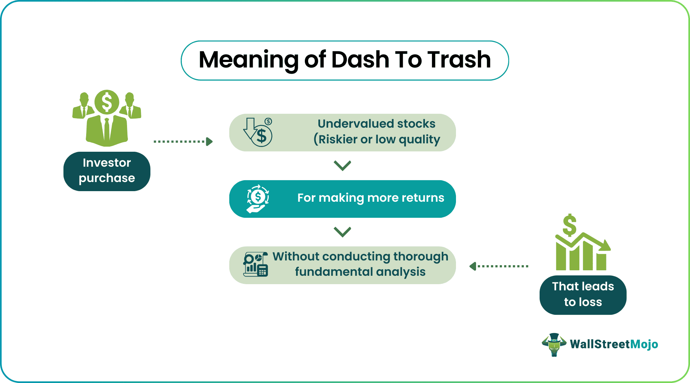

In the complex world of finance, investment strategies are constantly evolving to respond to market dynamics and technological advancements. A recent trend gaining traction is the phenomenon known as "dash to trash," particularly within the sphere of algorithmic trading. This term refers to the rush among investors to acquire low-quality stocks—often characterized by poor fundamentals—during bullish market trends. Such behavior is speculative in nature and is driven by the potential for rapid gains as these stocks are pushed to prices exceeding their intrinsic value.

Algorithmic trading plays a pivotal role in perpetuating this trend by utilizing sophisticated algorithms to analyze market data and execute trades at lightning speed. These algorithms are designed to identify and capitalize on market inefficiencies, which increasingly include the opportunities presented by "dash to trash" scenarios. As these investment strategies evolve, the influence on market volatility and investor behavior becomes more pronounced, highlighting both the risks and opportunities present in today's financial markets. This article investigates the nuances of the dash to trash phenomenon, its market implications, and its influence on shaping contemporary investment strategies.



## Table of Contents

## Understanding Dash to Trash

Dash to trash describes a trading phenomenon where investors flock to acquire stocks that are deemed low-quality based on their poor financial fundamentals. This strategy often unfolds during bullish markets when an optimistic outlook overshadows traditional metrics of stock evaluation. As investors pile into these subpar stocks, their prices become artificially inflated, sometimes soaring significantly higher than their intrinsic values. This speculative action can be enticing for many traders seeking quick profits; however, it carries hefty risks.

The essence of dash to trash lies in speculative behavior. Rather than relying on comprehensive financial analyses or balance sheets, investors are swayed by market momentum and the allure of rapid gains. This behavior is frequently observed when market sentiment is overwhelmingly positive, as the fear of missing out (FOMO) drives individuals and even algorithmic trading systems to capitalize on upward trends without thoroughly considering the underlying financial health of the stocks in question.

This market dynamic is not without its pitfalls. The inflated prices of these fundamentally weak stocks can only be sustained for so long. When market conditions shift or when reality sets in, these stocks can experience sharp corrections, resulting in significant losses for the unprepared investor. The cyclical nature of markets means that the exhilarating run-up in stock prices driven by dash to trash inevitably confronts the sobering effect of value realignment, often resulting in what is known as a market "correction."

Understanding the dash to trash trend requires recognizing the delicate balance between risk and reward and the psychological factors that feed into this trading behavior. While appealing during periods of exuberance, the cautionary tale here emphasizes the perils of straying too far from foundational investment principles.

## Factors Leading to Dash to Trash

The phenomenon of "dash to trash" in the stock market arises primarily during bullish market cycles, where optimism prevails and many investors pursue aggressive investment opportunities. Bullish markets are characterized by rising asset prices, increased investor confidence, and heightened market activity. During these periods, the reduced risk tolerance of investors often becomes apparent, as they prioritize potential high returns over cautious investment strategies.

One of the core elements driving the dash to trash is the sudden shifts in market sentiment, often fueled by news events or positive economic indicators. These shifts can lead to a bandwagon effect where investors collectively move towards the same low-quality stocks, amplifying their prices beyond what the companies' fundamentals would normally justify. The psychology behind this collective movement is rooted in fear of missing out (FOMO), where individual investors mimic the behavior of others, believing that they can achieve quick profits.

Analysts' predictions also play a significant role in shaping investor behavior. When market analysts issue upbeat forecasts about specific sectors or companies, it can drive considerable market engagement. Investors may become overly optimistic about these prospects, further fueling the dash to trash by investing in stocks that might otherwise be overlooked due to poor financial health.

Social trading platforms and online investment communities contribute significantly to the herd mentality that underpins the dash to trash. These platforms enable the rapid dissemination of information and opinions, often leading to echo chambers where bullish sentiments are reinforced. The collective enthusiasm can drive large-scale investment in low-quality stocks, further inflating their prices and increasing market [volatility](/wiki/volatility-trading-strategies).

Overall, the confluence of bullish market conditions, investor behavior, and influential external commentary creates an environment ripe for the dash to trash phenomenon. Without careful consideration of underlying fundamentals, investors may find themselves prone to significant losses when market corrections inevitably occur.

## Impact on Investment Strategies

In the financial markets, the dash to trash phenomenon significantly affects investment strategies. Investors are often lured by the prospect of quick gains, leading them to prioritize [momentum](/wiki/momentum) and speculative sentiment over rigorous [fundamental analysis](/wiki/fundamental-analysis). This tendency can result in portfolios that are diversified across a broad array of low-quality stocks. While diversification traditionally aims to mitigate risk, in this context, it can increase exposure to market volatility. This occurs because such stocks are susceptible to dramatic price swings, especially when market corrections occur.

Algorithmic trading (algo trading) has adapted to exploit these rapid market movements. Algorithms are designed to execute trades based on predetermined criteria, often focusing on short-term price fluctuations and pattern recognition. As a result, they can efficiently capitalize on inefficiencies created by the dash to trash trend. These strategies often involve high-frequency trading ([HFT](/wiki/high-frequency-trading-strategies)), where decisions are made in milliseconds to take advantage of fleeting opportunities.

For instance, when a sudden surge in the buying of low-quality stocks is detected, an algorithm might initiate buy positions to ride the wave of rising prices, followed by quick sell-offs to lock in profits before market corrections set in. The ability of algorithms to process vast amounts of data and reduce the emotional bias inherent in human trading makes them particularly adept at navigating the volatility associated with dash to trash trends.

Moreover, algo trading can exacerbate the effects of the dash to trash trend by amplifying price movements. When multiple algorithms react to the same signals or sentiment indicators, they can create feedback loops that drive prices further away from their intrinsic values. While this can lead to lucrative short-term gains, it also contributes to heightened market volatility.

To illustrate the dynamics of this process, consider the following Python pseudo-code for a simplistic algorithm tasked with executing trades based on short-term momentum in low-quality stocks:

```python
class DashToTrashAlgo:
    def __init__(self, initial_funds, stock_data):
        # Initialize with starting funds and historical stock data
        self.funds = initial_funds
        self.stock_data = stock_data
        self.positions = {}

    def analyze_data(self):
        # Analyze stock data for momentum signals
        signals = {}
        for stock, data in self.stock_data.items():
            # Simple momentum indicator: price today vs. 5 days ago
            if data['close'][-1] > data['close'][-6]:
                signals[stock] = 'buy'
            elif data['close'][-1] < data['close'][-6]:
                signals[stock] = 'sell'
        return signals

    def execute_trades(self, signals):
        # Execute trades based on identified signals
        for stock, action in signals.items():
            if action == 'buy' and self.funds > stock_data[stock]['close'][-1]:
                # Buy one unit of stock
                self.positions[stock] = self.positions.get(stock, 0) + 1
                self.funds -= stock_data[stock]['close'][-1]
            elif action == 'sell' and self.positions.get(stock, 0) > 0:
                # Sell one unit of stock
                self.positions[stock] -= 1
                self.funds += stock_data[stock]['close'][-1]

    def strategy(self):
        signals = self.analyze_data()
        self.execute_trades(signals)

# Example usage
initial_funds = 10000
stock_data = {'stock_a': {'close': [10, 12, 11, 13, 14, 15]},
              'stock_b': {'close': [20, 18, 19, 17, 16, 15]}}
algo = DashToTrashAlgo(initial_funds, stock_data)
algo.strategy()
```

In summary, the dash to trash phenomenon compels investors to reassess their strategies amidst rising volatility and the allure of speculative gains. By leveraging advanced algo trading systems, traders can navigate these turbulent conditions, albeit with inherent risks associated with increased market instability.

## The Role of Algo Trading

Algorithmic trading, often referred to as algo trading, is a method of executing stock trades using automated and pre-programmed trading instructions to account for variables such as time, price, and [volume](/wiki/volume-trading-strategy). This approach leverages vast amounts of data to identify market trends and execute trades with precision and speed. Through the use of complex algorithms, traders are able to analyze market conditions in real-time, allowing them to capitalize on short-lived trading opportunities that would be impossible to exploit manually.

In the context of the dash to trash phenomenon, algo trading plays a dual role. On one hand, these algorithms can contribute to the momentum by fueling the rapid price increases of low-quality stocks. This occurs because some algorithms are designed to detect and exploit short-term price movements, leading to increased purchasing of stocks that are surging in value, regardless of their fundamental quality. Such activity can amplify trends and drive the prices of these stocks even higher, exacerbating the dash to trash dynamics.

Conversely, [algorithmic trading](/wiki/algorithmic-trading) also has the potential to mitigate the effects of dash to trash. Sophisticated algorithms are designed to identify overvalued stocks by continuously assessing real-time market data against historical trends and statistical models. This capability enables traders to implement strategies that hedge against potential losses, such as short selling or diversifying the portfolio to include more stable assets. Moreover, algos can detect inefficiencies in the market, such as mispriced stocks, and execute trades to take advantage of these discrepancies, which can lead to more balanced market corrections.

Central to the efficacy of algorithmic trading is its capacity to leverage vast computing power and advanced statistical models, such as linear regression or [machine learning](/wiki/machine-learning) algorithms, to predict stock price movements. A simple example of a trading strategy could involve calculating the moving average of a stock price and executing trades based on deviations from this average. In Python, this can be implemented as follows:

```python
import numpy as np
import pandas as pd

# Sample stock price data
stock_prices = pd.Series([12.5, 12.7, 12.9, 13.2, 13.5, 13.3, 13.4, 13.7, 13.9, 14.0])

# Calculate the moving average
moving_average = stock_prices.rolling(window=3).mean()

# Simple trading algorithm
def trading_signal(prices, moving_avg):
    signals = []
    for price, avg in zip(prices, moving_avg):
        if price > avg:
            signals.append('buy')
        elif price < avg:
            signals.append('sell')
        else:
            signals.append('hold')
    return signals

signals = trading_signal(stock_prices, moving_average)
print(signals)
```

Algo trading's ability to process information quickly and operate on predefined strategies makes it a vital tool in contemporary trading environments, particularly as markets become increasingly volatile. Traders thus equip themselves with algorithmic solutions to navigate and exploit the rapid shifts often seen during phenomena like dash to trash, turning potential threats into profitable opportunities.

## Examples of Dash to Trash in Action

The "dash to trash" phenomenon can be vividly illustrated through recent market events and hypothetical scenarios. A notable real-time example is the surge in Carvana's stock price driven by market sentiment amid its financial restructuring. Despite Carvana experiencing challenges such as high debt levels and operational inefficiencies, its stock experienced a sharp increase as investors speculated on its potential turnaround. This surge can be attributed to news around financial restructuring efforts, which temporarily boosted investor confidence and led to heightened trading activity.

In this instance, the speculative buying overshadowed the company's underlying financial struggles. Investors, influenced by positive media coverage and market buzz, engaged in buying sprees, driving up stock prices beyond what traditional valuation metrics like Price-to-Earnings (P/E) ratio would justify. As a result, when further financial disclosures highlighted ongoing difficulties, many speculators faced losses as the market corrected and recalibrated the stock's value to align more closely with its fundamentals.

To illustrate with a hypothetical scenario, consider a small-cap tech firm, TechNova Inc., which operates in a niche sector with emerging technology. Initially, TechNova struggles to showcase consistent profits due to heavy research and development investments. However, rumors of a breakthrough product spark investor interest, leading to a swift appreciation in its stock price fueled by sentiment rather than confirmed financial performance. 

In this hypothetical example, the market excitement surrounding TechNova's potential masks the reality of its current operational inefficiencies and cash flow issues. As speculative trading intensifies, the stock reaches values disproportionate to its existing financial condition. When the product launch is delayed, or competitors introduce superior technology, stock prices could plummet, exposing the speculative nature of prior investments and resulting in significant losses for those who participated in the "dash to trash" without sufficient due diligence.

Both Carvana's real-life situation and the hypothetical TechNova example underscore the potential volatility and risks associated with sentiment-driven buying sprees. They highlight the importance for investors to exercise caution, perform thorough fundamental analysis, and remain vigilant against the allure of speculative profiting during market booms, which often precede corrections.

## Strategic Responses to Dash to Trash

Investors navigating the volatile terrain of a "dash to trash" market phenomenon should prioritize rigorous research and adhere to fundamental analysis principles. This approach involves thoroughly examining companies' financial health, assessing earnings, debt levels, and management efficiency to determine intrinsic values. A disciplined evaluation helps investors distinguish between genuinely undervalued opportunities and speculative ventures driven by market hype.

Balancing risk with potential rewards is crucial for a sound investment strategy. One effective method is maintaining a diversified portfolio that includes both value stocks and speculative buys. Value stocks, characterized by solid fundamentals and trading at prices lower than their intrinsic worth, provide stability and growth potential. These stocks counterbalance the inherent risk of speculative investments, which, while potentially offering high returns, can be highly volatile and dependent on market sentiment.

Staying informed about market trends is another vital component of strategic response to dash to trash dynamics. Investors should monitor economic indicators, industry developments, and geopolitical events that could influence market conditions. Leveraging technology and data analytics can significantly enhance this process. Advanced analytics tools and platforms offer real-time insights and predictive modeling to identify emerging trends and potential market shifts.

Utilizing algorithmic trading and machine learning techniques, investors can analyze large datasets to detect patterns and perform sentiment analysis. For instance, Python libraries like `pandas` and `scikit-learn` enable data manipulation and predictive modeling, aiding in the recognition of market signals that precede asset value fluctuations. Here is a simple Python example demonstrating sentiment analysis using `TextBlob`:

```python
from textblob import TextBlob

def analyze_sentiment(article):
    analysis = TextBlob(article)
    if analysis.sentiment.polarity > 0:
        return "Positive"
    elif analysis.sentiment.polarity == 0:
        return "Neutral"
    else:
        return "Negative"

market_news = "The recent innovations in technology have significantly boosted investor confidence."
sentiment = analyze_sentiment(market_news)
print(f"The sentiment of the market news is: {sentiment}")
```

This code snippet exemplifies how sentiment analysis can assist in evaluating qualitative market information, adding another layer to an investor's analytical toolkit.

In conclusion, by emphasizing thorough research, maintaining a balanced asset strategy, and embracing technologically driven insights, investors can adeptly navigate the challenges and maximize the opportunities afforded by the dash to trash phenomenon.

## Conclusion

Dash to trash phenomena present both complex challenges and significant opportunities in the financial markets. The speculative nature of these investment surges demands a nuanced approach, as the volatility can rapidly erode gains if not judiciously managed. Thoughtful investment strategies, underpinned by rigorous analysis and technological innovation, are vital in maneuvering through this volatile landscape.

Leveraging algorithmic trading technologies becomes increasingly crucial. Algorithms can process vast data sets to discern patterns and execute trades with precision and speed, often outmaneuvering human traders. This capability allows investors to better respond to rapid market shifts that characterize dash to trash episodes. However, these tools require strategic implementation to avoid exacerbating irrational buying patterns that dash to trash can induce.

Market participants must remain vigilant, utilizing comprehensive research and analysis to discern underlying fundamentals. Emphasizing the importance of traditional measures such as earnings stability, market position, and inherent value provides a counterbalance to the speculative tendencies that drive dash to trash movements.

As the market dynamics evolve, staying informed and flexible in investment approaches becomes imperative. Investors need to incorporate a balanced mix of speculative and value stocks, monitoring for signs of market exuberance that might indicate an impending correction. Adapting to evolving trends is crucial, ensuring strategies are aligned with both current market conditions and future expectations. Successfully navigating this landscape will rely on the judicious application of technological tools and a steadfast adherence to sound investment principles.

## References & Further Reading

[1]: Bergstra, J., Bardenet, R., Bengio, Y., & Kégl, B. (2011). ["Algorithms for Hyper-Parameter Optimization."](https://dl.acm.org/doi/10.5555/2986459.2986743) Advances in Neural Information Processing Systems 24.

[2]: ["Advances in Financial Machine Learning"](https://www.amazon.com/Advances-Financial-Machine-Learning-Marcos/dp/1119482089) by Marcos Lopez de Prado

[3]: ["Evidence-Based Technical Analysis: Applying the Scientific Method and Statistical Inference to Trading Signals"](https://www.amazon.com/Evidence-Based-Technical-Analysis-Scientific-Statistical/dp/0470008741) by David Aronson

[4]: ["Machine Learning for Algorithmic Trading"](https://github.com/stefan-jansen/machine-learning-for-trading) by Stefan Jansen

[5]: ["Quantitative Trading: How to Build Your Own Algorithmic Trading Business"](https://www.amazon.com/Quantitative-Trading-Build-Algorithmic-Business/dp/1119800064) by Ernest P. Chan