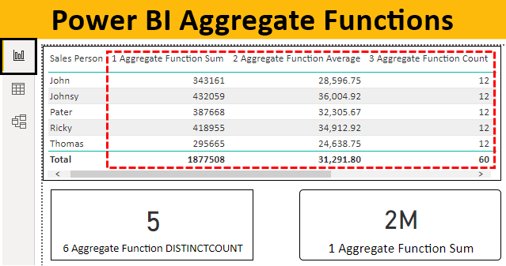

## Table of Contents

## What is a data aggregator?

A data aggregator is a company or service that collects information from many different places and puts it together in one spot. This can include things like personal information, shopping habits, or financial data. They gather this data from sources like websites, apps, and public records. People and businesses use data aggregators to get a complete picture of information they need, without having to search many places themselves.

Data aggregators help businesses make better decisions by giving them a lot of information in one place. For example, a store might use a data aggregator to see what products people are buying and where they are buying them. This helps the store decide what to sell and where to open new locations. However, there are also concerns about privacy because data aggregators collect a lot of personal information. It's important for them to keep this information safe and use it responsibly.

## What is alternative data?

Alternative data is information that comes from unusual places, not the usual sources like financial reports or government statistics. It can include things like satellite pictures, social media posts, or data from credit card transactions. Companies use alternative data to learn more about what's happening in the world and to make better decisions. For example, a company might look at satellite images to see how busy a shopping center is, which can help them understand how well stores are doing.

Using [alternative data](/wiki/best-alternative-data) can give companies an advantage because it helps them see things that other people might miss. For instance, by looking at social media, a company can find out what people are saying about their products or what new trends are starting. But, there are also challenges with alternative data. It can be hard to collect and make sense of, and there are concerns about privacy and making sure the data is used in the right way. Companies need to be careful and responsible when they use alternative data.

## How does a data aggregator use alternative data?

A data aggregator uses alternative data by collecting it from unusual places like social media, satellite images, and credit card transactions. They put all this information together to give a complete picture of what's happening. For example, if a data aggregator gets data from social media, they can see what people are saying about a product or a brand. This helps companies understand what customers like and don't like.

Data aggregators also use alternative data to help businesses make better decisions. They might look at satellite images to see how busy a shopping center is, which can tell them how well stores are doing. This kind of information can be very useful for companies trying to decide where to open new stores or what products to sell. But, data aggregators need to be careful because alternative data can be hard to understand and there are concerns about keeping people's information private.

## What are the benefits of using alternative data in data aggregation?

Using alternative data in data aggregation helps companies get a fuller picture of what's happening. Instead of just looking at regular reports and numbers, they can see things like what people are saying on social media or how busy places look from satellite pictures. This gives them a better understanding of what people want and how the world is changing. For example, a company might see from social media that people are really excited about a new type of food, so they decide to start selling it.

Another big benefit is that alternative data can give companies an edge over others. When a company uses data that others aren't looking at, they can make smarter choices. They might see from credit card data that people are buying more of a certain product in a particular area, so they decide to open a store there. But, companies need to be careful with alternative data. It can be hard to understand and there are worries about keeping people's information safe. So, they need to make sure they use it in the right way.

## What are some common sources of alternative data?

Alternative data comes from many places that aren't the usual sources like financial reports or government stats. One common source is social media. Companies look at what people are posting and talking about online to learn what's popular or what people are thinking about certain products. Another source is satellite images. These pictures can show how busy a place is, like a shopping center, which helps businesses understand how well stores are doing. Credit card transactions are also a big source. By looking at what people are buying and where, companies can figure out what's selling well and where people are spending their money.

There are other sources too, like mobile phone data. This can show where people are going and how they're moving around, which is useful for figuring out where to open new stores or what routes to take for delivery. Web scraping is another way to get alternative data. This means taking information from websites, like prices or reviews, to see what's happening in the market. Lastly, sensors and IoT devices, like those in smart homes or cars, can provide data about how people are using products or what they're doing at home. All these sources help companies see things they might not see with just regular data.

## How can alternative data improve business decision-making?

Alternative data can help businesses make better decisions by giving them information they can't get from usual places like financial reports. For example, by looking at social media, a company can see what people are saying about their products. This helps them understand what customers like and don't like, so they can make products that people want. Also, satellite images can show how busy a shopping center is, which tells businesses where to open new stores or what products are selling well in different areas.

Using alternative data also gives companies an edge over their competitors. When a business looks at data like credit card transactions, they can see what people are buying and where. This helps them decide where to sell their products and what to sell. For instance, if a company sees that people in a certain city are buying a lot of a specific item, they might decide to open a store there. But, companies need to be careful because alternative data can be hard to understand and they must keep people's information private.

## What are the challenges associated with using alternative data in data aggregation?

Using alternative data in data aggregation can be tricky. One big challenge is that it can be hard to understand and use. Alternative data comes from places like social media, satellite images, and credit card transactions. This data can be messy and not always easy to make sense of. Companies need special tools and smart people to turn this data into useful information. If they don't do it right, they might make wrong decisions.

Another challenge is keeping people's information safe. Alternative data often includes personal details, like where people go or what they buy. Companies need to be very careful to keep this information private and use it in a good way. If they don't, people might get upset and there could be legal problems. So, it's important for companies to follow rules about privacy and be honest about how they use the data.

Lastly, there can be problems with the quality of the data. Not all alternative data is accurate or complete. For example, social media posts might not represent what everyone thinks, and satellite images might be affected by weather. Companies need to check the data carefully to make sure it's good enough to use. If they use bad data, their decisions might be off, which can hurt their business.

## What technologies are typically used to process and analyze alternative data?

To process and analyze alternative data, companies often use big data technologies like Hadoop and Apache Spark. These tools help manage and process large amounts of data quickly. They can handle the messy and unstructured nature of alternative data, like social media posts or satellite images. Machine learning and [artificial intelligence](/wiki/ai-artificial-intelligence) are also important. They help find patterns and make sense of the data. For example, [machine learning](/wiki/machine-learning) can look at social media to see what people think about a product.

Another key technology is natural language processing (NLP). This is used to understand and analyze text data, like comments on social media or reviews. NLP helps turn words into useful information. Data visualization tools, like Tableau or Power BI, are also used. They help show the data in a way that's easy to understand, like charts and graphs. This makes it easier for companies to see what the data means and make decisions based on it.

## How do data privacy and regulations impact the use of alternative data by aggregators?

Data privacy and regulations have a big impact on how data aggregators can use alternative data. They have to follow strict rules about how they collect, store, and use people's information. Laws like the General Data Protection Regulation (GDPR) in Europe and the California Consumer Privacy Act (CCPA) in the U.S. make sure that people's data is used in the right way. Data aggregators need to be careful to keep people's information safe and private. If they don't follow these rules, they could get in trouble and face fines.

These regulations also mean that data aggregators have to be clear about how they use alternative data. They need to tell people what data they collect and why they are using it. This can make it harder for them to use the data in new and creative ways because they have to make sure they are following the rules. But, following these regulations helps build trust with people and businesses, which is important for data aggregators to keep working successfully.

## What are some best practices for integrating alternative data into existing data aggregation systems?

When integrating alternative data into existing data aggregation systems, it's important to start by understanding the quality and reliability of the new data. Alternative data can come from places like social media or satellite images, which might not be as accurate or complete as traditional data sources. Companies should check the data carefully to make sure it's good enough to use. They can do this by comparing it with other data they already have or by using special tools to clean and organize the new data. This helps make sure that the new information will help, not hurt, their decisions.

Once the data is ready, companies need to think about how to mix it with their existing systems. They might need to use new technology or change the way their current systems work to handle the new kind of data. It's a good idea to start small, maybe by testing the new data in one part of the business first. This way, they can see if it works well and make any needed changes without messing up everything. Also, they should always keep in mind the rules about data privacy and be clear with people about how they're using the new data. This helps keep trust and makes sure they're doing things the right way.

## How can the quality and accuracy of alternative data be ensured?

To make sure alternative data is good and correct, companies need to check it carefully. They can start by comparing the new data with what they already know from other places. If the new data matches up well with the old data, it's more likely to be right. They can also use special tools to clean up the data, which means getting rid of any mistakes or missing parts. This helps make the data more useful and trustworthy. Sometimes, they might need to ask experts to look at the data and make sure it's good enough to use.

Another important thing is to keep checking the data over time. Alternative data can change a lot, so it's not enough to just check it once. Companies should set up ways to watch the data and see if it stays good and accurate. They can do this by using special computer programs that keep an eye on the data and let them know if something looks wrong. By doing these things, companies can feel more sure that the alternative data they use will help them make good decisions.

## What future trends can we expect in the use of alternative data by data aggregators?

In the future, we can expect data aggregators to use more and more alternative data because it helps them see things they couldn't before. They will use new kinds of data, like from smart homes or cars, to learn about what people do every day. Also, they might start using data from things like fitness trackers or even voice assistants. This will help them understand people's habits and needs better. As technology gets better, data aggregators will be able to collect and use this data faster and easier, which will make their information even more useful for businesses.

Another trend we'll see is more focus on keeping data private and safe. As people get more worried about their information being used, laws will get stricter. Data aggregators will have to be very careful about how they collect and use alternative data. They will need to be clear with people about what they're doing with the data and make sure it's safe. This might slow down how fast they can use new kinds of data, but it will also help build trust. In the end, this will make sure that using alternative data is good for everyone.

## References & Further Reading

[1]: Lopez de Prado, M. (2018). ["Advances in Financial Machine Learning"](https://books.google.com/books/about/Advances_in_Financial_Machine_Learning.html?id=oU9KDwAAQBAJ). John Wiley & Sons.

[2]: Chan, E. P. (2008). ["Quantitative Trading: How to Build Your Own Algorithmic Trading Business"](https://rickorford.com/quantitative-trading/). John Wiley & Sons.

[3]: Aronson, D. R. (2006). ["Evidence-Based Technical Analysis: Applying the Scientific Method and Statistical Inference to Trading Signals"](https://www.amazon.com/Evidence-Based-Technical-Analysis-Scientific-Statistical/dp/0470008741). John Wiley & Sons.

[4]: Jansen, S. (2020). ["Machine Learning for Algorithmic Trading"](https://github.com/stefan-jansen/machine-learning-for-trading). Packt Publishing.

[5]: Bergstra, J., Bardenet, R., Bengio, Y., & Kégl, B. (2011). ["Algorithms for Hyper-Parameter Optimization."](https://dl.acm.org/doi/10.5555/2986459.2986743) Advances in Neural Information Processing Systems 24.