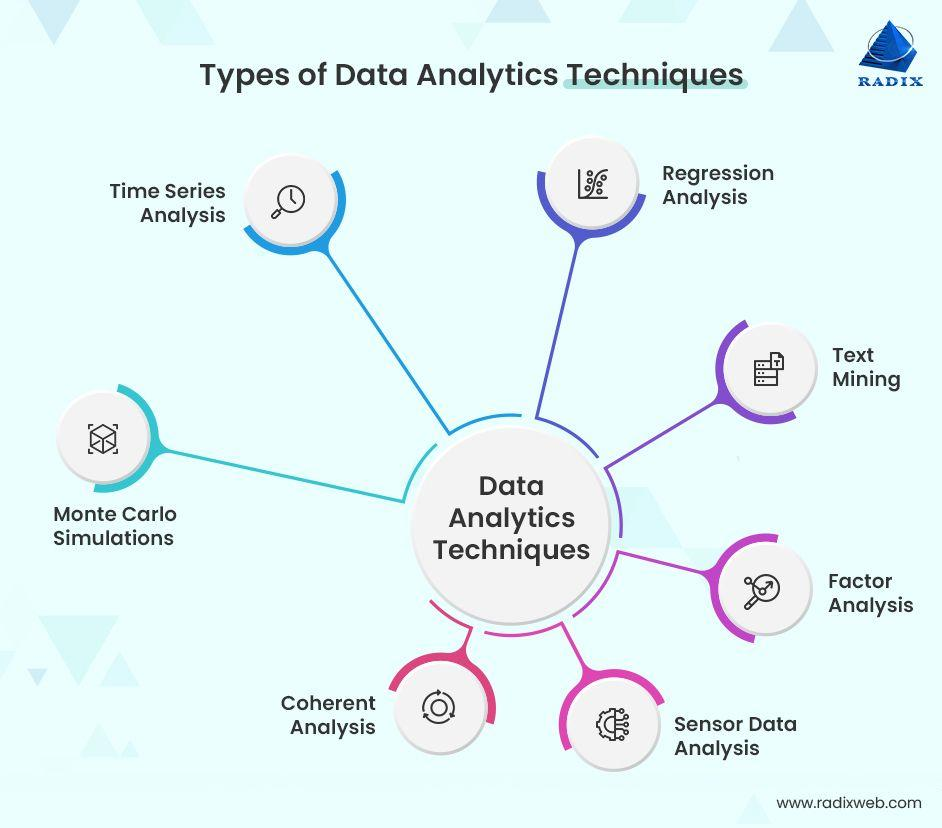

Data usage has become an integral part of the global economy, substantially influencing various sectors such as finance, healthcare, and technology. As organizations continue to generate vast amounts of data, the ability to process and interpret these complex datasets has become crucial. Data analytics techniques have emerged as essential tools to derive actionable insights that improve decision-making and operational efficiency.

One industry where data analytics plays a pivotal role is finance, particularly in algorithmic trading, or algo trading. Algorithmic trading uses computer programs to automate trading decisions, relying heavily on data analytics to process real-time and historical data. These programs can execute trades at speeds far beyond human capability, making them indispensable in today’s fast-paced financial markets. The precision and speed of algo trading offer significant advantages, such as minimizing the impact of human emotions, reducing transaction costs, and improving trade execution accuracy.



This article explores the interconnectedness of data usage, analytics techniques, and their application in algorithmic trading. By understanding how these elements collaborate, one can appreciate the transformative impact of data analytics on modern trading practices and the broader financial landscape.

## Table of Contents

## Understanding Data Analytics

Data analytics is the process of examining raw data to uncover meaningful insights that can inform decision-making. It encompasses a range of techniques and methodologies aimed at extracting valuable information from datasets. This science of data analysis plays a critical role in enabling organizations to make informed decisions based on empirical evidence rather than intuition.

There are several types of data analytics that serve different purposes:

1. **Descriptive Analytics**: This type of analysis focuses on understanding historical data to identify trends and patterns. It answers the question, "What happened?" For instance, a retailer might use descriptive analytics to ascertain past sales trends, identifying which products sold best during a particular season. Visualizations like charts and graphs are often used to represent this data, helping stakeholders easily grasp the findings.

2. **Diagnostic Analytics**: Moving beyond description, diagnostic analytics seeks to find the reasons behind past events. It addresses the question, "Why did it happen?" Techniques such as data mining and drill-down analytics are employed to uncover anomalies and relationships. For example, a business might explore why a product experienced a sudden sales surge or decline by investigating external and internal factors that influenced customer behavior.

3. **Predictive Analytics**: This analytical approach uses historical data combined with statistical algorithms and machine learning techniques to forecast future outcomes. It answers the question, "What could happen?" By building predictive models, organizations can anticipate trends and behaviors, enabling them to allocate resources effectively and prepare for future challenges. A classic example is using customer data to predict purchasing habits, allowing businesses to tailor marketing strategies accordingly.

4. **Prescriptive Analytics**: This type of analysis recommends actions that organizations can take to achieve desired outcomes. It answers the question, "What should we do?" By analyzing the data and considering the potential impact of different decisions, prescriptive analytics provides actionable insights. For instance, a logistics company might use prescriptive analytics to optimize delivery routes, reducing fuel consumption and improving delivery times.

Data analytics proves essential for businesses aiming to optimize their operations, increase efficiency, and enhance profitability. By implementing insights derived from these analyses, companies can streamline processes, reduce waste, and improve their competitive advantage. As organizations continue to accumulate vast amounts of data, the reliance on data analytics for telling stories supported by data becomes crucial for sustaining growth and adapting to market changes.

## Data Analytics Techniques

Data analytics encompasses a variety of techniques that are essential for extracting meaningful insights from complex datasets. One of the most fundamental techniques is regression analysis, which explores relationships between variables. Linear regression, the most basic form, models the relationship between a dependent variable $Y$ and one or more independent variables $X_1, X_2, \ldots, X_n$ according to the formula:

$$

Y = \beta_0 + \beta_1X_1 + \beta_2X_2 + \ldots + \beta_nX_n + \epsilon 
$$

where $\beta_0, \beta_1, \ldots, \beta_n$ are coefficients and $\epsilon$ is the error term.

Factor analysis is another technique used to identify underlying relationships between variables in large datasets. It reduces data dimensionality by finding a smaller set of unobserved variables, known as factors, that explain observed variances and correlations among data points. This method is particularly useful in validating and constructing psychometric instruments and in many fields like finance for risk management.

Cohort analysis provides insights into the behavior of specific subgroups within a dataset. By categorizing data into distinct cohorts, such as customers who joined a service during the same time period, analysts can track and compare metrics like retention rates or customer lifetime value over time.

Monte Carlo simulations are used extensively for risk assessment and probabilistic decision-making. These simulations generate a range of possible outcomes by running numerous iterations, each based on a set of random inputs. For instance, in finance, Monte Carlo methods can model the future performance of investments to estimate the risk of investment portfolios.

Time series analysis is crucial for forecasting future values based on previously observed data, accommodating trends, seasonal patterns, and cyclic behaviors. Time series models such as ARIMA (AutoRegressive Integrated Moving Average) are extensively applied in economic and financial forecasting to predict stock prices, economic indicators, and interest rates.

In Python, these methods can be implemented using libraries such as `statsmodels` for regression analysis, `scipy` and `numpy` for Monte Carlo simulations, and `pandas` or `statsmodels` for time series analysis.

These techniques are indispensable across various industries for optimizing decision-making, enhancing efficiency, and driving profitability through informed data analysis and interpretation.

## Data Analytics Tools

Data analytics encompasses a broad array of software tools that facilitate the examination and interpretation of data. Originally, simple spreadsheet applications like Microsoft Excel were the primary tools for data analysis. Excel remains widely used due to its accessibility and versatility in managing datasets, performing basic statistical operations, and creating pivot tables.

However, as the complexity and [volume](/wiki/volume-trading-strategy) of data have surged, more sophisticated platforms have emerged. Tools like Tableau and Power BI have been at the forefront of this evolution. These platforms are renowned for their potent data visualization capabilities, allowing users to create interactive and dynamic dashboards that make insights more comprehensible and actionable. Tableau, for instance, offers users an intuitive interface and robust functionality for connecting to a myriad of data sources, simplifying the exploratory data analysis process.

In addition to visualization tools, programming languages such as Python and R have become indispensable in the field of data analytics. These languages provide powerful libraries and packages—such as Pandas, NumPy, and SciPy in Python or Tidyverse in R—which enable complex data manipulation, transformation, and statistical analysis. For instance, Python's Pandas library is particularly effective for handling large datasets, offering data structures and functions designed to simplify processing and analysis. An example of using Pandas for data manipulation might look like this:

```python
import pandas as pd

# Load data into a DataFrame
data = pd.read_csv('data.csv')

# Perform basic data manipulation
data['Total'] = data['Quantity'] * data['Price']
summary = data.groupby('Category')['Total'].sum()
```

This script reads a CSV file into a DataFrame, calculates a total price for each item by multiplying the quantity and price columns, and then summarizes the total sales by category.

Moreover, statistical packages in R, such as R Studio, are widely used for their extensive range of statistical tests and modeling capabilities. R's syntax allows for detailed statistical analysis, which is a cornerstone in producing reliable data-driven insights.

The landscape of data analytics tools also includes [machine learning](/wiki/machine-learning) frameworks and libraries like Scikit-learn and TensorFlow, which integrate statistical methods with algorithmic learning for building predictive models. These tools are essential for processing large datasets and applying machine learning algorithms efficiently.

Overall, the tools employed in data analytics continue to evolve, driven by the need to process increasingly vast and complex datasets. As such, mastery of these software solutions and programming languages is critical for professionals looking to leverage data analytics in decision-making and strategy development.

## Algorithmic Trading and Data Analytics

Algorithmic trading leverages sophisticated algorithms to execute trades with high speed and precision, utilizing historical and real-time data to derive actionable insights. This form of trading automates decision-making processes through the application of data analytics, allowing traders to capitalize on market opportunities that may not be readily apparent through traditional analysis methods. Central to this process is predictive modeling, a subset of data analytics that plays a pivotal role in developing and refining trading strategies.

Predictive modeling involves the use of statistical techniques and machine learning algorithms to predict future outcomes based on historical data. In [algorithmic trading](/wiki/algorithmic-trading), these models are employed to forecast market trends and price movements, enabling traders to make informed decisions. Techniques such as linear regression, decision trees, and neural networks are commonly used in predictive modeling. These techniques provide traders with a mathematical framework to identify patterns and relationships within large datasets.

For instance, linear regression can be used to model the relationship between stock prices and various independent variables, such as interest rates or economic indicators. By fitting a linear model to historical data, traders can estimate future price movements and make buy or sell decisions accordingly. Python, a popular programming language in the field of data science, offers libraries such as `scikit-learn` which facilitate the implementation of such models:

```python
from sklearn.linear_model import LinearRegression
import numpy as np

# Example data
X = np.array([[1, 2], [2, 4], [3, 6]])  # Independent variables
y = np.array([5, 7, 9])  # Dependent variable

# Create and train the model
model = LinearRegression().fit(X, y)

# Predict future values
predictions = model.predict(np.array([[4, 8]]))
print(predictions)
```

In addition to predictive modeling, data analytics in algorithmic trading incorporates techniques such as time series analysis and sentiment analysis. Time series analysis involves studying price data at successive points in time to identify trends and seasonal patterns. This approach enhances the precision of predictive models by accounting for temporal dependencies in data.

Sentiment analysis, on the other hand, utilizes natural language processing to assess market sentiment from news articles, social media, and other textual sources. By quantifying sentiment, traders can gauge market emotions and anticipate potential market movements that arise from shifts in investor sentiment.

Overall, the integration of data analytics in algorithmic trading not only enhances the efficacy of trading strategies but also democratizes access to advanced trading techniques, allowing institutions and individual traders alike to operate at the forefront of financial innovation.

## Ethical and Regulatory Considerations

Algorithmic trading, a technology-driven approach to executing financial transactions, raises ethical concerns about market fairness and social responsibility. The [high frequency](/wiki/high-frequency-trading) and volume of trades executed by algorithms can potentially impact market stability, sometimes resulting in practices that might be viewed as manipulative or unfair to human traders. These practices can exacerbate market [volatility](/wiki/volatility-trading-strategies) and create an uneven playing field, where those without access to advanced algorithms might be at a disadvantage.

From an ethical standpoint, one of the primary concerns is the "flash crash," where an overwhelming number of buy or sell orders are executed in rapid succession, causing drastic market fluctuations. Notable instances such as the 2010 Flash Crash highlight the potential risks of algorithms operating without sufficient oversight. The sheer speed and complexity of these algorithms make it difficult for traditional regulatory mechanisms to monitor and react to potential abuses or errors effectively.

To mitigate these risks and maintain market integrity, regulatory frameworks have been developed. For instance, the Markets in Financial Instruments Directive II (MiFID II) is a comprehensive regulatory framework established by the European Union. MiFID II aims to increase transparency in trading activities and enhance investor protection, ensuring that the trading practices adhere to clear standards that prevent market manipulation. It requires firms engaged in algorithmic trading to implement risk controls and submit extensive reporting to regulators, facilitating better oversight.

Regulatory measures like MiFID II also address transparency issues, mandating that firms disclose information about their trading strategies and algorithmic techniques. This transparency is crucial for maintaining trust in financial markets, ensuring that all market participants have access to comparable levels of information.

In conclusion, while algorithmic trading offers significant efficiencies and opportunities in financial markets, it necessitates robust regulatory oversight to address ethical concerns. Ensuring fairness, transparency, and stability in the financial markets is paramount, and regulatory initiatives like MiFID II play a crucial role in achieving these goals.

## Future Trends and Innovations

Emerging technologies continue to shape the landscape of data analytics in algorithmic trading, offering enhancements in both capability and efficiency. Artificial intelligence (AI) and quantum computing are at the forefront of this transformation.

Artificial intelligence, with its ability to process vast amounts of data and identify complex patterns, is well-suited for the dynamic environment of financial markets. Machine learning models, a subset of AI, can generate predictive insights by learning from historical data, thereby refining algorithmic trading strategies. For example, [deep learning](/wiki/deep-learning) models enable the analysis of intricate datasets to forecast market trends with higher accuracy. These models can adapt to changing market conditions by continuously updating their algorithms driven by fresh data inputs, thus offering traders an edge in decision-making.

Quantum computing promises to further revolutionize data analytics through its potential to solve complex problems much faster than classical computers. Quantum algorithms, such as Shor's algorithm for integer factorization and Grover's algorithm for database searching, could significantly optimize computational tasks involved in algorithmic trading. The ability to process and analyze large datasets at unprecedented speeds positions quantum computing as a critical tool for future innovations in this domain.

Another significant trend is the rise of decentralized finance (DeFi) systems, which utilize blockchain technology to replicate and sometimes improve upon traditional financial markets without intermediaries. In DeFi, algorithmic trading protocols, known as smart contracts, automatically execute trades based on pre-defined criteria and data inputs. These protocols not only increase market efficiency by eliminating middlemen but also enhance transparency and security, as all transactions are recorded on a publicly accessible ledger. One of the key advantages of DeFi is its ability to provide users with greater control and accessibility to financial services, which could potentially democratize trading on a global scale. 

As technology advances, the fusion of AI, quantum computing, and blockchain within DeFi platforms will likely drive the next generation of innovations in algorithmic trading, expanding the possibilities for data analytics interventions in financial markets.

## Conclusion

The integration of data analytics with algorithmic trading has significantly reshaped the financial markets, leading to enhanced speed and precision in trade execution. By leveraging data-driven insights, algorithms can process vast datasets in real-time, allowing traders to make informed decisions and execute trades at speeds far exceeding human capability. This synergy not only enhances operational efficiency but also improves the accuracy of forecasts and risk assessments, enabling market participants to capitalize on market opportunities with remarkable agility.

As data science advances, its impact on trading strategies becomes increasingly profound. The continuous development of machine learning techniques, for instance, offers predictive models that are more reliable and adaptive to market changes. These models utilize historical and real-time data to predict price movements, optimize trade execution, and mitigate risks more effectively.

Emerging technologies like [artificial intelligence](/wiki/ai-artificial-intelligence) and quantum computing are poised to further revolutionize this landscape. AI's ability to learn and adapt from new data patterns promises to enhance algorithmic models' robustness, making them even more precise. Quantum computing holds the potential to solve complex optimization problems much faster than classical computers, thereby opening new possibilities for trading strategy development.

Decentralized finance (DeFi) introduces an additional paradigm shift where algorithmic trading can function without the dependency on conventional financial intermediaries. This advent brings about new challenges and opportunities in terms of [liquidity](/wiki/liquidity-risk-premium), market dynamics, and regulatory considerations.

In conclusion, the ongoing evolution in data analytics and technological innovation continues to redefine the strategic decision-making process in trading. This transformation not only enhances market efficiency but also sets the stage for future advancements in financial technologies, marking a new era of sophistication in algorithmic trading operations. As these technologies mature, the potential for further refinement and optimization in trading strategies will undoubtedly expand, shaping the future of financial markets in unprecedented ways.

## References & Further Reading

[1]: Bergstra, J., Bardenet, R., Bengio, Y., & Kégl, B. (2011). ["Algorithms for Hyper-Parameter Optimization."](https://papers.nips.cc/paper/4443-algorithms-for-hyper-parameter-optimization) Advances in Neural Information Processing Systems 24.

[2]: ["Advances in Financial Machine Learning"](https://www.amazon.com/Advances-Financial-Machine-Learning-Marcos/dp/1119482089) by Marcos Lopez de Prado

[3]: ["Evidence-Based Technical Analysis: Applying the Scientific Method and Statistical Inference to Trading Signals"](https://www.amazon.com/Evidence-Based-Technical-Analysis-Scientific-Statistical/dp/0470008741) by David Aronson

[4]: ["Machine Learning for Algorithmic Trading"](https://github.com/stefan-jansen/machine-learning-for-trading) by Stefan Jansen

[5]: ["Quantitative Trading: How to Build Your Own Algorithmic Trading Business"](https://www.amazon.com/Quantitative-Trading-Build-Algorithmic-Business/dp/1119800064) by Ernest P. Chan