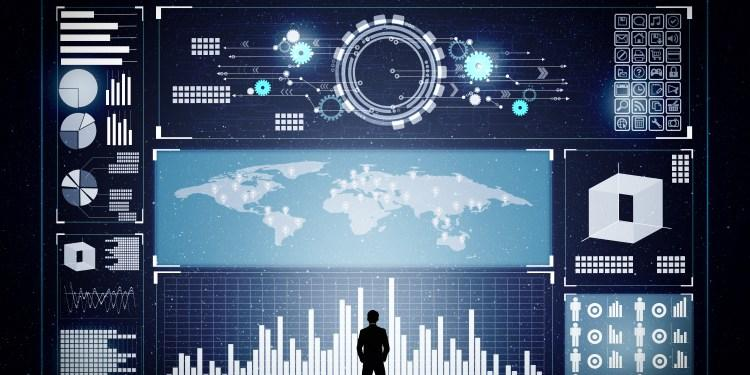

## Table of Contents

## What is data analytics?

Data analytics is the process of looking at data to find useful information. People use special tools and methods to study the data and see patterns or trends. This helps businesses and organizations make better decisions. For example, a store might use data analytics to see what products are popular and when people buy them.

There are different types of data analytics, like descriptive, which tells you what happened in the past, and predictive, which tries to guess what might happen in the future. Each type helps in different ways. By using data analytics, companies can understand their customers better, improve their services, and even save money. It's like solving a puzzle with numbers and facts to make smart choices.

## Why is data analytics important for businesses?

Data analytics is important for businesses because it helps them make better decisions. By looking at data, businesses can see what their customers like and don't like. This can help them make products that people want to buy. For example, if a store sees that many people are buying blue shirts, they might decide to sell more blue shirts. This way, they can make more money and keep their customers happy.

Also, data analytics can help businesses save money and work better. If a company finds out that they are spending too much on something they don't need, they can stop doing that. It can also help them see if there are any problems in how they work. For instance, if data shows that it takes too long to deliver products, the company can find ways to make it faster. This makes the business run smoother and saves them money in the long run.

In short, data analytics is like a tool that helps businesses understand their world better. It tells them what's working and what's not, so they can make smart choices. This can lead to more customers, more sales, and a stronger business overall.

## What are the different types of data analytics?

There are four main types of data analytics: descriptive, diagnostic, predictive, and prescriptive. Descriptive analytics is the simplest type. It looks at data to tell you what happened in the past. For example, it can show how many people visited a website last month. Diagnostic analytics goes a step further. It tries to understand why something happened. If fewer people visited the website, diagnostic analytics might help find out if there was a problem with the site.

Predictive analytics uses data to guess what might happen in the future. It uses math and models to make these guesses. For example, it might predict how many people will visit the website next month. Prescriptive analytics is the most advanced type. It not only predicts what will happen but also suggests what to do about it. If predictive analytics says fewer people will visit the website, prescriptive analytics might suggest ways to bring more visitors, like running ads or improving the site.

These types of data analytics help businesses in different ways. Descriptive and diagnostic analytics help understand the past and present, while predictive and prescriptive analytics help plan for the future. By using all these types, businesses can make better decisions and improve their performance.

## What are the common tools used in data analytics?

Common tools used in data analytics include software like Microsoft Excel, which many people use because it's easy and they already know how to use it. Excel can help sort data, make charts, and do simple calculations. Another popular tool is Tableau, which is great for making fancy graphs and dashboards. It's easy to use and helps people see their data in a clear way. For more advanced work, many data analysts use programming languages like Python and R. These languages let you do complex math and build models to predict things.

Other tools include SQL, which is used to manage and query databases. It's very important for pulling out the right data from big collections. There's also SAS, which is used a lot in big companies and can handle very large sets of data. For businesses that want to see their data in real-time, tools like Google Analytics are useful. It's free and helps track how people use a website. All these tools help data analysts do their job better, from organizing data to making predictions and sharing results.

## How does data analytics differ from data science?

Data analytics and data science are related but different. Data analytics is like looking at data to find out what happened and why. It uses tools to sort through data, make charts, and see patterns. For example, a store might use data analytics to see which products sell the best and at what times. It's about understanding the past and present to make better decisions.

Data science is a bit more complicated. It not only looks at what happened but also tries to predict what will happen in the future and suggest what to do about it. Data scientists use math, coding, and special models to make these predictions. They might use data to guess how many people will buy a new product or to find new ways to improve a business. Data science includes data analytics but goes beyond it by using more advanced techniques and broader goals.

## What are the steps involved in a data analytics project?

Starting a data analytics project usually begins with asking a clear question or setting a goal. What do you want to find out? Once you know this, you gather the data you need. This could be from databases, surveys, or other sources. It's important to make sure the data is good and clean, meaning it's correct and complete. After collecting and cleaning the data, you analyze it. This means using tools and methods to look for patterns, trends, or answers to your question. You might use software like Excel or more advanced tools like Python to do this.

Once you've analyzed the data, the next step is to make sense of what you found. This is called interpreting the results. You look at the patterns and trends you found and think about what they mean for your question or goal. After interpreting, you share your findings. This could be in a report, a presentation, or a dashboard. The idea is to tell others what you learned in a clear way. Finally, you use what you learned to make decisions or take action. Maybe you change how you do things at work, or you make new plans based on what the data told you.

## What are some basic statistical concepts used in data analytics?

In data analytics, some basic statistical concepts include mean, median, and mode. The mean is just the average of a set of numbers. You add them all up and divide by how many there are. The median is the middle number when you line them up from smallest to biggest. If there's an even number of values, you take the average of the two middle ones. The mode is the number that shows up the most. These three measures help you understand the center of your data.

Another important concept is the range, which tells you how spread out the data is. It's the difference between the biggest and smallest numbers. Standard deviation is also used to measure how spread out the numbers are, but it's a bit more complex. It shows how much the numbers differ from the mean. If the standard deviation is small, the numbers are close to the mean. If it's big, they're more spread out. Understanding these concepts helps you make sense of the data and see patterns or trends.

## How can data visualization enhance data analytics?

Data visualization makes data analytics easier to understand. When you use pictures, charts, and graphs to show data, it's easier to see patterns and trends. For example, a line graph can show how sales change over time, and a pie chart can show what part of your customers like different products. This way, people can understand the data quickly without reading long reports.

Also, data visualization helps people share what they found with others. If you have a colorful chart or an interactive dashboard, it's easier to explain your findings to your team or to bosses. This can help everyone make better decisions because they can see the data clearly. In short, data visualization turns numbers into pictures, making data analytics more useful and easier to use.

## What are predictive analytics and how are they applied?

Predictive analytics is a type of data analytics that uses data to guess what will happen in the future. It's like looking at the weather data to predict if it will rain tomorrow. People use math and special computer models to make these guesses. They look at past data to find patterns and use those patterns to predict what might happen next. For example, a store might use predictive analytics to guess how many people will buy a new toy during the holiday season.

Businesses use predictive analytics in many ways. They can predict how much of a product they need to make or buy, so they don't run out or have too much left over. They can also guess which customers might leave and try to keep them happy. For example, a phone company might use predictive analytics to see which customers are likely to switch to another company, and then offer them a special deal to stay. By using predictive analytics, businesses can make better plans and save money, because they know what to expect in the future.

## What ethical considerations should be taken into account in data analytics?

When doing data analytics, it's important to think about ethics. One big thing is privacy. People's information should be kept safe and not shared without permission. If someone's data is used, they should know about it and agree to it. Also, data should be used in a fair way. This means not using data to treat people differently or unfairly, like charging them more for something just because of where they live or what they look like.

Another thing to consider is being honest with the data. It's wrong to change the data or only show part of it to make things look better or worse than they really are. This can trick people and lead to bad decisions. Also, data analysts should think about how their work might affect people. For example, if a company uses data to decide who gets a job or a loan, they need to make sure it's done in a way that is fair to everyone. By keeping these ethical ideas in mind, data analytics can be used in a way that helps everyone and doesn't harm anyone.

## How can machine learning be integrated into data analytics?

Machine learning can make data analytics even better by helping to find patterns and make predictions that might be hard for people to see. It's like teaching a computer to learn from data, so it can do things like guess what customers will buy next or find out which emails are spam. In data analytics, [machine learning](/wiki/machine-learning) can be used to sort through huge amounts of data quickly and find important information. For example, a store might use machine learning to look at what people buy and then suggest other products they might like.

To use machine learning in data analytics, you first need to gather and clean the data, just like in regular data analytics. Then, you choose a machine learning model that fits your goal, like predicting sales or finding patterns in customer behavior. You train this model with your data, which means you let the computer learn from it. Once the model is trained, you can use it to make predictions or find new insights. This way, machine learning helps data analytics go beyond just looking at what happened and start guessing what will happen next.

## What advanced techniques can be used to handle big data in analytics?

When dealing with big data in analytics, one advanced technique is using distributed computing systems like Apache Hadoop. These systems break down large data sets into smaller pieces and process them on different computers at the same time. This makes it faster to analyze huge amounts of data that would take too long on just one computer. Another technique is using NoSQL databases, which are good for storing and managing big data that doesn't fit well in regular databases. NoSQL databases can handle different types of data and grow easily as more data comes in.

Another important technique is data streaming, which lets you analyze data as it comes in, instead of waiting for it all to be collected. Tools like Apache Kafka help with this by moving data quickly from where it's made to where it's analyzed. Machine learning also plays a big role in handling big data. Techniques like [deep learning](/wiki/deep-learning) can find patterns in large, complex data sets that would be hard for people to see. By using these advanced techniques, businesses can make sense of big data and use it to make better decisions.

## References & Further Reading

[1]: Lopez de Prado, M. (2018). ["Advances in Financial Machine Learning"](https://www.amazon.com/Advances-Financial-Machine-Learning-Marcos/dp/1119482089). John Wiley & Sons.

[2]: Aronson, D. (2006). ["Evidence-Based Technical Analysis: Applying the Scientific Method and Statistical Inference to Trading Signals"](https://www.amazon.com/Evidence-Based-Technical-Analysis-Scientific-Statistical/dp/0470008741). John Wiley & Sons.

[3]: Jansen, S. (2020). ["Machine Learning for Algorithmic Trading"](https://github.com/stefan-jansen/machine-learning-for-trading). Packt Publishing.

[4]: Chan, E. P. (2009). ["Quantitative Trading: How to Build Your Own Algorithmic Trading Business"](https://github.com/ftvision/quant_trading_echan_book). John Wiley & Sons.

[5]: Kissell, R. (2013). ["The Science of Algorithmic Trading and Portfolio Management"](https://www.sciencedirect.com/book/9780124016897/the-science-of-algorithmic-trading-and-portfolio-management). Academic Press.

[6]: Narang, R. K. (2013). ["Inside the Black Box: A Simple Guide to Quantitative and High Frequency Trading"](https://onlinelibrary.wiley.com/doi/book/10.1002/9781118662717). John Wiley & Sons.

[7]: Aldridge, I. (2013). ["High-Frequency Trading: A Practical Guide to Algorithmic Strategies and Trading Systems"](https://www.amazon.com/High-Frequency-Trading-Practical-Algorithmic-Strategies/dp/1118343506). John Wiley & Sons.