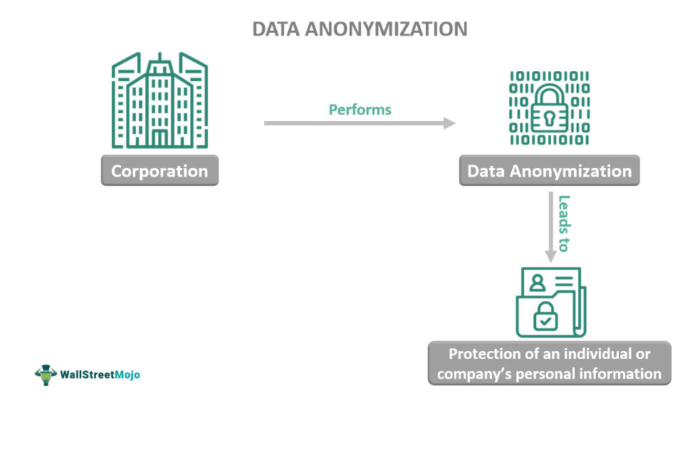

## Table of Contents

## What is data anonymization?

Data anonymization is the process of removing or changing personal information from data so that people cannot be identified. This is important for protecting privacy when sharing or using data. For example, if a hospital wants to share patient data for research, they might remove names, addresses, and other details that could identify patients.

There are different ways to anonymize data. One way is to remove identifying details completely. Another way is to change the data a bit, like rounding ages or using general locations instead of exact addresses. It's important to do this carefully because if not done right, someone might still be able to figure out who the data is about.

## Why is data anonymization important?

Data anonymization is important because it helps keep people's information private. When companies or organizations share data for things like research or business, they need to make sure no one can find out who the data is about. If they don't anonymize the data, someone might use it to learn private things about people, like their health or where they live. This could be harmful or upsetting for those people.

Anonymizing data also helps follow the rules about privacy. Many places have laws that say companies must protect people's personal information. By anonymizing data, companies can share it without breaking these laws. This means they can use the data to learn new things or make better decisions, but they do it in a way that keeps everyone's privacy safe.

## What are the common techniques used for data anonymization?

One common technique for data anonymization is called data masking. This means changing or hiding parts of the data so that people can't tell who it's about. For example, if you have a list of names and addresses, you might replace the names with fake ones or just use the first letter of each name. This way, the data can still be used for things like research, but no one can find out who the real people are.

Another technique is called generalization. This involves making the data less specific. Instead of saying someone is 34 years old, you might just say they are in their 30s. Or instead of saying someone lives at a certain street address, you might just say they live in a certain city. This makes it harder to figure out who the data is about because there are more people who fit the same description.

A third technique is called suppression. This means removing certain pieces of information completely. If a dataset has names, ages, and addresses, you might take out the names and addresses, leaving just the ages. This way, the data is still useful for some purposes, but it's much harder to identify the people it's about. Each of these techniques helps keep data private while still allowing it to be used in helpful ways.

## How does data anonymization protect privacy?

Data anonymization protects privacy by making sure that personal information is not easily connected to real people. When data is shared or used for things like research, names, addresses, and other details that could identify someone are removed or changed. This means that even if someone looks at the data, they can't tell who it's about. For example, if a hospital shares data about patients, they might take out the names and exact ages, so no one can figure out which patient the data belongs to.

By doing this, data anonymization helps follow privacy laws that say personal information must be protected. Companies and organizations can use the data to learn new things or make better decisions without worrying about breaking these laws. This way, the data is still useful, but it's also safe. If the data wasn't anonymized, someone might use it to learn private things about people, which could be harmful or upsetting.

## What is the difference between anonymization and pseudonymization?

Anonymization and pseudonymization are two ways to protect personal data, but they work a bit differently. Anonymization means changing or removing personal details so that no one can tell who the data is about. For example, if a hospital shares patient data, they might remove names and exact ages. Once data is anonymized, it's very hard to link it back to the original person, making it safe to share or use for research.

Pseudonymization, on the other hand, replaces personal information with fake names or codes, but keeps a way to link it back to the real person if needed. For example, a company might replace real names with numbers, but they keep a secret list that shows which number belongs to which person. This means the data can be used without revealing who it's about, but if there's a good reason, like a legal request, the real identity can still be found. So, pseudonymization offers some privacy protection, but it's not as strong as anonymization because the link to the real person still exists.

## Can anonymized data be re-identified? If so, how?

Yes, sometimes people can figure out who the data is about even if it's been anonymized. This is called re-identification. It can happen if the person trying to find out has other information that can be matched with the anonymized data. For example, if the data says someone is 34 years old and lives in a small town, and there's only one 34-year-old in that town, someone might be able to guess who it is.

Re-identification can also happen if the data has a lot of details that, when put together, can point to a specific person. For example, if the data includes someone's job, age, and a rare medical condition, someone with access to other databases might be able to match these details and figure out who it is. That's why it's important to be very careful when anonymizing data to make sure it's really hard to re-identify people.

## What are the legal requirements for data anonymization in different regions?

In the European Union, the General Data Protection Regulation (GDPR) says that personal data must be protected. If companies want to use or share data, they need to make sure it's anonymized so no one can find out who it's about. The GDPR says that if data is really anonymized, it's not considered personal data anymore, and the rules don't apply to it. But if the data can still be linked back to a person, even a little bit, it's not fully anonymized and needs to be protected.

In the United States, there isn't one big law like the GDPR for all of the country. Instead, there are different rules for different kinds of data. For example, the Health Insurance Portability and Accountability Act (HIPAA) says that health data must be protected. If health data is shared, it needs to be anonymized so no one can tell who the patient is. Other laws, like the California Consumer Privacy Act (CCPA), also talk about protecting personal information, but they might not use the word "anonymization" directly. Companies need to follow these laws to make sure they're not breaking any rules about privacy.

In other places around the world, like Canada and Australia, there are also laws about protecting personal data. In Canada, the Personal Information Protection and Electronic Documents Act (PIPEDA) says that companies must keep personal information safe. If they want to use or share data, they need to make sure it's anonymized. In Australia, the Privacy Act says the same thing. Each country might have different rules, but the main idea is the same: personal data needs to be protected, and anonymization is a way to do that.

## How does data anonymization impact data utility?

Data anonymization can make data less useful because it changes or removes important details. When you take out names, exact ages, or addresses, the data might not be as good for some kinds of research or analysis. For example, if a company wants to study how people in different age groups use their products, rounding ages to the nearest ten might make it hard to see the differences between, say, a 29-year-old and a 31-year-old. So, the more you anonymize the data, the less specific and detailed it becomes, which can make it harder to get clear answers from it.

On the other hand, there are ways to anonymize data that keep it useful. Techniques like generalization and data masking can still give you good information if done carefully. For example, if you replace exact addresses with general locations like cities, you can still study trends across different areas without revealing who lives where. The key is finding a balance between keeping data private and making sure it's still helpful for the work you want to do. If you can do that, data anonymization can protect privacy without losing too much of the data's value.

## What are the challenges faced in implementing data anonymization?

One big challenge in implementing data anonymization is keeping the data useful while making sure it's private. When you change or remove details to protect people's identities, the data can become less specific and harder to use for research or analysis. For example, if you round ages or use general locations instead of exact ones, it might be tough to see important patterns or differences. This means you have to find a good balance between privacy and usefulness, which can be tricky.

Another challenge is the risk of re-identification. Even if data is anonymized, someone might still be able to figure out who it's about if they have other information that can be matched with it. This is more likely to happen if the data has a lot of details or if it's about people in small groups. So, you have to be very careful and smart about how you anonymize the data to make sure it's really hard for anyone to link it back to real people.

Lastly, following the different laws and rules about data privacy can be hard. Each place might have its own rules about what counts as anonymized data and how it should be protected. For example, the GDPR in Europe has strict rules about personal data, and companies need to make sure they're following these rules when they anonymize data. This means they have to understand and keep up with different laws, which can be a lot of work.

## What advanced techniques exist for data anonymization?

One advanced technique for data anonymization is called differential privacy. This method adds a little bit of randomness to the data so that it's hard to tell who the data is about. Imagine you're counting how many people like a certain kind of ice cream. With differential privacy, you might add or subtract a small number to the count so no one can figure out if a specific person likes that ice cream. This way, the overall data is still useful, but individual privacy is protected.

Another advanced technique is synthetic data generation. This means creating fake data that looks like the real data but doesn't have any real people's information in it. For example, a company might use a computer program to make up fake names, ages, and addresses that match the patterns in their real data. This fake data can be used for research or testing without worrying about privacy because it's not linked to real people. Both of these techniques help keep data private while still letting people use it for important work.

## How can the effectiveness of data anonymization be measured?

The effectiveness of data anonymization can be measured by seeing how hard it is to figure out who the data is about. One way to do this is by trying to re-identify the data. If someone can't link the data back to real people even with a lot of other information, then the anonymization is working well. Another way is to use special tests and tools that check how much personal information is still in the data. These tools can tell if the data is private enough or if more work needs to be done to protect it.

Another important thing to look at is how useful the data still is after it's been anonymized. If the data is too changed or has too much taken out, it might not be good for research or other work. So, you need to find a balance where the data is private but still helpful. This can be measured by seeing if the data can still answer the questions people need it to answer. If it can, then the anonymization is effective because it keeps both privacy and usefulness in mind.

## What future trends are expected in the field of data anonymization?

In the future, data anonymization is likely to get even better thanks to new technology. One big trend will be using [artificial intelligence](/wiki/ai-artificial-intelligence) and [machine learning](/wiki/machine-learning) to make anonymization smarter. These tools can figure out the best ways to change data so it stays private but still useful. They can also keep learning and getting better at keeping data safe. Another trend will be using more synthetic data. This means making up fake data that looks real but doesn't have any personal information in it. This way, people can use the data for things like research without worrying about privacy.

Another important trend will be making sure data anonymization follows new laws and rules about privacy. As more places make strict laws like the GDPR in Europe, companies will need to find better ways to anonymize data to stay legal. This might mean using new techniques or tools that can prove the data is really private. At the same time, people will want to make sure the data is still useful for important work. So, finding the right balance between privacy and usefulness will be a big focus in the future of data anonymization.

## References & Further Reading

[1]: Narayanan, A., Shmatikov, V. (2008). ["Robust De-anonymization of Large Sparse Datasets."](https://ieeexplore.ieee.org/document/4531148) Proceedings of the 29th IEEE Symposium on Security and Privacy.

[2]: Dwork, C., Roth, A. (2014). ["The Algorithmic Foundations of Differential Privacy."](https://dl.acm.org/doi/10.1561/0400000042) Foundations and Trends® in Theoretical Computer Science, 9(3-4), 211-407.

[3]: Gentry, C. (2009). ["Fully Homomorphic Encryption Using Ideal Lattices."](https://www.cs.cmu.edu/~odonnell/hits09/gentry-homomorphic-encryption.pdf) Proceedings of the 41st Annual ACM Symposium on Theory of Computing.

[4]: Zarsky, T. Z. (2016). ["Incompatible: The GDPR in the Age of Big Data."](https://papers.ssrn.com/sol3/papers.cfm?abstract_id=3022646) International Data Privacy Law, 6(1), 10-16.

[5]: Aggarwal, C. C., Yu, P. S. (2008). ["A General Survey of Privacy-Preserving Data Mining Models and Algorithms."](https://link.springer.com/chapter/10.1007/978-0-387-70992-5_2) Privacy-Preserving Data Mining: Models and Algorithms, Springer, 11-52.

[6]: Lacoste-Julien, S., Jaggi, M., Schmidt, M., Pletscher, P. A. (2013). ["Block-Coordinate Frank-Wolfe Optimization for Structural SVMs."](https://arxiv.org/abs/1207.4747) Advances in Neural Information Processing Systems 26.