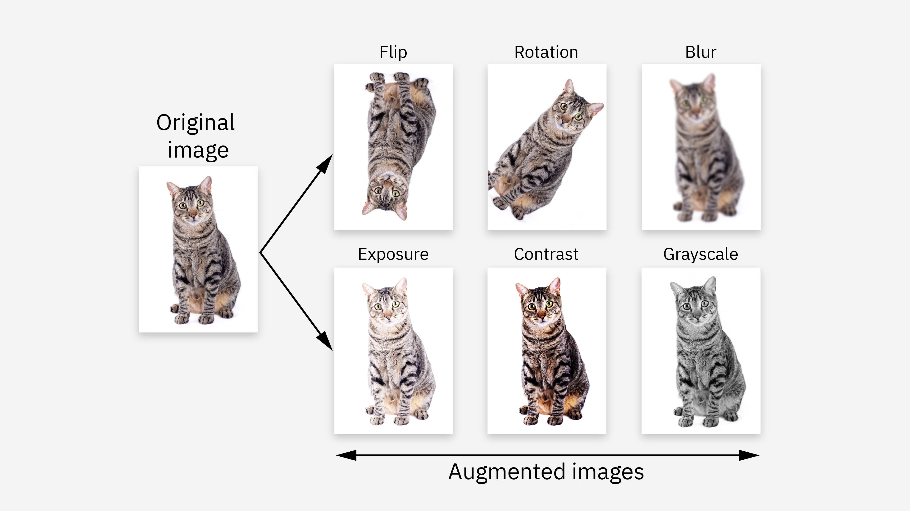

## Table of Contents

## What is data augmentation?

Data augmentation is a technique used to increase the amount of data available for training machine learning models. It works by creating new, modified versions of existing data, which helps the model learn better and perform more accurately. For example, in image recognition, data augmentation might involve rotating, flipping, or cropping images to create new training examples.

This method is especially useful when you don't have a lot of data to start with. By adding more variety to the training data, data augmentation helps the model generalize better, meaning it can handle new, unseen data more effectively. This is important because real-world data can be unpredictable, and a well-trained model needs to be able to adapt to different situations.

## Why is data augmentation important in machine learning?

Data augmentation is important in machine learning because it helps make models better by giving them more data to learn from. When you don't have a lot of data, it can be hard for a model to learn everything it needs to know. By using data augmentation, you can create new examples from the data you already have. This means the model can see more different situations and learn how to handle them, which makes it smarter and more accurate.

Another reason [data augmentation](/wiki/data-augmentation) is important is that it helps models work better with new data they haven't seen before. Real-world data can be very different and unpredictable. If a model only learns from a small set of data, it might not know what to do when it sees something new. But if you use data augmentation to show the model many different versions of the data, it can learn to recognize patterns and adapt to new situations more easily. This makes the model more reliable and useful in real life.

## What are some common data augmentation techniques for images?

Data augmentation for images involves changing pictures in different ways to make new ones for training. Some common ways to do this are rotating the images, flipping them horizontally or vertically, and zooming in or out. These changes help the model learn from different angles and sizes of the same thing, making it better at recognizing objects no matter how they are shown.

Another set of techniques includes changing the brightness, contrast, or color of the images. By making the images lighter or darker, or adjusting the colors, the model can learn to recognize objects under different lighting conditions or in different environments. This is important because the same object can look very different in different light or settings.

Lastly, you can also add noise to the images or apply blurring effects. Adding noise makes the image look grainy, which can help the model learn to ignore small imperfections. Blurring the image can help the model focus on the overall shape and features of an object rather than small details. All these techniques together make the model more flexible and better at handling new images it hasn't seen before.

## How does data augmentation help in preventing overfitting?

Data augmentation helps prevent overfitting by giving the model more different kinds of data to learn from. When a model only sees a small set of data over and over, it can start to memorize that data instead of learning general patterns. This is called overfitting, and it makes the model bad at handling new data. But with data augmentation, you can make new versions of your data, like rotating or flipping images. This shows the model many different ways the same thing can look, so it learns to recognize the important patterns instead of just memorizing the exact images it has seen.

By using data augmentation, the model gets to practice with a wider variety of examples. This makes it better at understanding what's really important in the data, like the shape of an object in an image, rather than focusing on small details that might not matter. When the model sees many different versions of the same thing, it learns to be more flexible and can handle new, unseen data better. This is why data augmentation is a good way to keep the model from overfitting and make it more useful in the real world.

## Can data augmentation be applied to other types of data besides images?

Yes, data augmentation can be used with other types of data, not just images. For example, with text data, you can create new sentences by changing words to their synonyms, shuffling the order of words, or adding small variations. This helps language models learn to understand and generate text better, even if they see slightly different words or sentences.

For audio data, you can apply techniques like changing the speed or pitch of the sound, adding background noise, or mixing different sounds together. These changes help models recognize speech or other sounds under different conditions, like in a noisy environment or when someone is speaking faster or slower than usual. By using data augmentation on different types of data, models can become more versatile and accurate in real-world situations.

## What are the potential drawbacks of using data augmentation?

Data augmentation can make models better, but it can also cause problems. One issue is that if you change the data too much, the model might learn the wrong things. For example, if you flip images too much, the model might think that things like numbers or letters can be read backwards, which is not true. This can confuse the model and make it less accurate when it sees real data.

Another problem is that data augmentation takes more time and computer power. Creating new versions of your data means you need more space to store them and more time to process them. If you don't have a lot of resources, this can be a big challenge. It's important to balance the benefits of using data augmentation with the extra work it requires.

## How can you implement data augmentation in a machine learning pipeline?

To implement data augmentation in a [machine learning](/wiki/machine-learning) pipeline, you first need to decide what kinds of changes you want to make to your data. For images, you might choose to rotate, flip, or change the brightness. For text, you might swap out words or change the order of sentences. Once you've decided, you can use special tools or write your own code to apply these changes. Many machine learning libraries, like TensorFlow or PyTorch, have built-in functions that make it easy to do this. You just tell the library what changes you want, and it will create new versions of your data automatically.

After you've added data augmentation to your pipeline, you need to make sure it fits well with the rest of your training process. This means you'll need to adjust your training code to handle the new, augmented data. You might need to change how you load the data into your model, or how you keep track of the results. It's important to test your pipeline to make sure the augmentation is helping and not hurting your model's performance. If you see that the model is getting better at handling new data, then you know you've done a good job with data augmentation.

## What are advanced data augmentation techniques for text data?

Advanced data augmentation techniques for text data go beyond simple changes like swapping words or changing their order. One technique is called back-translation, where you take a sentence in one language, translate it into another language, and then translate it back to the original language. This can create new sentences that mean the same thing but use different words. Another technique is called paraphrasing, where you use a model to rewrite a sentence in a different way. This helps the model learn how to understand and generate text in many different styles.

Another advanced method is called text noising, where you add small errors or changes to the text to make it more varied. For example, you might add typos, misspellings, or even remove some words to see if the model can still understand the main idea. This can help the model be more robust and handle real-world text better. These techniques make the model better at understanding and generating text by showing it many different ways to say the same thing, which is important for tasks like language translation or text generation.

## How do you measure the effectiveness of data augmentation?

To measure how well data augmentation works, you need to look at how your model performs before and after you use it. You can do this by checking the model's accuracy, which means seeing how often it gets the right answer. If the model is better at guessing correctly after you use data augmentation, then it's working. Another way to measure is by looking at how well the model can handle new data it hasn't seen before. If the model is better at understanding new things after using data augmentation, then it's a good sign that the technique is helping.

You can also use something called cross-validation to test the effectiveness of data augmentation. This means you split your data into different parts and train the model on some parts while testing it on others. If the model performs better on the test parts after using data augmentation, then it's working well. It's important to try different kinds of data augmentation and see which ones help the most. By doing all these checks, you can figure out if data augmentation is making your model smarter and more useful.

## What are the ethical considerations when using data augmentation?

When using data augmentation, it's important to think about ethical issues. One big thing to consider is privacy. If you're using real people's data, like photos or voice recordings, you need to be careful not to share or change them in a way that could harm or embarrass someone. It's important to make sure you have permission to use the data and to use it in a way that respects people's privacy.

Another ethical issue is fairness. Data augmentation can sometimes make models biased if the new data you create doesn't represent everyone equally. For example, if you only use images of certain types of people when you're augmenting data, the model might not work well for other groups. It's important to make sure that the data you use and the changes you make are fair and don't leave anyone out. By thinking about these ethical issues, you can use data augmentation in a way that is good for everyone.

## How can data augmentation be used in transfer learning scenarios?

Data augmentation can help a lot when you're using transfer learning. Transfer learning is when you take a model that's already been trained on one thing and use it to learn something new. Sometimes, you don't have a lot of new data to train the model on. That's where data augmentation comes in. By creating new versions of your new data, like flipping or rotating images, you can give the model more to learn from. This helps the model understand the new task better because it gets to see the new data in different ways.

When you're using transfer learning, it's important to make sure the data augmentation you use fits well with the new task. For example, if you're trying to recognize different kinds of animals, you might want to use augmentations that change the size or angle of the animals in the pictures. This helps the model learn to recognize animals no matter how they look. By using data augmentation wisely, you can make your transfer learning model more accurate and useful for the new job it's learning to do.

## What are the latest research trends in data augmentation?

The latest research in data augmentation is focusing on making it smarter and more automatic. Scientists are working on ways to use [artificial intelligence](/wiki/ai-artificial-intelligence) to choose the best kinds of data augmentation for different tasks. This means the computer can decide what changes to make to the data, like rotating images or changing words in text, without people having to tell it what to do. This is important because it can make data augmentation easier and more effective, especially when you have a lot of different kinds of data to work with.

Another trend is using data augmentation to make models more fair and less biased. Researchers are trying to make sure that the new data created by augmentation represents everyone equally. For example, if you're using images of people, you want to make sure the augmented images include people from different backgrounds and not just one group. This can help make sure that the models work well for everyone and don't leave anyone out. These trends show that data augmentation is becoming more advanced and important in making machine learning models better and fairer.

## What are Data Augmentation Techniques for Time Series in Financial Markets?

Time series data in financial markets possess unique challenges when it comes to data augmentation, largely due to their inherent sequential nature and complex temporal dependencies. However, this also presents opportunities for creating a variety of synthetic datasets that can be used to improve [algorithmic trading](/wiki/algorithmic-trading) models. Several techniques have been adapted and developed specifically for time series data, each aiming to simulate realistic market conditions and introduce variability that can enhance trading models.

### 1. Shifting

Shifting involves modifying the time series data by sliding it forward or backward along the time axis. This can be used to generate new datasets with temporal displacements, allowing models to learn from varying starting points. The mathematical operation for shifting a time series $X(t)$ by $\delta$ time units can be represented as:

$$
X'(t) = X(t + \delta)
$$

where $\delta$ can be positive or negative depending on the direction of the shift. Care must be taken to handle boundary conditions appropriately.

### 2. Stretching

Stretching alters the timescale of the data, effectively compressing or expanding the series. This is akin to changing the speed at which the data is observed, allowing the model to generalize over different time resolutions. In practice, stretching can be achieved by linearly interpolating or resampling the data points. For example, if we have a time series $X(t)$ and a stretching [factor](/wiki/factor-investing) $\alpha$, the transformed series can be expressed as:

$$
X'(t) = X(\alpha t)
$$

This operation requires careful attention to avoid introducing artificial patterns not present in the original data.

### 3. Adding Noise

Introducing stochastic variations by adding noise is another straightforward yet effective augmentation technique. Noise addition helps models become robust to minor fluctuations and external shocks typical of financial markets. Gaussian noise, often characterized by a mean $\mu$ of zero and a standard deviation $\sigma$, is commonly used. The augmented series is given by:

$$
X'(t) = X(t) + \epsilon(t)
$$

where $\epsilon(t) \sim \mathcal{N}(0, \sigma^2)$ is the noise term. The magnitude and nature of the noise should be carefully calibrated to not distort the underlying signal excessively.

### 4. Low-Pass Filters

Applying low-pass filters smooths the time series, effectively reducing high-frequency variations that might be considered noise. This technique preserves long-term trends, making it valuable for models focused on macro-level patterns rather than high-frequency anomalies. A typical low-pass filter works by convolving the time series with a kernel that suppresses rapid changes:

$$
X'(t) = \int X(\tau) \cdot h(t - \tau) \, d\tau
$$

where $h$ is the filter function that diminishes high-frequency components.

### Implementation in Python

Implementing these techniques can be efficiently achieved using Python libraries such as NumPy and SciPy. Here’s a simple code snippet to illustrate noise addition to a time series:

```python
import numpy as np

def add_noise(time_series, noise_level=0.01):
    noise = np.random.normal(0, noise_level, len(time_series))
    augmented_series = time_series + noise
    return augmented_series

# Example usage
original_data = np.array([1, 2, 3, 4, 5])  # Sample time series data
augmented_data = add_noise(original_data, noise_level=0.05)
```

These techniques underscore the potential for data augmentation to significantly bolster algo trading strategies. By increasing the diversity of training datasets, traders and data scientists can develop models that are more robust to the nuances and unpredictabilities of financial markets.

## References & Further Reading

[1]: ["Advances in Financial Machine Learning"](https://www.amazon.com/Advances-Financial-Machine-Learning-Marcos/dp/1119482089) by Marcos Lopez de Prado

[2]: ["Evidence-Based Technical Analysis: Applying the Scientific Method and Statistical Inference to Trading Signals"](https://www.wiley.com/en-gb/Evidence+Based+Technical+Analysis:+Applying+the+Scientific+Method+and+Statistical+Inference+to+Trading+Signals-p-9780470008744) by David Aronson

[3]: ["Machine Learning for Algorithmic Trading"](https://www.amazon.com/Machine-Learning-Algorithmic-Trading-intelligence/dp/9918608013) by Stefan Jansen

[4]: ["Quantitative Trading: How to Build Your Own Algorithmic Trading Business"](https://www.amazon.com/Quantitative-Trading-Build-Algorithmic-Business/dp/0470284889) by Ernest P. Chan

[5]: Zhang, Y., & Zohren, S. (2018). ["Deep Learning for Statistical Arbitrage: A Study on LOB Data."](https://arxiv.org/abs/1810.09965)

[6]: Goodfellow, I., Bengio, Y., & Courville, A. (2016). ["Deep Learning."](https://www.deeplearningbook.org/). MIT Press. 

[7]: Brownlees, C., Engle, R. F., & Kelly, B. T. (2011). ["A Practical Guide to Volatility Forecasting through Calm and Storm."](https://papers.ssrn.com/sol3/papers.cfm?abstract_id=1502915) 
