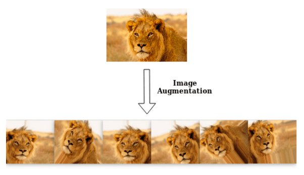

In the world of artificial intelligence, the term Data Augmentation is essential. If you're in the algorithmic trading business, or intend to be, it's an essential part of your jargon. But what is Data Augmentation? How is it applied, and why is it so crucial, particularly in quantitative trading? Let's tackle these questions together.

# Data Augmentation: definition and key concepts

Data Augmentation refers to the process of increasing the quantity and diversity of data used to drive a model. How does it work? By adding slightly modified copies of existing data. These modifications can include rotations, zooms, offsets, or other slight transformations, depending on the type of data.

Why is this so important?

1. **Filling the data gap**: In many cases, it is difficult to obtain sufficient data for training. Augmenting existing data offers a solution.
2. **Improve model performance**: More data usually means better model generalization, which translates into better performance.
3. **Prevention of overfitting**: When a model is overfitted to a specific training set, its performance on new data can decrease. A greater diversity of training data can help mitigate this problem.

# Data Augmentation in algorithmic trading

Finance, as a field, has always been at the forefront of adopting new technologies. Artificial intelligence and, by extension, Data Augmentation, are no exception. Here's how it fits into the algorithmic trading landscape:

1. **Historical data augmentation**: Financial data is often sequenced over time. Using Data Augmentation, we can "create" new sequences based on historical periods, offering more examples for training.
2. **Generalization across markets**: By slightly modifying the data for one market, it is possible to train a model to operate across several markets with similar characteristics.
3. **Improved robustness**: The market is volatile and subject to many external factors. By training a model on augmented data, it is better prepared to deal with unexpected scenarios.

Here are some common methods of data augmentation in trading:

- **Random noise**: Adding slight random noise to time series can simulate natural market volatility.
- **Time-warping**: Stretching or compressing sequences to simulate market accelerations or slowdowns.
- **Mixup**: Combine features from two different sequences to create a new sequence.

Before using them, here are a few important points to bear in mind:

- **Representivity**: Any data added must be representative of market reality.
- **Do not over-augment**: Too much modification can render data irrelevant or even detrimental to training.
- **Adaptability**: The market is constantly evolving. Augmentation techniques must be reviewed and adapted accordingly.

# Conclusion

Data Augmentation is a powerful tool for any AI practitioner, and is all the more relevant in the complex and dynamic field of algorithmic trading. By understanding and effectively using this technique, traders can improve the robustness, accuracy and performance of their models, setting them up for success in the ever-changing world of algorithmic finance.

💡 **Read more:**

- Trading strategies papers with code on [Equities](https://wiki.paperswithbacktest.com/trading-strategies/equities), [Cryptocurrencies](https://wiki.paperswithbacktest.com/trading-strategies/cryptocurrencies), [Commodities](https://wiki.paperswithbacktest.com/trading-strategies/commodities), [Currencies](https://wiki.paperswithbacktest.com/trading-strategies/currencies), [Bonds](https://wiki.paperswithbacktest.com/trading-strategies/bonds), [Options](https://wiki.paperswithbacktest.com/trading-strategies/options)
- [A curated list](https://github.com/paperswithbacktest/awesome-systematic-trading) of awesome libraries, packages, strategies, books, blogs, and tutorials for systematic trading
- [A bunch of datasets](https://huggingface.co/paperswithbacktest) for quantitative trading
- [A website to help you](https://paperswithbacktest.com/) become a quant trader and achieve financial independence