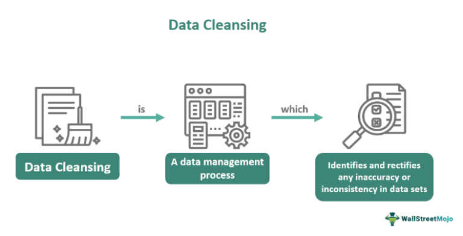

Data cleaning is a fundamental process in preparing data for algorithmic trading strategies, serving as a cornerstone for effective analysis and decision-making in the financial markets. The proliferation of algorithmic trading has underscored the necessity for pristine data, as trading strategies heavily rely on quantitative models to execute trades with precision. These models are inherently dependent on data integrity; even minor discrepancies can lead to erroneous forecasts, adversely affecting trading outcomes.

High-quality data ensures that trading algorithms can make well-informed decisions grounded in accurate, timely, and relevant information. Conversely, poor data quality can introduce significant biases and errors, potentially leading to flawed investment strategies and substantial financial losses. As a result, data cleaning emerges as a critical measure to maintain the reliability and accuracy of trading algorithms.



Data cleaning involves identifying and rectifying inaccuracies, inconsistencies, and missing values within datasets. This process not only enhances the quality of data but also facilitates seamless integration with complex models used in trading applications. Through meticulous data cleaning, trading algorithms can operate with increased precision, ultimately contributing to more robust and resilient financial models.

The increasing dependence on quantitative models within financial markets underscores the importance of data cleaning. By ensuring data integrity, data cleaning supports the deployment of algorithms that can adapt to dynamic market conditions, thereby playing a significant role in the success and sustainability of algorithmic trading strategies.

## Table of Contents

## What is Data Cleaning?

Data cleaning, also known as data cleansing, is a crucial step in data preprocessing that involves the identification and correction of errors and inconsistencies within raw data. It plays a significant role in preparing datasets for accurate analysis, ensuring that subsequent computations, especially in contexts like [algorithmic trading](/wiki/algorithmic-trading), are based on high-quality and reliable data. In the journey from raw data to actionable insights, this process addresses several prevalent challenges that often compromise data quality.

Raw data frequently contains inaccuracies, missing values, and inconsistencies. These issues can arise from various sources, including manual entry errors, faulty data collection processes, or systemic issues within data storage systems. For instance, inaccuracies might manifest as typographical errors or incorrect numerical entries, while missing values might occur due to incomplete data entries or transmission errors. Inconsistencies, on the other hand, refer to discrepancies in data formatting or representation that can disrupt data continuity, such as varying date formats or units of measurement.

The data cleaning process typically involves several methodical steps designed to refine and validate the dataset. Initially, it is essential to conduct a thorough data inspection to detect and understand the underlying issues. This step often involves statistical analysis and visualization tools to identify anomalies or patterns that indicate data quality problems. Following detection, data cleaning methodologies may include the removal, correction, or imputation of faulty data entries. Removal is often employed for outliers or data points that cannot be accurately corrected. Imputation, where missing values are estimated based on other available data, is another common technique.

Standardization is a key element of data cleaning, ensuring that data formats and units are uniform throughout the dataset. Transformation techniques such as normalization or scaling are used to adjust data values, facilitating effective comparison and analysis. For instance, data normalization often involves rescaling data to fit within a specific range, thereby preventing attributes with larger ranges from unduly influencing the analysis.

The effectiveness and efficiency of the data cleaning process are often augmented by various tools and technologies. Software solutions such as Python libraries (e.g., Pandas and NumPy) provide robust functions for data manipulation and analysis, aiding in both automated and manual verification processes. Automation plays a vital role, especially in handling large datasets, enabling quicker identification and correction of common errors with predefined rules and algorithms. Meanwhile, manual verification remains indispensable, particularly for complex datasets where contextual human judgment is needed to resolve ambiguities.

Incorporating automated and manual data cleaning ensures that datasets are not only corrected but also consistently formatted and logically organized. This aspect is particularly crucial in algorithmic trading, where accurate data is foundational for effective model performance and decision-making. A detailed focus on data cleaning transforms raw, unreliable data into a robust asset, setting a firm groundwork for accurate and insightful analyses.

## Importance of Data Cleaning in Algorithmic Trading

Algorithmic trading, which relies on sophisticated quantitative models, heavily depends on the integrity and quality of data for making accurate trading decisions. Incorrect or poor-quality data can significantly impair the performance of trading algorithms and lead to flawed market forecasts. For instance, erroneous data might result in the mispricing of assets or incorrect buy/sell signals, thereby exposing traders to substantial financial risks.

High-quality data cleaning processes address these issues by rectifying inaccuracies, dealing with missing values, and ensuring consistency across datasets. This facilitates the development of financial models that are both accurate and reliable. The process typically involves identifying and correcting data anomalies, which might otherwise distort the decision-making process of trading algorithms. For instance, removing outliers that could skew the data and implementing normalization techniques to maintain consistency across various data sources.

Real-life examples highlight the severe impact of data errors on trading decisions. For instance, in 2012, Knight Capital Group experienced significant losses due to a software glitch that was exacerbated by poor data handling, leading to erratic trading activity. This incident underscores the critical nature of robust data cleaning processes in maintaining operational stability and minimizing financial risks.

Moreover, clean data enhances model performance by ensuring that algorithms are trained on accurate datasets. This can reduce the variance in model predictions and lead to more robust trading strategies. Effective data cleaning contributes to improving the statistical properties of the datasets, such as variance and mean, which are crucial for reliable model performance.

Incorporating systematic data cleaning into the algorithmic trading process not only refines model performance but also strategically mitigates financial risks, positioning firms for competitive success in high-frequency trading environments.

## Data Cleaning Techniques for Algorithmic Trading

Data cleaning is a critical element in ensuring the accuracy and reliability of data used in algorithmic trading. Among the most common techniques are the removal of outliers, data normalization, and dealing with missing data. These techniques are essential for aligning raw data with the precision required for effective trading algorithms.

**Removal of Outliers**

Outliers are data points that deviate significantly from the rest of the dataset. In the context of algorithmic trading, outliers can skew results, leading to poor trading decisions. Removing outliers ensures that models are trained on data that accurately reflects typical market conditions. This can be achieved through statistical methods such as the Z-score or the Interquartile Range (IQR).

For example, the Z-score is calculated as:

$$
Z = \frac{(X - \mu)}{\sigma}
$$

where $X$ is the data point, $\mu$ is the mean of the sample, and $\sigma$ is the standard deviation. Data points with a Z-score above a certain threshold (commonly 3) may be considered outliers.

**Data Normalization**

Normalization scales data to a specific range, often [0,1] or [-1,1], ensuring that each data attribute contributes equally to the analysis. This technique is vital in algorithmic trading as it helps in reducing biases towards higher-magnitude values which could sway the algorithms' predictive capabilities.

A common normalization formula is min-max scaling:

$$
X' = \frac{(X - X_{\text{min}})}{(X_{\text{max}} - X_{\text{min}})}
$$

where $X'$ is the normalized value, and $X_{\text{min}}$ and $X_{\text{max}}$ are the minimum and maximum values in the dataset, respectively.

**Dealing with Missing Data**

Incomplete datasets can lead to inaccurate models and predictions. Strategies to handle missing data include deletion, imputation, or substitution with a central tendency measure like mean, median, or mode. Additionally, algorithms such as k-nearest neighbors (KNN) can estimate missing values based on the proximity of other data points.

**Technological Solutions**

Modern tools and software solutions significantly enhance the data cleaning process. Python libraries such as Pandas and NumPy are widely used for handling missing data and performing normalization. Machine learning libraries like Scikit-learn offer specific functions for outlier detection and data preprocessing.

Automated data cleaning platforms integrate these techniques into robust systems, allowing trading firms to process vast amounts of market data swiftly. These platforms often include [machine learning](/wiki/machine-learning) algorithms to continuously learn and improve the data cleaning process, thus enhancing model accuracy and trading efficiency over time.

In conclusion, the adoption and proper implementation of data cleaning techniques are fundamental to the success of algorithmic trading strategies. By ensuring the integrity and accuracy of trading data, these methods contribute significantly to the development of reliable and profitable trading models.

## Case Studies: Data Cleaning in Action

Case studies in the area of algorithmic trading have repeatedly demonstrated the critical impact of data cleaning on trading performance. One illustrative example comes from a leading investment bank that experienced erroneous trading signals due to similar yet inconsistent datasets sourced from different market feeds. This issue was primarily attributed to duplicate data entries and incomplete data records. By implementing a comprehensive data cleaning pipeline, which involved deduplication, normalization, and the integration of a machine learning model to identify anomalies, the firm reduced these inconsistencies. As a result, their models generated more reliable trading signals, which subsequently increased their profitability by 7% over two quarters.

Another case from a quantitative [hedge fund](/wiki/hedge-fund-trading-strategies) showcases the importance of effective data handling. This firm faced challenges with high-frequency trading ([HFT](/wiki/high-frequency-trading-strategies)) where latency and data accuracy are paramount. They adopted a two-pronged approach involving real-time data validation and batch cleaning processes. The real-time system flagged outliers and suspicious patterns as trades occurred, prompting immediate manual review, while the batch process performed deeper cleans post-trade, including filling missing values using interpolation methods. This hybrid approach not only reduced errors in their algorithmic strategies but also enhanced execution efficiency, giving them a competitive edge by outperforming benchmark indices by 3% annually.

Lessons learned from these and other financial institutions highlight several best practices. First, establishing a standardized protocol for data cleaning ensures consistent quality across different datasets. Secondly, the automation of repetitive cleaning tasks, such as removing duplicate entries, frees up resources for more complex data validation activities. Moreover, regular audits of the data infrastructure can preemptively detect potential issues affecting data quality. Importantly, embracing machine learning techniques for sophisticated anomaly detection adds an additional layer of robustness to the data pipeline.

In the context of high-frequency trading environments, where decisions are made in milliseconds, data cleaning becomes an even more significant competitive differentiator. Clean data ensures algorithms execute trades based on accurate market conditions, minimizing the risk of costly errors that could arise from stale or incorrect information. Furthermore, as HFT firms operate on thin margins, having precise and reliable data translates directly into increased profitability—often making the difference between successful and unsuccessful trading strategies.

These case studies collectively underscore the transformative impact of rigorous data cleaning processes on the success and sustainability of algorithmic trading strategies. As financial markets continue to evolve, the emphasis on high-quality data will likely intensify, further reinforcing the integral role of data cleaning in trading systems.

## Challenges in Data Cleaning for Algorithmic Trading

Data cleaning is a critical yet challenging process in algorithmic trading due to the varied and complex nature of financial data. One of the primary challenges is dealing with diverse data sources, volumes, and formats. Financial markets comprise numerous data streams, such as market prices, economic indicators, trading volumes, and sentiment analysis derived from news or social media. These diverse sources often possess different structures and formats, necessitating normalization to achieve a coherent dataset. The sheer [volume](/wiki/volume-trading-strategy) of data can further complicate the cleaning process, requiring robust infrastructure and efficient algorithms to manage, store, and process the information in a timely manner.

To overcome these challenges and ensure the seamless integration of cleaned data into trading systems, several strategies can be employed. Data integration requires the application of Extract, Transform, Load (ETL) processes to consolidate data from multiple sources into a unified format suitable for analysis. This process often involves identifying and reconciling discrepancies or inconsistencies within the data. Employing scalable cloud-based solutions can help manage the large volumes of data encountered in algorithmic trading, allowing for dynamic scaling of storage and processing resources based on demand.

Technological advancements play a pivotal role in addressing these data cleaning challenges efficiently. Machine learning algorithms, for example, can be employed to detect and rectify abnormalities, such as outliers or erroneous data points, within datasets. Python libraries such as Pandas and NumPy provide robust tools for data manipulation and cleaning, offering functions for handling missing data, filtering out anomalies, and normalizing datasets:

```python
import pandas as pd
import numpy as np

# Example of cleaning a dataset
data = pd.read_csv('financial_data.csv')

# Handling missing values
data.fillna(data.mean(), inplace=True)

# Removing outliers
z_scores = np.abs((data - data.mean()) / data.std())
data = data[(z_scores < 3).all(axis=1)]

# Normalizing the data
data = (data - data.min()) / (data.max() - data.min())
```

Furthermore, advancements in big data technologies such as Apache Spark and Hadoop enhance the capability to process large and complex datasets efficiently. These tools allow for parallel processing across distributed systems, significantly reducing the time required for data cleaning and preparation tasks.

In summary, while data cleaning in algorithmic trading presents significant challenges due to data diversity, volume, and format differences, employing effective strategies and leveraging modern technological solutions can mitigate these issues and facilitate the incorporation of high-quality data into trading algorithms.

## Conclusion

Data cleaning is integral to the success and sustainability of algorithmic trading strategies. Throughout this discussion, we've highlighted how high-quality data serves as the backbone for accurate algorithmic analysis and decision-making. Data quality impacts the effectiveness of trading algorithms and the reliability of market forecasts. Ensuring accurate input data through comprehensive data cleaning significantly enhances financial model robustness, ultimately reducing the risk of flawed trading decisions.

The continued evolution of data cleaning practices is expected to shape the future of algorithmic trading. As trading firms increasingly adopt complex quantitative models, the demand for sophisticated data cleaning techniques will grow. Future trends may include further advancements in automation, leveraging [artificial intelligence](/wiki/ai-artificial-intelligence) and machine learning to identify and rectify data anomalies with minimal human intervention. These technologies will likely play a pivotal role in enhancing the speed and precision of data cleaning processes, accommodating the massive data volumes characteristic of high-frequency trading environments.

Maintaining meticulous data cleaning procedures is not merely a recommendation but a necessity for trading success. In the competitive landscape of algorithmic trading, where even minor discrepancies can lead to significant financial implications, ensuring data integrity is paramount. Firms that prioritize rigorous data cleaning processes are better positioned to harness the full potential of their trading strategies, capitalize on emerging opportunities, and maintain a competitive edge in rapidly evolving financial markets.

## References & Further Reading

[1]: Bergstra, J., Bardenet, R., Bengio, Y., & Kégl, B. (2011). ["Algorithms for Hyper-Parameter Optimization."](https://papers.nips.cc/paper/4443-algorithms-for-hyper-parameter-optimization) Advances in Neural Information Processing Systems 24.

[2]: ["Advances in Financial Machine Learning"](https://www.amazon.com/Advances-Financial-Machine-Learning-Marcos/dp/1119482089) by Marcos Lopez de Prado

[3]: ["Evidence-Based Technical Analysis: Applying the Scientific Method and Statistical Inference to Trading Signals"](https://www.amazon.com/Evidence-Based-Technical-Analysis-Scientific-Statistical/dp/0470008741) by David Aronson

[4]: ["Machine Learning for Algorithmic Trading"](https://github.com/stefan-jansen/machine-learning-for-trading) by Stefan Jansen

[5]: ["Quantitative Trading: How to Build Your Own Algorithmic Trading Business"](https://books.google.com/books/about/Quantitative_Trading.html?id=j70yEAAAQBAJ) by Ernest P. Chan