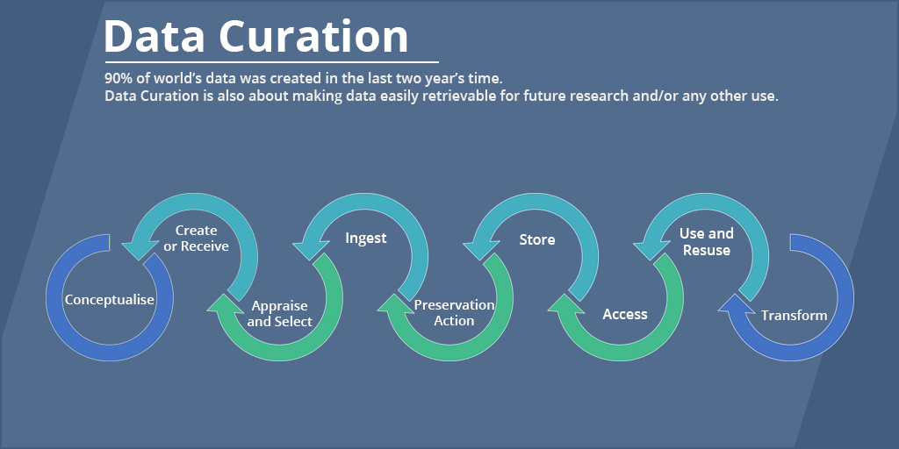

## Table of Contents

## What is data curation and why is it important?

Data curation is the process of collecting, organizing, and maintaining data so that it can be used and shared effectively. It involves cleaning up the data, making sure it is accurate, and adding descriptions or tags so that others can find and understand it easily. Think of it like taking care of a library: you need to make sure the books are in good condition, properly labeled, and easy to find.

Data curation is important because it helps people trust and use the data better. When data is well-organized and accurate, scientists, businesses, and others can make better decisions based on it. It also makes it easier to share data with others, which can lead to new discoveries and innovations. Without good data curation, important information might be lost or misunderstood, which can slow down progress and lead to mistakes.

## What are the main steps involved in the data curation process?

The first part of data curation is collecting the data. This means finding and gathering all the information you need from different places. Once you have the data, you need to organize it. This means putting it into a system where it makes sense, like sorting files into folders. You also need to clean the data, which means fixing any mistakes or removing information that is not correct or useful.

After the data is organized and cleaned, the next step is to add descriptions or tags to it. This helps others understand what the data is about and how to use it. You might also need to keep the data safe and up to date, which means checking it regularly and making sure it is stored properly. This whole process makes sure the data is ready for people to use and share.

The final part of data curation is making the data accessible and usable. This can involve creating ways for people to find the data easily, like search tools or databases. It's also important to think about who can use the data and how it should be shared. By following these steps, data curation helps make sure that the data is valuable and useful to everyone who needs it.

## How does data curation differ from data management?

Data curation and data management are related but different. Data curation focuses on making data useful and easy to understand. It involves collecting, cleaning, organizing, and adding descriptions to the data. Think of data curation like preparing a meal: you gather the ingredients, make sure they are fresh, and present the dish nicely so others can enjoy it. The goal is to make sure the data is accurate, reliable, and ready for people to use and share.

Data management, on the other hand, is more about handling and storing data throughout its life. It includes tasks like backing up data, making sure it is secure, and deciding how long to keep it. Data management is like keeping a house tidy: you need to organize your things, make sure they are safe, and decide what to keep and what to throw away. While data curation is about improving the quality and usability of data, data management is about the overall care and organization of data over time.

## What tools and technologies are commonly used in data curation?

Data curation often uses special software and tools to help organize and clean data. Some popular tools include Microsoft Excel for basic data cleaning and organization, and more advanced tools like OpenRefine for handling larger datasets and fixing errors. There are also special databases like DSpace and Fedora Commons that help manage and share curated data. These tools make it easier to sort, clean, and describe data so it is ready for others to use.

Another important part of data curation is using metadata standards and tools. Metadata is like a label that describes what the data is about. Tools like Dublin Core and Metadata Object Description Schema (MODS) help create these labels in a standard way, making it easier for others to find and understand the data. Some curators also use programming languages like Python or R to automate parts of the curation process, especially when dealing with large amounts of data. These technologies help make data curation more efficient and effective.

## How can data curation improve the quality and reliability of data?

Data curation helps make data better and more reliable by cleaning it up and organizing it. When you curate data, you check for mistakes and fix them. You might find numbers that are wrong or information that is missing, and you fix these problems. By doing this, you make sure the data is accurate. Organizing the data also helps because it makes it easier to find and use. When data is well-organized, people can trust it more because they can see that it has been taken care of carefully.

Another way data curation improves data quality is by adding descriptions or tags. These descriptions help people understand what the data is about and how to use it. When data has good descriptions, it is less likely to be misunderstood or used in the wrong way. This makes the data more reliable because people can trust that they are using it correctly. Overall, data curation makes data more useful and trustworthy by ensuring it is accurate, well-organized, and clearly described.

## What are the challenges faced in data curation, particularly with large datasets?

Data curation with large datasets can be really hard because there is so much information to handle. When you have a lot of data, it can be tough to find all the mistakes and fix them. It's like trying to clean a huge messy room all by yourself. You might miss some spots or get tired before you finish. Also, organizing big datasets takes a lot of time and effort. You need to make sure everything is in the right place, which can be overwhelming.

Another challenge is keeping the data up to date. With large datasets, new information comes in all the time, and you need to add it to what you already have. This means you have to keep going back to make sure everything is still correct and useful. It's like trying to keep a very big garden tidy; new plants keep growing, and you have to take care of them all. Plus, when you work with a lot of data, you need special tools and computers that can handle it all, which can be expensive and hard to use.

## How does data curation support data sharing and reuse in research?

Data curation helps with sharing and reusing data in research by making the data easy to find and understand. When researchers curate their data, they clean it up and add descriptions, which makes it clear what the data is about and how to use it. This is important because other researchers can then use the data for their own studies. If the data is well-organized and described, it's like having a map that shows the way to valuable information. This can lead to new discoveries because different researchers can build on each other's work.

Another way data curation supports research is by making sure the data stays useful over time. When data is curated, it is checked regularly to make sure it is still accurate and up to date. This means that even years later, other researchers can still use the data with confidence. It's like keeping a library well-maintained so that future generations can still find and use the books. By curating data, researchers help create a shared resource that can be used again and again, making research more efficient and collaborative.

## What role does metadata play in data curation?

Metadata is like a label that helps explain what the data is about. In data curation, metadata is really important because it makes the data easier to find and understand. When you add metadata, you are telling people what the data is, where it came from, and how they can use it. This is like putting a title and summary on a book so that someone can quickly know what it's about without reading the whole thing.

By using metadata, data curation makes data more useful and shareable. When data has good metadata, other people can find it more easily, like using a search engine. They can also trust the data more because they know where it came from and what it means. This is really helpful in research because it lets scientists build on each other's work. Metadata turns a big pile of data into something organized and valuable for everyone to use.

## How can organizations implement effective data curation strategies?

Organizations can start implementing effective data curation strategies by first setting clear goals for what they want to achieve with their data. They need to decide what kind of data they need, how it will be used, and who will be using it. This helps them focus their efforts on the most important data. They should also create a plan for how to collect, clean, and organize the data. This might involve using special software and tools to make the process easier and more efficient. It's important for everyone in the organization to understand the plan and their role in it, so good communication is key.

Another important step is to make sure the data is kept safe and up to date. Organizations should have rules about who can access the data and how it should be stored. Regular checks should be done to fix any mistakes and add new information. Using metadata, which is like a label that describes the data, can also help make the data easier to find and understand. By following these steps, organizations can make sure their data is accurate, reliable, and useful for everyone who needs it.

## What are the ethical considerations in data curation, especially with sensitive data?

When curating data, especially sensitive data, it's important to think about ethics. Sensitive data can include personal information like health records or financial details. Organizations need to make sure they protect this data and keep it private. They should only collect the data they really need and be clear with people about how it will be used. It's also important to get permission from people before using their data and to give them the chance to say no if they want to.

Another ethical consideration is fairness. Data curation should not harm or unfairly affect any groups of people. For example, if data is used to make decisions about who gets a job or a loan, it should be checked to make sure it's not biased. Organizations should also think about how their data curation practices might affect different communities and try to be as fair as possible. By being careful and thoughtful, organizations can use data in a way that respects people's rights and promotes fairness.

## How does data curation contribute to data preservation and long-term accessibility?

Data curation helps keep data safe and easy to use for a long time. When data is curated, it is cleaned up and organized, which makes it easier to store and protect. Think of it like putting your important papers in a safe place and making sure they are in good order. By doing this, organizations can make sure that the data stays useful even after many years. They can also add descriptions, called metadata, to help people find the data later on. This is important for things like research, where old data might still be useful for new studies.

Another way data curation helps with long-term access is by making sure the data stays up to date. Curators check the data regularly to fix any mistakes and add new information. This means that even as time goes by, the data remains accurate and relevant. By keeping the data well-maintained, organizations ensure that future generations can still use it. This is like taking care of a library so that the books are always ready for someone to read, no matter how much time has passed.

## What advanced techniques can be applied in data curation for enhancing data interoperability?

Advanced techniques in data curation can help make data work well with different systems and tools. One way to do this is by using common standards and formats. For example, if everyone uses the same way to label data, like using the same metadata standards, it's easier for different systems to understand and use the data. Another technique is using something called Application Programming Interfaces (APIs). APIs let different software talk to each other, so data can move smoothly from one place to another. This makes it easier for people to use the data in different ways, no matter what tools they are using.

Another important technique is data transformation and mapping. This means changing the data from one format to another so it can be used in different systems. For example, if one system uses dates in the format "MM/DD/YYYY" and another uses "DD-MM-YYYY," data curators can change the dates to match. They can also use tools to map different types of data to a common structure, which helps keep everything organized and easy to understand. By using these advanced techniques, data curation can make sure that data is not only well-organized but also easy to share and use across different platforms and communities.

## What is the relationship between Data Quality and Preprocessing?

In algorithmic trading, data quality plays a vital role in strategy development. High-quality data ensures that trading algorithms can make informed decisions, mitigate risks, and enhance profitability. Data preprocessing is a crucial step in maintaining this quality by transforming raw data into a clean and structured form suitable for analysis and algorithmic processing.

Data preprocessing methodologies encompass various techniques such as data cleaning and normalization. Data cleaning involves identifying and correcting inaccuracies and inconsistencies in datasets. This process can include handling missing values, removing duplicates, and correcting erroneous entries. For instance, in Python, missing data can be addressed using the pandas library with functions like `fillna()` for imputation or `dropna()` to remove incomplete observations.

Normalization is another essential preprocessing technique, ensuring that data from different sources or with varying scales are brought into a uniform range. This process helps prevent biases in algorithmic models caused by disproportionate data values. Normalization can be achieved using min-max scaling, where data is rescaled to fit within a specific range, often between zero and one. The min-max normalization formula is:

$$
X' = \frac{X - X_{\text{min}}}{X_{\text{max}} - X_{\text{min}}}
$$

where $X$ is the original value, $X_{\text{min}}$ and $X_{\text{max}}$ are the minimum and maximum values in the dataset, respectively, and $X'$ is the normalized value.

Despite the importance of data quality, several common pitfalls can compromise data practices. One frequent issue is overfitting, where a model becomes too tailored to the training data, potentially due to preprocessing errors such as improper handling of outliers. To avoid this, it is crucial to incorporate techniques such as cross-validation and ensuring that the preprocessing pipeline does not leak information from the test set into the training set.

Another challenge is the integration of disparate data sources, which can result in inconsistencies and misalignments. Employing integration techniques such as schema mapping and entity resolution can help maintain data coherence. Additionally, automating data validation checks and employing anomaly detection algorithms can proactively identify and rectify potential errors before they impact trading strategies.

By employing these preprocessing methodologies and avoiding common pitfalls, data curators and algorithm developers can maintain the integrity of their data, thereby enhancing the performance and reliability of algorithmic trading strategies.

## References & Further Reading

1. **Hasbrouck, Joel. "Empirical Market Microstructure: The Institutions, Economics, and Econometrics of Securities Trading."** (2007). This book offers insights into the intricate workings of securities trading and algorithmic strategies. It stands as a foundational text in understanding market microstructure and trading algorithms' operational principles.

2. **Aldridge, Irene. "High-Frequency Trading: A Practical Guide to Algorithmic Strategies and Trading Systems."** (2013). Aldridge provides a practical framework for developing and implementing high-frequency trading systems, emphasizing the role of data curation in maintaining system efficacy.

3. **Chan, Ernest P. "Algorithmic Trading: Winning Strategies and Their Rationale."** (2009). This publication outlines various algorithmic trading strategies while emphasizing data preprocessing and quality control—essential components for effective data curation.

4. **Li, Yi; Zheng, He; Liu, Li. "Anomaly Detection in Streams with Extreme Value Theory."** The authors discuss methods for anomaly detection within large datasets, showcasing techniques applicable to financial data streams critical in algorithmic trading.

5. **Bunger, Evan J. "Practical Machine Learning for Data Scientists: Real World Data Curation and Preprocessing."** This industry report provides a comprehensive guide on leveraging machine learning techniques to enhance data curation and preprocessing activities, geared towards data scientists in trading environments.

6. **Kxdb.com.** [Kx Systems - Technology for Algorithmic Trading](https://kx.com/algo-trading-technology/). Kx Systems offers advanced tools and technologies designed to support high-frequency trading and data curation, making it a prominent choice for developing fast data solutions.

7. **Confluent.io.** [Apache Kafka for Real-Time Data.](https://www.confluent.io/what-is-apache-kafka/) Learn about Apache Kafka's capabilities as a distributed event streaming platform that supports real-time data flows, crucial for algorithmic trading systems.

8. **Pandas Documentation.** [Pandas - Python Data Analysis Library.](https://pandas.pydata.org/pandas-docs/stable/) The Pandas library is pivotal in handling structured data efficiently within Python, facilitating essential data curation tasks such as cleaning, normalization, and transformation.

9. **Lo, Andrew W. "The Adaptive Markets Hypothesis: Market Efficiency from an Evolutionary Perspective."** (2017). Lo presents an evolutionary perspective on market dynamics, where data adaptation and curation play a vital role in algorithmic trading success.

10. **Research Papers in Economics (RePEc).** [RePEc Database.](https://repec.org/) Access a comprehensive database of working papers, articles, and software components for in-depth research on economics and finance studies, crucial for developing an algorithmic trading foundation.

These references provide a wealth of information on algorithmic trading and highlight the essential practices and technologies involved in data curation. They are fundamental resources for anyone interested in the intersection of finance, data science, and technology.

