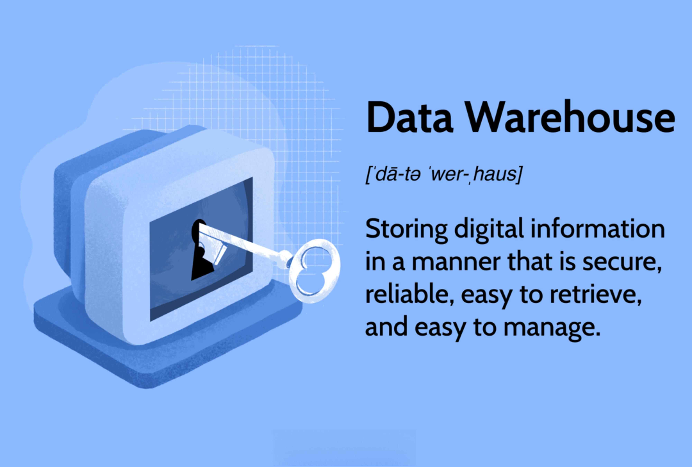

## Table of Contents

## What is a data curator?

A data curator is someone who takes care of data. They make sure the data is correct, organized, and easy to use. This is important because good data helps people make better decisions.

Data curators work in many places like libraries, research centers, and companies. They collect data from different places, check it for mistakes, and keep it safe. They also help others find and use the data they need.

## What are the primary responsibilities of a data curator?

A data curator's main job is to gather and organize data from different sources. They look for data that is useful and relevant to their organization. Once they find the data, they check it to make sure it is correct and complete. They also organize the data in a way that makes it easy for others to find and use. This involves creating clear labels and descriptions so that people can understand what the data is about.

Another important task for a data curator is to keep the data safe and up to date. They set up systems to protect the data from being lost or stolen. They also regularly check the data to see if anything needs to be updated or fixed. Data curators often work with other teams to make sure everyone has the data they need to do their jobs well. By doing these things, data curators help make sure that the data is reliable and useful for everyone in the organization.

## How does data curation differ from data management?

Data curation and data management are related but different jobs. Data curation is like being a caretaker for data. It involves collecting data from different places, checking it to make sure it's correct, and organizing it so it's easy to use. A data curator also keeps the data safe and up to date. Their main goal is to make sure the data is high quality and useful for people who need it.

Data management, on the other hand, is more about the overall handling of data. It includes setting up rules and systems for how data should be stored, shared, and used within an organization. Data managers make sure that everyone follows these rules and that the data systems work smoothly. While data curation focuses on the quality and usability of specific data, data management looks at the bigger picture of how all data is handled in an organization.

## What skills are essential for a data curator?

A data curator needs to be good at finding and collecting data from different places. They should know how to use tools like databases and search engines to gather information. Being able to tell if the data is correct and useful is also important. This means they need to have a sharp eye for detail and be good at checking facts. 

Another key skill for a data curator is organizing data in a way that makes sense. They should be able to create clear labels and descriptions so others can easily find and use the data. This involves understanding how to use metadata and cataloging systems. Good communication skills are also essential because data curators often need to explain their work to others and work with different teams to make sure everyone has the data they need.

## What tools and technologies do data curators commonly use?

Data curators use many tools to do their job well. They often use databases like MySQL or PostgreSQL to store and manage data. These tools help them keep the data organized and easy to find. They also use data collection tools like web scrapers and APIs to gather information from the internet. These tools make it easier to collect large amounts of data quickly.

Another important set of tools for data curators are data cleaning and validation software. Programs like OpenRefine and Trifacta help them check the data for mistakes and fix any errors they find. They also use metadata tools like Dublin Core and XML to add descriptions and labels to the data. This makes it easier for others to understand what the data is about and how to use it.

Lastly, data curators often use data visualization tools like Tableau or Microsoft Power BI. These tools help them show the data in charts and graphs, making it easier for people to see patterns and trends. They might also use collaboration platforms like GitHub or Slack to work with others on data projects. These tools help them share their work and get feedback from their team.

## How does a data curator ensure data quality and integrity?

A data curator makes sure data is good by checking it carefully. They look at the data to see if it is correct and complete. If they find mistakes, they fix them. They also compare the data with other sources to make sure it is right. This helps them know if the data is trustworthy. They use special tools like OpenRefine to clean the data and make it better.

Data curators also keep the data safe and up to date. They set up systems to protect the data from being lost or stolen. They check the data regularly to see if anything needs to be changed or updated. By doing this, they make sure the data stays useful and reliable over time. This helps everyone in the organization use the data to make good decisions.

## What are the typical challenges faced by data curators?

Data curators face many challenges in their work. One big challenge is dealing with a lot of data from different places. It can be hard to find all the data they need and make sure it is all correct. They have to spend a lot of time checking the data to make sure it is good and useful. This can be tiring and take a long time.

Another challenge is keeping the data safe and up to date. Data curators need to protect the data from being lost or stolen. They also need to check the data regularly to see if anything has changed. This means they have to keep working on the data even after they have collected it. It can be hard to keep everything in order and make sure the data stays useful for everyone who needs it.

Working with other people can also be a challenge for data curators. They need to explain their work to others and make sure everyone understands the data. Sometimes, different teams want different things from the data, and it can be hard to make everyone happy. Data curators have to talk to a lot of people and work together to make sure the data is used well.

## How does data curation contribute to research and development?

Data curation helps research and development by making sure the data used is good and useful. Researchers and developers need accurate data to do their work well. Data curators collect data from different places and check it to make sure it is correct. They also organize the data in a way that is easy to find and use. This means that when scientists or developers need data for their projects, they can trust it and use it quickly. This saves time and helps them focus on their research or development work.

Another way data curation helps is by keeping the data safe and up to date. Researchers often need to use old data along with new data to see how things change over time. Data curators make sure that the data is protected from being lost or changed by mistake. They also update the data regularly so it stays useful. This means that researchers and developers can rely on the data they get, which is important for making new discoveries or creating new things. By doing these things, data curators play a big role in helping research and development move forward.

## What are the ethical considerations in data curation?

Data curators need to think about ethics when they work with data. One big thing is keeping people's information private. Data curators have to make sure they don't share personal details without permission. They also need to be careful about how they use the data, making sure it doesn't harm anyone. For example, they should not use data in a way that could make some people feel bad or be treated unfairly.

Another important ethical consideration is being honest and clear about where the data comes from and how it is used. Data curators should always say where they got the data and explain what they are doing with it. This helps people trust the data and the work that is done with it. It's also important for data curators to think about who might be left out of the data. They need to make sure they include everyone and don't just focus on certain groups, so the data is fair and represents everyone.

## How do data curators collaborate with other professionals?

Data curators work with many different people to make sure the data is useful and correct. They often talk to researchers who need data for their projects. The data curators help the researchers find the right data and explain how to use it. They also work with IT teams to set up systems that keep the data safe and easy to access. Sometimes, data curators meet with people from different departments to understand what kind of data everyone needs. This helps them collect and organize the data in a way that helps everyone in the organization.

Working with other professionals can also mean sharing ideas and getting feedback. Data curators might use tools like GitHub or Slack to work with others on data projects. They can share their work and get advice on how to make it better. This teamwork is important because it helps make sure the data is as good as it can be. By working together, data curators and other professionals can use data to make better decisions and do their jobs well.

## What is the role of metadata in data curation?

Metadata is very important in data curation. It is like a label that tells you what the data is about. Data curators use metadata to describe the data they collect. This includes things like where the data came from, when it was collected, and what it means. By adding metadata, data curators make it easier for others to find and understand the data. This helps researchers and other people use the data correctly and quickly.

Metadata also helps keep the data organized and safe. Data curators can use metadata to group similar data together and make sure it is stored in the right place. This makes it easier to manage large amounts of data. Plus, metadata can include information about who is allowed to see the data, which helps protect it from being used in the wrong way. By using metadata well, data curators make sure the data stays useful and trustworthy for everyone who needs it.

## How can organizations optimize their data curation processes?

Organizations can make their data curation better by using tools that help find and collect data easily. They should use software like databases and web scrapers to gather information from different places. It's also important to check the data carefully to make sure it is correct and complete. Using tools like OpenRefine can help fix mistakes and make the data better. By setting up clear rules for how to organize and describe the data, everyone can find and use it more easily.

Another way to improve data curation is by working together as a team. Data curators should talk to researchers and other people in the organization to understand what kind of data they need. This helps them collect the right data and make it useful for everyone. It's also good to use collaboration tools like GitHub or Slack to share ideas and get feedback. By working together and using the right tools, organizations can make their data curation processes faster and more effective.

## References & Further Reading

[1]: Bergstra, J., Bardenet, R., Bengio, Y., & Kégl, B. (2011). ["Algorithms for Hyper-Parameter Optimization."](https://dl.acm.org/doi/10.5555/2986459.2986743) Advances in Neural Information Processing Systems 24.

[2]: ["Advances in Financial Machine Learning"](https://www.amazon.com/Advances-Financial-Machine-Learning-Marcos/dp/1119482089) by Marcos Lopez de Prado

[3]: ["Evidence-Based Technical Analysis: Applying the Scientific Method and Statistical Inference to Trading Signals"](https://www.amazon.com/Evidence-Based-Technical-Analysis-Scientific-Statistical/dp/0470008741) by David Aronson

[4]: ["Machine Learning for Algorithmic Trading"](https://github.com/stefan-jansen/machine-learning-for-trading) by Stefan Jansen

[5]: ["Quantitative Trading: How to Build Your Own Algorithmic Trading Business"](https://books.google.com/books/about/Quantitative_Trading.html?id=j70yEAAAQBAJ) by Ernest P. Chan