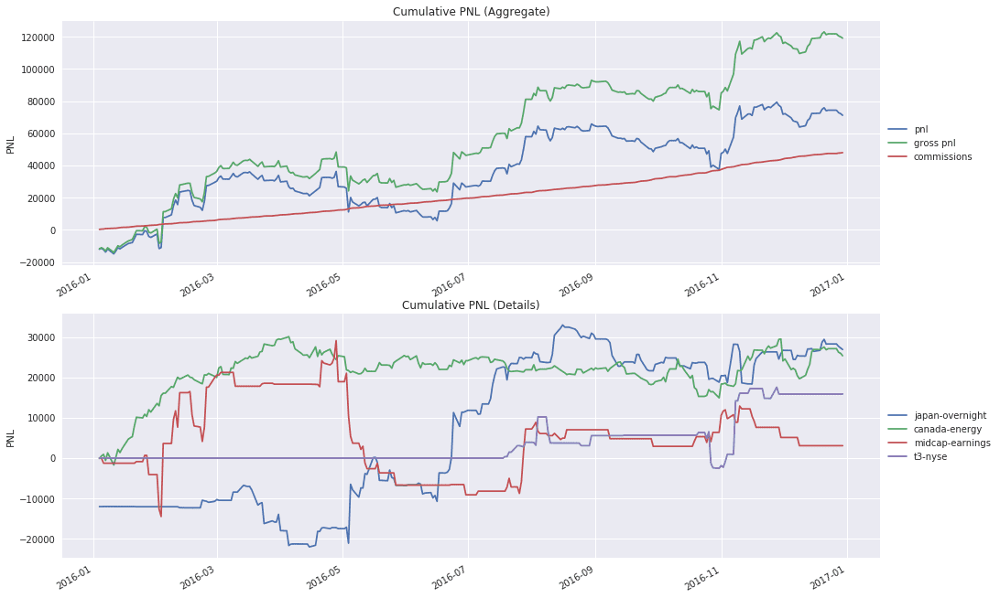

Algorithmic trading, also known as 'algo trading', employs computer algorithms to execute trading strategies based on pre-defined rules. This method involves the use of data-driven trading signals to optimize the buying and selling of financial assets, enabling quicker and more efficient decision-making processes. In recent years, algorithmic trading has gained prominence as financial markets have embraced technological advancements, offering traders a competitive advantage through enhanced precision and speed.

Data-driven trading signals form an integral part of algorithmic trading, providing systematic insights derived from large datasets. These signals assist in identifying favorable trading opportunities by examining market trends, price movements, and various technical indicators. As financial markets become more complex, the role of algorithms in reducing emotion-driven decisions and improving trade execution has become increasingly crucial.



This article examines the landscape of data-driven trading signals within algorithmic trading, looking into the benefits, challenges, strategies, and future trends associated with their use. The integration of data-driven signals has the potential to revolutionize trading by offering more consistent and accurate outcomes. Consequently, traders aiming to maximize their performance must consider leveraging these signals to enhance their trading strategies.

Algorithmic trading has emerged as a powerful tool in the financial markets, where data-driven approaches can potentially outpace traditional, manual methods. With advancements in data analysis, artificial intelligence, and computational power continuing to evolve, the reliance on algorithmic trading is expected to grow, emphasizing the need for traders to combine algorithmic techniques with rigorous strategy development. This article aims to provide a thorough guide on how the integration of data-driven signals can significantly enhance algorithmic trading practices.

## Table of Contents

## Understanding Algorithmic Trading and Data-Driven Signals

Algorithmic trading employs computer programs to facilitate the execution of trade orders based on pre-established rules. These programs are designed to analyze substantial volumes of data, thereby determining optimal trading moments. The integration of data-driven signals plays a crucial role in this process by evaluating market trends, volatility, and other pertinent factors. 

These algorithms typically focus on several key data types. Historical price patterns provide a foundation for understanding how assets have performed over time. This data is vital for establishing trends and projecting future price movements. Technical indicators, such as moving averages and the Relative Strength Index (RSI), offer insights into market momentum and potential reversals. Volume [statistics](/wiki/bayesian-statistics) also play a significant role, as they help traders gauge the strength of a current trend or a potential [breakout](/wiki/breakout-trading).

Data-driven signals significantly enhance the precision and dependability of trading decisions. By processing vast amounts of market data, these signals allow traders to optimize their strategies for better outcomes. For instance, if a historical price pattern suggests a strong resistance level at a certain price point, an algorithm can automatically place a sell order just below this level to capitalize on anticipated price movements. 

Backtesting is a critical component of [algorithmic trading](/wiki/algorithmic-trading), where traders rely on historical data to evaluate the effectiveness of their strategies. This procedure involves simulating a trading strategy on historical data to assess how it might perform under varied market conditions. By employing techniques such as walk-forward optimization, traders aim to ensure that their strategies can adapt to changing market dynamics and maintain effectiveness over time.

In practice, a simple moving average crossover strategy might be implemented in Python as follows:

```python
def moving_average(data, window_size):
    return data.rolling(window=window_size).mean()

def moving_average_crossover_strategy(data, short_window, long_window):
    signals = pd.DataFrame(index=data.index)
    signals['short_mavg'] = moving_average(data['close'], short_window)
    signals['long_mavg'] = moving_average(data['close'], long_window)

    signals['signal'] = 0.0
    signals['signal'][short_window:] = np.where(signals['short_mavg'][short_window:] > signals['long_mavg'][short_window:], 1.0, 0.0)
    signals['positions'] = signals['signal'].diff()

    return signals
```

In the code above, a strategy is implemented where a buy signal is issued when the short-term moving average exceeds the long-term moving average, and a sell signal is triggered when the opposite occurs. This kind of automated decision-making process underscores the advantages of data-driven signals in optimizing trading strategies for improved outcomes.

## Key Components of Algorithmic Trading Strategies

Algorithmic trading strategies rely heavily on three key components: market data analysis, automated trade execution, and risk management mechanisms.

Market Data Analysis is foundational to algorithmic trading, as it requires the examination of extensive datasets to inform trading decisions. This process involves evaluating price movements, trading volumes, and various market indicators. Traders utilize historical and real-time data to identify patterns and trends that might influence future price actions. Data analysis tools and techniques, such as statistical methods and [machine learning](/wiki/machine-learning) models, are often employed to extract valuable insights. For instance, a trader might use a moving average crossover strategy, where the algorithm identifies buy signals when a short-term moving average crosses above a long-term moving average.

Automated Trade Execution follows the identification of potential trading opportunities. Automation is critical because it ensures that trades are executed swiftly and accurately, minimizing human-induced delays and errors. By leveraging pre-programmed algorithms, orders are placed and managed without manual intervention, enabling traders to capitalize on fleeting opportunities in highly dynamic markets. For example, the following Python code snippet demonstrates how a basic algorithm might automatically execute trades within a trading platform using a moving average strategy:

```python
def moving_average(prices, window):
    return sum(prices[-window:]) / window

def trading_strategy(prices, short_window, long_window):
    short_ma = moving_average(prices, short_window)
    long_ma = moving_average(prices, long_window)
    if short_ma > long_ma:
        return "Buy"
    elif short_ma < long_ma:
        return "Sell"
    return "Hold"

prices = [120, 125, 130, 135, 140, 145]
short_window = 2
long_window = 5

decision = trading_strategy(prices, short_window, long_window)
print(decision)
```

Risk Management is integral to maintaining stability and safeguarding against adverse market conditions. Effective risk management strategies use tools such as stop-loss orders and position sizing. Stop-loss orders automatically [exit](/wiki/exit-strategy) positions when prices reach predefined levels, preventing significant losses. Position sizing ensures that no single trade can lead to substantial financial damage by determining the optimal amount of capital allocated to each trade according to the trader's risk tolerance. For instance, a trader may decide to risk only 1-2% of their total portfolio on any given trade, thereby limiting potential losses in volatile markets.

In summary, the synergy of market data analysis, automated trade execution, and stringent risk management forms the backbone of successful algorithmic trading strategies, enabling traders to optimize their performance and mitigate risks.

## Benefits of Data-Driven Algo Trading

Algorithmic trading has significantly transformed the landscape of financial markets, primarily due to its speed, precision, and the systematic approach it employs in executing trades. A key advantage of data-driven algorithmic trading lies in its ability to process and analyze vast sets of market data in real-time, enabling rapid decision-making and execution. This speed and efficiency mean that algorithms can identify and capitalize on even transient market opportunities, an aspect human traders may struggle to achieve due to inherent limitations in processing speed and reaction time.

Another significant benefit is the elimination of emotional bias from trading decisions. Human traders are often susceptible to emotional influences such as fear, greed, or overconfidence, which can negatively impact trading outcomes. By adhering to predefined rules and strategies, algorithmic trading systems mitigate these psychological factors, ensuring that trades are executed based on objective data analysis rather than emotional impulses. This disciplined approach not only enhances trading consistency but also reduces the potential for errors associated with subjective decision-making.

Moreover, data-driven algorithmic trading offers substantial scalability. Unlike manual trading, which is constrained by an individual's capacity to manage and monitor multiple trades, algorithmic systems can simultaneously handle a multitude of trades across different asset classes and markets. This capability is especially advantageous in today's global financial environment, where opportunities can arise in various markets and time zones. By leveraging algorithms, traders can broaden their trading horizons, diversifying their portfolios and accessing a wider range of investment opportunities.

The integration of sophisticated data analysis techniques further amplifies these benefits. Algorithms can incorporate complex mathematical models and statistical analyses to identify patterns and correlations that may not be readily apparent. For example, statistical [arbitrage](/wiki/arbitrage) strategies utilize these capabilities to exploit pricing inefficiencies between correlated securities, enhancing trading profitability.

In summary, data-driven algorithmic trading offers unmatched speed, removes emotional biases, and provides scalability, enabling traders to optimize their strategies and improve execution in a dynamic market environment.

## Common Challenges in Algorithmic Trading

Algorithmic trading, while highly advantageous, is not without its challenges. One of the foremost issues is overfitting. Overfitting occurs when a trading strategy becomes overly optimized for historical data, capturing noise rather than underlying patterns. This results in a model that performs exceptionally well on past data but fails to deliver similar results under new market conditions. For instance, a strategy might be finely tuned to react to specific historical price movements, which may not accurately reflect future market dynamics. To mitigate overfitting, traders often employ techniques such as cross-validation and the use of out-of-sample data testing. These methods help ensure that a model's performance is generalizable to various market scenarios.

Data quality and accuracy are also critical components that directly influence trading decisions. The integrity of the data used to inform algorithmic strategies must be maintained to avoid flawed and potentially costly decisions. Errors in data collection, whether due to latency, missing data points, or erroneous entries, can skew analytical outputs. Maintaining a high-standard data pipeline involves regular audits and employing real-time data validation checks to ensure accuracy. Reliable data sources are paramount, and traders often prefer using established financial data providers with proven track records to procure their information.

Additionally, the robustness of the trading system is crucial to ensure smooth operation. Algorithmic trading systems are susceptible to various technical issues such as software bugs, hardware failures, and network outages. These errors can lead to erroneous trade executions or system downtimes, potentially incurring significant financial losses. Regularly monitoring system performance and instituting rigorous testing protocols can help identify and rectify such issues. Employing fault-tolerant system architectures and establishing failover mechanisms are common practices to enhance system reliability. 

Furthermore, crafting a comprehensive risk management strategy complements robust system design, as it helps in managing potential losses in adverse scenarios, thus establishing a resilient trading framework. Through diligent attention to overfitting, data integrity, and system robustness, traders can better navigate the complexities inherent in algorithmic trading.

## Popular Data-Driven Trading Strategies

Algorithmic trading encompasses various data-driven trading strategies designed to exploit market inefficiencies and trends. Among the most prevalent of these strategies are Trend-Following Strategies, Mean Reversion Strategies, and Statistical Arbitrage.

Trend-Following Strategies operate by identifying and trading along the direction of current market trends. The underlying principle is that asset prices tend to move in sustained trends rather than random patterns. This strategy typically uses technical analysis tools such as moving averages, [momentum](/wiki/momentum) indicators, and breakouts to detect such trends. For instance, when the price of a stock crosses above its moving average, it may signal an upward trend, prompting the algorithm to initiate buy orders. The strategy thrives on strong market trends and requires rigorous [backtesting](/wiki/backtesting) across historical data to affirm its effectiveness in different market conditions.

Mean Reversion Strategies rest on the assumption that asset prices will revert to their long-term average over time. Traders using this strategy identify securities that deviate significantly from their historical average and anticipate a price correction. This approach often utilizes statistical measures such as Bollinger Bands or the Relative Strength Index (RSI) to determine overbought or oversold conditions. For example, if the price of an asset significantly exceeds its average Bollinger Band, a mean reversion strategy might trigger a sell signal, anticipating a downward correction. Such strategies require careful calibration to determine the historical mean and the acceptable deviation range.

Statistical Arbitrage involves identifying and exploiting pricing discrepancies between related securities through mathematical models. The strategy employs statistical techniques and algorithms to identify pairs or baskets of correlated securities that have temporarily diverged from their historical relationship. By simultaneously executing long and short positions in the mispriced securities, traders aim to profit once the prices realign. A common approach is pairs trading, where two historically correlated stocks are monitored for divergence in their price ratio. If one stock underperforms relative to its pair, the strategy would recommend buying the underperforming stock and shorting the outperforming one, anticipating a return to the mean spread.

Python code snippets can be used to implement these strategies effectively. For example, a simple moving average crossover strategy in Python can be framed as follows:

```python
import pandas as pd
import numpy as np

# Sample data extraction
data = pd.read_csv('historical_data.csv')
prices = data['Close']

# Calculate moving averages
short_window = 40
long_window = 100

signals = pd.DataFrame(index=data.index)
signals['short_mavg'] = prices.rolling(window=short_window, min_periods=1, center=False).mean()
signals['long_mavg'] = prices.rolling(window=long_window, min_periods=1, center=False).mean()

# Generate trading signals
signals['signal'] = np.where(signals['short_mavg'] > signals['long_mavg'], 1.0, 0.0)
signals['positions'] = signals['signal'].diff()

print(signals.tail())
```

This script calculates the short-term and long-term moving averages of stock prices and generates buy signals when the short-term average exceeds the long-term average. This example illustrates how technical indicators underpin trend-following strategies in algorithmic trading.

## The Role of Machine Learning in Algo Trading

Machine learning (ML) is revolutionizing algorithmic trading by offering advanced predictive insights through the analysis of large datasets and the identification of complex patterns. This technology enables traders to refine their strategies and enhance trade execution by processing and interpreting vast amounts of financial data, which traditional methods may struggle to handle effectively.

Machine learning's strength in algorithmic trading lies in its ability to uncover hidden patterns and correlations within the data that are not immediately apparent through conventional statistical methods. Techniques such as supervised learning, unsupervised learning, and [reinforcement learning](/wiki/reinforcement-learning) are commonly applied to optimize trading strategies. For instance, supervised learning algorithms, such as decision trees or neural networks, use labeled historical market data to predict future price movements or [volatility](/wiki/volatility-trading-strategies).

The adaptive nature of machine learning is paramount in responding to real-time market conditions. Through techniques like reinforcement learning, algorithms can dynamically adjust their strategies based on the feedback from ongoing trading results. This dynamic adjustment is crucial in financial markets, which are inherently characterized by sudden changes and unforeseen events. Machine learning models can employ various methods, such as gradient descent optimization, to continuously refine parameters during the trading process and optimize performance.

Consider the Python implementation of a simple reinforcement learning algorithm exploiting a Q-Learning framework for stock trading strategy development:

```python
import numpy as np

class QLearningTrader:
    def __init__(self, states, actions, learning_rate=0.1, discount_factor=0.9, epsilon=0.1):
        self.q_table = np.zeros((states, actions))
        self.learning_rate = learning_rate
        self.discount_factor = discount_factor
        self.epsilon = epsilon

    def choose_action(self, state):
        if np.random.rand() < self.epsilon:
            return np.random.randint(self.q_table.shape[1])  # explore
        return np.argmax(self.q_table[state])  # exploit

    def update_q_value(self, state, action, reward, next_state):
        best_next_action = np.argmax(self.q_table[next_state])
        td_target = reward + self.discount_factor * self.q_table[next_state, best_next_action]
        td_error = td_target - self.q_table[state, action]
        self.q_table[state, action] += self.learning_rate * td_error
```

This code snippet illustrates a simple framework for using reinforcement learning where the agent learns to trade by updating a Q-table based on actions taken, rewards received, and states observed. This adaptive learning process allows trading systems to improve over time, reacting to ever-changing market landscapes.

The integration of machine learning within algorithmic trading systems enhances both the predictive capability and adaptivity of trading strategies. As computational power and data accessibility increase, the role of machine learning in trading will continue to expand, providing traders with innovative tools to navigate complex financial environments efficiently.

## Conclusion

Data-driven trading signals have become an indispensable asset in algorithmic trading, fundamentally transforming how trades are executed. By relying on empirical data and computational algorithms, these signals deliver a level of precision and speed that manual trading cannot match. This paradigm shift is largely attributed to significant advancements in data analysis techniques, [artificial intelligence](/wiki/ai-artificial-intelligence), and the unprecedented growth in computational power.

As these advances continue, the landscape of algorithmic trading is set to evolve further. Artificial intelligence, particularly machine learning, plays a critical role by enabling the development of highly adaptive algorithms. These algorithms are capable of processing vast quantities of financial data, identifying complex patterns, and generating actionable trading insights. Predictive analytics, powered by enhanced machine learning models, allows for more accurate forecasts and strategic decision-making.

In the future, successful traders will need to integrate algorithmic automation with meticulous strategy development. This integration is crucial for managing the increasing complexity and [volume](/wiki/volume-trading-strategy) of financial data. An automated trading system not only executes trades with precision but also evaluates real-time data, adapts to shifting market dynamics, and recalibrates strategies as necessary. For instance, consider a simple Python code snippet illustrating a basic moving average crossover strategy:

```python
import pandas as pd
import numpy as np

# Calculate moving averages
def moving_average(data, window):
    return data['Close'].rolling(window=window).mean()

# Simulated trading signal
def generate_signal(data, short_window, long_window):
    data['Short_MA'] = moving_average(data, short_window)
    data['Long_MA'] = moving_average(data, long_window)
    data['Signal'] = 0
    data['Signal'][short_window:] = np.where(data['Short_MA'][short_window:] > data['Long_MA'][short_window:], 1, 0)
    data['Position'] = data['Signal'].diff()
    return data

# Example usage
# data = pd.read_csv('historical_stock_data.csv')
# signals = generate_signal(data, short_window=40, long_window=100)
```

This code showcases a classic strategy where signals are generated based on the crossover of short-term and long-term moving averages. However, in a more sophisticated setup, traders would employ machine learning algorithms to optimize such parameters dynamically, thus enhancing performance.

As technology propels forward, the integration of advanced analytics into everyday trading will become increasingly seamless, enabling traders to exploit fleeting opportunities across global markets effectively. This transformation underscores a pivotal trend: the continuous fusion of advanced algorithmic automation with the rigor of strategic financial insight, poised to redefine the boundaries of trading.

## References & Further Reading

[1]: Lopez de Prado, M. (2018). ["Advances in Financial Machine Learning"](https://books.google.com/books/about/Advances_in_Financial_Machine_Learning.html?id=oU9KDwAAQBAJ). Wiley.

[2]: Aronson, D. R. (2006). ["Evidence-Based Technical Analysis: Applying the Scientific Method and Statistical Inference to Trading Signals"](https://www.amazon.com/Evidence-Based-Technical-Analysis-Scientific-Statistical/dp/0470008741). Wiley.

[3]: Jansen, S. (2020). ["Machine Learning for Algorithmic Trading: Predictive models to extract signals from market and alternative data for systematic trading strategies with Python"](https://github.com/stefan-jansen/machine-learning-for-trading). Packt Publishing.

[4]: Chan, E. P. (2009). ["Quantitative Trading: How to Build Your Own Algorithmic Trading Business"](https://github.com/justinchou/books-quantitative-trading). Wiley.

[5]: Krollner, B., Vanstone, B. J., & Finnie, G. (2010). ["Financial time series forecasting with machine learning techniques: A survey"](https://www.semanticscholar.org/paper/Financial-time-series-forecasting-with-machine-a-Krollner-Vanstone/6772f7ffccc5d320ef6f067c62c8e63083072892). In Proceedings of the 2nd Workshop on Austro-Asian Collaboration in Computer Science (pp. 15-26).