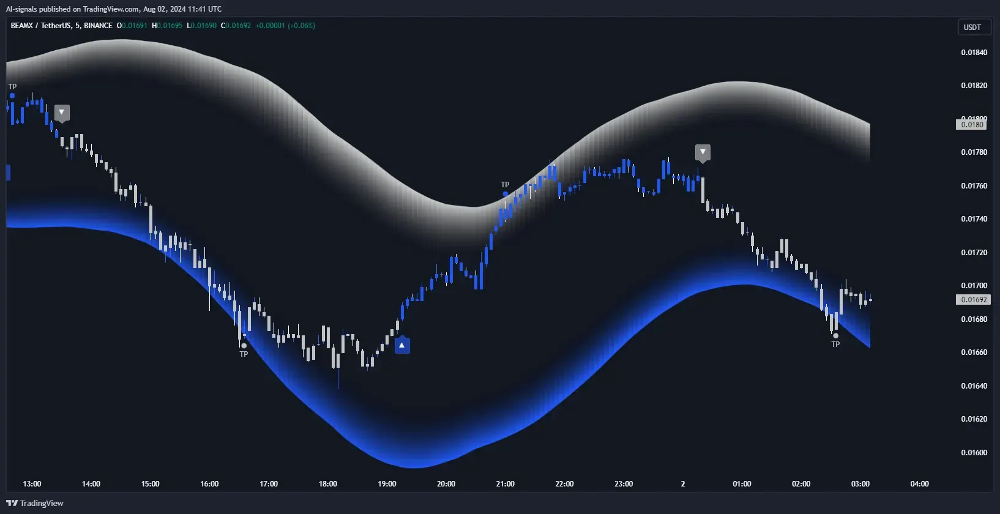

## Table of Contents

## What are data-driven trading signals?

Data-driven trading signals are specific indicators that traders use to make decisions about buying or selling assets. These signals are generated from analyzing large amounts of data, like stock prices, trading volumes, and economic reports. By using computers and special software, traders can find patterns and trends that help them predict what might happen next in the market. This method is popular because it takes the guesswork out of trading and bases decisions on hard data.

These signals can come from many different sources. For example, some signals might be based on technical analysis, which looks at charts and past price movements. Others might use fundamental analysis, which looks at a company's financial health and economic factors. Traders often use a mix of these signals to get a better overall picture of the market. The key is to use reliable data and good analysis tools to make the best possible trading decisions.

## How do data-driven trading signals differ from traditional trading methods?

Data-driven trading signals use computers and lots of data to help traders make choices about buying or selling. They look at things like stock prices, how many shares are traded, and even big reports about the economy. This way, traders can spot patterns and trends that might be hard to see otherwise. It's like using a big, smart tool to guide decisions, making them less about guessing and more about what the numbers say.

On the other hand, traditional trading methods often rely more on a trader's experience and gut feeling. These methods might use simpler charts or just watching the market closely. Traders using these methods might not use as much data or fancy tools. Instead, they might make decisions based on what they've seen work in the past or what they think will happen next. So, while data-driven signals are all about using numbers and technology, traditional methods are more about a trader's own knowledge and instincts.

## What types of data are commonly used to generate trading signals?

To create trading signals, people often use different kinds of data. One common type is price data, which shows how much stocks or other things are worth at different times. This helps traders see patterns and trends in how prices move. Another type is [volume](/wiki/volume-trading-strategy) data, which tells you how many shares or units of something are being bought and sold. This can show how interested people are in a particular stock or asset. Economic indicators, like unemployment rates or GDP growth, are also used because they can affect the whole market.

Besides these, fundamental data about companies is really important too. This includes things like earnings reports, which show how much money a company is making, and balance sheets, which tell you about a company's debts and assets. Traders look at this data to figure out if a company is doing well or not. Technical indicators, like moving averages or the relative strength index (RSI), are also used. These are calculated from price and volume data and help traders predict future price movements based on past patterns.

## Can you explain the basic process of creating a data-driven trading signal?

Creating a data-driven trading signal starts with gathering a lot of data. This data can be about stock prices, how many shares are traded, or even big reports about the economy. Traders use computers and special software to collect this information. Once they have the data, they clean it up to make sure it's accurate and ready to use. This step is important because any mistakes in the data could lead to wrong signals.

After the data is ready, traders use it to find patterns and trends. They might use math formulas or special computer programs to analyze the data. For example, they could look at how prices have moved in the past to predict where they might go next. Once they find a pattern, they create a rule or a signal based on it. If the data shows that a certain thing happens before prices go up, that could be a signal to buy. The final step is to test these signals to see if they work well over time. If they do, traders start using them to make decisions about buying or selling.

## What are some common technical indicators used in data-driven trading?

Technical indicators are tools that traders use to predict how prices might move in the future. Some common ones are moving averages, which help smooth out price data to see trends more clearly. For example, a simple moving average takes the average price of a stock over a certain number of days. Traders often look at the 50-day and 200-day moving averages to see if a stock is in an uptrend or downtrend. Another popular indicator is the Relative Strength Index (RSI), which measures how fast prices are changing to see if a stock is overbought or oversold. If the RSI is over 70, it might mean the stock is overbought and could go down soon. If it's under 30, it might be oversold and could go up.

Other useful indicators include the Moving Average Convergence Divergence (MACD), which shows the relationship between two moving averages of a stock's price. It helps traders spot when a trend might be changing. The Bollinger Bands are another tool, which create bands around a moving average to show how much prices are moving. When the bands get closer together, it might mean prices will start moving a lot soon. When they're far apart, it might mean prices are about to calm down. All these indicators help traders make better guesses about what might happen next in the market, based on what's happened before.

## How can fundamental analysis be incorporated into data-driven trading signals?

Fundamental analysis looks at things like a company's earnings, debts, and how the economy is doing to figure out if a stock is a good buy. In data-driven trading, traders can use this information to make signals. For example, if a company's earnings report shows they made a lot more money than expected, a trader might use that as a signal to buy the stock. They can use computers to quickly look at lots of these reports and find patterns. If the data shows that stocks usually go up after good earnings reports, that can be turned into a trading signal.

Traders can also use other fundamental data like interest rates or unemployment numbers to create signals. If the data shows that lower interest rates often lead to higher stock prices, that can be a signal to buy stocks when rates drop. By combining this fundamental data with technical indicators like moving averages, traders get a fuller picture of what might happen next in the market. This way, they can make better trading decisions based on both the company's health and the bigger economic picture.

## What role does machine learning play in developing trading signals?

Machine learning helps traders make better signals by finding patterns in big piles of data that people might miss. It's like a smart computer that learns from past information to guess what might happen next in the market. Traders use [machine learning](/wiki/machine-learning) to look at things like stock prices, how many shares are traded, and even big reports about the economy. The computer can find hidden trends and connections that are too hard for people to see on their own. This makes the signals more accurate and helps traders make better choices about buying or selling.

Once the machine learning model is set up, it keeps learning and getting better over time. As new data comes in, the model adjusts its predictions to be more accurate. This means the trading signals can change and improve without traders having to do a lot of extra work. By using machine learning, traders can create signals that adapt to the market, making them more reliable and helping to reduce the risk of losing money. It's like having a smart helper that keeps getting smarter and better at its job.

## How can one validate the effectiveness of a data-driven trading signal?

To check if a data-driven trading signal works well, you need to test it with past data. This is called [backtesting](/wiki/backtesting). You take the signal and see how it would have done if you used it to trade in the past. If the signal made good choices and would have made money, that's a good sign. But it's important to use a lot of past data and different market conditions to make sure the signal works in all kinds of situations, not just when the market is going up.

After backtesting, it's a good idea to try the signal in real time with a small amount of money. This is called forward testing or paper trading. You see how the signal does in the real market without risking a lot. If it keeps working well, you can start using it for real trades. But remember, markets change, so you need to keep checking and updating your signals to make sure they stay effective.

## What are the risks associated with relying on data-driven trading signals?

Using data-driven trading signals can be risky because they are based on past data and patterns. The market can change in ways that the signals don't expect, making them less useful. Sometimes, the data used to create the signals might have mistakes or be incomplete, which can lead to wrong signals. Also, if too many traders use the same signals, it can affect the market in ways that make the signals less effective. This is called overcrowding, and it can cause big price swings that hurt traders who follow the signals.

Another risk is that data-driven signals might not work well in all market conditions. They are good at finding patterns, but they can struggle when the market is very different from what they've seen before. Traders need to keep an eye on their signals and be ready to change them if the market changes a lot. Relying too much on signals without understanding the market can lead to big losses, so it's important to use them as part of a bigger trading plan and not the only thing guiding decisions.

## How do advanced traders optimize and refine their data-driven trading strategies?

Advanced traders optimize and refine their data-driven trading strategies by constantly testing and tweaking their signals. They use backtesting to see how their signals would have worked in the past, looking at different time periods and market conditions. If they find that a signal doesn't work well in certain situations, they adjust it or try new ways to analyze the data. They might also use machine learning to find new patterns or improve the accuracy of their signals. By doing this, they make sure their strategies keep up with changes in the market and stay effective.

Another way advanced traders refine their strategies is by using a mix of different signals and data sources. They don't just rely on one type of signal; instead, they combine technical indicators, fundamental data, and even sentiment analysis from news and social media. This gives them a fuller picture of what's happening in the market. They also keep track of how well their signals are doing in real time, making small changes as needed. By staying flexible and using a variety of tools, they can better manage risks and improve their chances of making profitable trades.

## What are some examples of successful data-driven trading strategies?

One successful data-driven trading strategy is called [trend following](/wiki/trend-following). Traders using this strategy look at moving averages to spot when a stock's price is going up or down. If the short-term moving average crosses above the long-term one, it might be a signal to buy. If it goes below, it could be time to sell. This strategy works well because it helps traders catch big moves in the market. A famous example is the Turtle Traders, who made a lot of money in the 1980s by following trends based on data.

Another good strategy is mean reversion. This one is based on the idea that prices will eventually go back to their average. Traders use data to find when a stock's price has moved too far away from its normal level. If the price is much higher than usual, they might sell, expecting it to drop back down. If it's much lower, they might buy, expecting it to rise again. This strategy can be successful in markets that tend to stay stable over time. A well-known example is the pairs trading strategy, where traders look for two related stocks that have moved apart and bet on them coming back together.

Both of these strategies show how important data is in trading. By using computers to analyze lots of information, traders can find patterns and make better decisions. But they also need to keep checking and changing their strategies to make sure they work as the market changes.

## How might future technological advancements impact data-driven trading signals?

Future technological advancements could make data-driven trading signals even better. New tools like [artificial intelligence](/wiki/ai-artificial-intelligence) and quantum computing might help traders find patterns in the market faster and more accurately. These technologies can look at huge amounts of data in a short time, spotting things that people or older computers might miss. For example, AI could learn from past trades and keep getting better at predicting what might happen next. This could lead to more reliable signals and help traders make money more easily.

But there are also challenges with these new technologies. As more traders use the same advanced tools, it might make the market harder to predict. If everyone is using the same signals, it could lead to overcrowding and big price swings. Also, the more we rely on computers, the more important it is to make sure they are safe from hackers. If someone hacks into a trading system, it could cause big problems. So, while new technology can make trading signals better, traders need to be careful and keep learning how to use these tools the right way.

## References & Further Reading

[1]: Lopez de Prado, M. (2018). ["Advances in Financial Machine Learning"](https://books.google.com/books/about/Advances_in_Financial_Machine_Learning.html?id=oU9KDwAAQBAJ). Wiley.

[2]: Aronson, D. R. (2006). ["Evidence-Based Technical Analysis: Applying the Scientific Method and Statistical Inference to Trading Signals"](https://www.amazon.com/Evidence-Based-Technical-Analysis-Scientific-Statistical/dp/0470008741). Wiley.

[3]: Jansen, S. (2020). ["Machine Learning for Algorithmic Trading: Predictive models to extract signals from market and alternative data for systematic trading strategies with Python"](https://github.com/stefan-jansen/machine-learning-for-trading). Packt Publishing.

[4]: Chan, E. P. (2009). ["Quantitative Trading: How to Build Your Own Algorithmic Trading Business"](https://github.com/justinchou/books-quantitative-trading). Wiley.

[5]: Krollner, B., Vanstone, B. J., & Finnie, G. (2010). ["Financial time series forecasting with machine learning techniques: A survey"](https://www.semanticscholar.org/paper/Financial-time-series-forecasting-with-machine-a-Krollner-Vanstone/6772f7ffccc5d320ef6f067c62c8e63083072892). In Proceedings of the 2nd Workshop on Austro-Asian Collaboration in Computer Science (pp. 15-26).