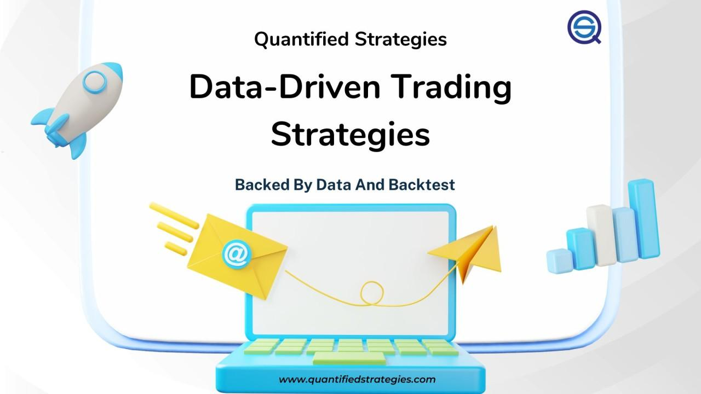

## Table of Contents

## What is data-driven trading?

Data-driven trading is a way of making decisions about buying and selling things like stocks or commodities by using a lot of information and computer programs. Instead of guessing or following feelings, people who do data-driven trading use numbers and patterns from the past to help them decide what to do next. They look at things like how prices have moved before, how much people are buying or selling, and other important details to make smarter choices.

This kind of trading often uses special computer programs called algorithms. These algorithms can look at huge amounts of data very quickly and find patterns that humans might miss. By using these patterns, traders can make decisions faster and more accurately than they could on their own. This method can help them make more money and avoid big losses, but it also means they need to keep learning and updating their tools to stay ahead.

## How does data-driven trading differ from traditional trading methods?

Data-driven trading and traditional trading are different in how they make decisions. In traditional trading, people often rely on their experience, intuition, and sometimes even rumors or news to decide when to buy or sell. They might look at charts and use some basic analysis, but a lot of it comes down to what they think will happen based on what they know. This can work well for some people, but it can also lead to mistakes because human judgment isn't always perfect.

On the other hand, data-driven trading uses computers and lots of data to make choices. Instead of guessing or following a gut feeling, traders use special programs to look at huge amounts of information from the past. These programs can find patterns and trends that humans might miss. This means data-driven traders can make more informed decisions, often faster and more accurately than traditional traders. While it takes a lot of work to set up and keep updating these systems, it can lead to better results over time.

## What types of data are used in data-driven trading?

In data-driven trading, people use all sorts of numbers and information to make their decisions. This includes things like the prices of stocks or other things they want to trade, how many of them are being bought or sold, and how much they are going up or down. They also look at news and events that might affect what they are trading, like if a company does really well or if there's a big change in the economy.

Another kind of data they use is called technical data. This includes patterns and trends they find by looking at charts and graphs of past prices. They might see that a stock goes up at certain times of the year or that it follows a certain pattern. They also use something called sentiment data, which is about how people feel about a stock or the market. This can come from social media, news articles, or surveys. By putting all this information together, they can make smarter choices about when to buy or sell.

## What are the basic tools and technologies needed for data-driven trading?

To do data-driven trading, you need a few important tools and technologies. First, you need a good computer that can handle a lot of information quickly. This computer needs to run special programs called algorithms that look at data and find patterns. You also need a way to get data, like a connection to a stock market or a service that gives you news and numbers about what you want to trade. This data is really important because it's what your algorithms use to make decisions.

Another key tool is a trading platform, which is a program that lets you buy and sell things easily. This platform needs to work well with your algorithms so that when they say it's time to buy or sell, you can do it fast. You might also use something called a data visualization tool, which helps you see the data in a way that's easy to understand, like with graphs and charts. All these tools together help you make smart choices based on a lot of information.

Lastly, you need to keep learning and updating your tools. The world of trading changes a lot, so you need to make sure your algorithms are always looking at the right data and making the best decisions. This might mean using machine learning, which is a way for computers to get better at finding patterns over time. By staying up to date, you can keep making good trades and avoid big losses.

## How can beginners start implementing data-driven trading strategies?

To start with data-driven trading, beginners should first learn the basics of how trading works and what data is important. They can begin by reading books or taking online courses about trading and data analysis. It's good to understand things like stock prices, trading volumes, and how news affects the market. Once they have a basic understanding, they can start looking at simple data, like daily stock prices, and practice finding patterns. There are many free tools and websites that provide historical data, which can be a great starting point.

Next, beginners should get familiar with some basic tools for data-driven trading. They can start with a simple spreadsheet program like Microsoft Excel or Google Sheets to organize and analyze data. As they get more comfortable, they might want to use a trading platform that lets them practice trading without using real money. Many platforms offer demo accounts where beginners can test their strategies. Over time, as they learn more, they can start using more advanced tools like programming languages such as Python, which can help them create their own trading algorithms. The key is to keep learning and practicing, starting small and gradually building up their skills and tools.

## What are some common data analysis techniques used in trading?

One common data analysis technique in trading is called technical analysis. This is when traders look at charts and graphs of past prices to find patterns. They might see that a stock goes up or down at certain times or in certain ways. By understanding these patterns, traders can try to predict what will happen next. For example, if a stock often goes up after a certain pattern, a trader might decide to buy it when they see that pattern again.

Another technique is called fundamental analysis. This is when traders look at the basic information about a company or market, like how much money the company makes or what's happening in the economy. They use this information to decide if a stock is a good buy. For example, if a company is doing well and making more money, a trader might think its stock will go up in the future. By combining both technical and fundamental analysis, traders can make more informed decisions about when to buy or sell.

Sentiment analysis is also important in trading. This technique involves looking at how people feel about a stock or the market. Traders might read news articles, social media posts, or surveys to see if people are feeling positive or negative. If a lot of people are excited about a company, its stock might go up because more people want to buy it. By understanding how people feel, traders can get a better sense of what might happen next in the market.

## How do you evaluate the effectiveness of a data-driven trading strategy?

To evaluate the effectiveness of a data-driven trading strategy, you need to look at how well it performs over time. This means checking if the strategy makes more money than it loses. You can do this by keeping track of all the trades you make and seeing if you end up with more money at the end. It's also important to compare your strategy to other ways of trading, like just buying and holding stocks or following the market. If your strategy does better than these other methods, it's a good sign that it's working well.

Another way to evaluate your strategy is by looking at how it handles different situations. Markets can change a lot, so you need to see if your strategy works well in good times and bad times. You can test this by using old data to see how your strategy would have done in the past. This is called backtesting. If your strategy makes money in different kinds of markets, it's more likely to be effective in the future. By keeping an eye on these things, you can tell if your data-driven trading strategy is working and make changes if you need to.

## What are the risks associated with data-driven trading?

Data-driven trading has some risks that traders need to be careful about. One big risk is that the data or the computer programs might be wrong. If the data you use is not correct or if your computer program has a mistake, you might make bad trading choices. This can lead to losing money. Also, markets can change quickly, and what worked in the past might not work in the future. So, if you rely too much on old data, you could miss new trends and lose out on good opportunities.

Another risk is that data-driven trading can make you trade too much. When you use computers to make quick decisions, you might end up buying and selling a lot more often than you should. This can lead to higher costs because every time you trade, you might have to pay fees. Also, too much trading can make you focus on small, short-term gains instead of thinking about the bigger picture. This can be risky because it might make you lose sight of your long-term goals.

## How can advanced algorithms improve data-driven trading outcomes?

Advanced algorithms can make data-driven trading better by looking at a lot of information very quickly and finding patterns that people might miss. These algorithms can learn from past trades and get better over time, which means they can make smarter choices about when to buy or sell. They can also handle more data than a person could, so they can look at things like news, social media, and even the weather to see how they might affect the market. By using all this information, advanced algorithms can help traders make more money and avoid big losses.

Another way advanced algorithms help is by making trading faster and more accurate. Because they can make decisions in seconds, traders can take advantage of small changes in the market that might not last long. This can lead to more trades and more chances to make money. Also, these algorithms can keep an eye on many different things at once, so they can spot opportunities or risks that a person might not see. By using advanced algorithms, traders can make better decisions and improve their chances of success in the market.

## What role does machine learning play in data-driven trading?

Machine learning helps data-driven trading by making it easier to find patterns in lots of data. It's like teaching a computer to learn from past trades and get better at making decisions. Instead of just following rules, machine learning algorithms can look at things like stock prices, news, and even social media to figure out what might happen next in the market. This means traders can make smarter choices about when to buy or sell, because the computer can learn from what worked well before.

Another way machine learning helps is by making trading more automatic. Once the computer learns how to spot good opportunities, it can make trades on its own, without needing a person to tell it what to do. This can be really useful because the market can change very quickly, and machine learning can react faster than a human could. By using machine learning, traders can make more trades and take advantage of small changes in the market, which can help them make more money and avoid big losses.

## How do regulatory environments affect data-driven trading practices?

Regulatory environments can change how people do data-driven trading. Governments and other groups make rules to make sure trading is fair and safe. These rules might say what kind of data traders can use or how fast they can make trades. If the rules are strict, traders might have to slow down or change their computer programs to follow them. This can make it harder to use some of the quick, automatic trading methods that data-driven trading often uses.

On the other hand, good rules can help make trading better and safer. They can stop people from cheating or using bad information. This can make the market more trustworthy, which is good for everyone. Traders might need to spend more time learning the rules and making sure their computer programs follow them, but this can help them avoid big problems and keep trading in a way that's fair and honest.

## What are the future trends and developments expected in data-driven trading?

In the future, data-driven trading is going to get even smarter and faster. One big trend is the use of more advanced machine learning and artificial intelligence. These technologies can learn from huge amounts of data and find patterns that people might miss. They can also make decisions very quickly, which is important in trading because the market can change in seconds. This means traders will be able to make more trades and take advantage of small changes in the market, which can help them make more money.

Another trend is that more and more data will be used in trading. Right now, traders use things like stock prices and news, but in the future, they might use even more kinds of information, like social media posts or satellite images. This can help them understand what's happening in the market better and make better decisions. But with more data comes more responsibility to make sure it's accurate and used in a fair way. So, rules and regulations will also need to keep up with these changes to make sure trading stays safe and honest.

## How can we integrate cutting-edge trading technologies?

Integrating cutting-edge trading technologies is a fundamental aspect of successful algorithmic trading. These technologies enable platforms like ValorAlgo to leverage real-time data analytics, offering traders actionable insights crucial for making informed decisions. The integration of sophisticated algorithms enhances trading accuracy by continuously analyzing market data to predict price movements with greater precision.

Advanced trading systems are designed to offer robust risk management tools, allowing traders to mitigate potential losses effectively. These systems enable seamless integration across various asset classes, which enhances a trader's capability to execute unified strategies under diverse market conditions. This versatility ensures that traders can respond dynamically to changes, optimizing their portfolios across different asset categories.

The emphasis on speed in algorithmic trading is paramount. Utilizing technologies that ensure minimal latency in executing trades can significantly affect trading performance. The formula for calculating the latency of a trading system can be expressed as:

$$
\text{Latency} = \text{Time}_{\text{Execution}} - \text{Time}_{\text{Signal}}
$$

Where:
- $\text{Time}_{\text{Execution}}$ is the timestamp when the trade is executed.
- $\text{Time}_{\text{Signal}}$ is the timestamp when the trading signal is generated.

Traders aim to minimize latency to capitalize on momentary price changes, thereby gaining a competitive advantage in the market.

Precision is another critical focus, where algorithmic platforms use machine learning models to refine predictions. By training models on historical market data, these platforms can identify patterns and forecast market movements more accurately. A Python implementation of a simple linear regression used in algorithmic trading might look like this:

```python
from sklearn.linear_model import LinearRegression
import numpy as np

# Sample market data
X = np.array([[1], [2], [3], [4], [5]])
y = np.array([2, 4, 5, 4, 5])

# Create linear regression model
model = LinearRegression()
model.fit(X, y)

# Predict future market movement
future_time = np.array([[6]])
predicted_movement = model.predict(future_time)
print(predicted_movement)  # Example output
```

Adaptability is equally crucial in ensuring that algorithmic systems can adjust strategies based on evolving market conditions. The use of adaptable algorithms allows for modifying trading strategies in response to shifts in market trends or regulatory changes.

By focusing on speed, precision, and adaptability, algorithmic trading platforms set new benchmarks in trading efficiency. These attributes ensure that traders can continually keep pace with market dynamics and execute strategies with consistency and excellence.

## What are the strategies for success in modern markets?

To thrive in modern markets, traders are increasingly required to employ automation as a crucial facet of their trading strategies. Algorithmic tools are no longer a mere adjunct but an essential component of effective decision-making processes. Automation addresses the complexities of contemporary trading environments by managing vast datasets with speed and precision, thereby enhancing the trader's ability to make informed decisions swiftly.

Continuous learning remains paramount as algorithmic trading evolves at a rapid pace, marked by the development of innovative tools and methodologies. Traders must keep abreast of advancements in technology and analytical techniques to maintain a competitive edge. This involves not only staying updated with the latest trading algorithms and platforms but also understanding the intricacies of underlying mathematical models and data science principles that drive these technologies.

Diversification is another strategic pillar for navigating modern markets. By spreading investments across a variety of asset classes, traders can mitigate risks associated with any single market. The principle of diversification is rooted in the concept of reducing the variance of the portfolio's return, as described mathematically by the variance formula for a portfolio of assets:

$$
\sigma_p^2 = \sum_{i=1}^{n} w_i^2 \sigma_i^2 + \sum_{i=1}^{n} \sum_{j \neq i}^{n} w_i w_j \sigma_i \sigma_j \rho_{ij}
$$

where $\sigma_p^2$ is the portfolio variance, $w_i$ and $w_j$ are the weights of assets $i$ and $j$, $\sigma_i$ is the standard deviation of asset $i$, and $\rho_{ij}$ is the correlation coefficient between assets $i$ and $j$.

Monitoring market sentiment is increasingly facilitated by AI-powered analysis tools. Techniques such as natural language processing (NLP) allow traders to analyze news articles, social media, and other financial content in real-time, extracting relevant sentiment indicators. This early detection of market shifts provides a competitive advantage, as traders can react promptly to changing conditions, positioning themselves strategically to capitalize on emerging trends.

Incorporating these strategies—automation, continuous learning, diversification, and sentiment analysis—aligns with the foundations of successful modern trading practices. These elements ensure that traders not only react effectively to current market conditions but also anticipate future developments, securing a robust foothold in the ever-evolving trading domain.

## References & Further Reading

[1]: ["Advances in Financial Machine Learning"](https://www.amazon.com/Advances-Financial-Machine-Learning-Marcos/dp/1119482089) by Marcos Lopez de Prado

[2]: ["Machine Learning for Algorithmic Trading"](https://github.com/stefan-jansen/machine-learning-for-trading) by Stefan Jansen

[3]: ["Quantitative Trading: How to Build Your Own Algorithmic Trading Business"](https://www.amazon.com/Quantitative-Trading-Build-Algorithmic-Business/dp/1119800064) by Ernest P. Chan

[4]: ["Algorithmic Trading: Winning Strategies and Their Rationale"](https://www.amazon.com/Algorithmic-Trading-Winning-Strategies-Rationale-ebook/dp/B00CY5HC0U) by Ernest P. Chan

[5]: Aldridge, Irene. (2013). ["High-Frequency Trading: A Practical Guide to Algorithmic Strategies and Trading Systems"](https://www.amazon.com/High-Frequency-Trading-Practical-Algorithmic-Strategies/dp/1118343506). 

[6]: Kissell, Robert. (2013). ["The Science of Algorithmic Trading and Portfolio Management"](https://www.sciencedirect.com/book/9780124016897/the-science-of-algorithmic-trading-and-portfolio-management).

[7]: Hasbrouck, Joel. (2007). ["Empirical Market Microstructure: The Institutions, Economics, and Econometrics of Securities Trading"](https://archive.org/details/empiricalmarketm0000hasb).

[8]: Cartea, Álvaro, deLarrard, Adrien, & Penaranda, Francisco. (2015). ["Algorithmic and High-Frequency Trading"](https://assets.cambridge.org/97811070/91146/frontmatter/9781107091146_frontmatter.pdf).

[9]: Bouchaud, Jean-Philippe, & Potters, Marc. (2003). ["Theory of Financial Risk and Derivative Pricing: From Statistical Physics to Risk Management"](https://assets.cambridge.org/97805218/19169/frontmatter/9780521819169_frontmatter.pdf).