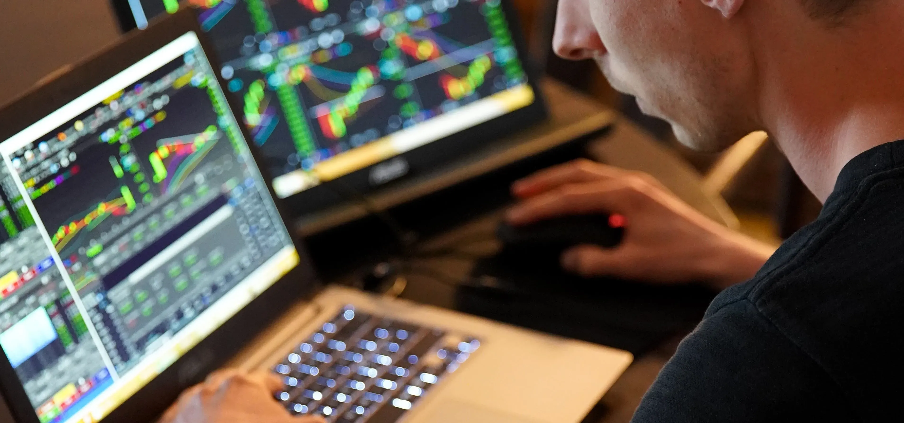

Algorithmic trading, commonly referred to as data-driven trading, leverages computer algorithms to automate trading strategies and decisions. This innovative method has transformed financial markets by enabling traders to execute complex strategies with remarkable speed and precision. Through the application of sophisticated algorithms, traders analyze vast amounts of data and identify lucrative opportunities, often in milliseconds. This capability has not only maximized efficiency but also minimized human error, making algorithmic trading a cornerstone of modern finance.

In this article, we examine the complex nature of data-driven trading, focusing on its evolution, the key trends influencing current market practices, and the technological advancements driving its growth. Historically, algorithmic trading was mostly the domain of large institutional investors due to its reliance on substantial computing power and data analytics capabilities. However, technological breakthroughs have democratized access, allowing individual retail traders to deploy strategies once exclusive to major financial players.



The rise in demand for algorithmic trading underlines its role and potential advantages, which are essential for traders aiming to maintain a competitive edge in the dynamic financial landscape. Traders now have the capacity to analyze and respond to market fluctuations with unprecedented agility, significantly altering how financial markets operate. As data-driven trading becomes more prevalent, robust understanding and strategic implementation of algorithmic techniques are vital for unlocking its full potential.

The exploration of algorithmic trading offers a glimpse into its historical roots while providing insight into future prospects. Insights from industry leaders, including ValorAlgo, highlight ongoing innovations and practical applications that traders can leverage to enhance their strategies. This context drives home the importance of staying informed and utilizing advanced tools in navigating the fast-paced world of finance.

## Table of Contents

## The Evolution of Algorithmic Trading

Algorithmic trading has undergone significant transformation since its inception, reshaping how financial markets function. Initially, this practice was predominantly employed by large institutional investors who had the necessary resources and technological infrastructure to manage and execute these complex strategies. However, as technology has advanced, algorithmic trading has become increasingly accessible to retail traders.

The key to this democratization of algorithmic trading lies in the advancement of computing power and sophisticated data analytics. Previously, the computational requirements to analyze vast datasets in real-time and execute trades based on sophisticated mathematical models were beyond the reach of individual traders. However, the exponential increase in computational capabilities, coupled with the reduction in hardware costs, has enabled a wider range of market participants to harness the power of algorithmic trading.

Data analytics plays a crucial role in this evolution, allowing traders to process and interpret large volumes of data with enhanced speed and accuracy. This analytical capability permits the design and implementation of strategies based on quantitative data, transforming trading decisions that were once intuition-based into measurable, performance-driven processes. Algorithms can now assess pricing models, track market trends, and evaluate statistical relationships between various financial instruments, opening the door for individual traders to deploy strategies that were traditionally exclusive to major financial institutions.

The evolution of [algorithmic trading](/wiki/algorithmic-trading) denotes a significant shift in the landscape of financial markets. This shift introduces increased opportunities for traders who leverage data-driven strategies, allowing them to identify profitable trading signals and reduce trading costs through automation. The ability to execute trades at the speed of computational processes rather than human decision-making enhances operational efficiency and precision, particularly in fast-moving markets.

As these technologies continue to evolve, algorithmic trading is expected to further influence market dynamics, drive innovations, and offer competitive advantages to those willing to integrate sophisticated analytics into their trading operations. This progression signifies not only a democratization of technology but also an enhancement in the strategic capabilities available to traders in an ever-expanding global market.

## Key Trends Shaping Algorithmic Trading

Several key trends are currently defining and reshaping the landscape of algorithmic trading, bringing about transformative changes and challenges in the financial markets. 

Increasing market [volatility](/wiki/volatility-trading-strategies) has become a prominent [factor](/wiki/factor-investing) driving traders towards data-driven strategies. Greater volatility necessitates quick adaptation to rapidly fluctuating market conditions, and algorithmic trading provides the necessary speed and precision. These strategies help traders respond swiftly and maintain profitability during volatile periods. For instance, leveraging [artificial intelligence](/wiki/ai-artificial-intelligence) and [machine learning](/wiki/machine-learning) algorithms allows traders to analyze vast amounts of data in real time and make informed trading decisions based on predictive analytics.

The growing diversification into digital assets, such as cryptocurrencies, has broadened the application of algorithmic trading. As cryptocurrencies have gained traction in financial markets, traders are required to manage a more extensive array of instruments. Algorithmic trading systems have evolved to accommodate the peculiarities of digital assets, including their highly volatile nature and 24/7 trading environment. This expansion necessitates robust algorithms that can execute trades seamlessly across various asset classes, integrating both traditional securities and digital currencies.

Regulatory developments have also significantly influenced algorithmic trading practices. Financial markets are subject to rigorous oversight to ensure fair trading and reduce risks associated with high-frequency trading and market manipulation. In response, technology-driven solutions have emerged to enhance compliance. For example, automated systems can now incorporate regulatory requirements into their trading algorithms, ensuring that trades are conducted within legal frameworks. Moreover, these systems can provide audit trails and transparency, which are crucial for regulatory reporting and maintaining market integrity.

Overall, these trends highlight the evolving nature of algorithmic trading, characterized by an increased reliance on advanced technologies to navigate the complexities of modern financial markets. As market dynamics continue to evolve, algorithmic trading will require continuous innovation to address emerging challenges and capitalize on new opportunities.

## Integrating Cutting-Edge Trading Technologies

Integrating cutting-edge trading technologies is a fundamental aspect of successful algorithmic trading. These technologies enable platforms like ValorAlgo to leverage real-time data analytics, offering traders actionable insights crucial for making informed decisions. The integration of sophisticated algorithms enhances trading accuracy by continuously analyzing market data to predict price movements with greater precision.

Advanced trading systems are designed to offer robust risk management tools, allowing traders to mitigate potential losses effectively. These systems enable seamless integration across various asset classes, which enhances a trader's capability to execute unified strategies under diverse market conditions. This versatility ensures that traders can respond dynamically to changes, optimizing their portfolios across different asset categories.

The emphasis on speed in algorithmic trading is paramount. Utilizing technologies that ensure minimal latency in executing trades can significantly affect trading performance. The formula for calculating the latency of a trading system can be expressed as:

$$
\text{Latency} = \text{Time}_{\text{Execution}} - \text{Time}_{\text{Signal}}
$$

Where:
- $\text{Time}_{\text{Execution}}$ is the timestamp when the trade is executed.
- $\text{Time}_{\text{Signal}}$ is the timestamp when the trading signal is generated.

Traders aim to minimize latency to capitalize on momentary price changes, thereby gaining a competitive advantage in the market.

Precision is another critical focus, where algorithmic platforms use machine learning models to refine predictions. By training models on historical market data, these platforms can identify patterns and forecast market movements more accurately. A Python implementation of a simple linear regression used in algorithmic trading might look like this:

```python
from sklearn.linear_model import LinearRegression
import numpy as np

# Sample market data
X = np.array([[1], [2], [3], [4], [5]])
y = np.array([2, 4, 5, 4, 5])

# Create linear regression model
model = LinearRegression()
model.fit(X, y)

# Predict future market movement
future_time = np.array([[6]])
predicted_movement = model.predict(future_time)
print(predicted_movement)  # Example output
```

Adaptability is equally crucial in ensuring that algorithmic systems can adjust strategies based on evolving market conditions. The use of adaptable algorithms allows for modifying trading strategies in response to shifts in market trends or regulatory changes.

By focusing on speed, precision, and adaptability, algorithmic trading platforms set new benchmarks in trading efficiency. These attributes ensure that traders can continually keep pace with market dynamics and execute strategies with consistency and excellence.

## Strategies for Success in Modern Markets

To thrive in modern markets, traders are increasingly required to employ automation as a crucial facet of their trading strategies. Algorithmic tools are no longer a mere adjunct but an essential component of effective decision-making processes. Automation addresses the complexities of contemporary trading environments by managing vast datasets with speed and precision, thereby enhancing the trader's ability to make informed decisions swiftly.

Continuous learning remains paramount as algorithmic trading evolves at a rapid pace, marked by the development of innovative tools and methodologies. Traders must keep abreast of advancements in technology and analytical techniques to maintain a competitive edge. This involves not only staying updated with the latest trading algorithms and platforms but also understanding the intricacies of underlying mathematical models and data science principles that drive these technologies.

Diversification is another strategic pillar for navigating modern markets. By spreading investments across a variety of asset classes, traders can mitigate risks associated with any single market. The principle of diversification is rooted in the concept of reducing the variance of the portfolio's return, as described mathematically by the variance formula for a portfolio of assets:

$$
\sigma_p^2 = \sum_{i=1}^{n} w_i^2 \sigma_i^2 + \sum_{i=1}^{n} \sum_{j \neq i}^{n} w_i w_j \sigma_i \sigma_j \rho_{ij}
$$

where $\sigma_p^2$ is the portfolio variance, $w_i$ and $w_j$ are the weights of assets $i$ and $j$, $\sigma_i$ is the standard deviation of asset $i$, and $\rho_{ij}$ is the correlation coefficient between assets $i$ and $j$.

Monitoring market sentiment is increasingly facilitated by AI-powered analysis tools. Techniques such as natural language processing (NLP) allow traders to analyze news articles, social media, and other financial content in real-time, extracting relevant sentiment indicators. This early detection of market shifts provides a competitive advantage, as traders can react promptly to changing conditions, positioning themselves strategically to capitalize on emerging trends.

Incorporating these strategies—automation, continuous learning, diversification, and sentiment analysis—aligns with the foundations of successful modern trading practices. These elements ensure that traders not only react effectively to current market conditions but also anticipate future developments, securing a robust foothold in the ever-evolving trading domain.

## How ValorAlgo is Leading the Charge

ValorAlgo distinguishes itself in the algorithmic trading industry by leveraging cutting-edge technology to offer traders tools that enhance their performance and competitiveness. By prioritizing speed, precision, and adaptability, ValorAlgo's platforms are at the forefront of technological advancements, providing an undeniable edge in the fast-paced global markets. The company focuses on developing systems that can process large data volumes rapidly, allowing traders to react to market changes with exceptional precision.

Integral to ValorAlgo’s approach is the continuous evolution of their platforms to remain aligned with ongoing market trends. The dynamic nature of financial markets requires solutions that can adapt quickly to fluctuations and emerging patterns. ValorAlgo achieves this by integrating machine learning algorithms and advanced data analytics into their systems.

For instance, ValorAlgo utilizes state-of-the-art predictive modeling techniques to forecast market trends before they unfold. This forward-thinking capability is facilitated by continuously updating their platforms with the latest research in machine learning and statistical analysis. Traders can employ Python-based predictive models provided by ValorAlgo, such as time-series analysis tools, which are especially effective in forecasting price movements. A simple implementation of a predictive model in Python might begin as follows:

```python
import pandas as pd
from statsmodels.tsa.arima.model import ARIMA

# Load market data
market_data = pd.read_csv('market_data.csv')

# Prepare the time series data
prices = market_data['prices']

# Fit an ARIMA model
model = ARIMA(prices, order=(5, 1, 0))
model_fit = model.fit()

# Predict the future prices
forecast = model_fit.forecast(steps=10)
print(forecast)
```

Moreover, ValorAlgo emphasizes robust risk management by integrating comprehensive risk assessment tools into their platforms. These tools enable traders to analyze potential risks associated with different trading strategies and optimize their asset allocation accordingly. The result is a risk-aware trading environment where decisions are informed by quantitative metrics rather than intuition alone.

To ensure that traders maintain a competitive advantage, ValorAlgo provides platforms that support a wide range of asset classes. This diversity allows users to diversify their portfolios effectively, reducing exposure to any single market's volatility. The platforms' adaptability extends to the regulatory environment as well, with compliance tools designed to effortlessly integrate regulatory requirements into trading systems, ensuring both security and legality in trading operations.

By continuously innovating and updating its technologies, ValorAlgo remains a leader in algorithmic trading, empowering traders with the resources they need to confidently navigate the future of finance. The company's commitment to providing superior performance tools not only enhances trade execution but also positions their clients to capitalize on emerging opportunities with greater certainty and authority.

## Conclusion

Algorithmic trading is redefining how financial markets function, presenting both innovative opportunities and challenges in a dynamically changing environment. As technology continues to advance, the landscape of algo trading is set to become even more thrilling, shaped by key factors such as market volatility, asset diversification, and regulatory changes. These elements create a vibrant and ever-evolving marketplace, encouraging traders to adapt and thrive in new ways.

ValorAlgo stands at the cutting edge of this transformation, providing traders with state-of-the-art technology and insightful analytics. By focusing on speed, precision, and adaptability, ValorAlgo ensures that traders are equipped with the necessary tools to excel in the global markets. Their commitment to staying at the forefront of these developments enables traders to navigate the complexities of modern financial environments with confidence.

As algorithmic trading continues to grow and incorporate more sophisticated techniques, staying well-informed and equipped with the right technological tools will be indispensable for achieving success. The future of algo trading holds immense potential, and those who invest in staying ahead of the curve will be poised to capitalize on the numerous opportunities it presents. By embracing these innovations and adapting to the changing landscape, traders can secure a competitive edge in the fast-paced world of finance.

## References & Further Reading

[1]: ["Advances in Financial Machine Learning"](https://www.amazon.com/Advances-Financial-Machine-Learning-Marcos/dp/1119482089) by Marcos Lopez de Prado

[2]: ["Machine Learning for Algorithmic Trading"](https://github.com/stefan-jansen/machine-learning-for-trading) by Stefan Jansen

[3]: ["Quantitative Trading: How to Build Your Own Algorithmic Trading Business"](https://www.amazon.com/Quantitative-Trading-Build-Algorithmic-Business/dp/1119800064) by Ernest P. Chan

[4]: ["Algorithmic Trading: Winning Strategies and Their Rationale"](https://www.amazon.com/Algorithmic-Trading-Winning-Strategies-Rationale-ebook/dp/B00CY5HC0U) by Ernest P. Chan

[5]: Aldridge, Irene. (2013). ["High-Frequency Trading: A Practical Guide to Algorithmic Strategies and Trading Systems"](https://www.amazon.com/High-Frequency-Trading-Practical-Algorithmic-Strategies/dp/1118343506). 

[6]: Kissell, Robert. (2013). ["The Science of Algorithmic Trading and Portfolio Management"](https://www.sciencedirect.com/book/9780124016897/the-science-of-algorithmic-trading-and-portfolio-management).

[7]: Hasbrouck, Joel. (2007). ["Empirical Market Microstructure: The Institutions, Economics, and Econometrics of Securities Trading"](https://archive.org/details/empiricalmarketm0000hasb).

[8]: Cartea, Álvaro, deLarrard, Adrien, & Penaranda, Francisco. (2015). ["Algorithmic and High-Frequency Trading"](https://assets.cambridge.org/97811070/91146/frontmatter/9781107091146_frontmatter.pdf).

[9]: Bouchaud, Jean-Philippe, & Potters, Marc. (2003). ["Theory of Financial Risk and Derivative Pricing: From Statistical Physics to Risk Management"](https://assets.cambridge.org/97805218/19169/frontmatter/9780521819169_frontmatter.pdf).