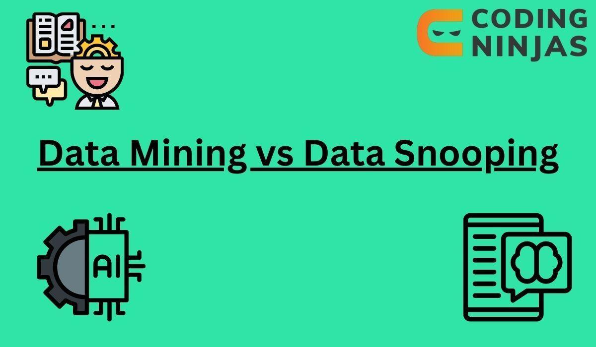

## Table of Contents

## What is data mining?

Data mining is like finding hidden treasures in a big pile of data. It's a way to look through large amounts of information to find patterns, relationships, and important facts that were not easy to see before. People use special computer programs and math tricks to do this. It's used in many places like stores, hospitals, and banks to help them make better choices and understand their customers better.

For example, a store might use data mining to see what products people often buy together. This can help them decide where to put things in the store or what deals to offer. It's not just about selling more stuff; it's also used in science to find new things or in medicine to help doctors understand diseases better. But, it's important to be careful because data mining can also raise questions about privacy and how we use personal information.

## What is data snooping?

Data snooping is when someone looks through data to find patterns or results that they want to see, but they might not be real or important. It's like trying to find a specific shape in the clouds; you might see something, but it's not really there. People do this by testing a lot of different ideas on the same set of data until they find something that looks good, but this can lead to false discoveries because they're not looking at new data to check if it's true.

This can be a problem in science and finance, where people might use data snooping to make it look like they've found a new discovery or a way to predict the stock market. But if they don't test their findings on new data, they might be fooling themselves and others. To avoid data snooping, it's important to use a separate set of data to check if the patterns you found are real and not just a trick of the data you were looking at.

## How do data mining and data snooping differ?

Data mining is like searching through a big pile of information to find useful patterns or facts that can help make decisions. It's used in many places like shops, hospitals, and banks to understand customers better or to find new things in science. People use special computer programs and math to look through the data carefully and find things that might not be easy to see at first.

Data snooping, on the other hand, is when someone looks through data hoping to find specific patterns or results they want to see, even if those patterns might not be real or important. It's like trying to see shapes in the clouds; you might think you see something, but it's not really there. People might do this by testing lots of ideas on the same data until they find something that looks good, but this can lead to false discoveries because they're not checking if it's true with new data.

The main difference is that data mining tries to find real and useful information using careful methods, while data snooping can lead to false results because it's more about finding what you want to see rather than what's actually there. It's important to use new data to check if the patterns found are real to avoid the problems that come with data snooping.

## What are the common techniques used in data mining?

Data mining uses different ways to find patterns and information in big piles of data. One common way is called association rule learning, which looks at things that often happen together, like what items people buy together at the store. Another way is clustering, where the computer groups similar things together without being told how to do it. This can help find groups of customers with similar habits or interests. There's also classification, where the computer learns from examples to sort new data into different groups, like telling if an email is spam or not.

Another technique is regression, which helps predict a number, like how much a house might cost based on its size and location. There's also anomaly detection, where the computer looks for things that are unusual or different from what's normal, like finding fraud in credit card transactions. All these methods help turn raw data into useful information that can be used to make better decisions.

These techniques often use fancy math and computer programs to work. But at the heart of it, they're all about finding hidden patterns and making sense of big amounts of data. By using these methods, people can learn more about their customers, find new things in science, or even predict what might happen next.

## What are the potential risks associated with data snooping?

Data snooping can lead to finding things that aren't really true. When people keep looking at the same data over and over, trying different ideas until they find something that looks good, they might think they've found a real pattern. But it could just be a coincidence, like seeing shapes in the clouds that aren't really there. This can be a big problem in science or finance, where people might think they've discovered something new or can predict the stock market, but they're actually just fooling themselves and others.

Another risk is that data snooping can make people trust the wrong information. If someone uses data snooping to find a pattern and then tells others about it without checking if it's true with new data, it can lead to bad decisions. For example, a doctor might think a new treatment works because of data snooping, but it might not really help patients. Or, an investor might put money into a stock based on a pattern found through data snooping, only to lose money when the pattern doesn't hold up in real life. It's important to always check findings with new data to make sure they're real and not just a result of data snooping.

## Can you explain the process of data mining in simple terms?

Data mining is like searching through a big pile of stuff to find hidden treasures. Imagine you have a huge box full of all kinds of things, and you want to find out what's in there and how it all fits together. You start by sorting everything out, looking for things that go together, like all the red socks or all the [books](/wiki/algo-trading-books) about animals. You use special tools and tricks to help you see patterns and connections that you might not notice at first. This is what data mining does with information, using computers and math to find useful patterns and facts in big sets of data.

Once you've found these patterns, you can use them to make better decisions. For example, if you're a store owner, you might find that people often buy bread and milk together. Knowing this, you could put these items closer to each other in your store to make shopping easier for customers. Or if you're a doctor, you might find that certain symptoms often go together, which could help you diagnose diseases faster. Data mining helps people in all kinds of jobs to understand their data better and use it to do their work more effectively.

## How can data snooping impact the validity of statistical analyses?

Data snooping can mess up the truthfulness of statistical analyses by making it look like there are patterns or results that aren't really there. When people keep testing the same data over and over, trying different ideas until they find something that looks good, they might think they've found a real pattern. But it could just be a coincidence, like seeing shapes in the clouds that aren't really there. This can lead to false discoveries because they're not checking if it's true with new data. In science or finance, this can be a big problem because people might think they've found something new or can predict the stock market, but they're actually just fooling themselves and others.

This can also make people trust the wrong information. If someone uses data snooping to find a pattern and then tells others about it without checking if it's true with new data, it can lead to bad decisions. For example, a doctor might think a new treatment works because of data snooping, but it might not really help patients. Or, an investor might put money into a stock based on a pattern found through data snooping, only to lose money when the pattern doesn't hold up in real life. It's important to always check findings with new data to make sure they're real and not just a result of data snooping.

## What ethical considerations should be taken into account with data mining?

Data mining can be very useful, but it's important to think about the right and wrong ways to use it. One big worry is privacy. When companies or researchers look through a lot of data, they might see personal information about people. It's important to make sure this information is kept safe and used in a way that respects people's privacy. People should know what's being done with their data and agree to it. If not, it can feel like their privacy is being invaded.

Another thing to think about is fairness. Data mining can sometimes make decisions that affect people's lives, like who gets a loan or a job. If the data used has biases, like if it's mostly about one group of people, the results might not be fair to everyone. It's important to check the data and the methods used to make sure they're not hurting any groups of people. Also, being open about how data is being used can help build trust and make sure everyone is treated fairly.

## How can organizations implement data mining to improve their operations?

Organizations can use data mining to make their work better by looking at big piles of data to find patterns and facts that help them make smarter choices. For example, a store might use data mining to see what things people often buy together. This can help them decide where to put items in the store or what deals to offer to make shopping easier and sell more. A hospital could use data mining to find out which treatments work best for certain diseases, helping doctors give better care to patients. By using special computer programs and math, organizations can learn a lot about their customers or their work, which can help them do things more efficiently and effectively.

It's important for organizations to start by making sure their data is clean and organized. This means checking the data for mistakes and making sure it's all in the right format. Once the data is ready, they can use data mining tools to look for patterns. These tools can find groups of customers with similar habits or predict what might happen next, like how much a product might sell in the future. By using these findings, organizations can make better plans, save money, and improve how they serve their customers or patients. But they need to be careful to use the data in a way that respects people's privacy and is fair to everyone.

## What are some advanced data mining algorithms used in industry and research?

In industry and research, one advanced data mining algorithm is called Random Forests. It's like a team of decision trees working together to make better guesses about data. Each tree in the forest looks at the data a bit differently, and then they all vote on the best answer. This method is really good at figuring out complex patterns and can be used for things like predicting if a customer will buy something or if a patient has a certain disease. It's popular because it can handle a lot of data and still give reliable results.

Another advanced algorithm is called Support Vector Machines (SVM). This one is like finding the best line to separate different groups of data. Imagine you have a bunch of red and blue balls mixed together, and you need to draw a line to keep them apart. SVM finds the best way to do this, even if the data is tricky and not easy to separate. It's used a lot in things like telling if an email is spam or not, or recognizing faces in pictures. Both Random Forests and SVM are powerful tools that help people in industry and research find important patterns in big sets of data.

## How can one prevent or minimize the effects of data snooping in research studies?

To prevent or minimize the effects of data snooping in research studies, it's important to use a separate set of data for checking the results. This is called a validation or test set. After finding a pattern in the first set of data, researchers should see if it also shows up in the new data. If it does, it's more likely to be a real pattern and not just a trick of the first set of data. This helps make sure the findings are true and not just something that happened by chance.

Another way to minimize data snooping is to be careful about how many times you look at the data. If you keep trying different ideas on the same data until you find something that looks good, you might be fooling yourself. It's better to decide on a plan before looking at the data and stick to it. This means setting clear goals and methods before starting the study. By doing this, researchers can avoid the temptation to keep searching until they find what they want to see, which can lead to false discoveries.

## What future trends are expected in the fields of data mining and data snooping?

In the future, data mining is expected to become even more important and powerful. With more and more data being created every day, companies and researchers will use even smarter computer programs to find useful patterns and make better decisions. These programs will get better at handling huge amounts of data from different places, like social media, health records, and shopping habits. They will also use new kinds of math and computer tricks to find patterns that are even harder to see. This will help businesses understand their customers better, doctors find new ways to treat diseases, and scientists make new discoveries.

As for data snooping, people will become more aware of its dangers and work harder to avoid it. Researchers will use better ways to check their findings with new data to make sure their results are real and not just lucky guesses. They will also be more careful about how they look at data, sticking to clear plans before they start their studies. This will help make sure that the patterns they find are true and not just something they wanted to see. In the end, better methods to prevent data snooping will help make research more trustworthy and useful.

## References & Further Reading

[1]: Bergstra, J., Bardenet, R., Bengio, Y., & Kégl, B. (2011). ["Algorithms for Hyper-Parameter Optimization."](https://proceedings.neurips.cc/paper/2011/file/86e8f7ab32cfd12577bc2619bc635690-Paper.pdf) Advances in Neural Information Processing Systems 24.

[2]: ["Advances in Financial Machine Learning"](https://www.amazon.com/Advances-Financial-Machine-Learning-Marcos/dp/1119482089) by Marcos Lopez de Prado

[3]: ["Evidence-Based Technical Analysis: Applying the Scientific Method and Statistical Inference to Trading Signals"](https://www.amazon.com/Evidence-Based-Technical-Analysis-Scientific-Statistical/dp/0470008741) by David Aronson

[4]: ["Machine Learning for Algorithmic Trading"](https://github.com/stefan-jansen/machine-learning-for-trading) by Stefan Jansen

[5]: ["Quantitative Trading: How to Build Your Own Algorithmic Trading Business"](https://books.google.com/books/about/Quantitative_Trading.html?id=j70yEAAAQBAJ) by Ernest P. Chan