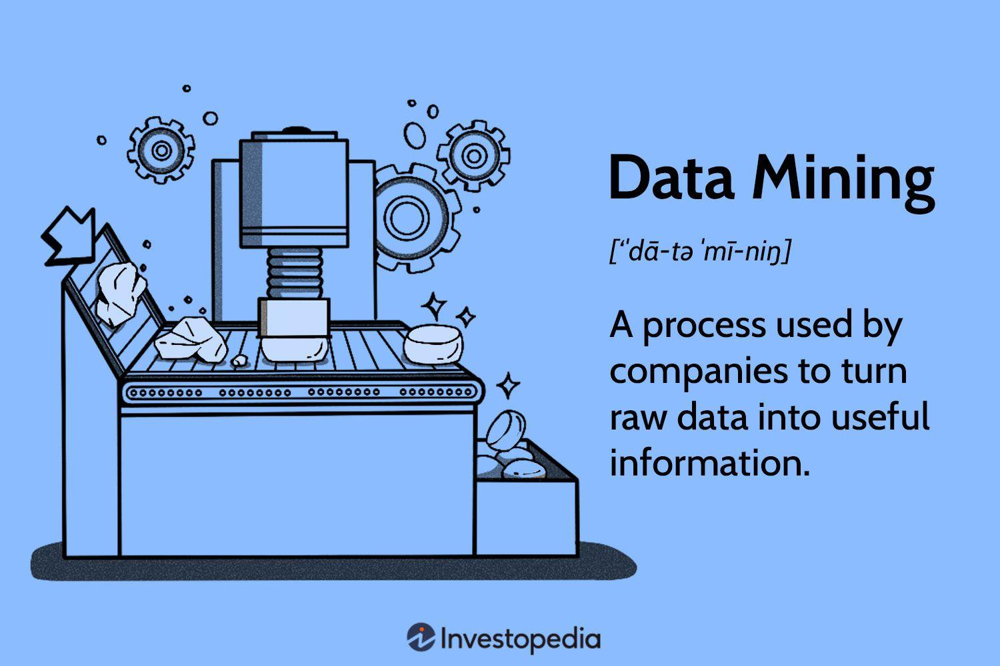

## Table of Contents

## What is data mining and how does it apply to investment?

Data mining is like searching through a big pile of information to find useful patterns and connections that are not easy to see at first. It uses computers and special math to look at lots of data and find things that might be important. People use data mining in many areas, like shopping, health, and even predicting the weather.

In investment, data mining helps people make smarter choices about where to put their money. By looking at past information about how different investments have done, data mining can spot trends and patterns. For example, it might show that certain types of companies do well when the economy is growing, or that some stocks go up when others go down. This can help investors pick the best places to invest their money to get the best returns.

## What are the basic data sources used in investment data mining?

In investment data mining, the main data sources come from financial markets and companies. Financial markets give us lots of information like stock prices, how much stocks are traded, and the value of different markets. This data helps us see how investments are doing over time and spot trends that might be useful for making investment choices. Companies also share important information through their financial reports, which tell us about their earnings, costs, and how well they are doing. By looking at this data, investors can figure out which companies might be good to invest in.

Another big source of data comes from economic indicators and news. Economic indicators, like unemployment rates, inflation, and GDP growth, give us a picture of how the whole economy is doing. This can affect how different investments perform. News articles and reports can also influence markets because they can change how people feel about investing. For example, good news about a company might make its stock price go up. By using all this data, investors can make better guesses about where to put their money to get the best results.

## How can data mining help in identifying investment opportunities?

Data mining helps find investment opportunities by looking at a lot of information and finding patterns that might be hard to see otherwise. For example, it can look at past stock prices and find that certain stocks tend to go up when the economy is doing well. By understanding these patterns, investors can pick stocks or other investments that are likely to do well in the future. This can help them make more money because they are choosing investments based on solid data instead of just guessing.

Another way data mining helps is by looking at company reports and other financial data. It can find companies that are doing better than others, maybe because they are making more money or spending less. This can show investors which companies might be good to invest in. Also, data mining can use economic indicators and news to see how the overall economy is doing and how it might affect different investments. By putting all this information together, investors can find the best places to put their money and make smart investment choices.

## What are some common data mining techniques used in investment analysis?

One common data mining technique used in investment analysis is called "association rule learning." This technique looks for patterns in data that show how different things are related. For example, it might find that when one stock goes up, another stock often goes up too. Investors can use this information to pick stocks that are likely to move together, helping them make better investment choices.

Another technique is "cluster analysis," which groups similar data points together. In investment, this can help find groups of companies that act in similar ways. For example, it might group together tech companies that tend to grow fast. By understanding these groups, investors can pick the right kind of companies to invest in based on their investment goals.

A third technique is "decision tree analysis," which helps make decisions by breaking down complex data into simpler choices. In investment, this can help investors decide whether to buy, sell, or hold a stock based on different factors like the company's earnings or the overall market conditions. By using decision trees, investors can make clear and logical choices about their investments.

## How does data mining assist in risk assessment for investments?

Data mining helps with risk assessment in investments by looking at a lot of past data to find patterns that show how risky different investments might be. For example, it can look at how much a stock's price has gone up and down in the past. If a stock's price has been very stable, it might be less risky. But if the price has moved a lot, it could be more risky. By understanding these patterns, investors can pick investments that match how much risk they are willing to take.

Another way data mining helps is by finding connections between different investments and how they might affect each other. For example, it might show that when one type of investment goes down, another type usually goes up. This can help investors spread out their money in a way that reduces risk. By using data mining to see these connections, investors can make their investment portfolios safer and more balanced.

## Can you explain how predictive modeling works in investment data mining?

Predictive modeling in investment data mining is like using past information to guess what might happen in the future. It looks at old data about things like stock prices, how much companies are earning, and what's going on in the economy. Then, it uses special math and computer programs to find patterns in this data. These patterns help make guesses about what will happen next. For example, if a company's stock usually goes up when the economy is growing, predictive modeling can use this pattern to guess that the stock might go up again if the economy starts to grow.

Once these patterns are found, predictive modeling can help investors make better choices. It can tell them which stocks or other investments might be good to buy, sell, or hold onto. For instance, if the model predicts that a certain stock will go up in the next few months, an investor might decide to buy it now. By using predictive modeling, investors can make smarter decisions and hopefully make more money from their investments.

## What role does machine learning play in enhancing data mining for investment?

Machine learning helps make data mining better for investments by learning from a lot of data and finding patterns that people might miss. It's like a computer getting smarter over time. For example, machine learning can look at past stock prices, company earnings, and what's happening in the economy to find out what might happen next. It can spot things like which stocks usually go up when the economy is doing well or which companies are likely to grow fast. By using machine learning, investors can get better guesses about where to put their money to make more money.

Another way machine learning helps is by making the process of finding important information faster and more accurate. It can handle huge amounts of data quickly and keep learning as new data comes in. This means that the guesses it makes about investments can get better over time. For investors, this means they can make decisions based on the latest and most accurate information. Machine learning takes a lot of the hard work out of looking at data, so investors can focus on making smart choices about where to invest their money.

## How do investors use data mining to optimize portfolio management?

Investors use data mining to optimize portfolio management by looking at a lot of information to find the best way to put their money into different investments. They use data mining to see how different stocks or other investments have done in the past and to find patterns that can help them make better choices. For example, data mining can show which stocks tend to do well when the economy is growing or which ones are less risky. By understanding these patterns, investors can pick a mix of investments that are likely to give them the best returns while keeping the risk low.

Data mining also helps investors keep their portfolios balanced and up to date. It can look at new information as it comes in and tell investors if they need to change their investments. For instance, if a company's earnings are not as good as expected, data mining can suggest selling that stock and buying a different one that is doing better. This way, investors can make sure their money is always in the best possible investments. By using data mining, investors can keep their portfolios working well and make smart choices about where to put their money.

## What are the ethical considerations of using data mining in investment?

When using data mining in investments, it's important to think about what's fair and right. One big worry is privacy. Data mining looks at a lot of information, some of which might be private. Investors need to make sure they're not using people's personal information in a way that could hurt them. They should follow rules and be open about what data they're using and how they're using it. Another concern is fairness. If some investors have better tools or more data, they might have an unfair advantage over others. This could make the market less fair and hurt smaller investors who don't have the same resources.

Another ethical issue is the risk of making wrong guesses. Data mining can find patterns, but sometimes these patterns might not be right or might change over time. If investors make choices based on these guesses and they're wrong, it could hurt people who put their money in those investments. It's important for investors to be honest about how sure they are about their guesses and not promise more than they can deliver. By thinking about these ethical issues, investors can use data mining in a way that's fair and good for everyone.

## How can data mining be used to detect fraud in investment markets?

Data mining helps find fraud in investment markets by looking at a lot of information to spot strange patterns. It can check things like how often someone trades, how much money they're making, and if their trades follow the usual rules. If someone is doing something different from what most people do, data mining can notice this and point it out. For example, if someone is buying and selling a stock a lot in a short time and making a lot of money, it might be a sign of insider trading, where someone is using secret information to make money.

By using data mining, people who watch over the markets can find and stop fraud faster. They can look at a lot of data quickly and find things that might need a closer look. This helps keep the market fair for everyone. If data mining finds something that looks like fraud, the people in charge can check it out and take action if needed. This makes sure that people who try to cheat in the market get caught and the market stays honest.

## What advanced algorithms are used in expert-level investment data mining?

Expert-level investment data mining uses advanced algorithms like neural networks and deep learning to find patterns in huge amounts of data. Neural networks are like computer brains that can learn from data and get better over time. They can look at stock prices, company earnings, and economic indicators to guess what might happen next. Deep learning is a special kind of neural network that can handle even more complex data and find patterns that are hard to see. By using these algorithms, investors can make very accurate guesses about where to put their money to make the best returns.

Another advanced algorithm used is called support vector machines (SVM). SVMs are good at sorting data into different groups, which can help investors find the best stocks or other investments. For example, SVMs can look at a lot of information about different companies and sort them into groups based on how risky they are or how much they might grow. This helps investors pick the right mix of investments for their portfolios. By using these advanced algorithms, investors can make smarter choices and keep their investments working well.

## How does real-time data mining impact decision-making in high-frequency trading?

Real-time data mining is really important for high-frequency trading. It means looking at information as it comes in, not waiting for it. High-frequency trading is when people buy and sell stocks very quickly, often in seconds or less. By using real-time data mining, traders can see what's happening in the market right now and make fast decisions. This helps them buy or sell stocks at the best times to make more money. Without real-time data, they might miss out on good chances to trade.

Real-time data mining also helps traders spot patterns and changes in the market faster. For example, if a stock's price starts to go up quickly, real-time data mining can notice this right away. Traders can then decide to buy that stock before its price goes up even more. This kind of quick decision-making is key in high-frequency trading because even a few seconds can make a big difference. By using real-time data mining, traders can keep up with the fast-moving market and make smart choices to do well in their trades.

## References & Further Reading

[1]: Bergstra, J., Bardenet, R., Bengio, Y., & Kégl, B. (2011). ["Algorithms for Hyper-Parameter Optimization."](https://dl.acm.org/doi/10.5555/2986459.2986743) Advances in Neural Information Processing Systems 24.

[2]: ["Advances in Financial Machine Learning"](https://www.amazon.com/Advances-Financial-Machine-Learning-Marcos/dp/1119482089) by Marcos Lopez de Prado

[3]: ["Evidence-Based Technical Analysis: Applying the Scientific Method and Statistical Inference to Trading Signals"](https://www.amazon.com/Evidence-Based-Technical-Analysis-Scientific-Statistical/dp/0470008741) by David Aronson

[4]: ["Machine Learning for Algorithmic Trading"](https://github.com/stefan-jansen/machine-learning-for-trading) by Stefan Jansen

[5]: ["Quantitative Trading: How to Build Your Own Algorithmic Trading Business"](https://www.amazon.com/Quantitative-Trading-Build-Algorithmic-Business/dp/1119800064) by Ernest P. Chan