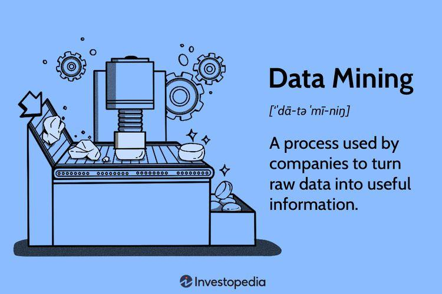

## Table of Contents

## What is data mining?

Data mining is like digging through a big pile of dirt to find valuable gems. It's a way to look through large amounts of data to find useful information or patterns that were not obvious before. People use special computer programs to do this because it would take too long to do it by hand. These programs can find things like what customers are likely to buy together or how to make a business run better.

It's used in many places, like stores, hospitals, and banks. For example, a store might use data mining to see what products people often buy at the same time. This helps them put those items closer together in the store or make special deals to sell more. In hospitals, data mining can help doctors see patterns in patient data to make better treatments. It's a powerful tool, but it needs to be used carefully to protect people's privacy and make sure the information found is correct.

## What are the main goals of data mining?

The main goals of data mining are to find patterns and relationships in large sets of data. Imagine you have a huge box of puzzle pieces. Data mining helps you figure out which pieces fit together without looking at each one by hand. This can help businesses understand what their customers like or how to make things work better. For example, a store might find out that people who buy bread also often buy milk. This kind of information can help the store decide where to put items or what deals to offer.

Another goal is to predict future trends or behaviors. By looking at past data, data mining can guess what might happen next. This is like using the weather data from the past few weeks to predict if it will rain tomorrow. For a company, this could mean figuring out which products will be popular in the future or how many of something they should make. This helps them plan better and save money. Both finding patterns and predicting the future help make smart decisions based on data, not just guesses.

## What are the common applications of data mining?

Data mining is used in many places to help understand big piles of information. In stores, it helps figure out what people like to buy together. For example, if lots of people buy bread and milk at the same time, the store might put these items next to each other. This can help the store sell more and make customers happy. Data mining also helps stores predict what will be popular in the future, so they can have the right amount of products ready.

In healthcare, data mining looks at patient information to find patterns that can help doctors make better treatments. It can show which medicines work best for certain sicknesses or how to stop diseases from spreading. This can make healthcare better and save lives. In banks, data mining helps find out if someone might not pay back a loan. It looks at things like how much money they make and if they've paid back loans before. This helps banks decide who to give money to and keeps the bank safe.

Data mining is also used in marketing to see what ads work best. Companies can find out which ads make people buy things and which ones don't. This helps them spend their money on the right ads. In social media, data mining helps understand what people like to share and talk about. This can help make the social media site more fun for users. Overall, data mining helps many different places use their information better to make smarter choices.

## What are the basic steps involved in the data mining process?

The data mining process starts with collecting and cleaning the data. Imagine you're sorting through a big pile of toys. You need to pick out the ones that are broken or not needed. In data mining, this means getting all the information together and making sure it's correct and ready to use. This step is important because if the data is messy, the results won't be good. After cleaning the data, the next step is to explore it. This is like looking at your toys to see what kinds you have and how many of each. In data mining, this means using tools to look at the data and see what patterns or interesting things you can find.

Once the data is explored, the next step is to build models. This is like using your toys to build something new, like a castle or a spaceship. In data mining, this means using special computer programs to create models that can predict things or find patterns in the data. After building the models, the last step is to test them and see if they work well. This is like checking if your toy castle can stand up or if your spaceship can fly. If the models work well, they can be used to make decisions or predict what will happen in the future. If they don't work well, you might need to go back and clean the data again or try a different model.

## What is the difference between data mining and data analysis?

Data mining and data analysis are both ways to look at data, but they do different things. Data mining is like searching through a huge pile of information to find hidden patterns or connections that you didn't know about before. It uses special computer programs to look through lots of data and find things that are not easy to see. For example, a store might use data mining to figure out that people who buy bread also often buy milk. This helps them make smart decisions, like putting bread and milk next to each other in the store.

Data analysis, on the other hand, is more about understanding the data you already have. It's like looking at a smaller pile of information and asking questions about it. Data analysis helps you see what's happening right now or what happened in the past. For example, a store might use data analysis to see how many loaves of bread they sold last month. This helps them know if they need to order more bread or if they sold too much. While data mining looks for new, hidden patterns, data analysis focuses on understanding the data you already know about.

## What are some popular data mining techniques?

One popular data mining technique is called association rule learning. This is like finding out which items people often buy together at a store. For example, if lots of people buy bread and milk at the same time, the store can use this information to put these items next to each other. This helps the store sell more and makes shopping easier for customers. Another technique is clustering, which groups similar things together. Imagine sorting your toys into piles of cars, dolls, and blocks. Clustering helps find groups in data that are similar, like customers who buy similar things or patients with similar health problems.

Another common technique is classification, which is like sorting things into different boxes. For example, a bank might use classification to decide if someone will pay back a loan or not. They look at things like how much money the person makes and if they've paid back loans before. This helps the bank make smart decisions about who to give money to. Lastly, there's prediction, which is like guessing what will happen next. For example, a store might use past sales data to predict how many of a certain product they will sell next month. This helps them have the right amount of products ready and not waste money.

## How does data preprocessing affect the results of data mining?

Data preprocessing is like cleaning and organizing your room before you start a big project. If your room is messy, it's hard to find what you need and you might make mistakes. In data mining, if the data is messy or has mistakes, the results won't be good. Data preprocessing makes sure the data is clean and ready to use. It involves fixing errors, filling in missing information, and getting rid of data that isn't needed. If you don't do this, the patterns and predictions you find might be wrong.

When the data is clean and organized, data mining works much better. It's easier to find real patterns and make good predictions. For example, if a store wants to know what people buy together, they need to make sure their sales data is correct. If there are mistakes in the data, like wrong prices or missing sales, the store might think people buy things together that they really don't. So, data preprocessing is really important because it makes sure the data mining results are correct and useful.

## What are the challenges faced in data mining?

Data mining can be tricky because it deals with huge amounts of information. One big challenge is making sure the data is clean and correct. If the data has mistakes or missing pieces, the patterns and predictions you find might be wrong. This is like trying to solve a puzzle with pieces that don't fit together properly. Another challenge is keeping people's information private. When you look through lots of data, you need to be careful not to share personal details about anyone. It's important to follow rules and laws to protect people's privacy.

Another difficulty is figuring out which data mining methods to use. There are many different techniques, and choosing the right one can be hard. It's like picking the best tool for a job; if you use the wrong tool, you won't get good results. Also, data mining can take a lot of time and computer power. Big sets of data need strong computers to look through them quickly. If the computers are slow, it can take too long to find the patterns you need. These challenges make data mining a complex task, but with the right approach, it can still be very helpful.

## How can data mining be used to improve business decisions?

Data mining helps businesses make better decisions by finding patterns in big piles of information. Imagine a store that wants to know what products people buy together. By using data mining, the store can see that lots of people buy bread and milk at the same time. This helps the store decide to put these items next to each other, making shopping easier for customers and helping the store sell more. Data mining can also help a business understand what its customers like. For example, if a company sees that people often buy certain products, they can make more of those products or offer special deals to sell even more.

Another way data mining improves business decisions is by predicting what will happen in the future. A store can use past sales data to guess how many of a certain product they will sell next month. This helps them order the right amount of products and not waste money. Banks can use data mining to decide if someone will pay back a loan. They look at things like how much money the person makes and if they've paid back loans before. This helps the bank make smart choices about who to give money to, keeping the bank safe and helping more people get loans. By using data mining, businesses can make decisions based on real information, not just guesses.

## What ethical considerations should be taken into account in data mining?

Data mining can help businesses and other groups make good choices, but it also has some big ethical worries. One big worry is keeping people's information private. When you look through lots of data, you might see personal details about people, like what they buy or where they go. It's very important to follow rules and laws to protect this information and make sure it's not shared without permission. Another worry is being fair. Data mining can sometimes treat different groups of people differently, like giving them different prices or ads. This can be unfair and needs to be watched carefully.

Another ethical issue is making sure the results from data mining are correct and not biased. If the data has mistakes or if the methods used are not fair, the patterns and predictions might be wrong. This can lead to bad decisions that hurt people or businesses. It's important to check the data and the methods used to make sure they are right. Overall, while data mining can be very helpful, it needs to be done in a way that respects people's privacy, is fair, and uses correct information.

## How do advanced algorithms enhance the effectiveness of data mining?

Advanced algorithms make data mining better by finding patterns and making predictions more accurately. They can look through huge amounts of data quickly and find things that might be hard to see with simpler methods. For example, machine learning algorithms can learn from the data and get better over time. This means they can find more complex patterns and make better guesses about what will happen next. These algorithms can also handle different types of data, like numbers, words, and pictures, which helps businesses understand their information in new ways.

Using advanced algorithms also helps businesses make smarter decisions. For instance, a store can use these algorithms to see what products people often buy together and put them closer in the store. This can help the store sell more and make shopping easier for customers. Also, these algorithms can predict what will be popular in the future, so the store can have the right amount of products ready. By using advanced algorithms, businesses can use their data to make choices that are based on real information, not just guesses.

## What are the future trends and developments in the field of data mining?

In the future, data mining will become even more important as more and more data is created every day. One big trend is the use of artificial intelligence (AI) and machine learning to make data mining better. These technologies can learn from the data and find patterns that are too complex for older methods. This means businesses and other groups can understand their information in new ways and make even smarter decisions. For example, a store could use AI to predict what products will be popular next month and make sure they have enough in stock. Another trend is the use of real-time data mining, where patterns and predictions are made as new data comes in. This helps businesses react quickly to changes and stay ahead of their competition.

Another important development is the focus on privacy and ethics in data mining. As people become more worried about their personal information, laws and rules about how data can be used will get stricter. This means data mining will need to be done in ways that protect people's privacy and are fair to everyone. Companies will need to be very careful about how they collect and use data, and they will need to be open about what they are doing. At the same time, new methods will be developed to make sure data mining results are correct and not biased. These trends and developments will help data mining continue to be a powerful tool for understanding big piles of information, while also making sure it is used in a way that is good for everyone.

## What are the key techniques and tools?

Several data mining techniques, including clustering, classification, and regression, are integral to algorithmic trading, enhancing data analysis and decision-making processes.

Clustering is a technique that groups similar data points within large datasets. This method is pivotal for identifying patterns and trends, providing insights that can be leveraged for strategic trading decisions. For example, clustering can be used to segment stocks with similar price movements, thereby identifying correlated instruments or emerging market trends.

Classification models play a crucial role in predicting the likelihood of certain market events, which is essential for effective risk management. These models categorize data into predefined classes, helping traders assess potential outcomes of trading decisions. A common application of classification in algorithmic trading is determining whether a market condition is likely to be bullish or bearish based on current and historical data.

Regression techniques are fundamental for predicting future price movements based on historical data. Linear regression, one of the simplest forms, models the relationship between a dependent variable and one or more independent variables. Traders use regression to forecast price levels, [volatility](/wiki/volatility-trading-strategies), and other market metrics. The regression model can be expressed mathematically as:

$$
Y = \beta_0 + \beta_1X_1 + \beta_2X_2 + \ldots + \beta_nX_n + \epsilon
$$

where $Y$ is the predicted value, $\beta_0$ is the intercept, $\beta_1, \beta_2, \ldots, \beta_n$ are coefficients for the independent variables $X_1, X_2, \ldots, X_n$, and $\epsilon$ is the error term.

To implement these techniques effectively, traders rely on powerful data mining tools and languages. Python and R are among the most popular due to their extensive libraries and frameworks for data analysis and visualization. Libraries such as pandas, numpy, and scikit-learn in Python facilitate data manipulation, statistical analysis, and implementation of [machine learning](/wiki/machine-learning) algorithms. Similarly, R provides robust packages like caret and randomForest, which are valuable for classification and regression tasks.

Additionally, dedicated trading platforms offer specialized features that integrate data mining capabilities directly into trading workflows. These platforms frequently include modules for executing these techniques in real-time, enabling traders to develop and deploy robust algorithmic strategies efficiently. 

Overall, mastering these data mining techniques and tools empowers algorithmic traders to gain significant insights into market behaviors and optimize their trading strategies for better performance.

## References & Further Reading

[1]: ["Advances in Financial Machine Learning"](https://www.amazon.com/Advances-Financial-Machine-Learning-Marcos/dp/1119482089) by Marcos Lopez de Prado

[2]: ["Machine Learning for Algorithmic Trading"](https://github.com/stefan-jansen/machine-learning-for-trading) by Stefan Jansen

[3]: ["Quantitative Trading: How to Build Your Own Algorithmic Trading Business"](https://books.google.com/books/about/Quantitative_Trading.html?id=j70yEAAAQBAJ) by Ernest P. Chan

[4]: ["Evidence-Based Technical Analysis: Applying the Scientific Method and Statistical Inference to Trading Signals"](https://www.amazon.com/Evidence-Based-Technical-Analysis-Scientific-Statistical/dp/0470008741) by David Aronson

[5]: Bergstra, J., Bardenet, R., Bengio, Y., & Kégl, B. (2011). ["Algorithms for Hyper-Parameter Optimization."](https://dl.acm.org/doi/10.5555/2986459.2986743) Advances in Neural Information Processing Systems 24.