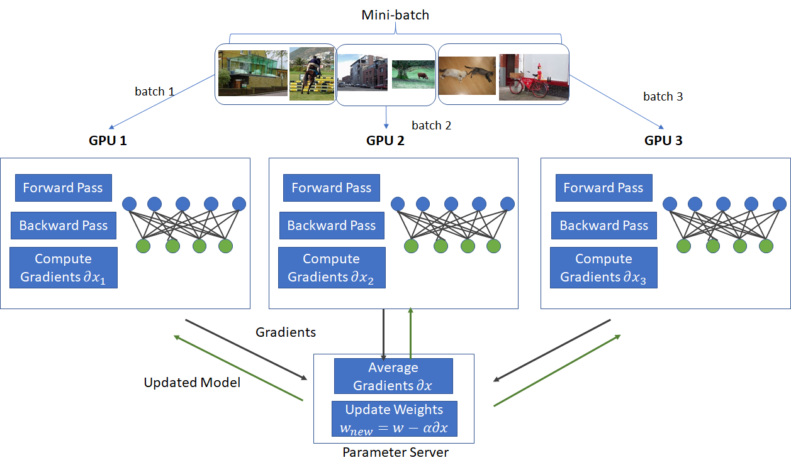

## Table of Contents

## What is data parallelism in machine learning?

Data parallelism in machine learning is a technique used to speed up the training of large models by distributing the data across multiple processing units, such as GPUs or CPUs. Instead of processing all the data on a single unit, the data is split into smaller chunks, and each chunk is processed simultaneously on different units. This approach allows the model to train faster because multiple parts of the data are being processed at the same time.

For example, if you have a large dataset and four GPUs, you can divide the data into four equal parts. Each GPU will then process its part of the data independently, and the results are combined to update the model. This method is especially useful for deep learning models, where training can take a long time due to the large amount of data and complex computations involved. By using data parallelism, you can significantly reduce the time needed to train these models, making the process more efficient.

## How does data parallelism differ from model parallelism?

Data parallelism and model parallelism are two different strategies to speed up the training of machine learning models. In data parallelism, the data is split into smaller chunks and each chunk is processed on different processing units, like GPUs or CPUs. For example, if you have a dataset and four GPUs, you can divide the data into four parts. Each GPU will process one part of the data, and the results are combined to update the model. This method is great for speeding up the training process because multiple parts of the data are being worked on at the same time.

On the other hand, model parallelism involves splitting the model itself across different processing units. Instead of dividing the data, the model's layers or parameters are distributed. This is useful when the model is very large and cannot fit into the memory of a single processing unit. For instance, if you have a deep neural network with many layers, you can assign different layers to different GPUs. Each GPU will handle a part of the model, and they work together to process the entire dataset. This approach is particularly helpful for very large models where memory constraints are a big issue.

Both methods aim to make training faster and more efficient, but they do so in different ways. Data parallelism is more about handling large datasets quickly, while model parallelism focuses on managing large models. Depending on the specific needs of your project, you might choose one over the other or even use a combination of both.

## What are the benefits of using data parallelism in training machine learning models?

Data parallelism helps make training [machine learning](/wiki/machine-learning) models faster. When you have a lot of data, it can take a long time to train a model on just one computer. But with data parallelism, you can split the data into smaller pieces and use several computers or GPUs at the same time. This way, each piece of data is processed quickly, and the overall training time goes down a lot. It's like having many people working on different parts of a big puzzle at the same time, instead of just one person trying to do it all.

Another benefit of data parallelism is that it makes better use of the hardware you have. If you have multiple GPUs, you can use all of them to work on your model at the same time. This means you don't have to wait for one GPU to finish before starting on the next piece of data. It's more efficient because all your hardware is being used, and you can get results faster. This is especially helpful when you're working with big datasets and complex models, where every bit of speed counts.

## Can you explain the process of implementing data parallelism in a neural network?

To implement data parallelism in a [neural network](/wiki/neural-network), you start by dividing your dataset into smaller parts. Imagine you have a big pile of data, and you split it into four smaller piles. Each of these smaller piles will be sent to a different GPU or CPU. For example, if you're using four GPUs, each GPU will get one of these smaller piles. Then, each GPU will work on its own pile of data at the same time. They'll all be doing the same thing, like calculating how well the model is doing and updating the model's parameters, but with different pieces of data. Once they're done, the results from all the GPUs are combined to update the model. This way, you can train the model much faster because all the GPUs are working together.

After the GPUs process their parts of the data, you need to make sure the model's updates are shared correctly. This is done through a process called synchronization. When each GPU finishes its calculations, it sends its updates to the other GPUs. They all agree on the best way to update the model, so the model stays consistent across all the GPUs. This step is important because it makes sure that all the GPUs are working towards the same goal. By using data parallelism, you can make the most out of your hardware and speed up the training process, which is really helpful when you're working with big datasets and complex models.

## What are the common frameworks that support data parallelism, and how do they implement it?

Common frameworks that support data parallelism include TensorFlow, PyTorch, and Apache MXNet. These frameworks make it easier to split your data across multiple GPUs or CPUs and handle the synchronization of model updates. For example, TensorFlow uses a concept called "MirroredStrategy" to implement data parallelism. In this approach, TensorFlow automatically divides the data into smaller parts and sends each part to a different GPU. It then combines the results from all GPUs to update the model. PyTorch, on the other hand, uses a module called "DistributedDataParallel" (DDP) to achieve the same goal. With DDP, PyTorch splits the data and ensures that each GPU works on its own part, then synchronizes the updates across all GPUs.

In TensorFlow, you can implement data parallelism by using the `tf.distribute.MirroredStrategy` class. This class creates a copy of the model on each GPU, and each copy processes a different part of the data. After processing, TensorFlow uses an "all-reduce" operation to combine the gradients from all GPUs and update the model. Here's a simple example of how you might use it:

```python
import tensorflow as tf

strategy = tf.distribute.MirroredStrategy()
with strategy.scope():
    model = ...  # Define your model
    model.compile(...)

dataset = ...  # Define your dataset
model.fit(dataset)
```

PyTorch's implementation of data parallelism with `DistributedDataParallel` is similar but uses a different approach. PyTorch splits the data using a `DataLoader` and then wraps the model with `DistributedDataParallel`. This ensures that each GPU processes its own part of the data, and the gradients are synchronized across all GPUs. Here's a basic example of how you might set it up:

```python
import torch
import torch.nn as nn
import torch.distributed as dist
from torch.nn.parallel import DistributedDataParallel as DDP

model = ...  # Define your model
model = DDP(model)

dataset = ...  # Define your dataset
dataloader = ...  # Define your dataloader

for data, target in dataloader:
    output = model(data)
    loss = ...  # Calculate loss
    loss.backward()
    optimizer.step()
```

Both frameworks handle the complexities of data parallelism, making it easier for you to train your models faster and more efficiently.

## How does data parallelism affect the performance and scalability of machine learning models?

Data parallelism helps make machine learning models train faster by spreading the work across multiple GPUs or CPUs. When you have a lot of data, it can take a long time to train a model on just one computer. But with data parallelism, you can split the data into smaller pieces and use several computers or GPUs at the same time. Each piece of data is processed quickly, and the overall training time goes down a lot. It's like having many people working on different parts of a big puzzle at the same time, instead of just one person trying to do it all. This makes the training process more efficient and speeds up how quickly you can get results.

In terms of scalability, data parallelism allows you to handle bigger datasets and more complex models. If you add more GPUs, you can process more data at the same time, which means you can train on larger datasets without slowing down. This is really helpful when you're working with big data and need to train models quickly. However, there are some challenges to consider. As you add more GPUs, you need to make sure they can communicate well with each other to keep the model updates consistent. This can add some overhead, but the benefits of faster training and the ability to handle larger datasets usually outweigh these costs.

## What are the potential challenges and limitations of using data parallelism?

Using data parallelism can make training machine learning models faster, but it also comes with some challenges. One big challenge is the communication overhead between different GPUs or CPUs. When each GPU processes its part of the data, they need to share their results to update the model. This sharing can slow things down, especially if you have a lot of GPUs. Another challenge is that not all models can benefit equally from data parallelism. Some models might have parts that are hard to split or need a lot of communication, which can limit how much faster they can train.

Another limitation is that data parallelism might not work well for very small datasets. If you split a small dataset into even smaller pieces, each GPU might not have enough data to work on, which can lead to inefficient training. Also, setting up and managing data parallelism can be tricky. You need to make sure all the GPUs are working together correctly, and this can take some time to get right. If not set up properly, you might not see the speed improvements you expect, or you might even run into errors during training.

## How can data parallelism be optimized for different hardware configurations?

Optimizing data parallelism for different hardware configurations involves understanding the capabilities and limitations of your hardware. For example, if you have a system with multiple GPUs, you want to make sure that the data is split evenly across them so that each GPU has enough work to do. This can be done by adjusting the batch size and the number of GPUs you use. If you have a lot of GPUs, you might need to use a larger batch size to keep them all busy. On the other hand, if you have fewer GPUs, a smaller batch size might be more efficient. You also need to consider the communication speed between the GPUs. If the GPUs can communicate quickly, you can use more of them without slowing down the training too much.

Another important aspect is the type of hardware you're using. Different GPUs have different amounts of memory and processing power. For instance, newer GPUs might have more memory, allowing you to use larger models and bigger batch sizes. You can also use techniques like mixed precision training, which can help you fit larger models into the memory of your GPUs. This involves using lower precision data types, like half-precision (float16) instead of full precision (float32), which can speed up the training and reduce memory usage. By carefully tuning these settings based on your hardware, you can make the most out of data parallelism and train your models more efficiently.

## What are some advanced techniques for improving the efficiency of data parallelism?

One advanced technique for improving the efficiency of data parallelism is gradient accumulation. This method allows you to use a larger effective batch size without increasing the memory usage of each GPU. Instead of updating the model after processing each mini-batch, you accumulate the gradients over several mini-batches and then perform a single update. This can be particularly useful when working with limited GPU memory because it allows you to simulate the effect of a larger batch size. For example, if you want to use a batch size of 1024 but each GPU can only handle 256, you can process four mini-batches of 256 and accumulate the gradients before updating the model. This way, you get the benefits of a larger batch size without needing more memory.

Another technique is to use asynchronous updates, where each GPU processes its data and updates the model independently without waiting for the others. This can reduce the communication overhead between GPUs, making the training process faster. However, it can also lead to less stable training because the model updates might not be perfectly synchronized. To balance this, you can use techniques like delayed updates, where each GPU waits for a certain number of updates from other GPUs before applying its own. This can help maintain the stability of the training process while still benefiting from the speed of asynchronous updates. By carefully tuning these advanced techniques, you can significantly improve the efficiency of data parallelism and make the most out of your hardware.

## How does data parallelism interact with other distributed training techniques?

Data parallelism works well with other distributed training techniques like model parallelism and pipeline parallelism. When you use data parallelism with model parallelism, you split both the data and the model across different GPUs. This can be really helpful when you have a very large model that doesn't fit into the memory of a single GPU. For example, you might use data parallelism to split the data across four GPUs, and then use model parallelism to split the model's layers across those same GPUs. This way, you can train a big model on a big dataset much faster.

Another technique that works well with data parallelism is pipeline parallelism. In pipeline parallelism, different parts of the model are processed in a sequence across multiple GPUs. When you combine this with data parallelism, you can split the data and process it in parallel, while also splitting the model into stages that are processed one after the other. This can help you train even faster because you're using both parallel processing of data and sequential processing of the model's stages. By using these techniques together, you can make the most out of your hardware and train complex models on large datasets more efficiently.

## Can you discuss a case study where data parallelism significantly improved model training?

A great example of how data parallelism can speed up model training comes from a project at a big tech company. They were working on a [deep learning](/wiki/deep-learning) model to recognize images in a huge database. The model was very complex, and training it on a single GPU would take weeks. By using data parallelism, they split the huge database into smaller parts and used eight GPUs to train the model at the same time. Each GPU worked on its own part of the data, and they combined the results to update the model. This made the training process much faster, finishing in just a few days instead of weeks. It was a big win because they could train the model much quicker and start using it to recognize images sooner.

In another case, a research team was working on a natural language processing model. They had a lot of text data to train on, and the model was also very large. They decided to use data parallelism along with model parallelism to make the training faster. They split the data across four GPUs and also divided the model's layers across these GPUs. This way, each GPU could work on its part of the data and its part of the model at the same time. The result was that they were able to train the model in half the time it would have taken on a single GPU. This combination of data and model parallelism helped them handle both the large dataset and the complex model more efficiently, leading to quicker results and better performance.

## What future developments can we expect in data parallelism for machine learning?

In the future, we can expect data parallelism to become even more efficient as hardware continues to improve. New GPUs and CPUs with more memory and faster processing speeds will make it easier to split and process large datasets across multiple units. This means that training complex models on huge amounts of data will become faster and more manageable. Additionally, improvements in communication technology between GPUs will reduce the overhead of syncing model updates, making data parallelism even more effective.

We might also see new software techniques that make data parallelism easier to use and more flexible. For example, frameworks like TensorFlow and PyTorch could introduce more automated ways to split data and manage model updates, making it simpler for researchers and engineers to take advantage of data parallelism without needing to do a lot of manual setup. These advancements will help make machine learning more accessible and efficient, allowing for quicker development and deployment of models across various industries.