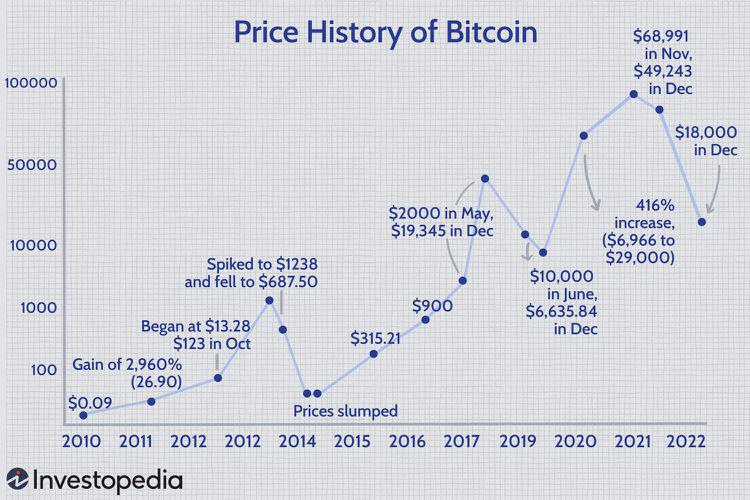

## Table of Contents

## What is the Bitcoin blockchain?

The Bitcoin blockchain is a digital ledger that records all Bitcoin transactions. It's like a big notebook where every page shows who sent Bitcoin to whom and how much. This notebook is shared across many computers around the world, so everyone can see and check the transactions. This makes it very hard for anyone to cheat or change the records because they would need to change it on all the computers at the same time.

Each page in this notebook is called a "block," and new blocks are added to the notebook about every 10 minutes. When someone wants to send Bitcoin, their transaction gets added to a new block. Once a block is full, it gets locked and added to the chain of blocks, which is why it's called a blockchain. This system helps keep Bitcoin safe and trustworthy because once a transaction is in a block, it's very hard to change it.

## What types of data can be recorded on the Bitcoin blockchain?

The Bitcoin blockchain mainly records transactions. These are the records of people sending and receiving Bitcoin. Each transaction shows who sent the Bitcoin, who received it, and how much was sent. This information is public, so anyone can look at it and see the history of Bitcoin movements.

Besides transactions, the Bitcoin blockchain can also store small pieces of data. This is often called "embedding" or "inscribing" data. People can add short messages or other types of information to transactions. However, because the blockchain is meant for financial transactions, it's not good for storing large amounts of data like pictures or long documents.

## How is data stored on the Bitcoin blockchain?

Data on the Bitcoin blockchain is stored in a special way. When someone wants to send Bitcoin, they create a transaction. This transaction includes details like who is sending the Bitcoin, who is receiving it, and how much is being sent. This information is written into a block, which is like a page in a big notebook. Each block can hold many transactions, and once a block is full, it gets added to the chain of blocks, which is why it's called a blockchain.

Besides transactions, people can also add small pieces of data to the blockchain. They do this by including the data in the transaction itself. This could be a short message or some other small piece of information. The data gets stored along with the transaction details in the block. Because the blockchain is mainly for financial transactions, it's not meant for storing large files like pictures or long documents. So, the data that can be added is limited in size.

## What is a Bitcoin transaction and how does it relate to data recording?

A Bitcoin transaction is when someone sends Bitcoin to someone else. It's like sending money, but instead of using banks, it happens on the Bitcoin network. When you want to send Bitcoin, you create a transaction that says who is sending the Bitcoin, who is getting it, and how much is being sent. This transaction gets added to a block, which is like a page in a big notebook that everyone on the Bitcoin network can see.

Besides sending Bitcoin, you can also add a little bit of extra information to the transaction. This is called embedding or inscribing data. It could be a short message or some other small piece of information. This data gets stored along with the transaction details in the block. Because the Bitcoin blockchain is mainly for financial transactions, you can't add big files like pictures or long documents. So, the extra information you can add is limited in size.

## Can you explain the concept of a blockchain block and its role in data storage?

A blockchain block is like a page in a big notebook. In the Bitcoin blockchain, each block holds a bunch of transactions. A transaction is when someone sends Bitcoin to someone else. So, each block is full of information about who sent Bitcoin, who received it, and how much was sent. Once a block is full, it gets added to the chain of blocks, which is why it's called a blockchain.

Blocks also play a key role in storing data on the Bitcoin blockchain. Besides transactions, you can add a little bit of extra information to a transaction. This could be a short message or some other small piece of data. This extra information gets stored along with the transaction details in the block. Because the Bitcoin blockchain is mainly for financial transactions, you can't add big files like pictures or long documents. So, the extra information you can add is limited in size.

## What are the differences between on-chain and off-chain data storage in Bitcoin?

On-chain data storage in Bitcoin means that the data is recorded directly on the Bitcoin blockchain. This is like writing something in a big notebook that everyone can see. When you send Bitcoin, the details of the transaction, like who sent it, who received it, and how much was sent, are written into a block on the blockchain. You can also add a little bit of extra information, like a short message, to the transaction. But because the blockchain is mainly for financial transactions, you can't add big files like pictures or long documents.

Off-chain data storage, on the other hand, means that the data is stored somewhere else, not on the Bitcoin blockchain. This could be on a regular computer or a special service that keeps data. People might use off-chain storage to keep bigger files or more private information that they don't want everyone to see. Sometimes, they might add a small note on the blockchain that points to where the off-chain data is stored, but the actual data is kept off the blockchain. This way, the Bitcoin blockchain stays focused on financial transactions and doesn't get too big and slow.

## How does the Bitcoin network ensure the integrity and security of recorded data?

The Bitcoin network keeps the data safe and trustworthy by using a system called consensus. This means that lots of computers around the world, called nodes, have to agree on what gets added to the blockchain. When someone wants to add a new block with transactions, the nodes check to make sure the transactions are correct and follow the rules. If most of the nodes agree, the new block gets added to the chain. This makes it very hard for anyone to cheat or change the data because they would need to control most of the nodes, which is very difficult.

Another way the Bitcoin network protects the data is through something called cryptographic hashing. Each block has a special code, called a hash, that is made from all the data in the block. If anyone tries to change even a tiny bit of the data in a block, the hash will change, and the nodes will notice that something is wrong. Plus, each block also has the hash of the previous block, making a chain of hashes. This makes the blockchain very secure because changing one block would mean changing all the blocks that come after it, which is nearly impossible.

## What are the limitations and costs associated with recording data on the Bitcoin blockchain?

Recording data on the Bitcoin blockchain has some limitations. The main one is that you can't store big files like pictures or long documents. The blockchain is meant for financial transactions, so it's not set up to handle large amounts of data. You can only add small pieces of information, like short messages. Also, once data is on the blockchain, it's there forever and everyone can see it, so it's not good for private or secret information.

There are also costs to think about. Every time you add data to the blockchain, you have to pay a fee, called a transaction fee. These fees can change based on how busy the network is. If lots of people are trying to add data at the same time, the fees can go up. Plus, because the data stays on the blockchain forever, it makes the whole system bigger and slower over time. So, it's important to think carefully about what you're adding and how much it will cost.

## How can one embed data into a Bitcoin transaction?

Embedding data into a Bitcoin transaction is like adding a little note to your money when you send it. When you want to send Bitcoin, you create a transaction that says who is sending the Bitcoin, who is getting it, and how much is being sent. Along with this information, you can add a small piece of data, like a short message or a code. This data gets stored along with the transaction details in a block on the blockchain. It's important to keep the data small because the blockchain is mainly for financial transactions, not for storing big files.

To actually embed the data, you need to use special software or a service that lets you add this extra information to your transaction. You write your message or data into the transaction in a way that follows the rules of the Bitcoin network. Once you've done that, you send the transaction to the network, and if everything is correct, it will get added to a block. Remember, you'll have to pay a fee for adding this data, and the fee can change depending on how busy the network is. So, it's a good idea to check the current fees before you send your transaction.

## What are the potential use cases for recording data on the Bitcoin blockchain?

One of the main uses for recording data on the Bitcoin blockchain is to keep a record of important information that can't be changed. For example, companies might use it to show when they did something or to prove that something happened at a certain time. This can be helpful for things like contracts or certificates because once the data is on the blockchain, it's there forever and everyone can see it. It's like having a public notebook where you can write down important stuff and know that it will always be there and can't be changed.

Another use is for adding extra information to Bitcoin transactions. People might want to send a short message along with their Bitcoin, like a thank you note or a special code. This can make the transaction more personal or useful. Also, some people use the blockchain to store small pieces of data that point to bigger files stored somewhere else. This way, they can use the blockchain to keep track of where the big files are, but without making the blockchain slow or too big.

## What are the advanced techniques for optimizing data storage on the Bitcoin blockchain?

One way to make better use of the Bitcoin blockchain for storing data is by using a technique called "OP_RETURN." This lets you add a small piece of information to a transaction without using up space that could be used for sending Bitcoin. OP_RETURN is like a special note you can leave on the blockchain that doesn't affect the money part of the transaction. It's useful because it helps keep the blockchain focused on financial stuff while still letting you add extra data. But remember, the space for this note is very small, so you can only add short messages or codes.

Another advanced technique is using "transaction malleability." This is a bit trickier and involves changing the way transactions are written so they can hold more data. It's like finding extra space in the transaction to squeeze in more information. But this method can be risky because it might mess up the transaction if not done right. People who know a lot about how the Bitcoin network works might use this to store more data, but it's not something everyone should try because it can be complicated and might cause problems.

## How does the scalability of the Bitcoin blockchain affect data recording practices?

The Bitcoin blockchain has a problem with scalability, which means it can get slow and expensive when lots of people want to use it at the same time. This affects how people record data on the blockchain because every piece of data you add takes up space and costs money. When the network is busy, the fees for adding data can go up a lot, making it more expensive to store information. So, people have to be careful about what they add and think about whether it's worth the cost.

Because of these scalability issues, people have come up with ways to use the blockchain more efficiently. One way is to use off-chain storage for big files and just put a small note on the blockchain that points to where the file is stored. This helps keep the blockchain from getting too big and slow. Another way is to use special techniques like OP_RETURN to add small pieces of data without taking up space needed for financial transactions. These methods help make the most of the limited space on the Bitcoin blockchain.

## What is the structure of Bitcoin's blockchain?

Bitcoin's blockchain is an integral component in ensuring the secure and efficient execution of Bitcoin transactions. It consists of a series of linked blocks, each functioning as a repository of transaction data. This block structure is crucial not only for maintaining the integrity and security of the data but also for enabling the decentralized nature of the network.

Each block within Bitcoin's blockchain is composed of a block header and a collection of transactions. The block header serves as the metadata for the block, playing an essential role in linking blocks together and ensuring the integrity of transaction data. It is comprised of several key elements:

1. **Previous Block Hash**: This field contains the hash of the block header of the preceding block, effectively linking one block to another and forming a chain. This linkage ensures that altering any block requires changes to all subsequent blocks, which is computationally impractical, thereby enhancing security.

2. **Merkle Root**: The Merkle root is a critical component that provides a single secure summary of all transactions within a block. It is derived using a binary tree (Merkle tree) structure, where each leaf node represents a transaction hash, and non-leaf nodes are hashed values of its child nodes. The final root of this tree is the Merkle root, serving as a compact representation of all transactions:
$$
   Merkle\ Root = Hash(Hash(T_1) \parallel Hash(T_2)) \parallel Hash(Hash(T_3) \parallel Hash(T_4)) \ldots

$$

   This structure allows for efficient and secure verification of transactions, enabling quick checks on whether a transaction is included in a block without storing all transactions themselves.

3. **Timestamp**: The block header also comprises a timestamp, denoting when the block was created. This helps organize blocks chronologically and assists network nodes in reaching consensus on the blockchain's state.

4. **Nonce and Difficulty Target**: These fields are utilized in the proof-of-work algorithm. The nonce is a variable that miners adjust to create a hash below the target difficulty, necessary for validating a new block. This ensures that block addition requires computational effort, aligning with Bitcoin's decentralized ethos by preventing easy manipulations and controlling the issuance rate.

Understanding this complex structure is vital for developers who create applications that interact with the blockchain and for traders who rely on it for transactional integrity and validation processes. By appreciating the layered design of Bitcoin's blockchain, stakeholders can devise more effective strategies for engaging with the network, ensuring secure and efficient transaction processing. As blockchain technology continues to evolve, the insights gained from understanding these structural elements will be essential in unlocking new potentials in [cryptocurrency](/wiki/cryptocurrency) trading and decentralized applications.

## References & Further Reading

[1]: Bergstra, J., Bardenet, R., Bengio, Y., & Kégl, B. (2011). ["Algorithms for Hyper-Parameter Optimization."](https://proceedings.neurips.cc/paper/2011/file/86e8f7ab32cfd12577bc2619bc635690-Paper.pdf) Advances in Neural Information Processing Systems 24.

[2]: ["Advances in Financial Machine Learning"](https://www.amazon.com/Advances-Financial-Machine-Learning-Marcos/dp/1119482089) by Marcos Lopez de Prado

[3]: ["Evidence-Based Technical Analysis: Applying the Scientific Method and Statistical Inference to Trading Signals"](https://www.wiley.com/en-us/Evidence+Based+Technical+Analysis%3A+Applying+the+Scientific+Method+and+Statistical+Inference+to+Trading+Signals-p-9780470008744) by David Aronson

[4]: ["Machine Learning for Algorithmic Trading"](https://github.com/PacktPublishing/Machine-Learning-for-Algorithmic-Trading-Second-Edition) by Stefan Jansen

[5]: ["Quantitative Trading: How to Build Your Own Algorithmic Trading Business"](https://www.amazon.com/Quantitative-Trading-Build-Algorithmic-Business/dp/1119800064) by Ernest P. Chan