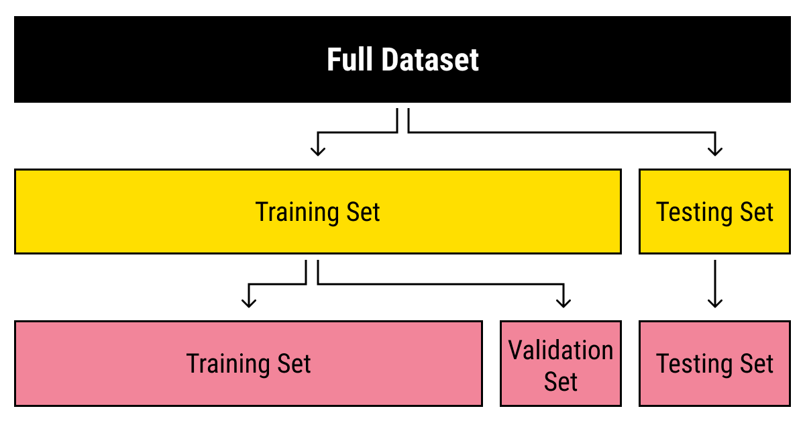

## Table of Contents

## What is a dataset in the context of machine learning?

A dataset in machine learning is a collection of data that is used to train, validate, and test machine learning models. This data can include numbers, text, images, or any other type of information that the model needs to learn from. For example, if you are building a model to recognize pictures of cats and dogs, your dataset would include many images labeled as either a cat or a dog. The quality and size of the dataset are very important because they directly affect how well the model can learn and perform its task.

Datasets are usually split into three parts: the training set, the validation set, and the test set. The training set is the largest part and is used to teach the model by showing it many examples. The validation set is used to check how well the model is learning during training, and it helps to make adjustments to improve the model's performance. Finally, the test set is used after training is complete to evaluate how well the model works on new, unseen data. This helps to make sure the model can generalize well to data it hasn't seen before.

## How do you collect data for a machine learning dataset?

Collecting data for a machine learning dataset can be done in many ways, depending on what you want your model to do. One common way is to gather data from the internet. For example, if you want to build a model to recognize different types of flowers, you can search for images of flowers online and download them. You can also use websites that already have collections of data, like Kaggle, where people share datasets for others to use. Another way is to create your own data. This might mean taking photos, recording sounds, or writing down information yourself. For instance, if you want to build a model to predict the weather, you could collect weather data by recording temperature, humidity, and other factors every day.

After you have collected the data, you need to make sure it is in a format that your machine learning model can use. This often means organizing the data into a table or a spreadsheet, where each row represents one example and each column represents a different piece of information about that example. For example, if you are collecting data about houses, each row might represent one house, and the columns might include information like the number of bedrooms, the size of the house, and the price. You also need to make sure your data is clean, which means checking for and fixing any mistakes or missing information. Once your data is organized and clean, you can split it into training, validation, and test sets to use with your machine learning model.

## What are the common types of datasets used in machine learning?

In [machine learning](/wiki/machine-learning), datasets come in many forms, but some of the most common types are tabular data, image data, and text data. Tabular data is organized into rows and columns, like a spreadsheet. Each row represents a single example, and each column represents a different feature or piece of information about that example. For example, a dataset about houses might have columns for the number of bedrooms, the size of the house, and the price. Image data is made up of pictures, which can be used to train models to recognize objects or faces. Text data includes written words, which can be used to train models for tasks like translating languages or answering questions.

Another type of dataset used in machine learning is time series data, which is information collected over time. This could be used to predict future values, like stock prices or weather patterns. For example, a dataset of daily temperatures could be used to train a model to predict the temperature for the next day. Audio data is another common type, which includes sounds and can be used to train models to recognize speech or music. Each of these types of datasets has its own challenges and requires different methods to process and analyze the data effectively.

In some cases, datasets can be a mix of different types of data. For example, a dataset about videos might include both image data (the frames of the video) and audio data (the sound). This kind of multi-modal data can be used to train models that need to understand and use different types of information at the same time. No matter what type of dataset you are using, the key is to make sure it is clean, well-organized, and large enough to train a good model.

## What is the difference between a training set, validation set, and test set?

In machine learning, a dataset is split into three parts: the training set, the validation set, and the test set. The training set is the largest part and is used to teach the model how to make predictions or decisions. You show the model lots of examples from the training set, and it learns from them. For example, if you are teaching a model to recognize cats and dogs, the training set would have many pictures of cats and dogs, each labeled correctly. The model looks at these pictures and learns what features make a cat a cat and a dog a dog.

The validation set is used while the model is being trained to check how well it is learning. You use the validation set to see if the model is getting better at making correct predictions. If it is not, you might need to change something about how the model is being trained. The validation set helps you make these adjustments without using the test set. The test set is used after the model is fully trained. It is a final check to see how well the model works on new data it has never seen before. This helps you know if the model can really do its job well in the real world.

## How do you preprocess a dataset before using it in machine learning?

Preprocessing a dataset is an important step before using it in machine learning. It involves cleaning and organizing the data so that the model can learn from it better. First, you need to check for and fix any missing or wrong data. For example, if you have a dataset about houses and some houses are missing the price, you need to decide what to do. You might fill in the missing prices with an average price or remove those houses from the dataset. You also need to make sure all the data is in the right format. For instance, if you have dates written in different ways, you need to change them all to the same format.

Next, you might need to change the data into numbers because many machine learning models work best with numbers. For example, if you have a column that says whether a house has a garden or not, you can change "yes" to 1 and "no" to 0. Sometimes, you also need to scale the data. This means making sure all the numbers are on a similar scale so that one column doesn't have too much influence over the model. For example, if you have a column for the size of the house in square feet and another for the number of bedrooms, the size column might have much bigger numbers. You can scale these numbers so they are all between 0 and 1. This helps the model learn better.

Finally, you might need to create new features from the existing data. This is called feature engineering. For example, if you have the date a house was sold, you might create a new feature that says how old the house was when it was sold. This can help the model make better predictions. After all these steps, you split the dataset into a training set, a validation set, and a test set. The training set is used to teach the model, the validation set helps you check how well the model is learning, and the test set is used to see how well the model works on new data.

## What are some common challenges when working with datasets in machine learning?

One common challenge when working with datasets in machine learning is dealing with missing or wrong data. Imagine you have a list of houses and their prices, but some houses don't have a price listed. You need to decide what to do with these missing prices. You might fill them in with an average price or remove those houses from your list. Another problem is when the data is not in the right format. For example, if you have dates written in different ways, like "01/01/2023" and "January 1, 2023," you need to change them all to look the same. This can take a lot of time and effort.

Another challenge is making sure the data is balanced. If you are trying to teach a model to recognize cats and dogs, but you have way more pictures of cats than dogs, the model might learn better about cats and not as well about dogs. You need to make sure you have a good mix of examples. Also, sometimes the data can be too big to handle easily. Imagine you have millions of pictures to sort through. It can be hard to process all that data quickly. You might need special tools or computers to help you.

Finally, choosing the right features to use in your model can be tricky. You need to decide which pieces of information are important for the model to learn from. For example, if you are trying to predict house prices, you might think the number of bedrooms is important, but maybe the color of the house isn't. This is called feature selection, and it can be hard to know which features will help the model make the best predictions. Sometimes, you might need to create new features from the data you already have, which can add another layer of complexity to your work.

## How do you handle missing or incomplete data in a dataset?

When you have missing or incomplete data in your dataset, one way to handle it is by filling in the missing parts with a good guess. For example, if you have a list of houses and some don't have a price listed, you could fill in those missing prices with the average price of all the other houses. This is called imputation. Another way is to just remove the examples that have missing data. If you have a lot of data, removing a few examples might not hurt your model too much. But if you don't have much data to start with, removing examples can make it harder for your model to learn well.

Another method to deal with missing data is to use a special value to show that the data is missing. This can help your model learn that some data is not there. For example, you might use a number like -999 to show that a price is missing. Some machine learning models can handle this kind of special value well. It's important to think about which method will work best for your specific dataset and what you are trying to do with your model. Trying different methods and seeing which one gives you the best results can be a good way to figure out what to do.

## What is data augmentation and how is it applied to datasets?

Data augmentation is a way to make your dataset bigger and more varied by changing the data you already have. Imagine you want to teach a model to recognize pictures of cats. You might not have enough pictures to start with, or the pictures you have might all look very similar. With [data augmentation](/wiki/data-augmentation), you can take one picture of a cat and make lots of new pictures by flipping it, rotating it, or changing its color a little bit. This way, your model gets to see many different versions of the same cat, which helps it learn better and work well with new pictures it hasn't seen before.

To apply data augmentation, you use special tools or write code to change your data. For example, if you are working with pictures, you might use a library like TensorFlow or PyTorch to flip, rotate, or zoom in on your pictures. If you are working with text, you might change some words to their synonyms or add a little bit of noise to the text. Data augmentation is very helpful because it makes your dataset more diverse, which can help your model learn better and be more accurate when it sees new data.

## How do you evaluate the quality of a dataset for machine learning?

Evaluating the quality of a dataset for machine learning involves checking several important aspects. First, you need to look at the completeness of the data. This means checking if there are any missing values and deciding how to handle them. If too much data is missing, it can make your model less accurate. You also need to check for errors or wrong data, like a house price that is way too high or too low. Cleaning up these mistakes is important to make sure your model learns the right things. Another thing to look at is the balance of the data. If you are trying to teach a model to recognize cats and dogs, but you have many more pictures of cats than dogs, your model might learn better about cats and not as well about dogs. Making sure your dataset has a good mix of examples is key.

Another important part of evaluating a dataset is looking at its relevance and representativeness. The data should be relevant to what you want your model to do. For example, if you are building a model to predict house prices, the data should include features that really affect the price, like the number of bedrooms or the size of the house. The dataset should also be representative of the real world. If you only have data from houses in one city, your model might not work well for houses in other cities. Finally, you need to check the size of the dataset. A bigger dataset usually helps your model learn better, but it also needs to be manageable. Sometimes, you might need to use data augmentation to make your dataset bigger and more varied, which can help improve the quality of your dataset and the performance of your model.

## What are some popular public datasets used in machine learning research?

One popular public dataset used in machine learning research is the MNIST dataset. This dataset contains images of handwritten digits from 0 to 9. It is often used to teach models how to recognize numbers. The dataset has 60,000 training examples and 10,000 test examples. Each image is small, just 28x28 pixels, which makes it easy to work with. Many researchers start with MNIST because it is a good way to test new ideas and see how well they work.

Another widely used dataset is the ImageNet dataset. This dataset has millions of images, each labeled with what is in the picture. It is used to train models to recognize objects in photos. ImageNet is much bigger and more complex than MNIST, which makes it harder to work with but also more useful for real-world tasks. Researchers use ImageNet to test how well their models can understand and categorize different things in pictures.

The CIFAR-10 and CIFAR-100 datasets are also very popular. CIFAR-10 has 60,000 small color images in 10 different classes, like airplanes, cars, and birds. CIFAR-100 is similar but has 100 classes. These datasets are good for testing how well a model can recognize different objects in a simpler setting than ImageNet. They are often used to compare different machine learning methods and see which ones work best.

## How do you scale and normalize data within a dataset?

Scaling and normalizing data are important steps to make sure all the numbers in your dataset are on the same level. This helps your machine learning model learn better because it stops one column from having too much power over the model. For example, if you have a dataset about houses with columns for the size in square feet and the number of bedrooms, the size column might have much bigger numbers. To scale the data, you can use a method called min-max scaling. This changes all the numbers so they are between 0 and 1. You do this by taking each number, subtracting the smallest number in the column, and then dividing by the difference between the biggest and smallest numbers in the column. The formula for min-max scaling is $$X_{\text{scaled}} = \frac{X - X_{\text{min}}}{X_{\text{max}} - X_{\text{min}}}$$.

Another way to normalize data is by using standardization. This method changes the data so it has a mean of 0 and a standard deviation of 1. Standardization is useful when your data follows a normal distribution, which means it looks like a bell curve. To standardize your data, you subtract the mean of the column from each number and then divide by the standard deviation of the column. The formula for standardization is $$X_{\text{standardized}} = \frac{X - \mu}{\sigma}$$, where $$\mu$$ is the mean and $$\sigma$$ is the standard deviation. Both scaling and normalizing help make sure all your data is on an even playing field, which can help your model learn better and make better predictions.

## What advanced techniques can be used to enhance dataset utility in deep learning?

One advanced technique to enhance dataset utility in [deep learning](/wiki/deep-learning) is transfer learning. Imagine you have already trained a model to recognize objects in pictures, like cats and dogs. Instead of starting from scratch, you can use what this model has learned to help you train a new model for a different but related task, like recognizing different types of birds. By using the knowledge from the first model, your new model can learn faster and with less data. This is especially useful when you don't have a lot of data for your new task, because the model can use what it already knows to make better guesses.

Another technique is using generative adversarial networks (GANs) for data augmentation. GANs are like two models that work together. One model tries to create new, fake data that looks real, while the other model tries to tell if the data is real or fake. Over time, the first model gets better at making realistic data, and the second model gets better at spotting fakes. You can use the realistic fake data created by the first model to make your dataset bigger and more varied. This can help your deep learning model learn better because it sees more examples, which can lead to better performance on new data.

## References & Further Reading

[1]: LeCun, Y., Cortes, C., & Burges, C. (1998). ["The MNIST Database of Handwritten Digits."](https://ieeexplore.ieee.org/document/6296535) The MNIST Database.

[2]: Deng, J., Dong, W., Socher, R., Li, L., Li, K., & Fei-Fei, L. (2009). ["ImageNet: A Large-Scale Hierarchical Image Database."](https://ieeexplore.ieee.org/document/5206848) 2009 IEEE Conference on Computer Vision and Pattern Recognition.

[3]: Krizhevsky, A., & Hinton, G. (2009). ["Learning Multiple Layers of Features from Tiny Images."](https://www.researchgate.net/publication/265748773_Learning_Multiple_Layers_of_Features_from_Tiny_Images) Technical Report, University of Toronto.

[4]: Chollet, F. (2017). ["Deep Learning with Python."](https://www.manning.com/books/deep-learning-with-python) Manning Publications.

[5]: Goodfellow, I., Bengio, Y., & Courville, A. (2016). ["Deep Learning."](https://link.springer.com/article/10.1007/s10710-017-9314-z) MIT Press.

[6]: Géron, A. (2019). ["Hands-On Machine Learning with Scikit-Learn, Keras, and TensorFlow."](https://www.academia.edu/43840124/Hands_On_Machine_Learning_with_Scikit_Learn_Keras_and_TensorFlow_SECOND_EDITION_Concepts_Tools_and_Techniques_to_Build_Intelligent_Systems) O'Reilly Media.

[7]: Russakovsky, O., Deng, J., Su, H., et al. (2015). ["ImageNet Large Scale Visual Recognition Challenge."](https://arxiv.org/abs/1409.0575) International Journal of Computer Vision, 115(3), 211–252.

[8]: Shorten, C., & Khoshgoftaar, T. M. (2019). ["A Survey on Image Data Augmentation for Deep Learning."](https://journalofbigdata.springeropen.com/articles/10.1186/s40537-019-0197-0) PLOS ONE, 14(5).