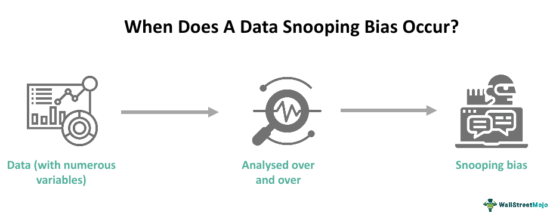

## Table of Contents

## What is data-snooping bias?

Data-snooping bias happens when people look at a lot of data and find patterns that seem important, but are actually just there by chance. Imagine you're flipping a coin and it lands on heads five times in a row. You might think the coin is biased towards heads, but it's just a random streak. In the same way, when researchers sift through large datasets, they might spot trends that look meaningful but are really just flukes.

This can be a big problem in fields like finance or medicine, where people make decisions based on data. If someone uses a pattern found by data-snooping to make choices, like picking stocks or prescribing medicine, they might end up with bad results. To avoid this, it's important to test findings on new data that wasn't used in the initial search. This helps make sure the patterns are real and not just lucky coincidences.

## How does data-snooping bias occur in statistical analysis?

Data-snooping bias occurs in statistical analysis when researchers look through a large amount of data and find patterns that seem important, but are really just random. Imagine you're looking at sales data for a store and you notice that ice cream sales go up every time it's sunny. You might think there's a strong connection, but if you only looked at data from summer, this pattern might just be a coincidence. When researchers don't have a clear plan before they start looking at the data, they might end up focusing on these random patterns instead of true relationships.

To make things worse, data-snooping bias can be hard to spot because it feels like you're discovering something new and exciting. But if you test these patterns on new data that wasn't part of your original search, you might find that they don't hold up. This is why it's important to have a clear hypothesis and plan before diving into the data, and to always check your findings with fresh data to make sure they're real and not just flukes.

## Can you provide an example of data-snooping bias in a simple study?

Imagine a small study where a researcher is trying to find out what affects students' test scores. The researcher looks at a lot of different things like the students' favorite color, the number of pets they have, and how much they like their teacher. After looking through all this data, the researcher notices that students who have exactly two pets tend to score higher on their tests. The researcher gets excited and thinks that having two pets helps students do better in school.

But this finding might just be a coincidence. The researcher looked at so many different factors that it's likely some of them would seem to be related to test scores just by chance. If the researcher then tests this idea with a new group of students, they might find that having two pets doesn't actually make a difference in their test scores. This is an example of data-snooping bias because the pattern the researcher found in the first group of students might not be a real, reliable connection.

## What are the common causes of data-snooping bias in data science?

Data-snooping bias often happens when researchers look at a lot of data without a clear plan. They might explore many different things, hoping to find something interesting. When they do this, they can easily spot patterns that seem important but are really just random. For example, if someone checks many different factors to see what affects stock prices, they might find that the price goes up every time a certain celebrity tweets. But this could just be a coincidence that won't hold up if they look at more data.

Another cause of data-snooping bias is when researchers don't test their findings on new data. After finding a pattern, it's important to check if it's real by seeing if it works with a different set of information. If they don't do this, they might think they've discovered something important when it's really just a fluke. For instance, a researcher might find that people who eat a certain type of food are healthier, but if they only looked at data from one small group, this might not be true for everyone. Always testing on new data helps make sure the patterns are reliable and not just lucky guesses.

## How can data-snooping bias affect the validity of research findings?

Data-snooping bias can make research findings less reliable. When researchers look at a lot of data without a clear plan, they might find patterns that seem important but are really just random. Imagine you're looking at the weather and you notice that it always rains when you wear a blue shirt. You might think your shirt causes rain, but it's just a coincidence. In research, if someone finds a pattern like this and thinks it's real, they might make decisions based on it, like suggesting a new medicine or investment strategy. But if the pattern is just a fluke, these decisions could lead to bad results.

To avoid this, researchers need to test their findings on new data that wasn't part of their original search. If the pattern holds up with fresh data, it's more likely to be real. But if it doesn't, then the pattern was probably just a random coincidence. For example, a researcher might find that people who drink a certain type of tea live longer. If they only looked at data from one small group, this might not be true for everyone. By checking the finding with a new group of people, they can see if the tea really makes a difference or if it was just a lucky guess.

## What are some methods to detect data-snooping bias in a dataset?

One way to detect data-snooping bias is by using a separate set of data to test your findings. After you find a pattern in your first set of data, you should check if it still holds true with new data that you haven't looked at before. If the pattern doesn't show up in the new data, it might just be a coincidence and not a real connection. This is called validation, and it helps make sure your findings are reliable and not just a result of looking at too many things until something interesting pops up.

Another method is to use statistical techniques like cross-validation. This means splitting your data into different parts and checking if your findings hold up across all of them. If you find a pattern in one part of the data but it doesn't show up in the others, it could be a sign of data-snooping bias. By testing your findings in different ways, you can be more confident that they are real and not just random flukes.

## How can researchers avoid data-snooping bias when conducting experiments?

Researchers can avoid data-snooping bias by having a clear plan before they start looking at the data. This means deciding what they want to find out and what they will look at before they dive into the numbers. For example, if they want to see if exercise helps people sleep better, they should decide to look only at exercise and sleep data, not at other things like what people eat or what color their bedroom walls are. By sticking to their plan, researchers can focus on real connections instead of random patterns that might show up by chance.

Another way to avoid data-snooping bias is to test findings on new data that wasn't part of the original search. After finding a pattern, researchers should check if it holds up with a different set of data. If the pattern is real, it should show up again in the new data. For instance, if a researcher finds that people who drink a certain type of tea live longer, they should test this idea with another group of people to see if it's true for everyone. By doing this, researchers can be more sure that their findings are reliable and not just lucky guesses.

## What role does cross-validation play in mitigating data-snooping bias?

Cross-validation helps researchers avoid data-snooping bias by splitting their data into different parts and testing their findings across all of them. Imagine you're looking at a big puzzle. Instead of trying to see the whole picture at once, you break it into smaller pieces and check if what you see in one piece matches up with the others. If a pattern shows up in one part of the data but not in the others, it might just be a random fluke and not a real connection. By using cross-validation, researchers can be more sure that their findings are reliable and not just something they found by chance.

For example, if a researcher wants to see if a certain type of diet helps people lose weight, they can use cross-validation to check this idea. They would divide their data into several groups and see if the diet works in each group. If the diet only seems to work in one group but not in the others, it might not be a real effect. By testing their findings in different ways, researchers can avoid making decisions based on patterns that might not hold up in the real world.

## How does data-snooping bias relate to overfitting in machine learning models?

Data-snooping bias and overfitting in machine learning models are closely related because they both happen when models or researchers look too closely at the data they have. In machine learning, overfitting happens when a model learns the details and noise in the training data so well that it performs poorly on new data it hasn't seen before. It's like memorizing a bunch of answers for a test without understanding the questions. The model might do great on the practice test but fail when the real test comes because it's too focused on the specific examples it was trained on.

Data-snooping bias is similar because it happens when researchers find patterns in their data that seem important but are actually just random. They might look at a lot of different things until they find something that looks like a connection, but this pattern might not hold up with new data. Just like an overfitted model, research affected by data-snooping bias can make it seem like there's a strong relationship when there isn't. To avoid both overfitting and data-snooping bias, it's important to test findings and models on new data to make sure they're reliable and not just based on chance or specific examples.

## What are the ethical implications of data-snooping bias in academic research?

Data-snooping bias can have serious ethical implications in academic research. When researchers find patterns that seem important but are actually just random, they might publish their findings as if they are real. This can mislead other scientists, doctors, or policymakers who might use these findings to make important decisions. For example, if a study suggests that a certain drug helps people live longer but it's actually just a fluke, doctors might prescribe it to their patients, leading to wasted time and money, or even harm if the drug has side effects.

Another ethical issue is that data-snooping bias can damage the trust people have in science. If people find out that research findings are not reliable because they are based on random patterns, they might start to doubt all scientific research. This can make it harder for scientists to convince people to follow important advice, like getting vaccinated or making lifestyle changes to improve their health. It's important for researchers to be honest about their methods and to test their findings carefully to make sure they are sharing accurate and trustworthy information.

## Can you discuss a real-world case study where data-snooping bias significantly impacted results?

One famous example of data-snooping bias happened in the world of finance. In the 1990s, a group of scientists and mathematicians started a hedge fund called Long-Term Capital Management (LTCM). They used complex math to look at a lot of financial data, trying to find patterns that would help them make money. They found some patterns that seemed to work really well, and they made a lot of money at first. But these patterns were just lucky guesses based on the data they had looked at. When they tried to use these patterns to make more money, they lost a lot because the patterns didn't work with new data.

The failure of LTCM had big effects. It showed that just because you find a pattern in data doesn't mean it will always work. The hedge fund's collapse led to a big financial crisis because many banks and investors had put money into LTCM. It took a lot of effort from the government and other banks to fix the mess. This case taught people in finance to be careful about trusting patterns found by looking at a lot of data without checking if they are real with new data.

## What advanced statistical techniques can be used to correct for data-snooping bias in complex datasets?

One advanced statistical technique to correct for data-snooping bias is called the bootstrap method. Imagine you have a big jar of marbles and you want to know what colors are in there. Instead of looking at all the marbles at once, you take a handful, put them back, and take another handful, over and over again. This helps you see if the patterns you find are real or just by chance. In the same way, the bootstrap method lets researchers take many samples from their data, see if the patterns they found hold up in all these samples, and be more sure that the patterns are not just lucky guesses.

Another technique is called the Bonferroni correction. When you look at a lot of different things in your data, you might find some patterns just by chance. The Bonferroni correction helps fix this by making it harder for a pattern to be called important. It's like saying, "If you want to say this pattern is real, you need to be really, really sure." By using this method, researchers can be more confident that the patterns they find are not just random flukes but are actually meaningful. Both of these techniques help make sure that research findings are reliable and not affected by data-snooping bias.

## References & Further Reading

[1]: Bergstra, J., Bardenet, R., Bengio, Y., & Kégl, B. (2011). ["Algorithms for Hyper-Parameter Optimization."](https://papers.nips.cc/paper/4443-algorithms-for-hyper-parameter-optimization) Advances in Neural Information Processing Systems 24.

[2]: ["Advances in Financial Machine Learning"](https://books.google.com/books/about/Advances_in_Financial_Machine_Learning.html?id=oU9KDwAAQBAJ) by Marcos Lopez de Prado

[3]: ["Evidence-Based Technical Analysis: Applying the Scientific Method and Statistical Inference to Trading Signals"](https://www.amazon.com/Evidence-Based-Technical-Analysis-Scientific-Statistical/dp/0470008741) by David Aronson

[4]: ["Machine Learning for Algorithmic Trading"](https://github.com/stefan-jansen/machine-learning-for-trading) by Stefan Jansen

[5]: ["Quantitative Trading: How to Build Your Own Algorithmic Trading Business"](https://books.google.com/books/about/Quantitative_Trading.html?id=j70yEAAAQBAJ) by Ernest P. Chan