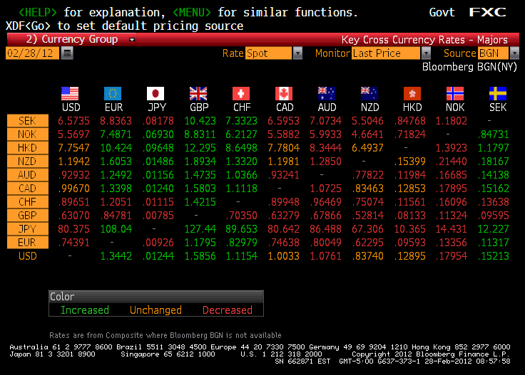

Algorithmic trading has revolutionized financial markets by allowing trading activities to be executed with increased precision and speed. At the heart of this transformation is the need for robust data management systems that ensure the accurate generation of trading signals. These systems rely heavily on databases, which play a pivotal role in storing, retrieving, and analyzing historical data. Databases provide a structured framework that supports the complex requirements of algorithmic trading, including the management of vast datasets and the execution of sophisticated trading strategies.

The significance of databases in algorithmic trading cannot be overstated. They serve as the foundation upon which trading strategies are developed and backtested, empowering traders to evaluate the viability of their models under various market conditions. The ability to access reliable and accurate historical data allows for the construction of predictive models, enhancing decision-making processes and leading to more informed trading decisions.



This article will explore the critical importance of historical databases in algorithmic trading systems. By understanding how databases enhance the efficiency and accuracy of trading strategies, market participants can leverage these tools to gain a competitive edge in the financial arena. Through this exploration, we will underscore the essential characteristics that make databases an integral component of successful algorithmic trading platforms.

## Table of Contents

## Understanding Databases in Algorithmic Trading

Databases form the backbone of [algorithmic trading](/wiki/algorithmic-trading) systems by enabling the efficient storage, retrieval, and analysis of vast amounts of data. Algorithmic trading relies heavily on accurate and timely data to generate trading signals, optimize strategies, and conduct [backtesting](/wiki/backtesting). The advantages offered by databases in this context revolve primarily around their ability to handle diverse data types, support complex queries, and provide reliable access to historical data.

Various types of databases are used in algorithmic trading, each serving distinct purposes. Relational databases, such as MySQL and PostgreSQL, are commonly employed for managing structured data. They make use of tables to store data and allow complex queries through Structured Query Language (SQL). These databases are particularly useful for storing reference data, metadata, and other structured information crucial for trade execution and compliance processes.

NoSQL databases, like MongoDB and Cassandra, offer flexibility in handling unstructured or semi-structured data. These databases are well-suited for storing diverse data types such as text, JSON, and XML, which may not fit neatly into tables. NoSQL databases excel in scalability, making them an excellent choice for processing large volumes of trade data with varying schemas.

For algorithmic trading, time-series databases such as InfluxDB and TimescaleDB are tailored to efficiently manage high-frequency data. They store data points indexed by time, which is essential for tracking price changes, trade volumes, and other time-dependent financial metrics. Time-series databases facilitate the rapid ingestion and retrieval of data, enabling real-time analytics and decision-making.

The role of databases extends beyond mere data storage to encompass data management for trading strategy development and backtesting. In these applications, databases must support fast and accurate data retrieval to ensure historical data is available for thorough analysis and strategy optimization. Databases like SQLite can be embedded into trading applications for lightweight, high-performance access to historical data during backtesting and simulation.

Furthermore, databases facilitate the integration of various data sources, including market data, economic indicators, and [alternative data](/wiki/best-alternative-data), allowing traders to develop more sophisticated and data-driven strategies. By maintaining data integrity and consistency, databases enable traders to implement strategies with confidence, reduce operational risk, and improve overall efficiency in trading operations.

In summary, databases are critical to algorithmic trading systems, offering a robust framework for storing and accessing data necessary for trading signal generation, strategy development, and backtesting. As technology continues to evolve, the role of innovative database solutions will be integral to the advancement of algorithmic trading methodologies.

## The Evolution of Databases in Algo Trading

The evolution of databases in algorithmic trading has been a transformative journey, reflecting broader advancements in data management technologies. Historically, financial markets relied heavily on manual data collection and recording processes. Early database systems were rudimentary, typically utilizing flat-file structures or basic relational databases that offered limited functionality for complex data analysis.

As data processing requirements evolved, particularly with the increased adoption of electronic trading platforms in the late 20th century, more sophisticated database technologies emerged. The introduction of structured query language (SQL) in the 1970s was a pivotal moment, promoting the use of relational database management systems (RDBMS) which allowed for more efficient data retrieval and management. RDBMS platforms like Oracle and IBM's DB2 became standard in financial systems, providing transaction consistency (ACID properties) and structured data storage.

With the growth of algorithmic trading in the early 2000s, the demand for speed and efficiency in managing vast datasets intensified. Traditional RDBMS faced challenges in handling unstructured data and achieving the high-speed data retrieval necessary for algorithmic executions. This limitation prompted the development and adoption of non-relational databases, such as NoSQL, which offer flexible schema designs and support for big data applications. Notable examples include MongoDB and Cassandra, which are capable of managing larger volumes of diverse data types such as text, time-stamped data, and JSON objects more fluidly than traditional systems.

The evolution continued with the advent of time-series databases, like InfluxDB and TimescaleDB, which are specifically optimized for managing time-stamped data, a critical component in high-frequency trading environments. These databases address the need for rapid data ingestion and querying capabilities, thus aligning with the speed demands of modern trading algorithms.

Comparing legacy systems to modern database solutions highlights significant advancements. Legacy databases offered reliability and strong data integrity but struggled with scalability and flexibility. Conversely, modern databases enhance performance through distributed architectures and cloud-based solutions, enabling scalable data management and real-time analytic capabilities. Cloud services like Amazon Web Services (AWS) and Microsoft Azure further simplify database management by providing on-demand, scalable infrastructure.

These advancements have substantially improved the capabilities and efficiencies of algorithmic trading systems, allowing for real-time data analysis and decision-making processes. As technology progresses, databases will likely continue to evolve, offering even more specialized solutions for the dynamic needs of financial markets.

## Types of Databases Used in Algorithmic Trading

In algorithmic trading, the choice of database is critical for managing vast amounts of structured and unstructured data efficiently. Different types of databases fulfill specific roles in handling this data, ensuring that algorithms can process information with speed and accuracy.

### Relational Databases
Relational databases, such as MySQL, PostgreSQL, and Oracle, are fundamental in handling structured data. They organize data into tables with defined relationships, which is ideal for maintaining data integrity and executing complex queries. SQL (Structured Query Language) is used to perform operations on this data, allowing traders to manage large datasets efficiently. The use of indexes in relational databases optimizes query performance, crucial for strategies that rely on specific data points.

### NoSQL and Document Databases
NoSQL databases, including MongoDB and Cassandra, provide flexibility in handling unstructured data, making them suitable for the evolving needs of algorithmic trading systems. These databases do not require a fixed schema, accommodating the diversity of data sources in trading, such as news feeds and sentiment analysis. Document databases like MongoDB store data in JSON-like formats, which support nesting and arrays, offering seamless integration with applications that need to process varied data structures.

### Time-Series Databases
Time-series databases like InfluxDB and TimescaleDB are specifically designed to handle high-frequency financial data. They efficiently manage time-stamped data, which is critical for tracking and analyzing market movements over time. These databases offer functionalities like compression and downsampling, crucial for storing large volumes of data without compromising on performance. The capabilities of time-series databases in providing real-time analytics support high-frequency trading strategies that depend on quick decision-making.

Each of these database types plays a pivotal role in developing and executing algorithmic trading strategies, offering unique advantages tailored to specific data management needs. Selecting the right database type or combination thereof depends on the data characteristics and the performance requirements of the trading system.

## Key Features of Historical Databases in Trading

Historical databases are a cornerstone in the architecture of algorithmic trading systems, providing essential data storage and retrieval capabilities. Their effectiveness is largely determined by a set of key features that ensure they meet the rigorous demands of trading environments.

Fast data ingestion, retrieval, and real-time analytics are crucial in trading, where milliseconds can impact profitability. Databases designed for trading must support high-speed data input and output to accommodate the massive volumes of market data generated every second. This requires optimizing both hardware resources, such as SSDs and fast network connections, and software techniques, such as indexing and partitioning. Real-time analytics capabilities are vital as well, enabling traders to process and analyze data instantaneously. This often involves using in-memory databases or incorporating cache systems to reduce latency.

Scalability is another vital characteristic. Trading databases must handle increasing volumes of data as firms expand their strategies and reach. This can involve vertical scaling, which improves the capacity of existing servers, or horizontal scaling, which adds more servers to distribute the load. Distributed database systems, such as those using the Apache Kafka or the Cassandra platforms, are often employed to ensure that the database can grow without degradation in performance.

Cost considerations also play a significant role in database selection. While cloud-based solutions, such as Amazon RDS or Google Cloud Bigtable, offer flexibility and scalability, they introduce ongoing expenses that can add up significantly over time. On-premise solutions might involve higher upfront costs but could be more economical in the long term for large-scale operations. It is crucial for firms to evaluate their specific needs and trading volumes to determine the most cost-effective solution. Selecting the right type of database and its configuration, whether it be relational, NoSQL, or time-series, directly impacts these cost and scalability considerations.

In essence, historical databases in trading must be built for speed, scalability, and cost-effectiveness to effectively support diverse and demanding trading strategies.

## Challenges with Historical Databases

Historical databases are integral to algorithmic trading systems, yet they present several challenges that need careful management. One of the primary concerns is ensuring data accuracy. This encompasses the precise recording of trades, quotes, and prices, which are subject to errors due to timing differences, source discrepancies, or data feed interruptions. Inaccurate data can lead to faulty algorithmic signals, resulting in erroneous trades and potential financial losses.

Handling corporate actions represents another significant challenge. These actions, such as dividends, stock splits, and mergers, can dramatically affect the price and availability of securities. Without accurate and timely adjustments in the historical database to reflect corporate actions, backtests and models can produce misleading results. For instance, failing to adjust for a stock split will result in incorrect calculations of historical returns.

Data spikes, often caused by market anomalies or errors in data feeds, pose further difficulties. These erroneous data points can skew analysis and lead to poor decision-making. Detecting and correcting these spikes is crucial to maintaining the integrity of historical data.

Data cleaning and validation are essential practices for maintaining data integrity. Algorithms designed for these tasks typically involve removing duplicates, correcting inaccuracies, and ensuring completeness of data records. Python, with libraries like pandas and numpy, is a common toolset in this domain. For instance, a basic script to identify and handle missing data points might look like:

```python
import pandas as pd

# Load historical data
data = pd.read_csv('historical_data.csv')

# Identify missing values
missing_data = data.isnull().sum()

# Fill or remove missing values as appropriate
data.fillna(method='ffill', inplace=True)  # Forward fill for time series continuity
```

Strategies to manage these challenges include implementing rigorous validation checks and employing advanced data analytics to detect inconsistencies. Automated systems can trigger alerts for suspected data anomalies, prompting manual review. Additionally, leveraging [machine learning](/wiki/machine-learning) algorithms can enhance the detection of subtle irregularities that might escape conventional methods.

Ultimately, addressing the challenges associated with historical databases requires a comprehensive approach. This includes establishing processes for regular data audits, integrating mechanisms to automatically adjust for corporate actions, and deploying robust anomaly detection systems. These strategies ensure that the foundation of algorithmic trading—its data—is reliable and accurate, thereby supporting effective trading strategies.

## Selecting the Right Database for Your Trading System

Selecting the right database for your trading system is a critical decision that influences the effectiveness and efficiency of algorithmic trading operations. Several technical and non-technical factors must be considered to ensure the selected database aligns with the specific needs of a trading strategy. Below is a comprehensive checklist and evaluation criteria to guide this decision-making process.

### Technical Requirements

1. **Performance**: The database must support high throughput for both read and write operations. This is essential for real-time data ingestion and retrieval, crucial for making timely trading decisions.

2. **Scalability**: A database should effortlessly handle growing data volumes without compromising on speed or performance. Horizontal scaling capabilities often present in distributed databases are desirable.

3. **Flexibility**: The database should be flexible enough to store diverse data types, which is particularly important if it handles both structured and unstructured data common in financial markets.

4. **Data Consistency**: Especially important in trading environments, the database must ensure data accuracy and consistency even under heavy transactional loads.

5. **Support for Complex Queries**: It should efficiently support complex queries necessary for backtesting and strategy development, including statistical functions and joins.

### Non-Technical Requirements

1. **Cost**: Total cost of ownership, including licensing fees, hardware requirements, maintenance, and possible costs related to scaling, should be taken into account.

2. **Community Support and Documentation**: A robust community and comprehensive documentation can significantly reduce development time and help troubleshoot issues.

3. **Vendor Support**: Consider the reliability and accessibility of vendor support. Premium support services could be vital, especially during critical trading periods.

4. **Ease of Use**: The database should align with the team's technical skills, bearing in mind the learning curve, setup complexity, and ease of integration with existing systems.

5. **Security Features**: Protection of sensitive financial data through encryption, access controls, and secure data transactions is non-negotiable.

### Case Studies and Examples

1. **Relational Databases**:
   - **MySQL**: Known for robustness and reliability, MySQL is often used for structured financial data in small to medium-sized trading firms. Its cost-effectiveness and extensive community support make it a popular choice.

2. **NoSQL Databases**:
   - **MongoDB**: Suitable for storing large volumes of unstructured data, MongoDB is favored for its scalability and flexibility. It’s particularly effective in handling semi-structured data from diverse financial sources.

3. **Time-Series Databases**:
   - **InfluxDB**: Designed for time-series data, InfluxDB is optimized for queries that involve time-based operations, such as those common in high-frequency trading. Its ability to handle vast volumes of data in real-time sets it apart.

### Conclusion

Choosing the right database for an algorithmic trading system necessitates a detailed evaluation of both technical capabilities and strategic considerations such as cost, support, and ease of integration. A well-chosen database can significantly enhance the performance and reliability of trading operations, making it a cornerstone of successful algorithmic trading strategies.

## Conclusion

Databases hold a pivotal role in enhancing the performance of trading strategies within algorithmic trading. By efficiently storing, retrieving, and analyzing vast amounts of historical and real-time data, databases enable traders to identify trends, test hypotheses, and develop robust algorithms. Their ability to manage complex datasets ensures that trading systems can make informed decisions based on accurate and timely information. The seamless integration of historical databases into trading platforms ensures that these systems are not only fast but also reliable in executing trading strategies.

Looking ahead, the evolution of database technology will continue to impact algorithmic trading. One anticipated trend is the increasing use of [artificial intelligence](/wiki/ai-artificial-intelligence) (AI) and machine learning (ML) to optimize database operations and enhance data analytical capabilities. AI-driven databases could automatically manage data workloads, predict and mitigate potential system bottlenecks, and even refine trading strategies in real-time. Additionally, advancements in distributed ledger technology (DLT), such as blockchain, may offer new ways to handle and audit trading data, ensuring enhanced security and transparency.

Moreover, the integration of cloud-based solutions is expected to further revolutionize database management for trading systems. These solutions promise scalability and flexibility, allowing traders to access and process large datasets without the constraints of on-premises infrastructure. As data continues to grow exponentially, cloud databases will become indispensable for managing the vast data volumes required in modern trading. 

In summary, historical databases are essential for the success and sophistication of algorithmic trading systems. They provide the foundation for accurate data analysis and informed strategy development. As technology continues to advance, the importance of databases will only grow, necessitating continual adaptation and integration of cutting-edge solutions to maintain competitiveness. Embracing these innovations will ensure that algorithmic trading systems remain efficient, reliable, and capable of capitalizing on market opportunities.

## References & Further Reading

[1]: Bergstra, J., Bardenet, R., Bengio, Y., & Kégl, B. (2011). ["Algorithms for Hyper-Parameter Optimization."](https://dl.acm.org/doi/10.5555/2986459.2986743) Advances in Neural Information Processing Systems 24.

[2]: ["Advances in Financial Machine Learning"](https://www.amazon.com/Advances-Financial-Machine-Learning-Marcos/dp/1119482089) by Marcos Lopez de Prado

[3]: ["Evidence-Based Technical Analysis: Applying the Scientific Method and Statistical Inference to Trading Signals"](https://www.amazon.com/Evidence-Based-Technical-Analysis-Scientific-Statistical/dp/0470008741) by David Aronson

[4]: ["Machine Learning for Algorithmic Trading"](https://github.com/stefan-jansen/machine-learning-for-trading) by Stefan Jansen

[5]: ["Quantitative Trading: How to Build Your Own Algorithmic Trading Business"](https://books.google.com/books/about/Quantitative_Trading.html?id=j70yEAAAQBAJ) by Ernest P. Chan