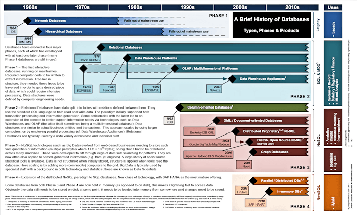

## Table of Contents

## What is a database and how has the definition evolved historically?

A database is a structured collection of data that is organized and easily accessible, often stored electronically in a computer system. It allows users to store, retrieve, and manage information efficiently. The concept of a database has been around for a long time, but the way we think about and use databases has changed a lot over the years. In the beginning, databases were simple lists or records kept on paper or in file cabinets. They were used by businesses and governments to keep track of things like customer information, inventory, and financial records.

As technology improved, so did databases. In the 1960s and 1970s, computers started to be used for storing data, leading to the development of more sophisticated database systems. These early systems were often very complex and required a lot of technical knowledge to use. Over time, the idea of a database management system (DBMS) became more common. A DBMS is a software tool that helps manage and organize the data in a database, making it easier for people to use and understand. Today, databases are used in almost every industry and are an essential part of many applications and services we use every day, like social media, online shopping, and banking. The evolution of databases has made them more user-friendly, flexible, and capable of handling large amounts of data.

## What were the earliest forms of databases used by civilizations?

The earliest forms of databases used by civilizations were simple records kept on clay tablets, papyrus, or parchment. Ancient Sumerians, around 3500 BCE, used clay tablets to keep track of things like taxes, trade, and ownership of land and goods. These tablets had lists and numbers written on them, which helped the Sumerians manage their growing cities and trade networks. Similarly, ancient Egyptians used papyrus to record information about their harvests, population, and military, helping them govern their large empire.

As civilizations grew, so did the need for more organized ways to keep records. In ancient China, around 1600 BCE, people used oracle bones to record information about their rulers and important events. These bones were inscribed with characters and used as a form of record-keeping. In the Roman Empire, around 500 BCE to 500 CE, officials used wax tablets and scrolls to keep track of taxes, census data, and legal records. These early forms of databases were crucial for managing large populations and complex societies, laying the groundwork for the more advanced systems we use today.

## How did the development of punched cards influence early database systems?

Punched cards played a big role in the development of early database systems. They were first used in the late 1800s by Herman Hollerith to help the U.S. Census Bureau process data faster. Each card had holes punched in it to represent different pieces of information. This allowed machines to read the cards and quickly sort and count the data. It was a huge improvement over counting by hand, which took a lot of time and was prone to errors.

The use of punched cards led to the creation of the first mechanical data processing systems. These systems were the ancestors of modern computers and databases. Companies and governments started using punched card systems to keep track of things like employee records, sales data, and inventory. This made it easier to manage large amounts of information and paved the way for the development of more advanced database technologies. Punched cards were an important step in the evolution of databases, helping to make data management faster and more efficient.

## What was the significance of the 1960s in the history of databases?

The 1960s were a very important time for databases. During this decade, computers started to become more common and powerful. This led to the creation of the first real database systems. One big step was the development of the CODASYL (Conference on Data Systems Languages) model in 1962. This model helped set up rules for how databases should work and how data should be organized. It was a big deal because it helped people understand how to make databases more useful and easier to use.

Another important thing that happened in the 1960s was the creation of the first relational database model by Edgar F. Codd in 1969. This model changed the way people thought about databases. Instead of using complicated ways to link data, the relational model used simple tables that could be connected easily. This made databases much simpler to design and use. The ideas from the 1960s laid the groundwork for the databases we use today, making it possible to store and manage huge amounts of information in a way that is easy to understand and use.

## Can you explain the concept of hierarchical databases and their historical use?

Hierarchical databases are a type of database where data is organized in a tree-like structure. Imagine a family tree where you have parents at the top, then children below them, and so on. In a hierarchical database, the main piece of data, called the root, is at the top. Below the root, there are branches and more branches, each holding different pieces of information. This way of organizing data was very popular in the early days of computers because it was simple and worked well with the technology at the time.

These databases were used a lot in the 1960s and 1970s. Companies like IBM used them to manage their data. For example, a company might use a hierarchical database to keep track of its employees. The company would be the root, and then there would be branches for different departments, and under each department, there would be branches for individual employees. This made it easy to see how everything was connected and to find information quickly. Over time, as computers got better and new types of databases were invented, hierarchical databases became less common, but they were very important in the early days of database technology.

## What role did the CODASYL group play in the development of database systems?

The CODASYL group was a big deal in the history of databases. They were formed in the early 1960s to figure out how to make computers better at handling data. They came up with something called the CODASYL model, which was a set of rules for how databases should work. This model was important because it helped people understand how to organize data in a way that made it easier to use and manage. It was one of the first times people tried to make databases more organized and useful.

The CODASYL group's work led to the creation of something called the network database model. This model let data be linked in more complicated ways than before. It was a step forward from the simpler hierarchical databases that were common at the time. The ideas from CODASYL helped shape the future of databases and were used in many systems for years. Even though we use different kinds of databases now, the work of the CODASYL group laid the groundwork for a lot of what we do with databases today.

## How did relational databases emerge and what impact did they have?

Relational databases came about in the late 1960s, thanks to a guy named Edgar F. Codd. He worked at IBM and came up with a new way to organize data. Instead of using complicated ways to link data, like in hierarchical or network databases, Codd's idea was to use simple tables. Each table would hold different pieces of information, and you could connect the tables easily using something called keys. This made it much simpler to design and use databases. In 1970, Codd wrote a paper about his idea, and it changed the way people thought about databases.

The impact of relational databases was huge. They made it easier for people to store, find, and manage data. Before relational databases, working with data was hard and needed a lot of technical know-how. But with relational databases, you could use something called SQL (Structured Query Language) to ask questions and get answers from your data. This made databases more user-friendly and helped businesses and organizations use their data better. Today, relational databases are used everywhere, from small businesses to big companies, and they're a big part of the technology we use every day.

## What are some key milestones in the development of SQL?

SQL, which stands for Structured Query Language, started in the early 1970s. It was created by people at IBM, like Donald Chamberlin and Raymond Boyce. They wanted a simple way to talk to databases. In 1974, they made a language called SEQUEL, which was the first version of SQL. It let people ask questions and get information from databases easily. By the late 1970s, other companies started to use their own versions of SQL, which helped it become more popular.

In 1986, SQL became an official standard when the American National Standards Institute (ANSI) and the International Organization for Standardization (ISO) made rules for it. This meant that different database systems could use SQL in similar ways, making it easier for people to work with different databases. Over the years, SQL kept getting better. New versions came out in 1989, 1992, 1999, and later, adding more features and making it even more useful. Today, SQL is used all over the world and is a big part of how we manage and use data.

## How have object-oriented databases evolved over time?

Object-oriented databases started to become popular in the late 1980s and early 1990s. They were different from traditional databases because they could store data as objects, just like in object-oriented programming. This meant that you could keep things like code and data together in one place. Companies like Object Design and Versant made these databases, and they were used a lot in areas like engineering and finance where people needed to work with complex data.

Over time, object-oriented databases got better and more useful. They added features that made them work well with other types of databases and programming languages. But as time went on, other kinds of databases, like relational databases, also got better at handling complex data. This made object-oriented databases less popular. Today, they are still used in some places, but they are not as common as they used to be. However, the ideas from object-oriented databases have helped shape newer kinds of databases, like NoSQL databases, which are used a lot now.

## What were the major challenges faced by database systems during the transition to distributed systems?

When databases started to become distributed, it meant that data was spread out over different places instead of being kept in one spot. This was a big change, and it brought some challenges. One big problem was keeping the data the same everywhere. If you changed something in one place, you had to make sure it changed everywhere else too. This was hard to do, and if it didn't work right, it could mess up the whole system. Another challenge was making sure the system was fast enough. When data is spread out, it can take longer to find and use it, so people had to find ways to make things run smoothly.

Another issue was keeping the system safe. With data in different places, it was harder to protect it from people who shouldn't see it. People had to come up with new ways to keep the data secure. Also, managing a distributed system was more complicated than managing a single database. You needed to keep track of all the different parts and make sure they all worked together. Over time, people figured out how to solve these problems, but it took a lot of work and new ideas.

## How has the advent of NoSQL databases changed the historical trajectory of database technology?

The arrival of NoSQL databases in the early 2000s changed the way people thought about databases. Before NoSQL, most databases were relational, using tables and SQL to manage data. But as the internet grew and more data was created, people needed databases that could handle a lot of information quickly and easily. NoSQL databases were different because they didn't use tables. Instead, they could store data in many ways, like as documents, key-value pairs, or graphs. This made them more flexible and able to work with big, messy data that didn't fit well in traditional databases.

NoSQL databases also made it easier to scale up, meaning they could handle more data by spreading it across many computers. This was important for big companies like Google and Amazon that had huge amounts of data to manage. The rise of NoSQL databases didn't replace relational databases but added new options for people to use. Today, many businesses use both types of databases, choosing the best one for their needs. The introduction of NoSQL has pushed database technology forward, making it more adaptable and ready for the future.

## What future trends in database technology are rooted in historical developments?

The future of database technology is building on what we've learned in the past. One big trend is the growth of cloud databases. This idea comes from the old days of distributed systems, where data was spread out over different places. Now, with the cloud, data can be stored and managed on the internet, making it easier for people to access it from anywhere. This is like how punched cards and early computers made data processing faster and more efficient. Cloud databases are taking that idea even further, letting businesses grow and change without having to worry about where their data is stored.

Another trend is the use of AI and [machine learning](/wiki/machine-learning) in databases. This is connected to the history of databases because it's about making data more useful. Just like how relational databases made it easier to ask questions and get answers from data, AI and machine learning can help find patterns and make predictions. This is making databases smarter and more helpful. For example, they can suggest what data you might need next or help you make decisions based on what the data shows. These trends show how the history of databases is guiding us to make them even better in the future.

## References & Further Reading

[1]: Bergstra, J., Bardenet, R., Bengio, Y., & Kégl, B. (2011). ["Algorithms for Hyper-Parameter Optimization."](https://dl.acm.org/doi/10.5555/2986459.2986743) Advances in Neural Information Processing Systems 24.

[2]: ["Advances in Financial Machine Learning"](https://www.amazon.com/Advances-Financial-Machine-Learning-Marcos/dp/1119482089) by Marcos Lopez de Prado

[3]: ["Evidence-Based Technical Analysis: Applying the Scientific Method and Statistical Inference to Trading Signals"](https://www.amazon.com/Evidence-Based-Technical-Analysis-Scientific-Statistical/dp/0470008741) by David Aronson

[4]: ["Machine Learning for Algorithmic Trading"](https://github.com/stefan-jansen/machine-learning-for-trading) by Stefan Jansen

[5]: ["Quantitative Trading: How to Build Your Own Algorithmic Trading Business"](https://books.google.com/books/about/Quantitative_Trading.html?id=j70yEAAAQBAJ) by Ernest P. Chan