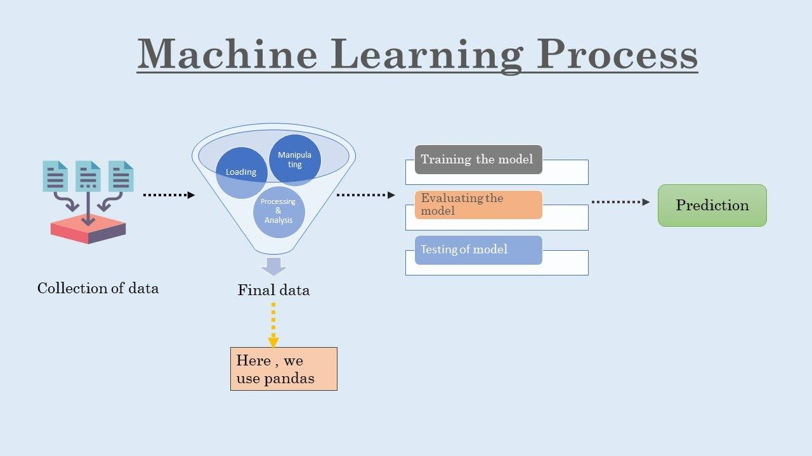

## Table of Contents

## What is a DataFrame in the context of machine learning?

A DataFrame is a type of data structure used in machine learning and data analysis. It is like a table in a spreadsheet where you can store and organize data. Each column in a DataFrame can hold a different type of data, such as numbers, text, or dates. This makes it easy to work with different kinds of information all in one place. DataFrames are commonly used in programming languages like Python, especially with libraries like Pandas, which provide powerful tools for manipulating and analyzing data.

In machine learning, DataFrames are very useful because they help you prepare and clean your data before you use it to train models. For example, you might use a DataFrame to remove missing values, combine different data sources, or transform your data into a format that a machine learning algorithm can understand. This preparation is crucial because the quality of your data directly affects how well your machine learning models will perform. By using DataFrames, you can make sure your data is in the best possible shape before you start building your models.

## How do you create a DataFrame in popular programming languages like Python or R?

In Python, you can create a DataFrame using the Pandas library, which is a popular tool for data manipulation. To start, you need to import Pandas and then you can create a DataFrame from different data sources like lists, dictionaries, or even CSV files. For example, if you want to create a DataFrame from a dictionary, you can do it like this: ```python
import pandas as pd
data = {'Name': ['Alice', 'Bob', 'Charlie'], 'Age': [25, 30, 35]}
df = pd.DataFrame(data)
``` This code will create a DataFrame with two columns, 'Name' and 'Age', and three rows of data.

In R, creating a DataFrame is also straightforward. You use the `data.frame()` function to combine vectors into a DataFrame. For instance, if you have vectors for names and ages, you can create a DataFrame like this: ```r
Name <- c('Alice', 'Bob', 'Charlie')
Age <- c(25, 30, 35)
df <- data.frame(Name, Age)
``` This will produce a DataFrame similar to the one created in Python, with 'Name' and 'Age' as columns and the specified values as rows. Both languages make it easy to work with DataFrames, allowing you to quickly organize and analyze your data.

## What are the basic operations you can perform on a DataFrame?

You can do many simple things with a DataFrame. One common operation is to look at your data. You can see the first few rows with `df.head()` or the last few with `df.tail()`. If you want to see some basic information about your DataFrame, like how many rows and columns it has, you can use `df.info()`. To get a quick summary of the numbers in your DataFrame, `df.describe()` is very useful. You can also pick out specific columns or rows. For example, to get the 'Name' column, you can use `df['Name']`. If you want to see rows where the 'Age' is over 30, you can do `df[df['Age'] > 30]`.

Another important thing you can do is change your DataFrame. You can add new columns, like `df['NewColumn'] = some_value`. To change values, you can use something like `df.loc[df['Age'] > 30, 'Age'] = 30` to set all ages over 30 to exactly 30. You can also sort your DataFrame by a column, like `df.sort_values('Age')`. If you need to group your data, you can use `df.groupby('Name')` to see things like the average age for each name. Lastly, you can combine DataFrames. To add rows from another DataFrame, use `pd.concat([df1, df2])`, and to add columns, use `pd.merge(df1, df2, on='some_column')`.

These operations help you get your data ready for machine learning. You can clean it, change it, and make it better. This is important because good data makes your machine learning models work better.

## How can DataFrames be used for data preprocessing in machine learning?

DataFrames are very helpful for getting your data ready for machine learning. You can use them to clean up your data. For example, if some data is missing, you can remove those rows with `df.dropna()`. Or, you might want to fill in the missing data with a common value like the average, using `df.fillna(df.mean())`. You can also change your data into a better format. If you have a column with different categories, you can turn it into numbers using something called one-hot encoding with `pd.get_dummies(df['Category'])`. This makes it easier for machine learning models to understand and use the data.

Another important use of DataFrames is to make your data better for machine learning models. You can create new columns that might help your model predict better. For example, if you have a 'Date' column, you could add a new column for the day of the week with `df['DayOfWeek'] = df['Date'].dt.dayofweek`. You can also combine data from different places. If you have two DataFrames with information about the same thing but from different sources, you can use `pd.merge(df1, df2, on='ID')` to put them together. This helps you have all the information you need in one place, making your data more useful for training your models.

## What are some common data manipulation techniques using DataFrames?

DataFrames are great for changing and working with data. One common thing you can do is filter your data. If you only want to see rows where people are older than 30, you can use `df[df['Age'] > 30]`. You can also sort your data. If you want to see people listed by age from youngest to oldest, you can use `df.sort_values('Age')`. Another useful technique is grouping data. For example, if you want to find the average age for each name, you can use `df.groupby('Name')['Age'].mean()`. These techniques help you look at your data in different ways and find important information.

You can also change your data with DataFrames. If you want to add a new column, like one that shows if someone is an adult, you can use `df['IsAdult'] = df['Age'] >= 18`. Sometimes, you need to change the type of data in a column. If 'Age' is stored as text but you need it as a number, you can use `df['Age'] = pd.to_numeric(df['Age'], errors='coerce')`. Another common task is combining data from different DataFrames. If you have two DataFrames with information about the same people but from different sources, you can use `pd.merge(df1, df2, on='ID')` to put them together. These techniques help you make your data better and ready for use in things like machine learning.

## How do you handle missing data within a DataFrame?

Handling missing data in a DataFrame is important because it can affect how well your machine learning models work. One way to deal with missing data is to remove the rows that have missing values. You can do this with `df.dropna()`. This is simple, but it might mean you lose a lot of data if many rows have missing values. Another way is to fill in the missing data with a common value, like the average or median of the column. For example, you can use `df.fillna(df.mean())` to fill missing values with the average of the column. This keeps all your data, but it might not always be the best choice because it can change how your data looks.

Another technique is to use a special value to show that data is missing, like -999 or 'Unknown'. This way, you keep all your data and can still see where values are missing. You can also use more advanced methods like interpolation, where you guess the missing values based on the values around them. For example, `df.interpolate()` can fill in missing values by looking at the values before and after the missing spot. Each method has its own pros and cons, so you need to think about what will work best for your data and your machine learning project.

## What methods can be used to merge or join DataFrames?

Merging or joining DataFrames is a common task when you want to combine information from different sources. In Python, you can use the `pd.merge()` function to join DataFrames. This function lets you specify which columns to use for joining, like `pd.merge(df1, df2, on='ID')`. This will combine the two DataFrames based on matching values in the 'ID' column. You can also choose how to join the DataFrames, like 'inner', 'outer', 'left', or 'right'. For example, `pd.merge(df1, df2, on='ID', how='left')` will keep all rows from `df1` and add matching rows from `df2`.

Another way to combine DataFrames is by using the `pd.concat()` function. This is useful when you want to stack DataFrames on top of each other or side by side. To stack them vertically, you can use `pd.concat([df1, df2])`, which will add the rows of `df2` below `df1`. If you want to add columns side by side, you can use `pd.concat([df1, df2], axis=1)`. This will add the columns of `df2` next to the columns of `df1`. Both `pd.merge()` and `pd.concat()` are powerful tools that help you bring your data together in a way that makes sense for your project.

## How can you optimize DataFrame operations for large datasets?

When working with large datasets, optimizing DataFrame operations can make your work much faster. One way to do this is by using the right data types. If you have a column with numbers, using the smallest data type that fits those numbers, like `int8` or `float32` instead of `int64` or `float64`, can save a lot of memory. You can change the data type with `df['column'] = df['column'].astype('int8')`. Another way is to avoid using loops to change data. Instead, use DataFrame methods like `apply()` or vectorized operations, which are much faster. For example, to add 5 to every number in a column, use `df['column'] = df['column'] + 5` instead of looping through each row.

You can also speed up your work by using the right tools. The `pandas` library has a lot of built-in functions that are already optimized for speed. For example, if you need to group your data, use `df.groupby()` instead of writing your own code to do it. Another tool you can use is `dask`, which is like `pandas` but made for very big datasets. It can split your data into smaller pieces and work on them at the same time, making things faster. To use `dask`, you can convert your DataFrame with `dd.from_pandas(df, npartitions=4)`. By choosing the right data types, using the right functions, and using tools like `dask`, you can make working with large datasets much easier and faster.

## What are the best practices for using DataFrames in a machine learning pipeline?

When using DataFrames in a machine learning pipeline, it's important to start by cleaning and preprocessing your data. You can use DataFrames to handle missing values by either removing rows with `df.dropna()` or filling them in with `df.fillna(df.mean())`. This helps make sure your data is complete and ready for your machine learning models. You can also use DataFrames to transform your data, like turning categories into numbers with `pd.get_dummies(df['Category'])`, which makes it easier for your models to understand. Another key step is to combine different datasets using `pd.merge(df1, df2, on='ID')` or `pd.concat([df1, df2])`, so you have all the information you need in one place.

Once your data is clean and transformed, you can use DataFrames to split your data into training and testing sets. This helps you see how well your model will work on new data. You can use `from sklearn.model_selection import train_test_split` and then `train_test_split(df, test_size=0.2)` to do this. DataFrames also make it easy to apply feature engineering, like creating new columns that might help your model predict better, such as `df['IsAdult'] = df['Age'] >= 18`. By following these steps and using DataFrames effectively, you can set up a strong machine learning pipeline that helps you build and test models more efficiently.

## How do DataFrames facilitate feature engineering in machine learning?

DataFrames make feature engineering easier in machine learning because they let you create new columns from existing data. For example, if you have a 'Date' column, you can add a new column for the day of the week with `df['DayOfWeek'] = df['Date'].dt.dayofweek`. This new column might help your model predict better because it gives more information. You can also combine data from different columns to make new features. If you have 'Height' and 'Weight' columns, you can create a 'BMI' column with `df['BMI'] = df['Weight'] / (df['Height'] / 100) ** 2`. This kind of feature engineering helps your model understand the data better and make more accurate predictions.

Another way DataFrames help with feature engineering is by letting you transform data easily. For instance, if you have a column with different categories, you can turn it into numbers using one-hot encoding with `pd.get_dummies(df['Category'])`. This makes it easier for machine learning models to work with the data. You can also use DataFrames to normalize or standardize your data, which can help your model perform better. For example, you might want to scale all values in a column to be between 0 and 1 with `df['ScaledColumn'] = (df['Column'] - df['Column'].min()) / (df['Column'].max() - df['Column'].min())`. By using DataFrames for these tasks, you can quickly and efficiently prepare your data for machine learning, making your models more effective.

## What advanced techniques can be applied to DataFrames for model evaluation and selection?

DataFrames can help you evaluate and choose the best machine learning model by letting you easily split your data into training and testing sets. You can use the `train_test_split` function from the `sklearn` library to do this with `from sklearn.model_selection import train_test_split` and then `X_train, X_test, y_train, y_test = train_test_split(df.drop('target', axis=1), df['target'], test_size=0.2)`. Once you have your data split, you can use DataFrames to calculate important metrics like accuracy, precision, recall, and F1 score. For example, after fitting your model and making predictions, you can use `from sklearn.metrics import accuracy_score` and then `accuracy = accuracy_score(y_test, predictions)`. These metrics help you see how well your model is doing and compare different models to find the best one.

Another advanced technique is using cross-validation to make sure your model works well on different parts of your data. You can use `from sklearn.model_selection import cross_val_score` and then `scores = cross_val_score(model, df.drop('target', axis=1), df['target'], cv=5)` to get scores from five different splits of your data. DataFrames make it easy to keep track of these scores and compare them across models. You can also use DataFrames to perform feature importance analysis, which helps you understand which parts of your data are most useful for your model. For example, if you're using a Random Forest model, you can get feature importance with `importances = model.feature_importances_` and then add it to your DataFrame with `df['Importance'] = importances`. This helps you choose the best features to use in your final model, making it more effective.

## How can you integrate DataFrames with machine learning libraries like scikit-learn or TensorFlow?

DataFrames are very helpful when you want to use them with machine learning libraries like scikit-learn or TensorFlow. For example, with scikit-learn, you can easily split your DataFrame into training and testing sets. You do this by using `from sklearn.model_selection import train_test_split` and then `X_train, X_test, y_train, y_test = train_test_split(df.drop('target', axis=1), df['target'], test_size=0.2)`. This code takes your DataFrame and splits it so you can train your model on some of the data and test it on the rest. After splitting, you can use the data to fit your model, like a Random Forest or a Linear Regression model, and then make predictions. You can also use DataFrames to calculate how well your model is doing by using metrics like accuracy or F1 score.

When working with TensorFlow, DataFrames can be used to prepare your data before feeding it into the model. You can convert your DataFrame to a TensorFlow dataset using `tf.data.Dataset.from_tensor_slices((df.drop('target', axis=1).values, df['target'].values))`. This makes it easy to use your data in TensorFlow's pipeline for training and evaluation. DataFrames also help you preprocess your data, like normalizing or scaling your features, which is important for neural networks. For example, you can use `df['feature'] = (df['feature'] - df['feature'].mean()) / df['feature'].std()` to standardize a column. By using DataFrames to organize and preprocess your data, you can make sure your machine learning models work better and are easier to build.