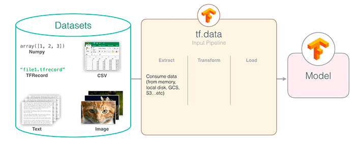

## Table of Contents

## What is the TensorFlow Dataset API (tf.data) and why is it important in machine learning?

The TensorFlow Dataset API, often referred to as tf.data, is a powerful tool used in machine learning to handle and process data efficiently. It allows you to create complex input pipelines from simple, reusable pieces that can read data from various sources, such as memory, files, or distributed storage systems. With tf.data, you can transform and preprocess the data on-the-fly, which is crucial for training machine learning models on large datasets. This API is designed to work seamlessly with TensorFlow, making it easier to manage data flow and optimize performance.

One of the main reasons tf.data is important in machine learning is that it helps to improve the efficiency and scalability of training processes. By using tf.data, you can avoid bottlenecks that often occur when loading and preprocessing data, which can significantly speed up the training time of your models. For example, you can use tf.data to parallelize data loading and preprocessing, allowing your model to train on data as it's being prepared, rather than waiting for the entire dataset to be ready. This not only makes the training process faster but also allows you to work with larger datasets that might otherwise be too cumbersome to handle.

## How do you create a simple dataset using tf.data from in-memory data?

To create a simple dataset using tf.data from in-memory data, you can use the `tf.data.Dataset.from_tensor_slices` method. This method takes a tensor or a list of tensors and creates a dataset where each element is a slice of the input tensor. For example, if you have a list of numbers, you can turn it into a dataset that you can iterate over. This is useful when you want to feed your data into a TensorFlow model for training or evaluation.

Here's a simple example of how to create a dataset from a list of numbers:

```python
import tensorflow as tf

# Create a list of numbers
numbers = [1, 2, 3, 4, 5]

# Create a dataset from the list
dataset = tf.data.Dataset.from_tensor_slices(numbers)

# Iterate over the dataset
for num in dataset:
    print(num.numpy())
```

In this example, the `tf.data.Dataset.from_tensor_slices` method takes the list `numbers` and creates a dataset where each element is one number from the list. When you iterate over the dataset, you get each number one at a time, which can be used to feed into a TensorFlow model. This approach is straightforward and efficient for small to medium-sized datasets stored in memory.

## What are the basic operations you can perform on a tf.data.Dataset?

With a tf.data.Dataset, you can do many basic operations to prepare your data for [machine learning](/wiki/machine-learning). One common operation is to shuffle the data, which helps your model learn from different examples in different orders. You can use the `shuffle` method to do this, which takes a buffer size as an argument to determine how many elements to shuffle at a time. Another important operation is to batch the data, which groups multiple examples into a single batch. This is done using the `batch` method, which takes the batch size as an argument. Batching is useful because it can speed up training by processing multiple examples at once.

You can also repeat the dataset using the `repeat` method, which allows you to go through the data multiple times during training. This is helpful when you want your model to see the data more than once. Additionally, you can use the `map` method to apply a function to each element of the dataset. This is useful for data preprocessing, like normalizing the data or converting it to the right format. For example, if you have a dataset of images, you might use `map` to resize them to a standard size. These operations can be combined to create a powerful data pipeline that prepares your data efficiently for training.

Here's a simple example of how you might use these operations:

```python
import tensorflow as tf

# Create a dataset from a list of numbers
numbers = [1, 2, 3, 4, 5]
dataset = tf.data.Dataset.from_tensor_slices(numbers)

# Apply operations
dataset = dataset.shuffle(buffer_size=5)  # Shuffle the dataset
dataset = dataset.batch(batch_size=2)     # Batch the dataset
dataset = dataset.repeat(count=2)         # Repeat the dataset twice

# Iterate over the dataset
for batch in dataset:
    print(batch.numpy())
```

In this example, the dataset is shuffled, batched into groups of 2, and repeated twice. When you iterate over the dataset, you'll see the numbers in different orders, grouped into batches, and repeated.

## How can you use tf.data to read data from files, such as CSV or TFRecord files?

You can use tf.data to read data from files like CSV or TFRecord files easily. For CSV files, you can use `tf.data.experimental.CsvDataset` to create a dataset directly from a CSV file. You just need to tell it the file path and the column names or types. This is useful when you have data stored in a CSV file and want to use it for training a model. For example, if you have a CSV file with columns for features and labels, you can read it into a dataset and then process it further.

For TFRecord files, which are binary files optimized for TensorFlow, you can use `tf.data.TFRecordDataset` to read the data. TFRecord files are good for large datasets because they are fast to read and can be compressed. You need to tell the `TFRecordDataset` the path to the file, and then you can use `tf.io.parse_single_example` or `tf.io.parse_example` to decode the records into tensors. This way, you can efficiently load and process large amounts of data stored in TFRecord format.

Here's a simple example of how you might use tf.data to read from a CSV file and a TFRecord file:

```python
import tensorflow as tf

# Reading from a CSV file
csv_file = 'path/to/your/file.csv'
csv_dataset = tf.data.experimental.CsvDataset(
    filenames=csv_file,
    record_defaults=[tf.float32, tf.float32],  # Assuming two float columns
    header=True
)

# Reading from a TFRecord file
tfrecord_file = 'path/to/your/file.tfrecord'
tfrecord_dataset = tf.data.TFRecordDataset(tfrecord_file)

# Define a function to parse the TFRecord
def _parse_function(example_proto):
    feature_description = {
        'feature': tf.io.FixedLenFeature([], tf.float32),
        'label': tf.io.FixedLenFeature([], tf.float32),
    }
    return tf.io.parse_single_example(example_proto, feature_description)

# Apply the parsing function to the dataset
parsed_dataset = tfrecord_dataset.map(_parse_function)
```

## What is the purpose of using tf.data.Dataset.map() and how is it implemented?

The `tf.data.Dataset.map()` function is used to apply a transformation to each element of a dataset. This is helpful when you need to preprocess your data before feeding it into a model. For example, you might want to normalize your data, convert it to a different format, or extract specific features. By using `map()`, you can do these transformations on-the-fly as the data is being read, which can save memory and make your data pipeline more efficient.

To use `map()`, you need to provide a function that defines the transformation you want to apply. This function will be called on each element of the dataset. For example, if you have a dataset of images and you want to resize them, you can define a function that takes an image and returns the resized version. Then, you can use `map()` to apply this function to every image in the dataset. Here's a simple example of how you might use `map()` to normalize a dataset of numbers:

```python
import tensorflow as tf

# Create a dataset from a list of numbers
numbers = [1, 2, 3, 4, 5]
dataset = tf.data.Dataset.from_tensor_slices(numbers)

# Define a function to normalize the numbers
def normalize(num):
    return (num - tf.reduce_mean(numbers)) / tf.math.reduce_std(numbers)

# Apply the normalization function to the dataset
normalized_dataset = dataset.map(normalize)

# Iterate over the normalized dataset
for num in normalized_dataset:
    print(num.numpy())
```

## How does tf.data.Dataset.batch() work and what are its benefits?

The `tf.data.Dataset.batch()` function groups multiple elements of a dataset into a single batch. When you use `batch()`, you tell it how many elements you want in each batch. For example, if you have a dataset of numbers and you use `batch(2)`, it will group the numbers into pairs. This is useful because many machine learning models work better when they can process multiple examples at once. Here's a simple example of how to use `batch()`:

```python
import tensorflow as tf

# Create a dataset from a list of numbers
numbers = [1, 2, 3, 4, 5]
dataset = tf.data.Dataset.from_tensor_slices(numbers)

# Batch the dataset into groups of 2
batched_dataset = dataset.batch(2)

# Iterate over the batched dataset
for batch in batched_dataset:
    print(batch.numpy())
```

The main benefit of using `batch()` is that it can make your model train faster. When you process data in batches, you can take advantage of parallel processing on your computer's GPU or CPU. This means that instead of processing one example at a time, which can be slow, you can process many examples together, which can be much faster. Batching also helps to make the training process more stable because the model sees many examples at once, which can help it learn more effectively.

## What are some common data augmentation techniques that can be applied using tf.data?

Data augmentation is a way to make your dataset bigger and more varied by changing the data a little bit. With tf.data, you can use the `map()` function to apply these changes to each piece of data in your dataset. Some common ways to do this include flipping images, rotating them, or changing their brightness. For example, if you have a dataset of pictures, you might use `map()` to flip each picture left to right. This can help your model learn to recognize things no matter which way they're facing.

Another common technique is to zoom in or out on images. This can help your model learn to recognize objects even if they're bigger or smaller than usual. You can also add noise to your data, which means adding small random changes. This can help your model be more robust and handle real-world data better. All these changes can be done on-the-fly as your data is being read, which saves memory and makes your data pipeline more efficient.

Here's a simple example of how you might use tf.data to flip images in a dataset:

```python
import tensorflow as tf

# Create a dataset from a list of images
images = tf.random.normal([10, 28, 28, 3])  # 10 images of size 28x28 with 3 channels
dataset = tf.data.Dataset.from_tensor_slices(images)

# Define a function to flip the images
def flip_image(image):
    return tf.image.flip_left_right(image)

# Apply the flipping function to the dataset
augmented_dataset = dataset.map(flip_image)

# Iterate over the augmented dataset
for image in augmented_dataset:
    print(image.shape)
```

## How can you optimize the performance of data pipelines using tf.data, including prefetching and caching?

Optimizing the performance of data pipelines with tf.data involves using techniques like prefetching and caching. Prefetching helps by loading data ahead of time, so your model doesn't have to wait for data to be ready. You can use the `prefetch` method to tell tf.data to start loading the next batch of data while the current batch is being processed. This can make your training much faster because it reduces the time your model spends waiting for data. For example, if you set `prefetch(tf.data.AUTOTUNE)`, tf.data will automatically figure out how much data to load ahead of time based on your system's capabilities.

Caching is another way to speed up your data pipeline. When you use the `cache` method, tf.data stores the dataset in memory after it's been read the first time. This means that if you need to go through the data again, it can be loaded much faster from memory instead of being read from disk every time. This is especially useful when you're doing multiple epochs of training and your dataset fits in memory. For instance, you can use `dataset = dataset.cache()` to cache your dataset, which can significantly speed up your training process by avoiding repeated disk reads.

## What is the role of tf.data.Dataset.shuffle() and how does it affect model training?

The `tf.data.Dataset.shuffle()` function mixes up the order of the data in your dataset. It does this by using a buffer where it puts some of the data and then picks elements randomly from this buffer. You tell it how big the buffer should be with the `buffer_size` argument. For example, if you use `dataset.shuffle(buffer_size=100)`, it will mix up the first 100 elements and then keep adding new elements to the buffer as it goes along. This helps make sure that the model sees the data in a different order each time it goes through the dataset, which can help the model learn better.

Shuffling the data is important because it can stop the model from learning patterns that are just because of the order of the data. If the data is always in the same order, the model might start to remember the sequence instead of learning the actual patterns in the data. By shuffling, you make sure that the model sees different examples at different times, which can help it learn more about the data and not just the order. This can lead to a model that works better and is more likely to perform well on new data it hasn't seen before.

## How can you create and manage multiple epochs of data using tf.data?

To create and manage multiple epochs of data using tf.data, you can use the `repeat` method. This method tells the dataset to go through all the data again after it finishes the first time. For example, if you want your model to see the data three times, you can use `dataset = dataset.repeat(3)`. This is helpful because it lets your model learn from the data over and over, which can make it better at understanding patterns.

When you use `repeat` with other operations like `shuffle` and `batch`, you can create a powerful data pipeline. For example, you might want to shuffle the data each time it starts a new epoch so that the model sees the data in a different order. You can do this by putting `shuffle` after `repeat`, like `dataset = dataset.repeat(3).shuffle(buffer_size=100).batch(32)`. This way, the data is mixed up at the start of each epoch, and then it's grouped into batches for the model to process. This can help your model learn better and faster.

## What advanced features does tf.data offer for handling complex data structures and large datasets?

tf.data offers advanced features that make it easier to handle complex data structures and large datasets. One key feature is the ability to work with nested structures. This means you can have datasets where each element is not just a simple number or image, but a more complex structure like a dictionary or a tuple. For example, you might have a dataset where each element is a dictionary with keys for features and labels. You can use the `map` function to apply transformations to these nested structures, making it easy to preprocess complex data on-the-fly. This is helpful when you're working with data that has different types of information that need to be processed in different ways.

Another important feature is the ability to handle large datasets efficiently. tf.data can read data from multiple files at the same time, which is useful when you have a lot of data spread across many files. You can use the `interleave` function to read from multiple files in parallel, which can speed up the process of loading data. Additionally, tf.data supports distributed training, where the data is split across multiple machines. This means you can train your model on very large datasets that wouldn't fit on a single machine. By using these advanced features, you can create data pipelines that are both flexible and efficient, making it easier to work with complex and large datasets.

## How can you monitor and debug a tf.data pipeline to ensure it is functioning correctly?

To monitor and debug a tf.data pipeline, you can use the `take` method to look at a few elements of your dataset. This helps you see if the data is being read and processed correctly. For example, if you use `dataset.take(5)`, you can see the first five elements of your dataset. This is a simple way to check if your data looks right. You can also use the `tf.data.experimental.get_single_element` function to get one element from the dataset and check it in detail. This can help you find problems with how the data is being transformed or batched.

Another useful tool for debugging is the `tf.data.Dataset.element_spec` property. This tells you the structure of the elements in your dataset, which can help you understand what kind of data you're working with. If something in your pipeline isn't working as expected, you can use this to make sure the data is in the right format. Additionally, you can use TensorFlow's built-in logging and profiling tools to track how your data pipeline is performing. This can help you find bottlenecks and optimize your pipeline for better performance.

## References & Further Reading

[1]: Abadi, M., Barham, P., Chen, J., Chen, Z., Davis, A., Dean, J., ... & Zheng, X. (2016). ["TensorFlow: A System for Large-Scale Machine Learning."](https://arxiv.org/abs/1603.04467) In 12th {USENIX} Symposium on Operating Systems Design and Implementation ({OSDI} 16).

[2]: ["Hands-On Machine Learning with Scikit-Learn, Keras, and TensorFlow"](https://www.amazon.com/Hands-Machine-Learning-Scikit-Learn-TensorFlow/dp/1098125975) by Aurélien Géron

[3]: TensorFlow Core. (2023). ["tf.data: Build TensorFlow input pipelines."](https://www.tensorflow.org/guide/data) [Online Guide]

[4]: Chollet, F. (2018). ["Deep Learning with Python"](https://www.amazon.com/Deep-Learning-Python-Francois-Chollet/dp/1617294438) by François Chollet

[5]: Gulli, A., & Pal, S. (2017). ["Deep Learning with Keras."](https://books.google.com/books/about/Deep_Learning_with_Keras.html?id=20EwDwAAQBAJ) [E-book]