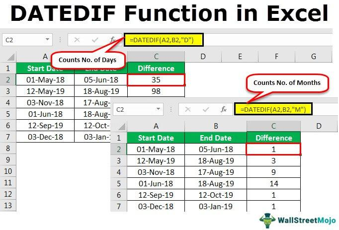

Algorithmic trading, characterized by its dependence on well-defined rules and automation, has significantly transformed financial markets. Incorporating computer algorithms, this method enables traders to execute orders at speeds and frequencies far beyond human capability. This evolution towards automated systems has introduced new operational efficiencies and complexities, necessitating refined mechanisms for managing trading actions. One such mechanism is the 'date certain' function, a crucial element that specifies exact dates for executing particular actions within trading systems.

The significance of the date certain function in algorithmic trading cannot be overstated. By providing precise timing for trade executions, these functions reduce uncertainty and enhance the predictability of trading strategies. They ensure that specific actions occur on predetermined dates, aligning with market conditions and strategic objectives. As such, date certain functions serve as integral components in the design of trading algorithms, contributing to improved accuracy and reliability in executing trades.



This article will explore the concept and application of date certain functions within algorithmic trading. We will examine their role in scheduling trade actions and assess their impact on enhancing the efficiency and precision of trading strategies. Real-world examples will illustrate how these functions are applied in various financial instruments, such as options and futures contracts. Additionally, we will discuss the legal and financial implications of date certain functions, highlighting their importance in maintaining contract integrity and ensuring compliance.

Readers will gain insights into the ways date certain functions augment trading strategies by providing certainty and precision. Understanding and implementing these functions can lead to more robust algorithmic trading systems, contributing to optimized performance and strategic success.

## Table of Contents

## What is a Date Certain Function?

A date certain function is a contractual clause that specifies an exact date by which a particular action must be completed. In the context of algorithmic trading, these functions play a crucial role in scheduling precise trade actions. Their implementation ensures that trading or contract execution occurs on a designated date, thus significantly reducing uncertainty in financial operations.

These functions are of particular importance in automated trading systems, where precision and timing are paramount. One fundamental characteristic of date certain functions is their legally binding nature, which holds parties accountable for fulfilling their commitments by the agreed-upon dates. This enforceable aspect provides a level of security and predictability in trading contracts, which is vital for minimizing risks associated with delayed or missed trades.

Moreover, date certain functions enable [algorithmic trading](/wiki/algorithmic-trading) systems to operate with enhanced accuracy. By ensuring specific actions are executed at predetermined times, these functions help align trading strategies with market conditions optimally. As a result, traders can better manage their portfolios, anticipating market movements and executing trades with efficiency.

In practical terms, these functions might be implemented in code as follows:

```python
import datetime

def execute_trade_on_date(certain_date, trade_action):
    """Executes a trade action on a specific date."""
    today = datetime.date.today()
    if today == certain_date:
        trade_action()
    else:
        print("Trade date not reached.")

# Example usage:
certain_date = datetime.date(2023, 11, 15)

# Define the trade action
def trade_action():
    print("Executing trade...")

# Execute trade on the specified date
execute_trade_on_date(certain_date, trade_action)
```

This example illustrates a simple mechanism whereby a trade action is scheduled to execute on a specific date. Such programs exemplify the way date certain functions can be utilized in algorithmic trading to ensure timely and precise trade execution, thereby adhering to the legal stipulations of relevant contracts.

## Examples of Date Certain Functions in Algorithmic Trading

Options contracts, integral to algorithmic trading systems, typically include a date certain for expiration, necessitating timely action by traders. These contracts stipulate an exact date when the option must be exercised if desired; failure to do so results in expiration. This precise timing is critical, as it allows traders to capitalize on market conditions while managing risk effectively. For instance, a call option on a stock may expire on the third Friday of a particular month, requiring the holder to decide whether to exercise it or let it lapse based on the current stock price relative to the strike price.

Similarly, futures contracts leverage date certain functions to dictate the delivery of goods or the settlement of profits and losses on a predefined schedule. These contracts specify the exact date when the seller must deliver the underlying asset or the date when cash settlement must occur, ensuring that both parties are aware of their obligations. This precision helps in managing the supply chain and price risk associated with commodities and financial instruments. For example, a [crude oil](/wiki/crude-oil) futures contract might demand delivery on the 20th of a particular month, regardless of market [volatility](/wiki/volatility-trading-strategies), ensuring that the transaction’s terms are clear and enforceable.

Algorithmic trading strategies frequently use date certain functions to execute buy or sell orders on designated dates, driven by market analysis. These strategies can be programmed to trigger trades automatically when specific conditions align with the calendar, thus optimizing entry and [exit](/wiki/exit-strategy) points without human intervention. Utilizing Python, traders can implement a script such as:

```python
import datetime
import pandas as pd

# Example strategy for a date certain function in trading
def trade_on_date(certain_date, stock_data):
    if datetime.datetime.now() == certain_date:
        return execute_trade(stock_data)

def execute_trade(data):
    # Logic for executing a trade
    pass

# Assume stock_data is preloaded DataFrame with stock information
certain_trade_date = datetime.datetime(2023, 12, 15)
trade_on_date(certain_trade_date, stock_data)
```

Such functions extend to setting up limit orders that adjust based on specified dates. Limit orders allow traders to set buy or sell instructions at predetermined prices. Date certain functions can enhance these orders by adjusting them according to evolving market conditions or trading strategies as the specified date approaches.

In portfolio management, automated rebalancing leverages date certain functions to adjust asset allocations on predefined schedules. Regular rebalancing ensures that a portfolio remains aligned with the investor's risk tolerance and investment goals, irrespective of market fluctuations. Implementing this involves scheduling specific times when the portfolio composition is analyzed and modified accordingly, often using algorithmic criteria like mean-variance optimization.

In summary, date certain functions provide algorithmic traders with mechanisms to execute precise actions within options, futures, and various trading strategies. These functions are essential tools for constructing reliable and efficient automated trading systems that demand meticulous adherence to predetermined timelines and conditions.

## Benefits of Using Date Certain Functions

Date certain functions are integral to algorithmic trading, offering several advantages that enhance trading efficiency and reliability. By providing clear and unambiguous guidelines for executing trades, these functions significantly bolster legal security. Clarity in contract terms ensures that all parties involved in a trade understand their obligations and the exact timing of executions, thereby reducing the potential for disputes or misinterpretations. 

One of the primary benefits is the prevention of delays and potential market losses. Specifying exact execution times reduces the risks associated with market volatility, allowing trades to be executed at the most advantageous moments as pre-defined by the algorithms. This precision not only aids in optimizing trade efficiency but also protects against adverse market movements that could arise from delayed actions.

Reducing human intervention is another significant advantage. By automating trade executions based on date certain functions, the scope for human error is minimized. This automation ensures strict adherence to trading strategies, as the algorithm executes actions consistently and accurately without the need for manual oversight. Consequently, traders can maintain a disciplined approach that aligns closely with their strategic objectives.

In the context of hedging, date certain functions improve efficiency by facilitating precise risk management. Traders can plan their hedging activities with a high degree of accuracy, adjusting their positions at exact times to mitigate risks associated with market changes. This level of precision is crucial for maintaining balanced portfolios and achieving desired risk profiles.

Finally, investor confidence is significantly heightened through the use of date certain functions. By ensuring adherence to the agreed terms and conditions of trading contracts, these functions assure investors that their investments are managed with high diligence and accuracy. The predictability and reliability imparted by date certain functions promote trust, which is essential for maintaining robust investor relationships and attracting new capital. Thus, the integration of date certain functions into algorithmic trading frameworks not only optimizes technical performance but also reinforces investor assurance in the trading process.

## Legal and Financial Implications

Date certain functions hold parties legally accountable, ensuring adherence to contractually stipulated actions by specific dates. When implemented in financial contracts, these functions provide both advantages and risks, necessitating careful consideration by all involved parties.

One of the primary legal benefits of date certain functions is their ability to offer remedies in case of non-compliance. Such provisions are designed to compel parties to fulfill their obligations within a designated timeframe, offering a clear [course](/wiki/best-algorithmic-trading-courses) of action if a party fails to meet its commitments. This legal enforceability adds a layer of security that can help mitigate the risk of financial loss resulting from contractual breaches.

Moreover, the inclusion of date certain functions in contracts may attract a premium due to the additional value they provide. By reducing uncertainty and enhancing predictability in transaction settlements, these functions could be seen as a value-added feature. Consequently, parties may be willing to pay more for contracts that include such provisions, recognizing their potential benefits in minimizing risk and ensuring timely execution.

The enforceability of date certain functions is grounded in legal precedents that emphasize strict adherence to contractual terms. Courts have consistently upheld the binding nature of these functions, reinforcing the necessity for parties to comply with the agreed-upon timelines. This judicial backing underscores the importance of clearly defining and documenting these contractual clauses to avoid ambiguities and disputes.

The financial implications of failing to meet date certain obligations can be significant. Non-compliance may result in lawsuits and the imposition of damages, leading to substantial financial losses. Parties must therefore exercise due diligence in fulfilling their contractual commitments to avoid such penalties. Clear documentation and a thorough understanding of the terms are crucial to safeguarding against potential legal challenges.

Overall, date certain functions play a pivotal role in financial contracts by enhancing precision and accountability. However, parties must approach these functions with caution, ensuring that all terms are well-documented and understood to prevent legal and financial repercussions.

## Challenges and Considerations

Date certain functions, while advantageous, can introduce several challenges and considerations for traders implementing them within algorithmic trading strategies. 

A prominent issue is the potential for rigidity in trading strategies. The inflexibility of a date certain function dictates that actions must occur on predetermined dates, potentially ignoring evolving market conditions. This lack of adaptability can lead to suboptimal decisions that do not reflect real-time market dynamics.

Moreover, algorithmic errors or system failures pose significant risks. If the algorithm fails to execute an action on the specified date due to technical malfunctions, this could lead to missed opportunities or unintended financial consequences. Ensuring robust algorithmic designs and system reliability is therefore essential to mitigate these risks.

Time synchronization is another critical [factor](/wiki/factor-investing). Traders must ensure their systems are precisely synchronized to avoid discrepancies caused by differing time zones. Such discrepancies can result in actions not being executed at the intended time, adversely affecting the trading strategy’s performance.

Market [liquidity](/wiki/liquidity-risk-premium) around date certain events should also be carefully considered. Low liquidity might exacerbate price volatility or widen bid-ask spreads, impacting the cost and feasibility of executing trades as planned. Traders need to assess liquidity conditions and potentially adjust their strategies accordingly to minimize adverse price impacts.

Lastly, regulatory compliance is an indispensable consideration when employing date certain functions. Traders must ensure adherence to legal standards governing their use to avoid penalties and legal disputes. This involves a thorough understanding of relevant laws and regulations in the jurisdictions where they operate.

By addressing these challenges, traders can better harness the advantages of date certain functions while minimizing associated risks.

## Conclusion

The adoption of date certain functions within algorithmic trading frameworks plays a vital role in enhancing precision, reliability, and legal security. These functions, which define exact dates for executing specific actions, automate and optimize trading strategies with remarkable accuracy. By reducing ambiguities and ensuring adherence to predefined schedules, they mitigate the risks of human error and market fluctuations that might otherwise arise from manual intervention.

Despite their apparent benefits, the integration of date certain functions is not without its challenges. Rigidity in execution schedules can limit flexibility, and any malfunction in algorithmic systems could lead to missed opportunities. It is therefore essential for traders to ensure robust system design and synchronization to harness the full potential of date certain functions and prevent discrepancies such as time zone misalignments or system failures.

As the landscape of algorithmic trading evolves, the usage of date certain functions is expected to grow both in complexity and application, driven by advancements in technology and heightened regulatory standards. This evolution will likely bring about more sophisticated strategies that take full advantage of precise scheduling.

Traders and financial institutions are encouraged to explore the integration of date certain functions into their trading practices. By doing so, they can achieve improved strategic outcomes, reduced legal uncertainties, and heightened confidence in contractual commitments. Efficiently leveraging these functions holds the promise of not only optimizing individual strategies but also contributing to more orderly and predictable financial markets.

## References & Further Reading

[1]: Kearns, M., Nevmyvaka, Y. (2013). ["Machine Learning for Market Microstructure and High Frequency Trading."](https://www.cis.upenn.edu/~mkearns/papers/KearnsNevmyvakaHFTRiskBooks.pdf) Handbook of Financial Econometrics and Statistics.

[2]: Aldridge, I. (2013). ["High-Frequency Trading: A Practical Guide to Algorithmic Strategies and Trading Systems."](https://www.amazon.com/High-Frequency-Trading-Practical-Algorithmic-Strategies/dp/1118343506) Wiley Trading.

[3]: De Prado, M. L. (2018). ["Advances in Financial Machine Learning."](https://www.amazon.com/Advances-Financial-Machine-Learning-Marcos/dp/1119482089) Wiley.

[4]: Chan, E. (2009). ["Quantitative Trading: How to Build Your Own Algorithmic Trading Business."](https://github.com/ftvision/quant_trading_echan_book) Wiley.

[5]: Pardo, R. (2008). ["The Evaluation and Optimization of Trading Strategies,"](https://onlinelibrary.wiley.com/doi/book/10.1002/9781119196969) Wiley Trading.