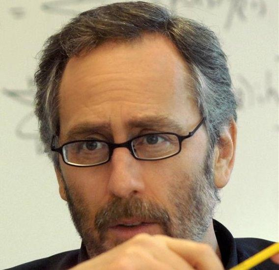

## Table of Contents

## Who is David E. Shaw?

David E. Shaw is a well-known person in the world of computers and finance. He was born in 1951 in the United States. Shaw is famous for starting a company called D. E. Shaw & Co., which uses computers to make smart investment choices. Before he started his company, Shaw worked at places like Morgan Stanley and taught at Columbia University. He is considered a pioneer in using computers to help make money in the stock market.

Besides his work in finance, Shaw has also made a big impact in the field of science. He helped start the Center for Computational Biology and Bioinformatics at Columbia University. This center uses computers to study biology and health. Shaw also founded a company called D. E. Shaw Research, which works on understanding how proteins work in our bodies. His work has helped many scientists learn more about how to fight diseases.

David E. Shaw is not only successful in his professional life but also generous. He has donated a lot of money to different causes, including education and health. For example, he gave a large donation to help build a new science building at Columbia University. Shaw's contributions have made a big difference in many areas, showing that he cares about helping others and advancing knowledge.

## What is David E. Shaw's educational background?

David E. Shaw went to school at the University of California, San Diego. He studied there and got a degree in biochemistry. After that, he decided to learn more about computers and math. So, he went to Stanford University and got a Ph.D. in computer science. His time at these schools helped him learn a lot about science and technology.

After finishing his Ph.D., Shaw started working as a professor at Columbia University. There, he taught students about computer science. This job let him share his knowledge and also keep learning new things. His education and teaching experience were important steps in his career. They helped him start his own companies later on.

## How did David E. Shaw start his career?

David E. Shaw started his career after getting his Ph.D. in computer science from Stanford University. He first worked at a big company called Morgan Stanley. There, he used his computer skills to help with finance. This job showed him how computers could be used to make smart choices in the stock market.

After working at Morgan Stanley, Shaw became a professor at Columbia University. He taught computer science and shared what he knew with students. This job let him keep learning and also helped him think about starting his own business. His time at Columbia was important because it led him to start D. E. Shaw & Co., where he used computers to help make money in the stock market.

## What is D. E. Shaw & Co., and what role did David E. Shaw play in its founding?

D. E. Shaw & Co. is a company that David E. Shaw started in 1988. It is a big firm that uses computers to make smart choices about buying and selling stocks. This kind of work is called quantitative investing. The company looks at a lot of data and uses math to decide what to do with money. It has grown a lot since it started and now has many employees all over the world.

David E. Shaw was the founder of D. E. Shaw & Co. He used his knowledge of computers and finance to start the company. Before he started it, he worked at Morgan Stanley and taught at Columbia University. His idea was to use computers to find good ways to invest money. He led the company for many years and helped it become very successful. Even though he is not the main leader anymore, the company still uses the ideas he started with.

## What are some of the major achievements of D. E. Shaw & Co. under David E. Shaw's leadership?

Under David E. Shaw's leadership, D. E. Shaw & Co. became known as a leader in using computers to make smart investment choices. The company grew very fast and became one of the biggest and most respected firms in its field. They were able to use a lot of data and math to find good ways to invest money. This helped them make a lot of money for their clients and themselves. The company also started to work in many different areas of finance, not just stocks. This showed how good they were at using computers to understand the market.

Another big achievement was that D. E. Shaw & Co. helped change how people thought about investing. Before they came along, many people did not use computers to make investment choices. But D. E. Shaw & Co. showed that computers could be very helpful. They used new ideas and technology to find good investments. This made other companies start to use computers too. David E. Shaw's leadership helped make the company successful and also changed the whole industry.

## How has David E. Shaw influenced the field of computational biochemistry?

David E. Shaw has made a big impact on computational biochemistry through his work at D. E. Shaw Research. He started this company to use computers to study how proteins work in our bodies. Proteins are very important because they help our bodies do many things, like fighting diseases. By using computers, Shaw and his team can look at proteins in a very detailed way. They can see how proteins move and change, which helps scientists understand diseases better and find new ways to treat them.

One of the big things Shaw did was to create a special computer called Anton. This computer is very fast and can do a lot of calculations to study proteins. With Anton, scientists can see how proteins work over a long time. This has helped them learn more about how to stop diseases like Alzheimer's and cancer. Shaw's work has shown that computers can be a powerful tool in biochemistry. His contributions have helped many scientists around the world and have moved the field forward.

## What is David E. Shaw's approach to quantitative investing?

David E. Shaw's approach to quantitative investing is all about using computers to make smart choices with money. He started D. E. Shaw & Co. to use math and data to decide which stocks to buy and sell. Instead of just guessing, his company looks at a lot of information and uses special formulas to find good investments. This way, they can make decisions that are based on numbers and facts, not just feelings.

Shaw's method has been very successful because it uses technology to do things that people alone can't do as well. Computers can look at a lot of data very quickly and find patterns that might be hard for people to see. This helps D. E. Shaw & Co. find good opportunities in the stock market that others might miss. By using computers, Shaw has changed how people think about investing and has made his company one of the best in the world at quantitative investing.

## Can you explain the significance of the Anton supercomputer in David E. Shaw's research?

The Anton supercomputer is very important in David E. Shaw's research because it helps scientists study proteins in a new way. Proteins are tiny parts of our bodies that do many important jobs, like fighting diseases. Anton is a special computer that can do a lot of math very quickly. This lets scientists see how proteins move and change over a long time. By using Anton, Shaw and his team can learn more about how proteins work and find new ways to treat diseases.

Anton has made a big difference in the field of computational biochemistry. Before Anton, it was hard to study how proteins move because it takes a long time and a lot of computer power. But Anton is very fast and can do these studies much better. This has helped scientists understand diseases like Alzheimer's and cancer better. Because of Anton, researchers around the world can now do more detailed studies on proteins, which can lead to new medicines and treatments.

## What are some of the key patents David E. Shaw has been granted?

David E. Shaw has been granted several important patents, many of which are related to his work in finance and computational biology. One key patent he received is for a method of using computers to make smart choices about buying and selling stocks. This patent is important because it shows how Shaw used technology to change the way people invest money. His company, D. E. Shaw & Co., uses this method to help its clients make money in the stock market.

Another important patent Shaw has is for the Anton supercomputer. This patent is about a special computer that can study how proteins work in our bodies. Proteins are tiny parts of us that do important jobs, like fighting diseases. The Anton supercomputer can do a lot of math very quickly, which helps scientists learn more about diseases and find new ways to treat them. This patent has helped move the field of computational biology forward.

## How has David E. Shaw's work impacted the broader financial industry?

David E. Shaw's work has changed the way the financial industry works. He started D. E. Shaw & Co., which uses computers to make smart choices about buying and selling stocks. This way of investing is called quantitative investing. Before Shaw, many people didn't use computers to help them invest. But Shaw showed that computers could look at a lot of data and find good investments. This made other companies start using computers too. Now, many big firms use computers to help them make money in the stock market.

Shaw's ideas have also made the financial industry more competitive. His company became very successful and showed that using math and technology could lead to good results. This made other companies want to do the same thing. They started hiring people who were good at math and computers to help them invest. Shaw's work has helped make the financial industry better at finding good investments and making money for their clients.

## What are David E. Shaw's contributions to philanthropy and education?

David E. Shaw has given a lot of money to help others. He cares about education and health, so he donates to schools and hospitals. One big thing he did was give a lot of money to Columbia University. This helped them build a new science building. His donations have helped many students learn and many sick people get better care.

Shaw also started the Center for Computational Biology and Bioinformatics at Columbia University. This center uses computers to study biology and health. By doing this, Shaw has helped many scientists learn more about how to fight diseases. His work in philanthropy and education shows that he wants to help others and make the world a better place.

## What are the current projects or research areas that David E. Shaw is focusing on?

David E. Shaw is currently focusing on his work at D. E. Shaw Research. This company uses special computers to study how proteins work in our bodies. Proteins are important because they help us fight diseases. Shaw and his team are trying to learn more about how proteins move and change. This can help scientists find new ways to treat diseases like Alzheimer's and cancer. They use a very fast computer called Anton to do these studies. Anton helps them see how proteins work over a long time, which is something that was hard to do before.

Besides his work at D. E. Shaw Research, Shaw is also still involved with D. E. Shaw & Co. This company uses computers to make smart choices about buying and selling stocks. Even though Shaw is not the main leader anymore, he helps the company keep using new ideas and technology to find good investments. His work has changed how people think about investing and made the financial industry more competitive. Shaw's focus on using computers in both biology and finance shows how he believes technology can help solve big problems.

## References & Further Reading

[1]: Bergstra, J., Bardenet, R., Bengio, Y., & Kégl, B. (2011). ["Algorithms for Hyper-Parameter Optimization."](https://papers.nips.cc/paper/4443-algorithms-for-hyper-parameter-optimization) Advances in Neural Information Processing Systems 24.

[2]: ["Advances in Financial Machine Learning"](https://www.amazon.com/Advances-Financial-Machine-Learning-Marcos/dp/1119482089) by Marcos Lopez de Prado

[3]: ["Evidence-Based Technical Analysis: Applying the Scientific Method and Statistical Inference to Trading Signals"](https://www.amazon.fr/Evidence-Based-Technical-Analysis-Scientific-Statistical/dp/0470008741) by David Aronson

[4]: ["Machine Learning for Algorithmic Trading"](https://www.amazon.fr/Machine-Learning-Algorithmic-Trading-alternative/dp/1839217715) by Stefan Jansen

[5]: ["Quantitative Trading: How to Build Your Own Algorithmic Trading Business"](https://www.amazon.com/Quantitative-Trading-Build-Algorithmic-Business/dp/0470284889) by Ernest P. Chan