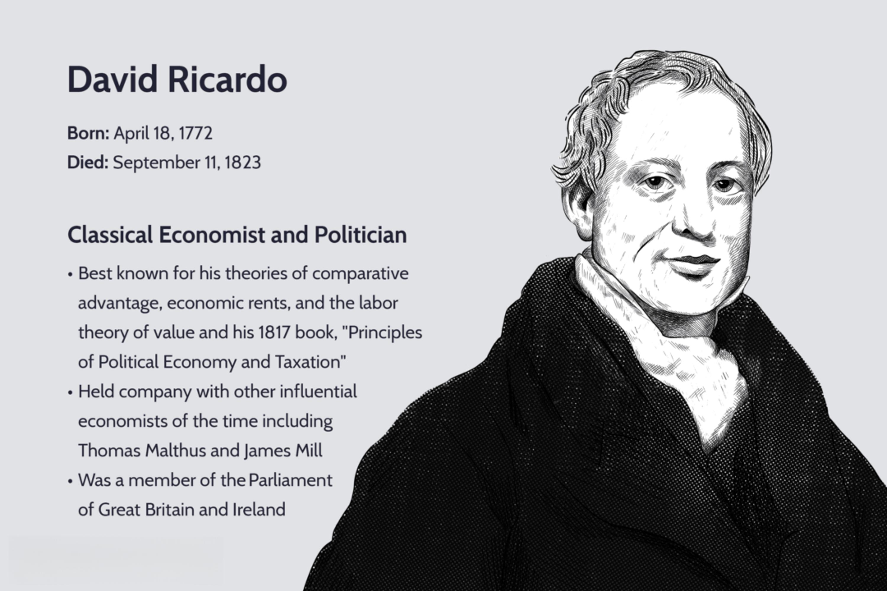

The concept of comparative advantage, as introduced by David Ricardo, is an essential cornerstone of international trade economics. Comparative advantage explains how countries benefit from specializing in the production of goods for which they have a lower opportunity cost, thereby fostering an efficient allocation of resources on a global scale. Ricardo's theories laid the groundwork for understanding how nations can optimize trade relationships and enhance economic growth through specialization, contrasting with earlier notions focused primarily on absolute advantages.

In today's fast-paced global economy, Ricardo’s insights remain profoundly relevant, particularly when examining innovations such as algorithmic trading. This highly specialized form of trading utilizes programmed systems to execute trades at speeds and efficiencies unattainable by human traders. By integrating economic theories like comparative advantage into these algorithms, traders can generate strategies informed by global market efficiencies and economic indicators, providing a competitive edge.



Comparative advantage continues to influence economic policy development and international trade dynamics. Policymakers often leverage these principles to negotiate trade agreements, determine tariffs, and assess the potential impact of protectionist policies. Understanding the core tenets of Ricardo's theory allows for informed decision-making that can lead to more robust and sustainable economic outcomes.

Moreover, translating such economic theories into practical applications within algorithmic trading platforms represents a forward-thinking approach to capitalizing on market opportunities. By systematically analyzing economic data through the lens of comparative advantage, algorithms can identify and exploit relative cost advantages across different markets and securities. This application not only enhances trading efficiency but also underscores the enduring significance of Ricardo’s work in modern economic and technological contexts.

## Table of Contents

## David Ricardo's Economic Theories

David Ricardo, an influential figure in classical economics, made significant contributions to the field with his pioneering introduction of the theory of comparative advantage. This theory postulates that nations gain from specializing in the production of goods they can produce at the lowest opportunity cost, even if they are less efficient in producing all goods compared to another nation. The idea encouraged countries to engage in trade that would be mutually beneficial and to focus on sectors where they hold a competitive edge, thereby enhancing overall economic efficiency and wealth generation.

Ricardo's theory of comparative advantage built upon and extended the concepts of Adam Smith, who advocated the idea of absolute advantage, where production efficiency varied between nations. The critical distinction in Ricardo's analysis was that even if one nation had an absolute disadvantage across all products, it could still benefit from trade by focusing on relative efficiency differences.

In addition to comparative advantage, Ricardo developed the labor theory of value, which posits that the value of a good is primarily determined by the labor required for its production. Although this theory has evolved and faced criticism, it laid the groundwork for later economic theories, and influenced discussions on value and distribution.

Ricardo also formulated the theory of rents, which addressed the differential returns to land. According to Ricardo, rent arises from the varying fertility of land, and it serves as a portion of total production value that goes to landowners due to the productive differences in land quality. This theory highlighted issues in wealth distribution and influenced debates over taxation and policy regarding land and resources.

Ricardo's economic theories, particularly comparative advantage, continue to be foundational in understanding international trade dynamics and economic policies. Through rigorous analysis and logical reasoning, Ricardo expanded upon the ideas of his predecessors and provided a coherent framework that remains relevant in the context of modern economics. His insights into production specialization and trade laid the groundwork for subsequent developments in economic thought, influencing both policy and academic research.

## Theory of Comparative Advantage

The theory of comparative advantage, formulated by David Ricardo, serves as a cornerstone of international trade theory. It elucidates how and why countries can benefit from engaging in trade by concentrating on the production of goods for which they possess the lowest opportunity cost. This theory contrasts with absolute advantage, where a nation benefits by being more efficient than others in producing a good. 

Ricardo's comparative advantage principle suggests that even if a country is less efficient in producing all goods compared to another nation, it can still gain from trade by honing in on goods where it holds a relative efficiency edge. The opportunity cost model helps to illustrate this concept. Mathematically, country A should specialize in producing good X if:

$$
\frac{OC_{X,A}}{OC_{Y,A}} < \frac{OC_{X,B}}{OC_{Y,B}}
$$

where $OC_{X,A}$ and $OC_{Y,A}$ are the opportunity costs of producing goods X and Y in country A, respectively, and $OC_{X,B}$ and $OC_{Y,B}$ are the opportunity costs in country B.

This principle supports the advocacy of free trade, positing that such specialization and exchange enhance global economic efficiency. In practice, comparative advantage encourages countries to allocate resources more judiciously, improving overall productivity and economic welfare. The theory also cautions against protectionist policies, such as tariffs and subsidies, which can hinder economic prosperity by imposing artificial barriers to trade. 

In summary, comparative advantage not only underscores the rationale for international trade but also highlights the potential pitfalls of isolationist economic strategies, advocating instead for a more interconnected and cooperative global trading environment.

## From Economics to Algorithmic Trading

Algorithmic trading applies economic theories such as comparative advantage to craft sophisticated trading strategies that capitalize on global economic indicators and market efficiencies. This approach hinges on a comprehensive understanding of economic metrics, familiar to any economist studying international trade but viewed here through the innovative application to trading algorithms.

In Ricardo's analysis, the cornerstone of comparative advantage rests on the efficient allocation of resources to produce goods with the lowest opportunity cost. Translating this to [algorithmic trading](/wiki/algorithmic-trading), the same principle can be applied to identify market inefficiencies where certain securities can be traded advantageously. For example, by evaluating data on price movements, supply-demand shifts, and geopolitical factors, algorithms can optimize trades that align with Ricardo's insights.

An algorithmic trader enhances decision-making by leveraging complex models that incorporate these economic indicators. Consider a simplified representation where a model predicts future price movements based on past data and economic conditions:

```python
import numpy as np
from sklearn.linear_model import LinearRegression

# Sample economic indicator data
economic_data = np.array([[1.1, 2.4, 3.5], [2.2, 3.5, 4.5], [3.3, 4.6, 5.5]])
# Corresponding price movements
price_movements = np.array([1.5, 2.9, 3.8])

# Initialize and fit the model
model = LinearRegression()
model.fit(economic_data, price_movements)

# Predict price movement using new economic data
new_data = np.array([[2.5, 3.6, 4.7]])
predicted_movement = model.predict(new_data)
print(f"Predicted price movement: {predicted_movement}")
```

In most sophisticated applications, algorithmic trading systems analyze thousands of such data points simultaneously, adjusting strategies dynamically as market conditions evolve. These systems parse diverse data sources, including global economic reports, historical market data, and real-time analytics, to devise strategies that exploit comparative advantages effectively.

By leveraging economic theories through algorithmic systems, traders can achieve competitive advantages by adapting to fast-changing economic landscapes. The precision of these algorithms allows them to execute trades at optimal times, maximizing returns while minimizing risk, reflective of the trading equivalent of producing goods where opportunity costs are minimized.

## Implementing Comparative Advantage in Algo Trading

Algorithmic trading can efficiently integrate the principles of comparative advantage by identifying and exploiting market conditions where certain securities demonstrate relative cost advantages. This involves setting precise parameters within automated trading algorithms, which allow traders to capitalize on opportunities that align with the comparative advantage theory. The main goal is to develop trading strategies that leverage historical and real-time data to predict optimal trading opportunities based on the relative efficiencies of different market assets.

One of the fundamental ways algorithmic trading employs comparative advantage is by assessing the relative performance metrics of assets. For instance, if a particular security exhibits superior performance relative to its opportunity cost, trading algorithms can prioritize trades involving this security. This prioritization relies heavily on data analysis and economic modeling to identify which securities offer the best returns given current market conditions.

### Setting Parameters in Automated Trading Algorithms

To operationalize comparative advantage, traders must establish parameters that define when and how trades should be executed. This process involves assessing various economic indicators such as interest rates, GDP growth rates, and inflation rates, which can signal changes in opportunity costs. Here is a basic example in Python to illustrate the concept of setting parameters based on relative cost advantages:

```python
# Example of a simple strategy using Python

# Import necessary libraries
import numpy as np
import pandas as pd

# Function: Determine relative cost advantage
def calculate_relative_advantage(security_data):
    # Sample calculation of relative cost advantage
    mean_return = np.mean(security_data['returns'])
    std_dev = np.std(security_data['returns'])
    return mean_return / std_dev  # Example metric

# Sample data
data = {'Security A': {'returns': [0.05, 0.02, 0.04, 0.06, 0.03]},
        'Security B': {'returns': [0.02, 0.01, 0.03, 0.01, 0.02]}}

# Calculate relative advantages
for security, values in data.items():
    advantage = calculate_relative_advantage(pd.DataFrame(values))
    print(f"Relative Cost Advantage for {security}: {advantage}")
```

### Modeling Predictions Based on Historical Data

In the context of algorithmic trading, historical data is crucial for modeling predictions. Algorithms can be designed to analyze historical price movements and trading volumes to identify patterns and predict future performance. By aligning these predictions with Ricardo's principles, traders focus on sectors or assets with the most favorable opportunity costs.

Monte Carlo simulations and linear regression models are examples of tools that can help refine these strategies, allowing traders to backtest various scenarios and enhance the predictive accuracy of their models. By integrating [machine learning](/wiki/machine-learning) techniques, such as neural networks or decision trees, algorithms can further enhance their ability to detect and adapt to changing economic conditions.

In essence, algorithmic trading leverages comparative advantage by systematically evaluating market conditions and strategically deciding where to allocate resources for maximum potential return. By modeling trading strategies around historical data and current economic indicators, traders can better position themselves to benefit from relative efficiencies and market opportunities.

## Challenges and Criticisms

While David Ricardo's theories, particularly comparative advantage, have been fundamental in shaping economic discourse, their application is not without challenges in today's complex global trading systems. Key assumptions underpinning these theories, such as labor being the sole [factor](/wiki/factor-investing) of production, are often criticized for being overly simplistic in the context of modern economies that involve multiple inputs, including technology and capital.

Ricardo's model posits that countries will benefit from trade by specializing in the production of goods at which they have a lower opportunity cost, but this assumes constant returns to scale and ignores economies of scale and externalities. Moreover, it does not account for the fact that factors of production are not immobile as assumed. Capital, for instance, can often move more freely across borders than labor, leading to imbalances not predicted by his theory.

Algorithmic trading, which utilizes economic theories to enhance trading strategies, must face these criticisms head-on. In contemporary settings, traders operate in markets characterized by rapid technological changes and complex financial instruments that were nonexistent in Ricardo’s time. Thus, while his insights on opportunity costs and trade specialization hold theoretical appeal, adapting these concepts requires adjustments to account for multifaceted market dynamics.

For example, algorithmic models must incorporate multiple economic indicators and adjust for [volatility](/wiki/volatility-trading-strategies) and market sentiment, rather than relying solely on comparative costs. This involves deploying advanced data analytics and machine learning techniques to parse through vast datasets and identify patterns that align with modified economic theories. A simple Python snippet to illustrate how one might begin modeling such an approach could look like this:

```python
import pandas as pd
import numpy as np
from sklearn.linear_model import LinearRegression

# Load trade data
data = pd.read_csv('trade_data.csv')

# Feature engineering to include multiple factors of production
data['capital_to_labor_ratio'] = data['capital'] / data['labor']
data['tech_level'] = data['technology_index']

# Selecting features and targets
X = data[['capital_to_labor_ratio', 'tech_level', 'opportunity_cost']]
y = data['trade_balance']

# Building and training the model
model = LinearRegression()
model.fit(X, y)

# Making predictions
trade_predictions = model.predict(X)
print(trade_predictions)
```

Algorithmic traders must also remain agile, constantly refining their models to account for dynamic market conditions and discrepancies between model predictions and real-world outcomes. This necessitates a robust approach to quantitative analysis, where models are stress-tested and validated against historical data, ensuring resilience against market anomalies. 

While Ricardo’s insights continue to inform economic policy and trading strategies, their application in algorithmic trading requires nuanced adaptations and an embrace of technological tools to bridge the gap between theory and practice in complex modern markets.

## Conclusion

David Ricardo's theory of comparative advantage remains crucial for understanding the dynamics of modern international trade and the development of algorithmic trading strategies. In a globalized world where technology rapidly connects markets, the application of comparative advantage is continually adapting within economic and trading systems. This adaptation is largely due to technological advancements that allow for real-time data analysis and decision-making in trading.

Incorporating these classical economic theories into algorithmic trading strategies offers a valuable perspective on optimizing trading activities. By identifying which assets or markets hold a relative cost advantage based on economic indicators and historical data analysis, traders can finely tune their strategies for maximum efficacy. This involves coding algorithms that can analyze vast datasets to determine the optimal points for buying or selling, factoring in the opportunity costs that Ricardo emphasized.

Furthermore, in a market characterized by [high frequency](/wiki/high-frequency-trading) and volatility, algorithmic traders are better equipped to leverage comparative advantage by responding swiftly to shifts in economic conditions. This involves employing sophisticated models to predict market movements and adjust portfolios accordingly, making trading more efficient and economically grounded.

As global trade and financial markets continue to evolve, the intersection of Ricardo's economic theories with algorithmic trading will likely yield even more nuanced insights, fostering more sophisticated strategies that benefit from comparative advantage principles. This symbiotic relationship underscores the enduring relevance of Ricardo's insights and their applicability to cutting-edge financial practices.

## References and Further Reading

1. **Biographies of David Ricardo:**
   - Ricardo, David. *Principles of Political Economy and Taxation*. This seminal work lays the foundation of Ricardo's theories, including the concept of comparative advantage.
   - Sraffa, Piero, ed. *The Works and Correspondence of David Ricardo*. This comprehensive collection offers insight into Ricardo's life, economic theories, and correspondence with contemporaries.

2. **Comparative Advantage in Modern Economics:**
   - Dornbusch, Rudiger, Stanley Fischer, and Paul A. Samuelson. "Comparative Advantage, Trade, and Payments in a Ricardian Model with a Continuum of Goods." This paper extends Ricardo's model to explain modern trade patterns using a continuum approach.
   - Krugman, Paul R. *Geography and Trade*. This publication explores the new trade theory, which integrates comparative advantage with economies of scale, impacting modern economic understanding.

3. **Integrating Economic Theories into Algorithmic Trading Systems:**
   - Chan, Ernest P. *Algorithmic Trading: Winning Strategies and Their Rationale*. This book provides practical insights into how economic theories can guide algorithmic trading strategies.
   - Narang, Rishi K. *Inside the Black Box: A Simple Guide to Quantitative and High-Frequency Trading*. This resource explains the role of quantitative analysis and economic theories in developing trading algorithms.
   - Lo, Andrew W. and Jasmina Hasanhodzic. *The Evolution of Technical Analysis: Financial Prediction from Babylonian Tablets to Bloomberg Terminals*. This text connects economic theory with technical analysis practices used in algorithmic trading today.

The references cited offer a comprehensive understanding of David Ricardo's contributions, their application in modern economic models, and the intersection with algorithmic trading strategies.

## References & Further Reading

[1]: Ricardo, David. *Principles of Political Economy and Taxation*. Available at the Library of Economics and Liberty: [link](https://archive.org/details/onprinciplesofpo0000rica).

[2]: Sraffa, Piero, ed. *The Works and Correspondence of David Ricardo*. Cambridge University Press, 1951-1973.

[3]: Krugman, Paul. *Geography and Trade*. MIT Press, 1992.

[4]: Dornbusch, Rudiger, Fischer, Stanley, & Samuelson, Paul A. (1977). "Comparative Advantage, Trade, and Payments in a Ricardian Model with a Continuum of Goods." *The American Economic Review*, 67(5), 823-839.

[5]: Chan, Ernest P. *Algorithmic Trading: Winning Strategies and Their Rationale*. Wiley, 2009.

[6]: Narang, Rishi K. *Inside the Black Box: The Simple Truth about Quantitative Trading*. Wiley, 2009.

[7]: Lo, Andrew W., & Hasanhodzic, Jasmina. *The Evolution of Technical Analysis: Financial Prediction from Babylonian Tablets to Bloomberg Terminals*. Wiley, 2010.