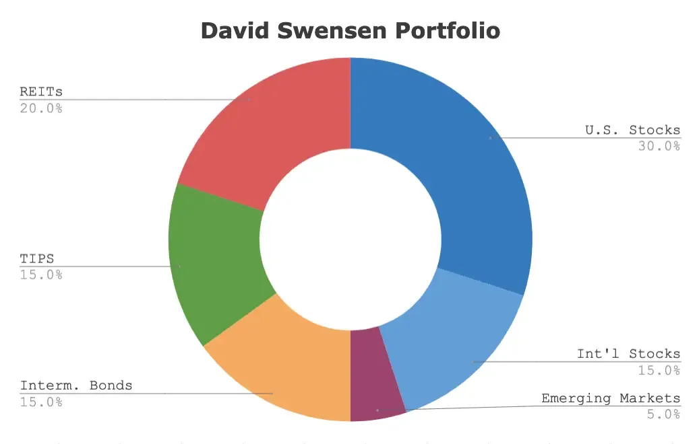

## Table of Contents

## What is the David Swensen Portfolio?

The David Swensen Portfolio is an investment strategy created by David Swensen, who is famous for managing Yale University's endowment fund. This portfolio is designed for individual investors and aims to balance risk and return by spreading investments across different types of assets. Swensen suggests that investors should put their money into six different categories: domestic stocks, real estate investment trusts (REITs), government bonds, Treasury Inflation-Protected Securities (TIPS), foreign developed market stocks, and emerging market stocks.

The idea behind the David Swensen Portfolio is to help people build a diversified investment mix that can grow over time while also protecting against big losses. By investing in these six asset classes, the portfolio aims to capture growth from stocks while using bonds and TIPS to provide stability. Swensen recommends specific percentages for each category, such as 30% in domestic stocks and 5% in REITs, to create a balanced approach. This strategy has been praised for its simplicity and effectiveness, making it a popular choice for those looking to manage their own investments.

## Who is David Swensen and why is his portfolio significant?

David Swensen was a famous money manager who worked at Yale University. He was in charge of Yale's big investment fund, called an endowment, and he did a great job making it grow. Because of his success, many people listened to his ideas about investing. Swensen wrote books to help regular people learn how to invest their money wisely. He believed that anyone could build a good investment plan by following some simple rules.

The David Swensen Portfolio is important because it's a simple way for people to invest their money without needing to be experts. Swensen suggested splitting money into six types of investments, like stocks from the U.S. and other countries, real estate, and different kinds of bonds. This mix helps spread the risk so that if one type of investment does badly, the others might do well. His portfolio is significant because it shows that you don't need to be rich or have a lot of fancy knowledge to invest well. Many people have used his ideas to build their own investment plans and feel more confident about their money.

## What are the asset classes included in the David Swensen Portfolio?

The David Swensen Portfolio includes six different types of investments, or asset classes. These are domestic stocks, which are shares in companies from the United States; foreign developed market stocks, which are shares in companies from countries like Japan or Germany; and emerging market stocks, which are shares in companies from countries that are still growing their economies, like Brazil or India. These three types of stocks help the portfolio grow over time by investing in different parts of the world.

The other three asset classes in the portfolio are real estate investment trusts (REITs), government bonds, and Treasury Inflation-Protected Securities (TIPS). REITs are companies that own and manage properties like shopping centers or apartments, and they can provide income and growth. Government bonds are loans to the U.S. government that pay interest over time, adding stability to the portfolio. TIPS are special bonds that protect against inflation, helping to keep the value of the portfolio steady even when prices go up. Together, these six asset classes help spread out risk and aim for a good balance of growth and safety.

## How should one allocate their investments according to the David Swensen Portfolio?

According to the David Swensen Portfolio, you should divide your money into six different types of investments. The biggest part, about 30%, should go into domestic stocks. These are shares in companies from the United States. Next, you should put 15% into foreign developed market stocks, which are shares in companies from countries like Japan or Germany. Another 5% should go into emerging market stocks, which are shares in companies from countries like Brazil or India that are still growing their economies. This helps your money grow by investing in different parts of the world.

The rest of your money should be split between three other types of investments. About 20% should go into government bonds, which are loans to the U.S. government that pay you interest over time. This adds stability to your portfolio. You should also put 15% into Treasury Inflation-Protected Securities, or TIPS, which are special bonds that protect your money from inflation. Finally, 5% should go into real estate investment trusts, or REITs, which are companies that own and manage properties like shopping centers or apartments. These can provide both income and growth. By following these percentages, you spread out your risk and aim for a good balance of growth and safety.

## What are the benefits of following the David Swensen Portfolio strategy?

Following the David Swensen Portfolio strategy can help you build a strong and balanced investment plan. It's simple to understand because it tells you exactly where to put your money. By spreading your investments across six different types, like stocks from the U.S., other countries, and emerging markets, plus real estate and different kinds of bonds, you're not putting all your eggs in one basket. This diversification helps lower the risk of losing a lot of money if one type of investment does badly. It also means you can still make money even if the economy changes.

Another big benefit is that the David Swensen Portfolio aims to grow your money over time while also keeping it safe. The mix of stocks can help your investments grow, especially with the potential for higher returns from emerging markets and foreign stocks. At the same time, government bonds and TIPS provide stability and protect your money from inflation. This balance makes it a good choice for people who want to invest without needing to be experts. It's a strategy that many people have used successfully to feel more confident about their financial future.

## Can the David Swensen Portfolio be adapted for different risk tolerances?

Yes, the David Swensen Portfolio can be changed to fit different levels of risk that people are comfortable with. If someone doesn't like taking big risks, they can put more of their money into safer investments like government bonds and TIPS. These parts of the portfolio help keep things steady and protect against losing money. On the other hand, if someone is okay with taking more risk to try and make more money, they can put more into stocks, especially in emerging markets and foreign developed markets, which can grow faster but are also more up and down.

By adjusting the percentages of each type of investment, people can make the David Swensen Portfolio work for them. For example, someone who wants a safer approach might choose to have 40% in domestic stocks instead of 30%, and increase the bonds and TIPS to 30% each. Someone looking for more growth might bump up their emerging market stocks to 10% or more. The key is to find a mix that feels right for your own comfort with risk and your goals for your money.

## How does the David Swensen Portfolio perform compared to traditional investment portfolios?

The David Swensen Portfolio often does better than many traditional investment portfolios because it spreads money across different types of investments. Traditional portfolios might focus a lot on U.S. stocks and bonds, but Swensen's strategy includes stocks from other countries and emerging markets, plus real estate and special bonds. This mix helps the portfolio grow more over time and handle ups and downs in the market better. Studies have shown that Swensen's approach can give you higher returns with less risk compared to just sticking to U.S. stocks and bonds.

Even though the David Swensen Portfolio can perform well, it's not perfect for everyone. Some traditional portfolios might be simpler and easier to manage, especially if someone doesn't want to deal with foreign stocks or real estate. But for people who are okay with a bit more work and want to try to get better results, Swensen's portfolio can be a smart choice. It's all about finding what works best for you and your goals.

## What are the key considerations for rebalancing the David Swensen Portfolio?

Rebalancing the David Swensen Portfolio means checking and adjusting your investments to keep them in line with the original plan. You might need to do this every year or when your investments start to be too far away from the percentages Swensen suggests. For example, if your domestic stocks grow a lot and now make up 40% of your portfolio instead of 30%, you would sell some of those stocks and use the money to buy more of the other investments, like bonds or foreign stocks, to get back to the right mix.

It's important to think about your own comfort with risk when rebalancing. If the market goes up or down a lot, your portfolio might change more than you want. Rebalancing helps you stick to your plan and keep your risk level steady. Also, consider any fees or taxes you might have to pay when you sell and buy investments. These costs can affect how much money you keep, so it's good to think about them before you make any changes.

## How can one implement the David Swensen Portfolio using low-cost index funds?

To implement the David Swensen Portfolio using low-cost index funds, you need to find funds that match the six asset classes Swensen suggests. For domestic stocks, you can use a fund like the Vanguard Total Stock Market Index Fund (VTSAX). For foreign developed market stocks, consider the Vanguard FTSE Developed Markets Index Fund (VTMGX). For emerging market stocks, you might choose the Vanguard FTSE Emerging Markets Index Fund (VEMAX). For real estate investment trusts (REITs), the Vanguard Real Estate Index Fund (VGSLX) is a good choice. For government bonds, you can use the Vanguard Total Bond Market Index Fund (VBTLX), and for Treasury Inflation-Protected Securities (TIPS), the Vanguard Inflation-Protected Securities Fund (VAIPX) works well. These funds are known for being low-cost, which means you keep more of your money instead of paying a lot in fees.

Once you've picked these funds, you need to put your money into them based on the percentages Swensen recommends. That means 30% in domestic stocks, 15% in foreign developed market stocks, 5% in emerging market stocks, 20% in government bonds, 15% in TIPS, and 5% in REITs. You can do this by figuring out how much money you have to invest and then splitting it up according to these percentages. For example, if you have $10,000, you would put $3,000 into the domestic stock fund, $1,500 into the foreign developed market stock fund, and so on. It's a good idea to check your investments every year and make adjustments to keep the percentages the same, a process called rebalancing. This way, you can stick to Swensen's plan and keep your portfolio balanced.

## What are the potential drawbacks or criticisms of the David Swensen Portfolio?

One of the main criticisms of the David Swensen Portfolio is that it can be hard for some people to set up and keep up with. You need to find the right funds for each part of the portfolio, and that can take time and research. Also, you have to check your investments every year and make changes to keep the percentages the same. This can be a lot of work, and some people might not want to deal with it. Plus, if you don't do it right, you might end up paying more in fees or taxes than you need to.

Another potential drawback is that the portfolio might not be the best fit for everyone. Some people might be more comfortable with a simpler plan that just focuses on U.S. stocks and bonds. They might not want to deal with foreign stocks or real estate, which can be more up and down. Also, the suggested percentages might not match what someone wants for their own risk level or money goals. So, while the David Swensen Portfolio can work well for many people, it's important to think about your own situation and what you feel good about before you decide to use it.

## How does the David Swensen Portfolio adjust to different economic cycles?

The David Swensen Portfolio is designed to handle different economic cycles because it spreads your money across six different types of investments. This mix helps your portfolio stay balanced even when the economy changes. For example, if the U.S. economy is doing well, your domestic stocks might grow a lot. But if the U.S. economy slows down, your foreign stocks and emerging market stocks might do better. This way, if one part of your portfolio goes down, another part might go up, helping to keep your overall investments steady.

Also, the portfolio includes government bonds and TIPS, which are safer investments that can protect your money during tough economic times. When the economy is not doing well, these bonds can help keep your portfolio stable. And if inflation goes up, TIPS can help your money keep its value. By having a mix of stocks and bonds, the David Swensen Portfolio can adjust to different economic cycles and help you feel more secure about your investments, no matter what's happening in the economy.

## What advanced strategies can be applied to enhance the performance of the David Swensen Portfolio?

One way to make the David Swensen Portfolio perform better is by using something called tax-loss harvesting. This means you sell investments that have lost value to get a tax break, and then you buy similar investments to keep your portfolio the same. This can help you save money on taxes and maybe even buy more investments with the money you save. Another strategy is to use dollar-cost averaging, where you put a little bit of money into your investments at regular times, like every month. This can help you buy more shares when prices are low and fewer when prices are high, which can make your investments grow over time.

You can also think about using something called tactical asset allocation. This means you change the percentages of your investments based on what's happening in the market. For example, if you think the economy is going to do well, you might put more money into stocks. If you think it's going to be tough, you might put more into bonds. This can help you take advantage of good times and protect your money during bad times. But remember, this takes more work and you need to be careful not to make too many changes, which can lead to more fees and taxes.

## References & Further Reading

[1]: Swensen, D. F. (2009). ["Pioneering Portfolio Management: An Unconventional Approach to Institutional Investment."](https://www.amazon.com/Pioneering-Portfolio-Management-Unconventional-Institutional/dp/1416544690) Free Press.

[2]: Mauboussin, M. J. (2007). ["More Than You Know: Finding Financial Wisdom in Unconventional Places."](https://www.amazon.com/More-Than-You-Know-Unconventional/dp/0231143729) Columbia University Press.

[3]: Ang, A. (2014). ["Asset Management: A Systematic Approach to Factor Investing."](https://academic.oup.com/book/3342) Oxford University Press.

[4]: Wibisono, A., & Tolle, H. (2021). ["Implementing Mean-Variance Portfolio Theory Using Python."](https://www.quantifiedstrategies.com/mean-variance-portfolio-in-python/) 2021 4th International Conference on Information and Communications Technology (ICOIACT).

[5]: De Prado, M. L. (2018). ["Advances in Financial Machine Learning."](https://books.google.com/books/about/Advances_in_Financial_Machine_Learning.html?id=oU9KDwAAQBAJ) Wiley.